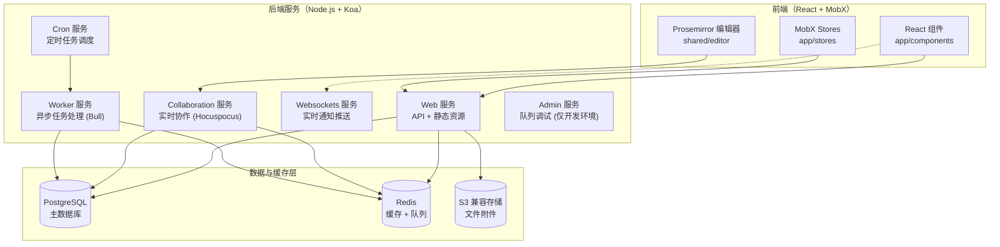

Outline 是一款**为团队打造的快速、协作式知识库**，旨在帮助团队集中管理文档说明、产品规划、会议纪要、入职清单、公司制度等各类知识资产。它不是一个简单的文档编辑器，而是一个围绕「文档集- 嵌套文档 - 全文搜索 - 实时协作」构建的完整知识管理平台。项目由 General Outline, Inc. 维护，提供云端托管版本（[getoutline.com](https://www.getoutline.com)），同时也支持自部署。作为开发者，你所面对的这个代码仓库是一个前后端同仓的 TypeScript monorepo，使用 BSL 1.1 许可证（将在 2030 年转为 Apache 2.0），涵盖了从富文本编辑器到后端 API、从 WebSocket 实时协作到异步任务队列的完整技术栈。

Sources: [README.md](README.md#L1-L108), [LICENSE](LICENSE#L1-L32), [app.json](app.json#L1-L10)

## 核心定位：团队知识共享的「活的文档」

Outline 的设计理念可以用三个关键词概括：**速度、协作、结构化**。在速度方面，全文搜索从底层开始就以性能为目标构建，用户可以在任何位置通过 `CMD+K` 快捷键发起搜索并按时间、作者等条件过滤。在协作方面，编辑器基于 Prosemirror + Y.js CRDT 实现多人实时编辑，配合 Hocuspocus 协作服务端，允许多名团队成员同时编辑同一篇文档而不会产生冲突。在结构化方面，Outline 通过「文档集」来组织文档，按销售、产品、人力资源等主题划分，文档之间可以相互链接并多层嵌套，同时自动维护反向链接关系，让知识不再是孤立的信息孤岛。

Sources: [server/onboarding/What is Outline.md](server/onboarding/What is Outline.md#L1-L20), [server/onboarding/Our Editor.md](server/onboarding/Our Editor.md#L1-L19)

## 功能特性一览

下表概括了 Outline 的主要功能模块及其对应的技术实现路径，帮助你在理解产品特性的同时建立与代码库的映射关系。

| 功能领域 | 核心能力 | 关键代码目录 |
|---|---|---|
| **文档编辑** | Markdown/WYSIWYG 双模式、代码高亮、数学公式、Mermaid 图表、嵌入组件 | `shared/editor/` |
| **实时协作** | 多人同时编辑、光标同步、在线状态感知 | `server/collaboration/` |
| **知识组织** | 文档集、嵌套文档、反向链接、模板 | `app/models/Collection.ts`, `app/models/Document.ts` |
| **全文搜索** | CMD+K 快捷搜索、PostgreSQL 全文检索、过滤排序 | `plugins/search-postgres/` |
| **权限控制** | 基于角色的访问控制、文档集级权限、群组权限 | `server/policies/` |
| **认证集成** | Google、OIDC、Azure、Slack、Passkeys 等多种认证方式 | `plugins/oidc/`, `plugins/google/`, `plugins/azure/` |
| **异步任务** | 文档导入/导出、邮件发送、Webhook 投递 | `server/queues/` |
| **国际化** | 支持 27+ 种语言的翻译体系 | `shared/i18n/` |
| **扩展插件** | 22 个内置插件覆盖集成、存储、搜索等场景 | `plugins/` |
| **API 与集成** | REST API、MCP（AI 工具协议）、OAuth 2.0 服务端、Webhook | `server/routes/api/`, `server/routes/mcp/` |

Sources: [shared/editor/version.ts](shared/editor/version.ts#L1-L4), [plugins/](plugins/), [shared/i18n/locales](shared/i18n/locales), [server/policies/index.ts](server/policies/index.ts)

## 技术架构全景

Outline 的后端并非单一的 Web 服务，而是由六个可独立部署的服务组合而成。这种拆分设计使得你可以根据负载情况灵活扩展——例如将协作服务单独部署到独立节点以应对高并发的实时编辑请求。



后端服务的启动由 `server/index.ts` 统一编排，它通过 `throng` 库管理多进程模型，并根据环境变量 `SERVICES` 或 `--services` 参数决定启动哪些服务。在默认的 Docker 部署中，所有服务会在同一进程中运行；在生产环境中，你可以通过逗号分隔的方式选择性地启动服务组合，例如 `--services=web,worker` 只启动 Web 和 Worker 两个核心服务。

Sources: [server/index.ts](server/index.ts#L1-L50), [server/services/index.ts](server/services/index.ts#L1-L16), [docs/SERVICES.md](docs/SERVICES.md#L1-L37)

## 代码库组织结构

Outline 采用前后端共享同一仓库的 monorepo 架构。由于前后端均使用 TypeScript 编写，公共逻辑被抽取到 `shared/` 目录中，实现了编辑器定义、工具函数、样式常量等代码的跨端复用。下面展示了顶层目录的功能划分：

```
outline/
├── app/            # 前端 React 应用
│   ├── components/ # 可复用 UI 组件（Avatar、Menu、Sidebar 等）
│   ├── editor/     # 编辑器专用组件（菜单、扩展）
│   ├── models/     # MobX observable 数据模型
│   ├── stores/     # 模型集合 + 数据获取逻辑（30+ 个 Store）
│   ├── scenes/     # 完整页面视图（Home、Search、Settings 等）
│   ├── routes/     # 路由定义
│   ├── hooks/      # 自定义 React Hooks（60+ 个）
│   ├── menus/      # 上下文菜单
│   └── utils/      # 前端工具方法
├── server/         # 后端 Node.js 服务
│   ├── models/     # Sequelize ORM 模型（40+ 个）
│   ├── routes/     # API 路由（api/、auth/、mcp/、oauth/）
│   ├── commands/   # 跨模型复杂业务操作
│   ├── policies/   # 基于 CanCan 的权限策略
│   ├── presenters/ # 模型序列化层（后端→前端数据契约）
│   ├── queues/     # Bull 异步队列
│   ├── services/   # 服务启动入口
│   ├── middlewares/ # Koa 中间件
│   ├── migrations/ # 数据库迁移（200+ 个）
│   ├── collaboration/ # 实时协作扩展
│   ├── emails/     # 邮件模板
│   └── plugins/    # 插件管理
├── shared/         # 前后端共享模块
│   ├── editor/     # Prosemirror 编辑器核心定义
│   ├── i18n/       # 国际化配置（27+ 种语言）
│   ├── utils/      # 共享工具函数
│   └── styles/     # 主题、断点、颜色等样式常量
├── plugins/        # 22 个功能插件
│   ├── slack/      # Slack 集成
│   ├── google/     # Google 认证
│   ├── github/     # GitHub 集成
│   └── ...         # 更多插件
└── public/         # 静态资源（字体、图片、Logo）
```

Sources: [docs/ARCHITECTURE.md](docs/ARCHITECTURE.md#L1-L67)

## 运行时技术栈速览

下表列出了 Outline 运行时的核心技术选型，为后续深入阅读各技术栈专题页面提供一份快速参考索引。

| 层次 | 技术 | 用途 | 专题页面 |
|---|---|---|---|
| **前端框架** | React + TypeScript | SPA 应用主体 | [前端技术栈](4-qian-duan-ji-zhu-zhan-react-mobx-styled-components-yu-vite) |
| **状态管理** | MobX 4 | Observable 数据模型 + 响应式更新 | [状态管理](9-zhuang-tai-guan-li-mobx-model-store-yu-rootstore-jia-gou) |
| **样式方案** | Styled Components | CSS-in-JS 组件样式 | [主题系统](12-zhu-ti-xi-tong-yu-quan-ju-yang-shi-she-ji) |
| **构建工具** | Vite | 前端编译与热更新 | [前端技术栈](4-qian-duan-ji-zhu-zhan-react-mobx-styled-components-yu-vite) |
| **后端框架** | Koa | HTTP API 服务 | [后端技术栈](5-hou-duan-ji-zhu-zhan-koa-sequelize-redis-yu-bull-dui-lie) |
| **数据库** | PostgreSQL + Sequelize | 持久化存储 + ORM | [数据模型层](18-shu-ju-mo-xing-ceng-sequelize-mo-xing-ding-yi-guan-lian-yu-sheng-ming-zhou-qi-gou-zi) |
| **缓存/队列** | Redis + Bull | 缓存 + 异步任务队列 | [Redis 缓存](25-redis-huan-cun-ce-lue-yu-hui-hua-guan-li) |
| **实时协作** | Hocuspocus + Y.js | WebSocket 协作编辑 | [实时协作编辑](15-shi-shi-xie-zuo-bian-ji-hocuspocus-y-js-crdt-yu-websocket-chi-jiu-hua) |
| **富文本** | Prosemirror | 文档编辑器内核 | [编辑器架构](14-bian-ji-qi-jia-gou-ji-yu-prosemirror-de-jie-dian-biao-ji-yu-kuo-zhan-ti-xi) |
| **文件存储** | S3 兼容 | 附件上传与存储 | [文件存储](24-wen-jian-cun-chu-s3-jian-rong-cun-chu-yu-fu-jian-guan-li) |
| **认证** | Passport | OAuth 2.0 多身份提供商 | [认证集成](26-ren-zheng-ji-cheng-google-oidc-azure-slack-yu-passkeys) |
| **容器化** | Docker | 生产环境部署 | [Docker 部署](31-docker-bu-shu-jing-xiang-gou-jian-yu-docker-compose-pei-zhi) |

## 插件生态与扩展性

Outline 内置了一套灵活的插件系统，通过 `PluginManager` 管理了 22 个功能插件。插件可以注册为多种类型，包括 API 路由扩展、认证提供商、邮件模板、搜索提供商、事件处理器、异步任务、链接展开器等。这意味着你可以通过编写自定义插件来扩展 Outline 的能力边界，而不需要修改核心代码。例如，`plugins/slack/` 实现了 Slack 认证和消息集成，`plugins/search-postgres/` 提供了基于 PostgreSQL 的全文搜索能力，`plugins/figma/` 则支持在文档中嵌入 Figma 设计稿。

Sources: [server/utils/PluginManager.ts](server/utils/PluginManager.ts#L1-L68), [plugins/](plugins/)

## 推荐阅读路径

作为初入 Outline 代码库的开发者，建议按照以下顺序循序渐进地建立全局认知：

1. **搭建开发环境** —— 先让项目跑起来，再深入理解：[本地开发环境搭建指南](2-ben-di-kai-fa-huan-jing-da-jian-zhi-nan)
2. **理解目录结构** —— 熟悉代码组织方式，快速定位文件：[项目目录结构与代码组织总览](3-xiang-mu-mu-lu-jie-gou-yu-dai-ma-zu-zhi-zong-lan)
3. **掌握技术栈** —— 分别了解前后端的技术选型与设计哲学：
   - [前端技术栈：React、MobX、Styled Components 与 Vite](4-qian-duan-ji-zhu-zhan-react-mobx-styled-components-yu-vite)
   - [后端技术栈：Koa、Sequelize、Redis 与 Bull 队列](5-hou-duan-ji-zhu-zhan-koa-sequelize-redis-yu-bull-dui-lie)
4. **深入架构** —— 理解前后端如何协作、服务如何拆分：
   - [整体架构：前后端 Monorepo 与共享模块设计](6-zheng-ti-jia-gou-qian-hou-duan-monorepo-yu-gong-xiang-mo-kuai-she-ji)
   - [后端服务拆分：Web、Collaboration、Websockets、Worker 与 Cron](7-hou-duan-fu-wu-chai-fen-web-collaboration-websockets-worker-yu-cron)