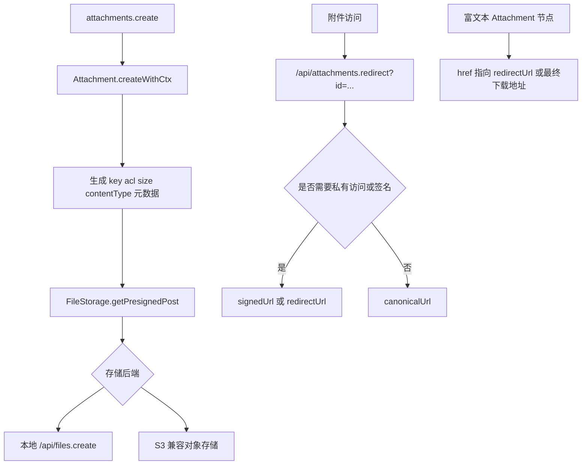
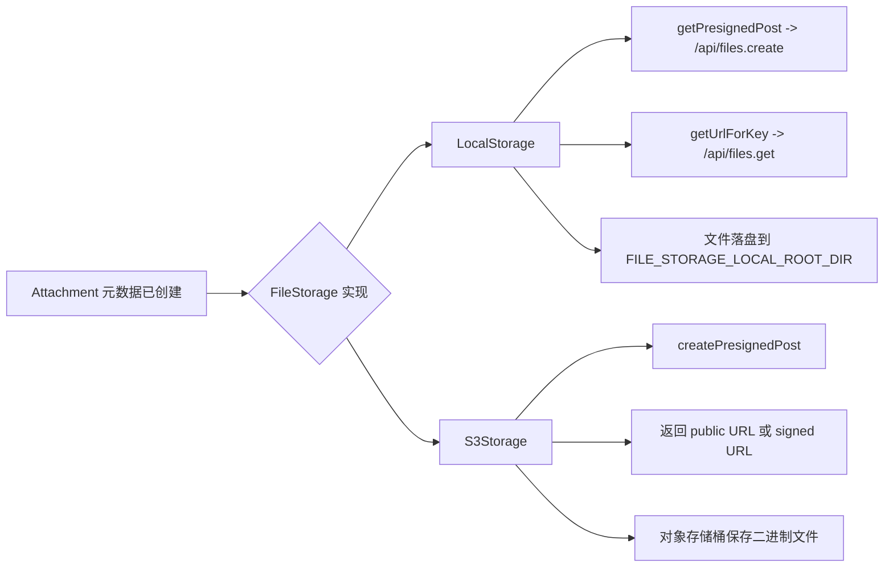

如果只把 Outline 的附件理解成“上传到 S3 的一个 URL”，会漏掉这套系统真正重要的三层结构：

- `server/storage/files/` 负责抽象具体存储后端
- `Attachment` 模型负责权限、生命周期和元数据
- 路由 / 编辑器 / 后台任务再把“上传、访问、过期、删除”串成完整链路

所以这一页的重点不是某个 SDK 调用，而是：**Outline 怎样把对象存储、数据库记录和编辑器里的附件节点稳定地绑定在一起。**

Sources: [server/storage/files/index.ts](server/storage/files/index.ts), [server/storage/files/BaseStorage.ts](server/storage/files/BaseStorage.ts), [server/storage/files/LocalStorage.ts](server/storage/files/LocalStorage.ts), [server/storage/files/S3Storage.ts](server/storage/files/S3Storage.ts), [plugins/storage/server/api/files.ts](plugins/storage/server/api/files.ts), [plugins/storage/server/api/schema.ts](plugins/storage/server/api/schema.ts), [server/models/Attachment.ts](server/models/Attachment.ts), [server/models/helpers/AttachmentHelper.ts](server/models/helpers/AttachmentHelper.ts), [server/commands/attachmentCreator.ts](server/commands/attachmentCreator.ts), [server/routes/api/attachments/attachments.ts](server/routes/api/attachments/attachments.ts), [server/routes/api/attachments/schema.ts](server/routes/api/attachments/schema.ts), [server/presenters/attachment.ts](server/presenters/attachment.ts), [server/queues/tasks/UploadAttachmentFromUrlTask.ts](server/queues/tasks/UploadAttachmentFromUrlTask.ts), [server/queues/tasks/DeleteAttachmentTask.ts](server/queues/tasks/DeleteAttachmentTask.ts), [server/queues/tasks/CleanupExpiredAttachmentsTask.ts](server/queues/tasks/CleanupExpiredAttachmentsTask.ts), [shared/editor/nodes/Attachment.tsx](shared/editor/nodes/Attachment.tsx)

## 先把附件系统放回一条完整链路里看

可以先把 Outline 当前的附件路径压成下面这张图：



这条链路背后的关键点是：**数据库里的 `attachments` 行不是“上传后的附属记录”，而是整个流程的中心锚点。**

## `BaseStorage` 先把“存什么、怎么取、怎么签名”抽象成统一接口

`server/storage/files/index.ts` 很简单，根据 `env.FILE_STORAGE` 在：

- `LocalStorage`
- `S3Storage`

之间二选一。

真正重要的是 `BaseStorage` 的抽象面。它没有只暴露一个 `store()`，而是把附件系统真正需要的动作都列了出来：

- `getPresignedPost`
- `getUploadUrl`
- `getUrlForKey`
- `getSignedUrl`
- `getFileStream`
- `getFileHandle`
- `store`
- `storeFromUrl`
- `moveFile`
- `deleteFile`
- `getFileExists`

这说明 Outline 从一开始就不是把“文件存储”当作一个单纯写入动作，而是把它当作一套完整能力：

- 上传入口
- 下载入口
- 远程抓取
- 临时签名
- 导出时落地成临时文件
- 生命周期删除

### `storeFromUrl` 很能说明这层抽象为什么有价值

这个 helper 会同时处理两类输入：

- Base64 Data URL
- 远程 HTTP(S) URL

它还顺手做了几件很实际的事情：

- 如果 URL 已经指向当前存储后端或内部地址，直接跳过，避免重复上传
- 对 Base64 和远程抓取都套统一的最大体积限制
- 跟随重定向，但限制跟随次数和超时时间
- 抓取失败只记日志，不把整个调用链炸穿

所以 `BaseStorage` 不只是“适配器基类”，它其实定义了 Outline 对文件系统的业务预期。

### 安全内联策略也被放在这一层

`BaseStorage.getContentDisposition()` 明确把只有少数内容类型视为可安全内联：

- `application/pdf`
- `image/png`
- `image/jpeg`
- `image/gif`
- `image/webp`
- 以及音视频类型

SVG 被故意排除在外。这和后面的下载响应头、附件预览逻辑是连着的。

Sources: [server/storage/files/index.ts](server/storage/files/index.ts), [server/storage/files/BaseStorage.ts](server/storage/files/BaseStorage.ts)

## 本地存储和 S3 存储共享接口，但运行方式明显不同



## `LocalStorage`：上传和下载都经过应用路由

本地存储的几个关键特征非常清楚：

- 上传地址是 `/api/files.create`
- 下载地址是 `/api/files.get?key=...`
- 签名下载地址是 `/api/files.get?sig=...`
- 文件真实写入 `FILE_STORAGE_LOCAL_ROOT_DIR`

### `getPresignedPost` 在本地模式下其实不是“真 presigned”

它返回的是一个伪表单描述：

- `url` 指向 `/api/files.create`
- `fields` 里带上 `key`
- `fields` 里带上 `acl`
- `fields` 里带上 `maxUploadSize`
- 还会带上 CSRF token

也就是说，对客户端来说上传体验仍然像“拿到 uploadUrl + form 后再直传”，只是本地模式把真正的接收方换成了 Outline 自己的路由。

### `files.create` 会再次对上传和声明元数据做一致性校验

`plugins/storage/server/api/files.ts` 的上传路由会：

1. 根据 `key` 找到 `Attachment`
2. 确认当前用户就是该附件记录的 owner
3. 检查实际文件大小不能超过预声明的 `attachment.size`
4. 调 `attachment.writeFile(file)` 真正落盘
5. 如果前端声明大小和真实大小不一致，再静默回写数据库

所以本地存储不是“先传文件，后补记录”，而是和对象存储模式一样，**先有 attachment 元数据，再放行数据上传。**

### `files.get` 负责本地模式下的大部分下载细节

这个路由会处理：

- `key` 或 `sig` 两种取文件方式
- 私有附件授权
- `Range` 请求
- `Content-Disposition`
- `Content-Security-Policy`
- PDF 内嵌时去掉 `X-Frame-Options`

它本质上把本地磁盘包装成了一个带权限、带缓存头、带分块下载能力的对象存储接口。

## `S3Storage`：上传尽量直连对象存储，应用只管签名和元数据

S3 后端的设计目标则很明确：尽量减少应用服务器在大文件上传/下载路径上的中转。

### 上传阶段使用 `createPresignedPost`

`S3Storage.getPresignedPost()` 会生成标准 S3 表单上传参数，并把这些约束前置到存储端：

- 上传桶
- `content-length-range`
- `Content-Type` 前缀匹配
- `Cache-Control`
- `Content-Disposition`
- 可选 `ACL`

这意味着 Outline 自己并不接收文件体，浏览器可以直接把附件打进对象存储。

### 下载阶段区分公开 URL 和签名 URL

`getUrlForKey()` 返回对象存储公开访问地址，`getSignedUrl()` 则按需生成临时可访问链接。

其中有几个实现细节值得注意：

- 如果配置了 `AWS_S3_ACCELERATE_URL`，会优先使用加速域名
- 会兼容 path-style 和 virtual-host-style bucket URL
- presigned URL 的过期时间会被钳制到 7 天以内，以满足 S3 Signature V4 约束
- Docker 本地 fake-s3 场景下会退回直接公开 URL，而不是强行走签名

### `getFileHandle` 暴露给导出/转换任务一个“本地临时文件视图”

S3 存储本身没有磁盘路径，但一些导出链路仍然需要文件路径。这里的做法是：

1. 先把对象流下载到临时目录
2. 把临时文件路径交给上层
3. 再提供 `cleanup()` 做清理

这说明存储抽象不只是给 API 上传下载用，也在服务于导出、导入、转换任务。

Sources: [server/storage/files/LocalStorage.ts](server/storage/files/LocalStorage.ts), [server/storage/files/S3Storage.ts](server/storage/files/S3Storage.ts), [plugins/storage/server/api/files.ts](plugins/storage/server/api/files.ts), [plugins/storage/server/api/schema.ts](plugins/storage/server/api/schema.ts)

## `Attachment` 模型才是附件系统真正的业务边界

如果只看存储后端，你仍然不知道一个附件在 Outline 里“意味着什么”。这些语义在 `server/models/Attachment.ts`。

它关心的核心字段包括：

- `key`
- `contentType`
- `size`
- `acl`
- `lastAccessedAt`
- `expiresAt`
- `teamId`
- `documentId`
- `userId`

### URL 不是简单存字段，而是运行时派生

`Attachment` 暴露了几种不同 URL 语义：

- `canonicalUrl`：直指存储后端的原始地址
- `redirectUrl`：`/api/attachments.redirect?id=...`
- `signedUrl`：向存储后端申请的临时可访问地址
- `url`：若附件私有则返回 `redirectUrl`，否则返回 `canonicalUrl`

这使得调用方不必到处手写“私有附件走 redirect，公开附件走直链”的判断。

### bucket 和 ACL 是两层不同概念

`Attachment.isStoredInPublicBucket` 只根据 key 的 bucket 前缀判断是否位于：

- `avatars`
- `public`

而 `isPrivate` 则单独看 `acl === "private"`。

代码里的注释还特别强调了一点：历史上“public attachment”可能放在单独 bucket，如今更偏向所有附件都放在私有存储里，再按附件级 ACL 控制。

### 生命周期钩子把“元数据删除”和“文件删除”绑在一起

这里有三件很关键的事：

- `BeforeCreate` 会 sanitize key
- `BeforeUpdate` 禁止修改 key
- `BeforeDestroy` 会尝试删除底层文件

而且删除文件失败时只打 warning，不阻塞数据库记录删除。这非常务实，因为对象存储偶发失败不应该把业务删除动作彻底卡死。

Sources: [server/models/Attachment.ts](server/models/Attachment.ts)

## `AttachmentHelper` 把 preset 规则集中收口

附件系统里很多差异并不来自用户，而来自“这是哪种附件”：

- 文档附件
- Avatar
- Emoji
- Import
- WorkspaceImport

`AttachmentHelper` 负责把这些 preset 映射成三类关键策略：

- `presetToAcl`
- `presetToExpiry`
- `presetToMaxUploadSize`

### key 结构本身就编码了归属信息

默认 key 形如：

```text
uploads/<userId>/<attachmentId>/<fileName>
```

这带来两个直接好处：

- 通过 key 就能反推出 userId / attachmentId / fileName
- 存储层目录结构天然和业务归属保持一致

### Import 类附件天然就是临时资源

`presetToExpiry()` 会给：

- `Import`
- `WorkspaceImport`

打上 24 小时过期时间。也就是说，这类附件从一开始就被当作中间态输入，而不是长期资产。

Sources: [server/models/helpers/AttachmentHelper.ts](server/models/helpers/AttachmentHelper.ts)

## 上传链路是“先建元数据，再放行文件”

`attachments.create` 这条路由很能说明 Outline 的上传哲学。

### 第一步不是收文件，而是先做授权和配额判断

路由会先检查：

- 当前 preset 是否允许该 content type
- 文档附件是否有 `update document` 权限
- 团队层面是否允许创建附件
- 文件体积是否超过 preset 上限

如果这些都通过，才会创建 `Attachment` 行。

### 第二步创建 attachment 元数据，并返回客户端上传说明

路由完成后，客户端拿到的是：

- `uploadUrl`
- `form`
- `attachment`

其中 `attachment` 已经有：

- `id`
- `name`
- `contentType`
- `size`
- `url`

但这里的 `url` 会被显式改成 `attachment.redirectUrl`，这样无论底层是本地存储还是对象存储，前端都可以先用统一的下载入口。

### `attachments.createFromUrl` 是另一条“服务端抓取附件”路径

如果附件来自外部 URL，则流程变成：

1. 先创建一个 `size = 0` 的占位 `Attachment`
2. 调度 `UploadAttachmentFromUrlTask`
3. task 内部用 `FileStorage.storeFromUrl(...)` 抓取远程文件
4. 成功后回写 `size` 和 `contentType`

这种设计的好处是：

- 远程抓取失败不会污染正常上传路径
- 可以重试
- 占位 attachment id 能提前进入文档或导入流程

Sources: [server/routes/api/attachments/attachments.ts](server/routes/api/attachments/attachments.ts), [server/routes/api/attachments/schema.ts](server/routes/api/attachments/schema.ts), [server/commands/attachmentCreator.ts](server/commands/attachmentCreator.ts), [server/queues/tasks/UploadAttachmentFromUrlTask.ts](server/queues/tasks/UploadAttachmentFromUrlTask.ts), [server/presenters/attachment.ts](server/presenters/attachment.ts)

## 下载和访问控制并不在文档权限层完成，而是在 workspace 附件层完成

`attachments.redirect` 这条路由有个很重要、也很容易误读的判断：

- 私有附件只要求当前用户属于同一个 workspace
- 并不在这里重新检查 document 级权限

代码注释写得很直白：附件归 workspace 所有，而不是归某篇文档所有；而且附件还可能脱离文档独立存在。

### redirect 路由真正做的是“选择正确的访问方式”

它会：

1. 查出 attachment
2. 对私有附件做 team 级校验
3. 更新 `lastAccessedAt`
4. 如果附件位于 public bucket，直接跳 `canonicalUrl`
5. 否则跳到 `attachment.signedUrl`

这里还能看到两种不同的缓存策略：

- public bucket 跳转可缓存 7 天
- signed URL 跳转则按默认 300 秒缓存

### 本地模式下的 signed URL 实际上是 JWT 封装的 `/api/files.get?sig=...`

也就是说，本地存储没有真的去签对象存储 URL，而是签了一个由应用自己解释的下载凭证。

Sources: [server/routes/api/attachments/attachments.ts](server/routes/api/attachments/attachments.ts), [server/models/Attachment.ts](server/models/Attachment.ts), [server/storage/files/LocalStorage.ts](server/storage/files/LocalStorage.ts)

## 附件并不是“上传完就结束”，后面还有清理、统计和编辑器消费

## 过期清理由 cron 周期性完成

`CleanupExpiredAttachmentsTask` 每小时扫描：

- `expiresAt < now`

的附件，然后直接 `attachment.destroy()`。

因为 `Attachment` 的 `BeforeDestroy` 钩子已经负责删底层文件，所以这条 cron 任务写起来非常薄。

## 删除附件既可以同步触发，也可以丢到后台做

- 用户主动删除走 `attachments.delete`
- 某些业务场景也可以调 `DeleteAttachmentTask`

两条路径最终都会落到同一个模型删除逻辑上，这让删除语义保持一致。

## 编辑器节点只消费稳定的附件契约

`shared/editor/nodes/Attachment.tsx` 关心的主要是：

- `id`
- `href`
- `title`
- `size`
- `preview`
- `contentType`

它不会知道底层究竟是本地文件还是 S3 对象，只会：

- 在普通场景下渲染下载组件
- 对 PDF 走预览组件
- 在 `toDOM` 时把 `href` 经过 `sanitizeUrl()`

这正是前面存储抽象和 presenter 层存在的价值：编辑器可以只依赖稳定字段，而不用理解存储后端差异。

Sources: [server/queues/tasks/CleanupExpiredAttachmentsTask.ts](server/queues/tasks/CleanupExpiredAttachmentsTask.ts), [server/queues/tasks/DeleteAttachmentTask.ts](server/queues/tasks/DeleteAttachmentTask.ts), [shared/editor/nodes/Attachment.tsx](shared/editor/nodes/Attachment.tsx)

## 为什么 Outline 要把附件系统拆成这三层

Outline 在附件这件事上同时面对几个现实约束：

1. **部署形态不同**  
   有人用本地磁盘，有人用 S3 兼容对象存储。

2. **权限语义复杂**  
   有公开头像、私有附件、导入临时文件、文档内引用文件。

3. **上传来源不止浏览器本地文件**  
   还包括远程 URL、Base64 数据和导入任务。

4. **附件还要服务导出、预览、分享和清理任务**

所以 Outline 的选择是：

- 存储后端抽象在 `BaseStorage`
- 业务边界收敛到 `Attachment`
- 路由 / task / editor 再各自消费这层稳定契约

这比“直接把文件传到 bucket 然后数据库记个 URL”重一些，但对于一个长期演进、支持多部署形态的知识库产品来说，明显更稳。

## 建议继续阅读

- 想看这些 attachment 记录属于哪一层数据模型：读 [数据模型层：Sequelize 模型定义、关联与生命周期钩子](18-shu-ju-mo-xing-ceng-sequelize-mo-xing-ding-yi-guan-lian-yu-sheng-ming-zhou-qi-gou-zi)
- 想看附件在 API 返回里怎样被前端稳定消费：读 [数据 Presenter 层：模型序列化与前后端数据契约](21-shu-ju-presenter-ceng-mo-xing-xu-lie-hua-yu-qian-hou-duan-shu-ju-qi-yue)
- 想看后台任务怎样处理导入、清理和异步附件抓取：读 [异步任务与事件驱动：Bull 队列、Processor 与 Task 体系](22-yi-bu-ren-wu-yu-shi-jian-qu-dong-bull-dui-lie-processor-yu-task-ti-xi)
- 想看附件 schema 和过期字段怎样随版本演进：读 [数据库迁移管理：Sequelize 迁移与数据回填脚本](23-shu-ju-ku-qian-yi-guan-li-sequelize-qian-yi-yu-shu-ju-hui-tian-jiao-ben)
- 想看 Redis、队列和协作服务如何与这套存储链路配合：读 [Redis 缓存策略与会话管理](25-redis-huan-cun-ce-lue-yu-hui-hua-guan-li)
- 想看富文本里这些附件节点最终怎样渲染和扩展：读 [编辑器架构：基于 Prosemirror 的节点、标记与扩展体系](14-bian-ji-qi-jia-gou-ji-yu-prosemirror-de-jie-dian-biao-ji-yu-kuo-zhan-ti-xi)
