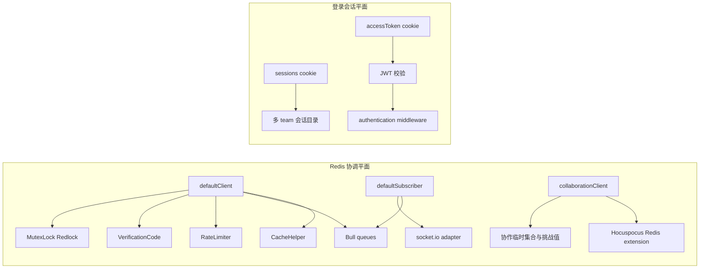
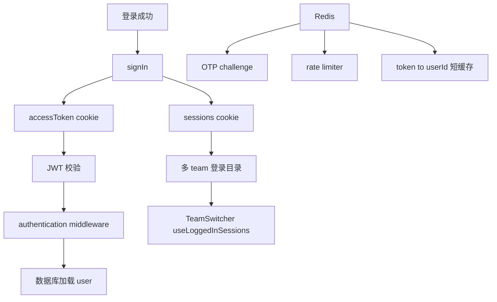

这一页最容易写偏。Outline 确实大量依赖 Redis，但它并没有把“用户登录会话”本体直接存在 Redis 里。更准确地说，Redis 在这里扮演的是一层**跨进程协调平面**：

- 缓存
- 分布式锁
- 队列底座
- WebSocket / 协作 pubsub
- 限流
- 短期认证状态

真正的登录会话仍然是 JWT + cookie。Redis 只是围着它提供加速和协调能力。

Sources: [server/storage/redis.ts](server/storage/redis.ts), [server/index.ts](server/index.ts), [server/queues/queue.ts](server/queues/queue.ts), [server/services/websockets.ts](server/services/websockets.ts), [server/services/collaboration.ts](server/services/collaboration.ts), [server/utils/CacheHelper.ts](server/utils/CacheHelper.ts), [server/utils/RedisPrefixHelper.ts](server/utils/RedisPrefixHelper.ts), [server/utils/MutexLock.ts](server/utils/MutexLock.ts), [server/utils/VerificationCode.ts](server/utils/VerificationCode.ts), [server/middlewares/rateLimiter.ts](server/middlewares/rateLimiter.ts), [server/utils/RateLimiter.ts](server/utils/RateLimiter.ts), [server/utils/authentication.ts](server/utils/authentication.ts), [server/middlewares/authentication.ts](server/middlewares/authentication.ts), [server/utils/jwt.ts](server/utils/jwt.ts), [server/routes/auth/index.ts](server/routes/auth/index.ts), [server/routes/api/auth/auth.ts](server/routes/api/auth/auth.ts), [app/hooks/useLoggedInSessions.ts](app/hooks/useLoggedInSessions.ts), [app/stores/AuthStore.ts](app/stores/AuthStore.ts), [server/routes/api/urls/urls.ts](server/routes/api/urls/urls.ts), [server/models/User.ts](server/models/User.ts), [server/models/Collection.ts](server/models/Collection.ts), [server/models/UserMembership.ts](server/models/UserMembership.ts), [server/queues/processors/RevisionsProcessor.ts](server/queues/processors/RevisionsProcessor.ts), [server/queues/tasks/ValidateSSOAccessTask.ts](server/queues/tasks/ValidateSSOAccessTask.ts)

## 先建立一个正确的心智模型

可以先把 Outline 里的 Redis 用途压成下面这张图：

如果把这两块混成一件事，就会误判很多实现细节。尤其是标题里的“会话管理”，在 Outline 里更接近：

- cookie/JWT 会话
- 多 team 会话目录
- transfer token 跳域
- 一些 Redis 承载的认证辅助状态

而不是传统的“Redis Session Store”。

## Redis 连接层不是一个单 client，而是按角色拆分的

`server/storage/redis.ts` 先把 ioredis 包装成了 `RedisAdapter`，然后再暴露三类懒加载连接：

- `defaultClient`
- `defaultSubscriber`
- `collaborationClient`

### `RedisAdapter` 本身就吸收了不少部署细节

它统一处理了：

- retry strategy
- `READONLY` 错误时重连
- Heroku `rediss://` TLS 兼容
- 连接名标识
- `ioredis://` Base64 JSON 自定义连接配置

后一点尤其说明这层不是“本地开发随便连一下 Redis”，而是为不同托管/代理场景预留了配置通道。

### 协作服务允许用独立 Redis

`collaborationClient` 会优先使用 `REDIS_COLLABORATION_URL`。如果没配，回退到默认 Redis。

这背后的架构含义很明确：

- 协作流量可以和普通缓存/队列流量共用 Redis
- 也可以单独拆出去，减少互相干扰

`server/index.ts` 甚至还进一步加了保护：如果启用了 collaboration 服务但没有单独的 `REDIS_COLLABORATION_URL`，进程数会被限制为 1，避免多进程协作服务在没有共享协作 Redis 的前提下失真。

Sources: [server/storage/redis.ts](server/storage/redis.ts), [server/index.ts](server/index.ts)

## 队列、WebSocket 和协作服务都建立在这层 Redis 连接拓扑之上

## Bull 队列不会盲目复用单连接

`server/queues/queue.ts` 的 `createQueue()` 明确按 Bull 的三种连接类型分流：

- `client` -> `Redis.defaultClient`
- `subscriber` -> `Redis.defaultSubscriber`
- `bclient` -> 新建专用阻塞连接

这样做是因为 Bull 的阻塞式消费连接和普通命令连接不能混着来。

### WebSocket 广播通过 Redis adapter 横向扩散

`server/services/websockets.ts` 使用：

- `pubClient: Redis.defaultClient`
- `subClient: Redis.defaultSubscriber`

把 socket.io 适配成跨进程广播系统。这意味着：

- 某个 worker 或 web 实例触发的 websocket 事件
- 可以由真正持有连接的 websockets 服务广播出去

### 协作服务的 Y.js 文档同步也能落到 Redis

`server/services/collaboration.ts` 里，Hocuspocus 在有 `REDIS_COLLABORATION_URL` 时会挂上 Redis extension。这样文档协作状态就能跨协作进程传播。

这进一步说明：**Redis 在 Outline 里不仅是“缓存箱子”，还是多服务之间的实时消息中转层。**

Sources: [server/queues/queue.ts](server/queues/queue.ts), [server/services/websockets.ts](server/services/websockets.ts), [server/services/collaboration.ts](server/services/collaboration.ts)

## 缓存层走的是“带分布式锁的读穿缓存”，不是裸 `get/set`

`CacheHelper` 很值得单独看。它不是只封装了 JSON 序列化，而是直接把缓存击穿问题考虑进去了。

### `getDataOrSet` 用双重检查 + 分布式锁防止 thundering herd

流程大致是：

1. 先 `getData`
2. miss 后尝试拿 `MutexLock`
3. 再次 `getData`
4. 仍 miss 才执行 callback
5. 把结果写回 Redis

这正是典型的“读穿缓存 + 锁保护”模式。

### 缓存值还能动态指定过期时间

callback 不只能返回普通数据，也可以返回：

- `{ data, expiry }`

这样像 unfurl 这类外部资源缓存，就能针对不同 provider 返回不同 TTL，而不是被迫吃一刀切默认值。

## key 前缀设计是很清楚的业务分层

`RedisPrefixHelper` 目前至少定义了四类 key：

- `unfurl:<teamId>:<url>`
- `cd:<collectionId>`
- `embed:<url>`
- `uc:<userId>`

它们分别服务于：

- 外链 unfurl 结果缓存
- collection document structure 缓存
- embed 可嵌入性检测缓存
- 用户可访问 collection id 列表缓存

### 这些 key 不是孤立存在的，而是和模型钩子 / 路由直接联动

例如：

- `urls.unfurl` 和 `urls.checkEmbed` 直接用 `CacheHelper.getDataOrSet(...)`
- `Collection` 在 `documentStructure` 变更时先清缓存，再在保存后写新缓存
- `User.collectionIds()` 在无额外查询参数时走 10 秒短缓存
- `UserMembership` 创建/删除时会主动清用户 collection id 缓存

这说明 Outline 的 Redis 缓存并不追求“全局大缓存”，而是更偏向：

- 昂贵计算结果
- 容易被频繁重复读取的派生视图
- 可以由模型事件精准失效的短生命周期数据

Sources: [server/utils/CacheHelper.ts](server/utils/CacheHelper.ts), [server/utils/RedisPrefixHelper.ts](server/utils/RedisPrefixHelper.ts), [server/routes/api/urls/urls.ts](server/routes/api/urls/urls.ts), [server/models/Collection.ts](server/models/Collection.ts), [server/models/User.ts](server/models/User.ts), [server/models/UserMembership.ts](server/models/UserMembership.ts)

## 分布式锁不只是迁移时用一次，而是很多跨实例协调动作的基础设施

`MutexLock` 用的是 Redlock，提供了两种主要用法：

- `acquire / release`
- `using(...)`

### `using(...)` 甚至考虑到了长任务自动续租和中断

它会：

- 自动获取锁
- 运行期间自动续租
- 如果锁续租失败，通过 `AbortSignal` 通知调用方停止

这比简单的 `SETNX + EXPIRE` 成熟很多。

### 典型用途有三类

1. **启动迁移**  
   `checkPendingMigrations()` 会先抢 `"migrations"` 这把锁。

2. **缓存回填保护**  
   `CacheHelper.getDataOrSet()` 用 `lock:<cacheKey>` 避免多个实例一起算同一份缓存。

3. **后台认证校验**  
   `ValidateSSOAccessTask` 用 `validateSSO:<userId>` 保证同一个用户不会被多个任务并发校验外部 SSO 状态。

所以 Redis 锁在这里不是偶发技巧，而是多进程部署下的一条基础约束。

Sources: [server/utils/MutexLock.ts](server/utils/MutexLock.ts), [server/utils/startup.ts](server/utils/startup.ts), [server/utils/CacheHelper.ts](server/utils/CacheHelper.ts), [server/queues/tasks/ValidateSSOAccessTask.ts](server/queues/tasks/ValidateSSOAccessTask.ts)

## Redis 还承载了一批“认证辅助状态”

## 限流直接落在 Redis 上

`rateLimiter` 中间件和 `RateLimiter` 工具一起做了两层工作：

- 默认全局限流
- 路由级自定义限流

其中 Redis 存的不只是窗口计数器，还有一层 token -> userId 的缓存映射。

### 为什么要缓存 token 对应 userId

默认限流策略会优先按 user 维度限流，而不是按 IP：

- 已认证用户共享 NAT 时不会互相误伤
- 未认证请求再回退到 IP

但每次都完整校验 JWT 成本偏高，于是 `RateLimiter` 会把：

- `sha256(token)` -> `userId`

缓存 1 小时。这样下一次请求可以更快拿到稳定限流 key。

### 即使 Redis 出问题也有保险丝

`RateLimiter.defaultRateLimiter` 还配置了 `RateLimiterMemory` 作为 insurance limiter，这意味着 Redis 异常时至少还能有一个退化版保护。

## 邮箱 OTP 验证码也是 Redis 短状态

`VerificationCode` 把邮箱验证码按：

- teamId
- email

双重作用域写进 Redis，TTL 10 分钟，并单独维护尝试次数 key。超过 10 次尝试就会删掉验证码和计数器。

这个设计和标题里的“会话管理”关系更接近真实实现：Redis 负责的是**登录前的一次性状态**，不是登录后的会话本体。

Sources: [server/middlewares/rateLimiter.ts](server/middlewares/rateLimiter.ts), [server/utils/RateLimiter.ts](server/utils/RateLimiter.ts), [server/utils/VerificationCode.ts](server/utils/VerificationCode.ts)

## 协作和编辑链路里还有一些只存在于 Redis 的短暂状态

`RevisionsProcessor` 是一个很好的例子。文档更新后它会：

1. 读取 `Document.getCollaboratorKey(documentId)` 对应的 Redis set
2. 拿到自上次 revision 以来的 collaboratorIds
3. 立刻把这个 key 删除
4. 再生成 revision

这说明 Redis 还被用作：

- 低成本临时集合
- 只在几秒到几分钟内有意义的协作现场状态

这种数据显然不适合进 PostgreSQL。

Sources: [server/queues/processors/RevisionsProcessor.ts](server/queues/processors/RevisionsProcessor.ts)

## 现在再看“会话管理”，会发现主体其实在 cookie 和 JWT

## `auth` 中间件支持四种 token 传输方式

`server/middlewares/authentication.ts` 会按顺序从下面几处取 token：

- `Authorization: Bearer ...` header
- body 里的 `token`
- query 里的 `token`
- `accessToken` cookie

随后再区分：

- OAuth access token
- API key
- Outline 自己的 JWT session / transfer token

所以 Outline 的会话入口从来不是“查 Redis 里的 session id”，而是**解 token、验签、再查数据库用户**。

## 会话 token 的本体在 JWT 里

`server/utils/jwt.ts` 和 `server/models/User.ts` 里能看到几类 token：

- `session`
- `transfer`
- `collaboration`
- `email-signin`

它们都用用户自己的 `jwtSecret` 签发。只要用户旋转这个 secret，相关 token 就能整体失效。

### 登录、跨域跳转和协作各自用不同 token

- `accessToken` cookie 对应长期 session
- `transfer` token 用来从 apex 域跳转到 team 域，并且只能用一次
- `collaborationToken` 是前端保存在内存里的短期协作 token

这说明 Outline 的“会话”其实已经拆成了多种能力型 token，而不是一个单一 session object。

Sources: [server/middlewares/authentication.ts](server/middlewares/authentication.ts), [server/utils/jwt.ts](server/utils/jwt.ts), [server/models/User.ts](server/models/User.ts)

## `sessions` cookie 记录的是“我在哪些 team 上已登录”，不是服务端 session 数据

`server/utils/authentication.ts` 的 `signIn()` 在 cloud-hosted 场景下会额外写一个 apex-domain cookie：

- `sessions`

里面存的是一个 JSON：

- key 是 `team.id`
- value 是 `{ name, logoUrl, url }`

这份数据会被：

- `getSessionsInCookie()`
- `useLoggedInSessions()`
- `AuthStore.logout()`

在前后端读写，用来支持：

- 多 workspace 登录态展示
- 团队切换 UI
- 某个 team 登出时只删自己那一项

它不是服务端要去校验的 session store，而更像一个**跨子域登录目录**。

## 真正的 team 域登录靠 transfer token 落地

`signIn()` 在云端多子域模式下不会直接把 apex 上的认证变成 team session，而是：

1. 先设置 `sessions` cookie
2. 生成 1 分钟有效的 `transfer` token
3. 重定向到 `team.url/auth/redirect?token=...`

`server/routes/auth/index.ts` 的 `/auth/redirect` 再把这个 transfer token 兑换成新的 `accessToken` cookie。

这样设计的好处是：

- apex 域统一处理登录入口
- team 子域仍然持有自己的实际会话 cookie
- transfer token 通过 `lastActiveAt > createdAt` 检查防重放

## 登出也主要是 JWT/cookie 语义

`auth.delete` 做的核心动作是：

- `user.rotateJwtSecret()`
- 清理 rate limiter token cache
- 让 `accessToken` cookie 过期

而前端 `AuthStore.logout()` 还会进一步：

- 从 `sessions` cookie 里删掉当前 team
- 清掉本地缓存和 collaboration token

这再次说明 Redis 在“登录后会话”里的角色非常有限。

Sources: [server/utils/authentication.ts](server/utils/authentication.ts), [server/routes/auth/index.ts](server/routes/auth/index.ts), [server/routes/api/auth/auth.ts](server/routes/api/auth/auth.ts), [app/hooks/useLoggedInSessions.ts](app/hooks/useLoggedInSessions.ts), [app/stores/AuthStore.ts](app/stores/AuthStore.ts)

## 为什么 Outline 会把 Redis 用成今天这个样子

这套设计背后有几个很现实的前提：

1. **服务被拆成 web / worker / websockets / collaboration 多进程**
2. **很多状态天然是短命的，不值得进主数据库**
3. **缓存击穿、重复任务、跨进程广播都必须被控制**
4. **登录体系既有子域跳转，又有协作 token、邮件 OTP、第三方 SSO**

在这些约束下，Outline 很自然地把 Redis定位成：

- 临时状态存储
- 协调层
- 队列底座
- 实时广播总线

而把真正长期可审计的登录身份和权限边界留在：

- JWT
- cookie
- PostgreSQL 里的 User / Team / UserAuthentication

这比“所有状态都塞 Redis”更清楚，也更容易随着服务拆分继续演进。

## 建议继续阅读

- 想看 Bull 队列、Processor 和 worker 怎样建立在 Redis 之上：读 [异步任务与事件驱动：Bull 队列、Processor 与 Task 体系](22-yi-bu-ren-wu-yu-shi-jian-qu-dong-bull-dui-lie-processor-yu-task-ti-xi)
- 想看协作服务为什么需要单独的 Redis 拓扑：读 [实时协作编辑：Hocuspocus、Y.js CRDT 与 WebSocket 持久化](15-shi-shi-xie-zuo-bian-ji-hocuspocus-y-js-crdt-yu-websocket-chi-jiu-hua)
- 想看 cookie/JWT、多 provider 登录和 Passkeys 的完整认证链：读 [认证集成：Google、OIDC、Azure、Slack 与 Passkeys](26-ren-zheng-ji-cheng-google-oidc-azure-slack-yu-passkeys)
- 想看附件上传、签名 URL 和对象存储这类外部状态怎样与 Redis 之外的存储系统协作：读 [文件存储：S3 兼容存储与附件管理](24-wen-jian-cun-chu-s3-jian-rong-cun-chu-yu-fu-jian-guan-li)
- 想从服务拆分角度理解 web / websockets / collaboration / worker 为什么都要碰 Redis：读 [后端服务拆分：Web、Collaboration、Websockets、Worker 与 Cron](7-hou-duan-fu-wu-chai-fen-web-collaboration-websockets-worker-yu-cron)
- 想从生产部署角度继续看 Redis、优雅关闭和环境变量：读 [生产环境配置：环境变量、日志、监控与优雅关闭](32-sheng-chan-huan-jing-pei-zhi-huan-jing-bian-liang-ri-zhi-jian-kong-yu-you-ya-guan-bi)
