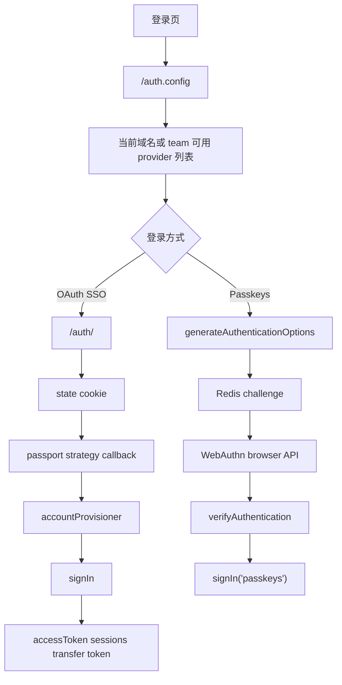
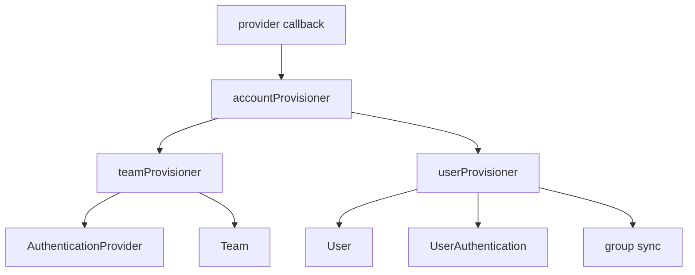

Outline 的认证系统不是一个单独的 passport 配置文件，而是四层叠在一起的结构：

- 插件系统决定“有哪些登录方式存在”
- `AuthenticationProvider` 决定“某个 workspace 启用了哪些外部身份源”
- `accountProvisioner -> teamProvisioner -> userProvisioner` 决定“外部身份如何落到本地 Team / User / UserAuthentication”
- `signIn()` 再把这些结果变成 Outline 自己的 cookie / JWT 会话

Passkeys 则复用了最后一层 `signIn()`，但前半段完全不走 OAuth。

Sources: [server/routes/auth/index.ts](server/routes/auth/index.ts), [server/routes/api/auth/auth.ts](server/routes/api/auth/auth.ts), [server/routes/api/authenticationProviders/authenticationProviders.ts](server/routes/api/authenticationProviders/authenticationProviders.ts), [server/routes/api/oauthAuthentications/oauthAuthentications.ts](server/routes/api/oauthAuthentications/oauthAuthentications.ts), [server/routes/api/oauthClients/oauthClients.ts](server/routes/api/oauthClients/oauthClients.ts), [server/middlewares/passport.ts](server/middlewares/passport.ts), [server/utils/passport.ts](server/utils/passport.ts), [server/utils/authentication.ts](server/utils/authentication.ts), [server/utils/jwt.ts](server/utils/jwt.ts), [server/commands/accountProvisioner.ts](server/commands/accountProvisioner.ts), [server/commands/teamProvisioner.ts](server/commands/teamProvisioner.ts), [server/commands/userProvisioner.ts](server/commands/userProvisioner.ts), [server/models/AuthenticationProvider.ts](server/models/AuthenticationProvider.ts), [server/models/UserAuthentication.ts](server/models/UserAuthentication.ts), [server/models/UserPasskey.ts](server/models/UserPasskey.ts), [server/models/helpers/AuthenticationHelper.ts](server/models/helpers/AuthenticationHelper.ts), [server/policies/userPasskey.ts](server/policies/userPasskey.ts), [server/presenters/providerConfig.ts](server/presenters/providerConfig.ts), [server/presenters/authenticationProvider.ts](server/presenters/authenticationProvider.ts), [plugins/google/server/index.ts](plugins/google/server/index.ts), [plugins/google/server/auth/google.ts](plugins/google/server/auth/google.ts), [plugins/azure/server/index.ts](plugins/azure/server/index.ts), [plugins/azure/server/auth/azure.ts](plugins/azure/server/auth/azure.ts), [plugins/oidc/server/index.ts](plugins/oidc/server/index.ts), [plugins/oidc/server/auth/oidcRouter.ts](plugins/oidc/server/auth/oidcRouter.ts), [plugins/slack/server/index.ts](plugins/slack/server/index.ts), [plugins/slack/server/auth/slack.ts](plugins/slack/server/auth/slack.ts), [plugins/email/server/index.ts](plugins/email/server/index.ts), [plugins/email/server/auth/email.ts](plugins/email/server/auth/email.ts), [plugins/passkeys/server/index.ts](plugins/passkeys/server/index.ts), [plugins/passkeys/server/auth/passkeys.ts](plugins/passkeys/server/auth/passkeys.ts), [plugins/passkeys/server/api/passkeys.ts](plugins/passkeys/server/api/passkeys.ts), [plugins/passkeys/server/processors/PasskeyCreatedProcessor.ts](plugins/passkeys/server/processors/PasskeyCreatedProcessor.ts), [plugins/passkeys/server/email/templates/PasskeyCreatedEmail.tsx](plugins/passkeys/server/email/templates/PasskeyCreatedEmail.tsx), [plugins/passkeys/server/presenters/userPasskey.ts](plugins/passkeys/server/presenters/userPasskey.ts), [plugins/passkeys/client/Settings.tsx](plugins/passkeys/client/Settings.tsx), [app/scenes/Login/Login.tsx](app/scenes/Login/Login.tsx), [app/scenes/Login/components/AuthenticationProvider.tsx](app/scenes/Login/components/AuthenticationProvider.tsx), [app/scenes/Settings/Authentication.tsx](app/scenes/Settings/Authentication.tsx), [app/scenes/Settings/Security.tsx](app/scenes/Settings/Security.tsx), [shared/utils/passkeys.ts](shared/utils/passkeys.ts)

## 先把整条认证链画出来

可以先把 Outline 的登录流程压成下面这张图：

这张图里最重要的一点是：**外部 provider 只负责证明“你是谁”，真正的应用会话还是由 Outline 自己签发。**

## 第一层是插件注册：哪些 provider 存在，由插件系统决定

Outline 并不是把 Google、Azure、Slack、OIDC 这些 provider 硬编码在一个中央 auth 文件里。它们都是通过 `Hook.AuthProvider` 注册进来的。

从 `plugins/*/server/index.ts` 可以很清楚地看到：

- Google 插件在 `GOOGLE_CLIENT_ID/SECRET` 存在时注册
- Azure 插件在 `AZURE_CLIENT_ID/SECRET` 存在时注册
- OIDC 插件支持手工 endpoint 配置或 issuer discovery
- Slack 插件除了 AuthProvider，还顺带注册 API hooks 和 Processor
- Email、Passkeys 也是 AuthProvider，只是它们不走传统 OAuth

### 登录页拿到的是“当前域名可用 provider 列表”

`auth.config` 会根据当前请求域名判断是：

- self-hosted 根域
- cloud custom domain
- cloud team subdomain
- 标准根登录页

然后用 `AuthenticationHelper.providersForTeam(team?)` 返回真正应该展示给用户的 provider。

`presentProviderConfig()` 再把每个 provider 映射成：

- `id`
- `name`
- `authUrl`

前端 `Login.tsx` 和 `AuthenticationProvider.tsx` 就只消费这层稳定配置，不需要知道 provider 背后的具体策略类。

### Passkeys 和 Email 在 provider 列表里是“特例”

`AuthenticationHelper.providersForTeam()` 对这两种方式单独分支：

- Email 只看 `team.emailSigninEnabled`
- Passkeys 不仅要看 `team.passkeysEnabled`，还要求当前 team 至少已经有一个已注册 passkey

WHY Passkeys 要多这个条件？因为如果团队启用了 passkeys，但实际上没有任何成员注册过 passkey，那么登录页把它展示出来只会得到一个不可用入口。

Sources: [plugins/google/server/index.ts](plugins/google/server/index.ts), [plugins/azure/server/index.ts](plugins/azure/server/index.ts), [plugins/oidc/server/index.ts](plugins/oidc/server/index.ts), [plugins/slack/server/index.ts](plugins/slack/server/index.ts), [plugins/email/server/index.ts](plugins/email/server/index.ts), [plugins/passkeys/server/index.ts](plugins/passkeys/server/index.ts), [server/models/helpers/AuthenticationHelper.ts](server/models/helpers/AuthenticationHelper.ts), [server/routes/api/auth/auth.ts](server/routes/api/auth/auth.ts), [server/presenters/providerConfig.ts](server/presenters/providerConfig.ts), [app/scenes/Login/Login.tsx](app/scenes/Login/Login.tsx), [app/scenes/Login/components/AuthenticationProvider.tsx](app/scenes/Login/components/AuthenticationProvider.tsx)

## 第二层是 apex auth 应用和 state cookie：所有 OAuth 流都先经过统一跳板

`server/routes/auth/index.ts` 会动态挂载所有 provider 的 router。也就是说：

- `/auth/google`
- `/auth/azure`
- `/auth/oidc`
- `/auth/slack`
- `/auth/email`
- `/auth/passkeys.*`

都是由插件注入进来的。

## `StateStore` 把 OAuth 过程中的关键上下文塞进 cookie

`server/utils/passport.ts` 的 `StateStore` 会把下面这些信息编码进 `state` cookie：

- `host`
- `token`
- `client`
- `codeVerifier`
- `accessToken`

这里的 `host` 很关键。用户可能从：

- apex 域
- team 子域
- 自定义域

发起登录，所以回调时必须知道原始意图是什么 team / 什么 host。

### state 不只是 CSRF token，还承担“恢复上下文”的工作

除了防止 OAuth state mismatch，它还被用来：

- `getClientFromOAuthState()`：判断这是 Web 还是 Desktop 发起的登录
- `getUserFromOAuthState()`：在“管理员给当前 team 连接新的 provider”场景下恢复原有登录态
- `getTeamFromContext()`：根据 state 或 query host 推断应该落到哪个 team

也就是说，Outline 的 OAuth state 比传统最简方案承载的信息更多，因为它要支持多子域、多 team 和“已登录管理员追加连接 provider”这类高级场景。

## provider callback 的错误重定向也考虑了域名恢复

`server/middlewares/passport.ts` 在认证失败时不会只把用户粗暴打回 `/`，而是：

1. 尝试从 `state` 恢复原始 host
2. 在 cloud-hosted 下校验这个 host 是否可信
3. 再把错误 notice 重定向回原始域名/子域名

这类细节如果没有 state cookie 是很难做好的。

Sources: [server/routes/auth/index.ts](server/routes/auth/index.ts), [server/utils/passport.ts](server/utils/passport.ts), [server/middlewares/passport.ts](server/middlewares/passport.ts)

## 第三层是 provider-specific 身份映射：不同 provider 的“team id”和“user id”并不一样

所有外部 OAuth provider 最终都会调到 `accountProvisioner(...)`，但传进去的识别字段并不相同。

## Google：team 按邮件域，user 按 Google profile.id

Google 路由里能看到：

- team `providerId` 取邮件域名 `domain`
- user `providerId` 取 `profile.id`
- subdomain 也由域名 slugify 而来

这意味着 Google 集成天然偏向“同域邮箱归同一个 workspace”。

## Azure：team 按租户，user 按对象 ID

Azure 路由传给 `accountProvisioner()` 的是：

- team `providerId = profile.tid`
- user `providerId = profile.oid`

所以 Azure 的团队边界更像 AAD tenant，而不是邮箱域名本身。

## Slack：team 按 Slack workspace，user 按 Slack user

Slack 路由使用：

- team `providerId = profile.team.id`
- user `providerId = profile.user.id`

Slack 插件因此不仅负责登录，还能顺带把同一套 providerId 用到 Slack API hook 和消息处理器里。

## OIDC：team/providerId 更灵活

OIDC 最复杂。它会：

- 尝试复用已存在 `AuthenticationProvider.providerId`
- 如果没有，就回退到 OIDC issuer/URL 的 hostname

这样做是因为 OIDC 不是单一厂商协议，不同部署的 identity provider 拓扑差异很大。

### `accountProvisioner` 统一收口这些差异

无论上游是谁，传给它的结构都统一成四块：

- `team`
- `user`
- `authenticationProvider`
- `authentication`

这就是为什么 Outline 可以把 provider-specific 逻辑控制在插件里，而把真正的账号落地逻辑集中到 commands。

Sources: [plugins/google/server/auth/google.ts](plugins/google/server/auth/google.ts), [plugins/azure/server/auth/azure.ts](plugins/azure/server/auth/azure.ts), [plugins/slack/server/auth/slack.ts](plugins/slack/server/auth/slack.ts), [plugins/oidc/server/auth/oidcRouter.ts](plugins/oidc/server/auth/oidcRouter.ts), [server/commands/accountProvisioner.ts](server/commands/accountProvisioner.ts)

## 第四层是账号落地：team、provider、user、auth record 分开建

`accountProvisioner` 本身没有直接把所有事情写死在一个事务里，而是继续拆给：

- `teamProvisioner`
- `userProvisioner`

这层分拆非常合理，因为“创建/找到 workspace”和“创建/找到用户”其实是两个不同问题。

## `teamProvisioner` 先决定要不要创建或绑定 workspace

它会优先尝试找到已有的 `AuthenticationProvider` 记录。如果找到了，说明：

- 这个外部身份源已经绑定到某个 team
- 直接复用即可

如果没找到，则分情况处理：

- self-hosted 且 `teamId` 已存在时，可以在允许域名条件下把新 provider 绑定到现有 team
- cloud-hosted 下，不允许陌生 provider 随便接到现有 team
- 完全找不到匹配 team 时，才真的 `teamCreator(...)`

这解释了为什么 Outline 的“SSO 登录”同时兼具：

- 登录已有 workspace
- 首次创建 workspace
- 给已有 workspace 追加新的 provider

三种能力。

## `userProvisioner` 再决定用户是老用户、邀请壳用户，还是新用户

它会按下面顺序尝试：

1. 先找 `UserAuthentication` 是否已有相同外部 `providerId`
2. 没有的话，再按 email 在 team 内找现有 `User`
3. 如果现有 user 是 invite shell record，则补上 authentication
4. 如果都没有，再判断是否允许新建用户

这里还会显式处理：

- `inviteRequired`
- `allowedDomains`
- `defaultUserRole`
- avatar 同步
- invited user 接受邀请通知

所以外部 provider 只负责“证明身份”，用户是否允许进入这个 workspace，仍然由 Outline 自己的 team 策略控制。

### group sync 也是在这一步追加

`accountProvisioner` 在用户落地后，还会根据 provider settings 决定是否执行：

- `groupsSyncer(...)`

也就是把外部身份源里的 group membership 同步回 Outline 本地 groups。

Sources: [server/commands/accountProvisioner.ts](server/commands/accountProvisioner.ts), [server/commands/teamProvisioner.ts](server/commands/teamProvisioner.ts), [server/commands/userProvisioner.ts](server/commands/userProvisioner.ts), [app/scenes/Settings/Authentication.tsx](app/scenes/Settings/Authentication.tsx), [app/scenes/Settings/Security.tsx](app/scenes/Settings/Security.tsx)

## `AuthenticationProvider` 和 `UserAuthentication` 分别记录“身份源”和“用户凭据”

这个区分非常重要。

## `AuthenticationProvider` 是 team 级配置

它保存的是：

- `name`
- `providerId`
- `enabled`
- `settings`
- `teamId`

它表达的是：“这个 workspace 连接了哪个外部身份源，以及是否启用、如何配置 group sync 等细节。”

### 不是任何 provider 都能随便关掉

`AuthenticationProvider.disable()` / `destroy()` 会检查：

- team 是否开启了 email 登录
- 除自己之外是否还有其他启用中的 provider

如果都没有，就拒绝关闭最后一个 provider。这个约束非常关键，否则管理员可能把整个 workspace 锁死。

## `UserAuthentication` 才是用户级外部登录凭据

它保存的是：

- `scopes`
- `accessToken`
- `refreshToken`
- `providerId`
- `expiresAt`
- `lastValidatedAt`

而且 token 字段还是加密存储的。

### 外部 access token 失效后，Outline 会尝试自己刷新并持续验证

`validateAccess()` 的逻辑大致是：

1. 5 分钟内已校验过则跳过
2. 如果 access token 快过期且有 refresh token，先尝试 rotate
3. 对支持 `oauthClient.userInfo()` 的 provider 再做一次远端校验
4. 如果所有校验都失败，返回 false

`ValidateSSOAccessTask` 则会在后台汇总这个结果：如果一个用户所有 SSO authentication 都失效了，就旋转 `jwtSecret`，让已有 Outline session 全部失效。

这说明 Outline 不会把“一次成功 SSO 登录”当作永久真相，而是会在后续会话生命周期里持续复核。

Sources: [server/models/AuthenticationProvider.ts](server/models/AuthenticationProvider.ts), [server/models/UserAuthentication.ts](server/models/UserAuthentication.ts), [server/routes/api/auth/auth.ts](server/routes/api/auth/auth.ts), [server/queues/tasks/ValidateSSOAccessTask.ts](server/queues/tasks/ValidateSSOAccessTask.ts), [server/routes/api/authenticationProviders/authenticationProviders.ts](server/routes/api/authenticationProviders/authenticationProviders.ts)

## 外部身份一旦被接受，最终还是要落到 Outline 自己的 cookie/JWT 会话

`signIn()` 是整条链路的收口点。

它会统一做这些事情：

- 拒绝 suspended team / suspended user
- 更新 `lastSignedInAt`
- 记录 `users.signin` event
- 设置 `lastSignedIn` cookie
- 生成或兑换 Outline 自己的 JWT

## cloud-hosted 场景下会拆成 apex cookie + transfer token 两步

如果是云端多子域模式，`signIn()` 不会直接在 apex 域落最终 session，而是：

1. 在 apex 域写 `sessions` cookie，记录哪些 team 已登录
2. 生成 1 分钟有效的 `transfer` token
3. 跳转到 `team.url/auth/redirect?token=...`
4. `/auth/redirect` 再签发真正的 `accessToken` cookie

Desktop 客户端则改走 `/desktop-redirect`。

## self-hosted / 单域场景则直接写 `accessToken`

如果没有多子域跳转需求，`signIn()` 会直接设置：

- `accessToken` cookie

然后按默认 collection / recent / home 规则重定向。

### `auth.info` 是前端“恢复当前登录态”的主入口

登录后前端并不是自己解析 token，而是通过 `auth.info` 拿回：

- user
- team
- groups
- `collaborationToken`
- `availableTeams`

同时这条接口还会在非 Email / Passkeys 的会话上，按条件后台调度 `ValidateSSOAccessTask`。这说明外部 SSO 与内部会话并不是“一次性交换”，而是有持续关系的。

Sources: [server/utils/authentication.ts](server/utils/authentication.ts), [server/routes/auth/index.ts](server/routes/auth/index.ts), [server/routes/api/auth/auth.ts](server/routes/api/auth/auth.ts), [server/utils/jwt.ts](server/utils/jwt.ts), [app/stores/AuthStore.ts](app/stores/AuthStore.ts)

## Email 和 Passkeys 是两条不走外部 OAuth 的并行登录路径

标题虽然重点点名了 Google / OIDC / Azure / Slack，但 Email 和 Passkeys 在实际实现里也已经是一级认证通道。

## Email 登录更像“先查用户，再决定发 magic link 还是改跳 SSO”

`plugins/email/server/auth/email.ts` 的逻辑很有意思：

1. 先根据当前域名推断 team
2. 检查 `team.emailSigninEnabled`
3. 按 team + email 找用户
4. 如果这个用户其实已经绑定了某个 SSO provider，直接返回那个 provider 的登录地址
5. 否则才发送：
   - magic sign-in link
   - 或 6 位 OTP 验证码

### OTP 只是登录前的短期 Redis 状态

如果用户选择 OTP 模式，真正持久化在 Redis 里的只是：

- teamId + email 对应的验证码
- 以及尝试次数

校验通过后仍然会回到统一的 `signIn(ctx, "email", ...)`。

Sources: [plugins/email/server/auth/email.ts](plugins/email/server/auth/email.ts), [server/utils/authentication.ts](server/utils/authentication.ts)

## Passkeys 复用登录收口，但前半段完全是 WebAuthn 流

Passkeys 的实现非常完整，不是一个“实验性按钮”。

### 登录时：先 challenge，再浏览器 WebAuthn，再回到 `signIn`

登录页上如果 provider id 是 `passkeys`，前端会：

1. 调 `/auth/passkeys.generateAuthenticationOptions`
2. 拿到 `challengeId + options`
3. 用 `@simplewebauthn/browser` 的 `startAuthentication(...)`
4. 把结果原生 POST 到 `/auth/passkeys.verifyAuthentication`

服务端则会：

1. 从 Redis 取 challenge
2. 用 credentialId 找 `UserPasskey`
3. 校验 team 是否开启 `passkeysEnabled`
4. 用 `verifyAuthenticationResponse(...)` 验证
5. 更新 passkey counter / `lastActiveAt`
6. 最后调用 `signIn(ctx, "passkeys", ...)`

### 注册时：是一个已登录用户侧的安全设置动作

Passkey 注册要求用户已经登录：

1. `generateRegistrationOptions` 会拉取当前用户已有 passkeys 做 exclude
2. 把 registration challenge 按 userId 写进 Redis
3. 前端设置页调用 `startRegistration(...)`
4. `verifyRegistration` 校验 challenge / origin / rpId
5. 创建或更新 `UserPasskey`

### `UserPasskey` 保存的是 WebAuthn 凭据本体

模型字段包括：

- `credentialId`
- `credentialPublicKey`
- `aaguid`
- `counter`
- `transports`
- `name`
- `userAgent`
- `lastActiveAt`

其中 `name` 不是随机字符串，而会通过 `generatePasskeyName(aaguid, userAgent, transports)` 生成人类可读设备名。

### Passkeys 还有自己的设置 UI、权限和审计反馈

- `userPasskey` policy 只允许本人读/改/删自己的 passkey
- team 级 `createUserPasskey` 还要求 `passkeysEnabled`
- 设置页可以 list / rename / delete
- 新建 passkey 后还会触发 `passkeys.create` event
- `PasskeyCreatedProcessor` 会发送一封安全通知邮件

这说明 Passkeys 已经被当成正式生产认证方式，而不是一个 demo。

Sources: [plugins/passkeys/server/auth/passkeys.ts](plugins/passkeys/server/auth/passkeys.ts), [plugins/passkeys/server/api/passkeys.ts](plugins/passkeys/server/api/passkeys.ts), [plugins/passkeys/server/processors/PasskeyCreatedProcessor.ts](plugins/passkeys/server/processors/PasskeyCreatedProcessor.ts), [plugins/passkeys/server/email/templates/PasskeyCreatedEmail.tsx](plugins/passkeys/server/email/templates/PasskeyCreatedEmail.tsx), [plugins/passkeys/client/Settings.tsx](plugins/passkeys/client/Settings.tsx), [app/scenes/Login/components/AuthenticationProvider.tsx](app/scenes/Login/components/AuthenticationProvider.tsx), [server/models/UserPasskey.ts](server/models/UserPasskey.ts), [shared/utils/passkeys.ts](shared/utils/passkeys.ts), [server/policies/userPasskey.ts](server/policies/userPasskey.ts)

## 最后要区分一件事：外部 SSO 登录和 Outline 自己作为 OAuth Server 是两套问题

这一页讨论的主要是“用户如何通过外部身份进入 Outline”。而 `oauthClients.*` / `oauthAuthentications.*` 这些路由则是另一条线：

- Outline 自己对外发 OAuth client
- 用户授权第三方应用访问 Outline API

它们和 Google/Azure/Slack/OIDC 登录相关，但不是同一层能力。真正展开要看下一页专门的 OAuth 2.0 服务端实现。

Sources: [server/routes/api/oauthClients/oauthClients.ts](server/routes/api/oauthClients/oauthClients.ts), [server/routes/api/oauthAuthentications/oauthAuthentications.ts](server/routes/api/oauthAuthentications/oauthAuthentications.ts)

## 为什么 Outline 要把认证系统设计成今天这样

这套实现背后的现实约束至少有这些：

1. **同一产品要同时支持 self-hosted、cloud、team subdomain、custom domain**
2. **外部身份源很多，而且 provider 的“team identity”定义并不一致**
3. **登录后仍要回到 Outline 自己可控的会话、权限和审计体系**
4. **管理员需要在不破坏团队访问的前提下增删 provider**
5. **Passkeys 这样的非 OAuth 方案也要并入同一用户体系**

所以 Outline 的策略是：

- 用插件系统承接 provider 差异
- 用 `AuthenticationProvider` 承接 team 级身份源配置
- 用 `UserAuthentication` 承接用户级外部凭据
- 用 `signIn()` 承接内部 session 发放
- 用 Passkeys/Email 做并行但同样正式的一等登录方式

这让系统既能接住多种外部认证方案，又不会把核心会话控制权让渡给第三方 provider。

## 建议继续阅读

- 想看 cookie/JWT、Redis challenge、rate limiter 和多 team 会话目录怎样配合：读 [Redis 缓存策略与会话管理](25-redis-huan-cun-ce-lue-yu-hui-hua-guan-li)
- 想看授权校验怎样在登录之后继续约束 API 和模型能力：读 [权限系统：基于 CanCan 的策略（Policies）与授权机制](20-quan-xian-xi-tong-ji-yu-cancan-de-ce-lue-policies-yu-shou-quan-ji-zhi)
- 想看 Outline 自己对外提供 OAuth client/授权能力的另一半：读 [OAuth 2.0 服务端实现：客户端注册与授权流程](28-oauth-2-0-fu-wu-duan-shi-xian-ke-hu-duan-zhu-ce-yu-shou-quan-liu-cheng)
- 想看这些 provider 为什么能以插件形式挂到系统里：读 [插件系统：客户端与服务端的扩展机制](8-cha-jian-xi-tong-ke-hu-duan-yu-fu-wu-duan-de-kuo-zhan-ji-zhi)
- 想看登录成功后前端是怎样恢复 team/user/policies 状态的：读 [状态管理：MobX Model、Store 与 RootStore 架构](9-zhuang-tai-guan-li-mobx-model-store-yu-rootstore-jia-gou)
- 想看 API 路由层如何把 validate、auth middleware、presenter 串成请求链：读 [API 路由设计：Schema 验证、中间件与错误处理](17-api-lu-you-she-ji-schema-yan-zheng-zhong-jian-jian-yu-cuo-wu-chu-li)
