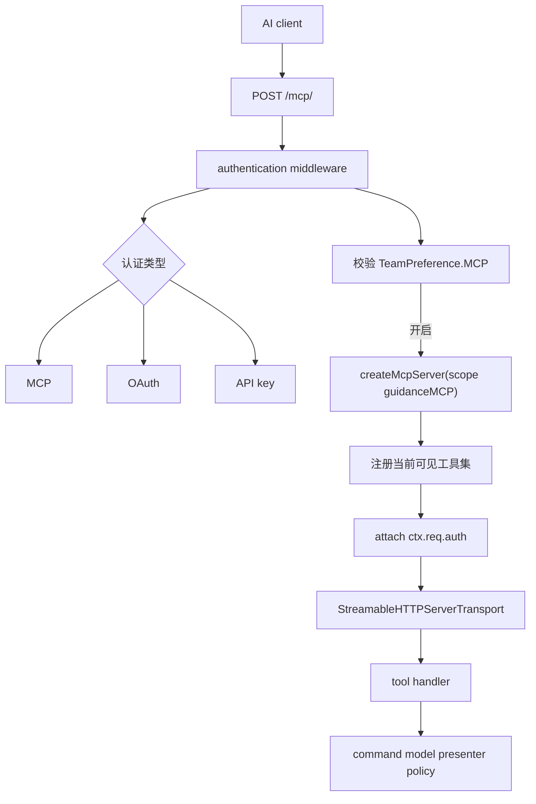
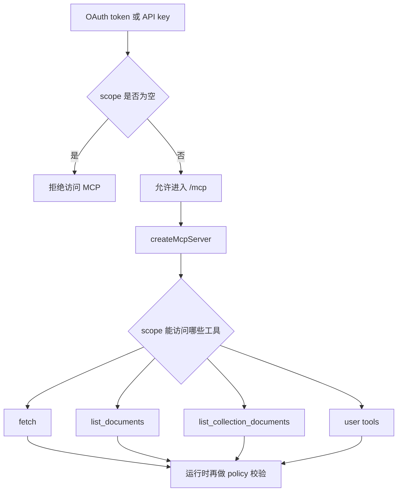

如果把 Outline 的 MCP 只理解成“给大模型开放一个搜索接口”，会低估它的设计难度。当前实现里，MCP 不是旁路系统，也不是单独同步一份知识库数据，而是**把现有权限、OAuth/API key、presenter、command、搜索和团队配置重新包装成一个可被 AI 客户端消费的工具服务器**。

Sources: [server/routes/mcp/index.ts](server/routes/mcp/index.ts), [server/routes/mcp/index.test.ts](server/routes/mcp/index.test.ts), [server/test/McpHelper.ts](server/test/McpHelper.ts), [server/routes/index.ts](server/routes/index.ts), [server/routes/api/teams/schema.ts](server/routes/api/teams/schema.ts), [server/models/ApiKey.ts](server/models/ApiKey.ts), [server/models/oauth/OAuthAuthentication.ts](server/models/oauth/OAuthAuthentication.ts), [server/tools/util.ts](server/tools/util.ts), [server/tools/fetch.ts](server/tools/fetch.ts), [server/tools/users.ts](server/tools/users.ts), [server/tools/documents.ts](server/tools/documents.ts), [app/scenes/Settings/Features.tsx](app/scenes/Settings/Features.tsx)

## 先把整条 MCP 链路画出来

可以先把当前实现压成下面这张图：



这条链路里最关键的一点是：**MCP 复用了 Outline 原有的数据平面和授权平面。**

它没有额外建：

- 一套单独的 AI 文档索引 API
- 一套脱离现有模型的 agent 数据层
- 一套和 Web/API 不一致的权限模型

这意味着 MCP 工具拿到的数据，原则上和正常用户通过 Web UI、REST API 看到的是同一份事实，只是入口换成了工具调用。

## `/mcp/` 是一个受控的工具入口，不是公开开放的协议端点

`server/routes/mcp/index.ts` 做了几层很明确的限制：

- 只接受 `POST /mcp/`
- `GET` 和 `DELETE` 一律返回 `405`，并带 `Allow: POST`
- 路由前面挂了 `rateLimiter(RateLimiterStrategy.OneThousandPerHour)`
- 认证类型只允许 `MCP`、`OAUTH`、`API`
- 当前 team 没开启 `TeamPreference.MCP` 时直接 `404`

这里故意返回 `404` 而不是“功能关闭”的业务错误，很像一个产品边界声明：**没有启用 MCP 的 workspace，从协议视角看就像这个资源不存在。**

测试也把这层边界写得很明确：

- 未认证请求返回 `401`
- 普通 JWT 不能直接拿来打 `/mcp/`
- 功能关闭时返回 `404`
- 初始化请求可以正常返回 capabilities

Sources: [server/routes/mcp/index.ts](server/routes/mcp/index.ts), [server/routes/mcp/index.test.ts](server/routes/mcp/index.test.ts)

## `createMcpServer(...)` 做的不是“挂几个函数”，而是按 scope 组装一台专属工具服务器

`createMcpServer(scopes, guidance?)` 每次请求都会新建一个 `McpServer` 实例，然后注册几组工具：

- `attachmentTools`
- `collectionTools`
- `commentTools`
- `documentTools`
- `fetchTool`
- `userTools`

这说明 Outline 的 MCP 不是启动时注册一次全局工具集，然后在调用时判权限；它更接近：

1. 先看当前 token 拿到了什么 scope
2. 再决定这一台 server 实例到底暴露哪些工具
3. 最后在具体工具实现里继续做模型级权限判断

这样做的好处是，客户端在 `tools/list` 阶段就能看到一个已经被裁剪过的工具集合，而不是先拿到一堆自己永远不能调用的能力。

## 默认 instructions 已经把 Outline 的编辑约束告诉 MCP 客户端

`defaultInstructions` 里有一条非常实际的规则：文档和 collection 的 markdown 里，用户 mention 要写成：

```text
@[Display Name](mention://user/userId)
```

而且还明确提示客户端先用 `list_users` 找 user ID。

这不是装饰性文案，而是在补 MCP 的一个天然缺口：协议层只知道“工具”和“文本”，但不知道 Outline 编辑器里哪些 markdown 语法有业务语义。把 mention 语法塞进 instructions，相当于给上游 agent 一份最小但必要的写作约束。

## `guidanceMCP` 让每个 workspace 都能叠加自己的 AI 使用说明

如果 team 配了 `guidanceMCP`，它会直接追加到默认 instructions 后面。也就是说，MCP 客户端最终看到的说明书由两部分组成：

- Outline 自己的通用文档规则
- 当前 workspace 的团队级附加指南

前端设置页 `app/scenes/Settings/Features.tsx` 也完全围绕这两个配置展开：

- 开关 `TeamPreference.MCP`
- 显示并复制当前 `/mcp` endpoint
- 编辑 `guidanceMCP`

而 `server/routes/api/teams/schema.ts` 又对 `guidanceMCP` 长度做了校验，说明这不是临时字符串，而是正式 team 配置的一部分。

Sources: [server/routes/mcp/index.ts](server/routes/mcp/index.ts), [app/scenes/Settings/Features.tsx](app/scenes/Settings/Features.tsx), [server/routes/api/teams/schema.ts](server/routes/api/teams/schema.ts)

## MCP 的认证模型分两层：先放行到 `/mcp`，再在工具级做 scope 裁剪

这部分实现很值得单独看，因为它回答了一个核心问题：**为什么 `/mcp` 路由本身不按每个 API path 去卡死权限？**

答案在 `OAuthAuthentication.canAccess()` 和 `ApiKey.canAccess()`：

- 对普通 API path，还是按 `AuthenticationHelper.canAccess(...)` 判断
- 但只要是 `/mcp`，就退化成“scope 非空即可访问”

也就是说，访问 MCP server 的门槛是：

- 你必须有一个合法的 OAuth token 或 API key
- 而且这个 token/key 不能是空 scope

但真正细粒度的读写权限，不在入口处判断，而是在工具注册阶段完成。例如：

- `fetch` 只有当 `documents.info`、`collections.info`、`users.info` 至少有一个能访问时才会注册
- `list_documents` 依赖 `documents.list`
- `list_collection_documents` 依赖 `collections.documents`
- 其他 create/update/delete 工具也都按各自 scope 决定是否出现

这样做的原因很实际：MCP 客户端面对的是“工具能力集合”，而不是一条一条 REST path。**工具是否存在，本身就是授权结果的一部分。**

Sources: [server/models/oauth/OAuthAuthentication.ts](server/models/oauth/OAuthAuthentication.ts), [server/models/ApiKey.ts](server/models/ApiKey.ts), [server/tools/fetch.ts](server/tools/fetch.ts), [server/tools/documents.ts](server/tools/documents.ts), [server/tools/users.ts](server/tools/users.ts)



## 工具处理器并没有重写业务逻辑，而是把 MCP 请求转回 Outline 的既有抽象

`server/tools/util.ts` 是这层复用的关键胶水。

它提供了几类 helper：

- `getActorFromContext`：从 MCP transport 传下来的 `authInfo.extra` 里取当前用户
- `buildAPIContext`：构造一个最小 `APIContext`，供 command 复用
- `success` / `error`：把结果包装成 MCP `CallToolResult`
- `withTracing`：给每个工具调用打 tracing span 和用户/team tag
- `pathToUrl`：把相对 path/url 补全成 team 级绝对地址

这里最关键的是 `buildAPIContext`。很多写操作原本就是为 Koa API 路由写的 command，比如创建或更新文档时依赖：

- `ctx.state.auth`
- `ctx.context.auth`
- `ctx.request.ip`

MCP 不会原生给这些字段，但 `buildAPIContext` 把它们补齐后，就能继续调用现有 command，而不是再造一套“AI 专用写文档逻辑”。

换句话说，Outline 的策略不是“把 command 改造成 MCP-first”，而是“让 MCP 适配 command 已有的调用约定”。

## 几个工具例子能看出它更像“受限版工作区操作台”，而不是单纯搜索插件

### `fetch`：统一读取入口

`fetch` 工具可以按 `resource + id` 读取：

- `document`
- `collection`
- `user`

它还有几个很实用的实现细节：

- 输入既可以是纯 ID，也可以是 URL，内部会抽取最后一个 path segment
- `document` 返回的是“结构化属性 + 文本内容”两段 text payload
- `collection` 返回 collection 本体以及完整文档树
- `user` 支持 `self` / `me` / `current_user`

这说明它不是一个“REST client passthrough”，而是一个针对 LLM 消费场景重新整理过的读取接口。

### `list_documents`：既能搜，也能列最近更新

`list_documents` 有两种模式：

- 传 `query` 时走全文搜索
- 不传 `query` 时按 `updatedAt DESC` 返回最近文档

如果 query 看起来像文档 slug 或 URL，还会先尝试精确匹配，把精确命中顶到前面。这个细节很适合 agent 使用，因为模型经常会把用户贴过来的文档 URL 直接原样传进来。

### `list_collection_documents`：直接返回层级树，并用 Redis 缓存结构

这个工具不是简单查一张 documents 表，而是读取 collection 的 `documentStructure`，并通过：

- `CacheHelper.getDataOrSet(...)`
- `RedisPrefixHelper.getCollectionDocumentsKey(...)`

把结果做了短期缓存。

这再次说明 MCP 不是“给 AI 读库表”，而是尽量把 Outline 已经整理好的导航结构直接暴露出去。

### `list_users`：把 workspace 成员目录做成了一个 agent 可探索对象

`list_users` 支持：

- 按 query 搜姓名/邮箱
- 按 role 过滤
- 按 active / suspended / invited / all 过滤

而且非管理员默认看不到 suspended users。也就是说，MCP 工具并没有跳过原有权限边界。

Sources: [server/tools/fetch.ts](server/tools/fetch.ts), [server/tools/documents.ts](server/tools/documents.ts), [server/tools/users.ts](server/tools/users.ts), [server/tools/util.ts](server/tools/util.ts)

## 发现、注册和设置界面说明：MCP 在 Outline 里是一项正式集成功能

`server/routes/index.ts` 还提供了两组 `.well-known` 元数据：

- `/.well-known/oauth-authorization-server`
- `/.well-known/oauth-protected-resource`

它们有两个重要特点：

1. 如果 workspace 没开 MCP，protected resource 直接 `404`
2. 只有 MCP 开启且未禁用 DCR 时，authorization server 元数据里才会暴露 `registration_endpoint`

这说明当前实现把 MCP 和 OAuth client registration 紧密绑在一起：**Outline 不是只想让用户手动复制 token 连接 AI 客户端，而是准备按标准方式把 MCP server 暴露给外部应用发现和注册。**

前端设置页也印证了这一点。用户能在一个正式设置页面里：

- 开关 MCP server
- 复制 endpoint
- 写 workspace guidance

它已经不是实验性 feature flag，而是产品化功能。

## 测试代码反过来暴露了协议实现的一个关键现实：传输层是 SSE 风格响应

`server/test/McpHelper.ts` 会专门解析 `text/event-stream`，从 `data:` 行里抽出 JSON-RPC 响应。也就是说，虽然入口是 HTTP `POST /mcp/`，但 transport 返回的并不是普通 JSON，而是 MCP SDK 的流式 HTTP 语义。

`index.test.ts` 里还覆盖了：

- initialize
- tools/list
- 具体工具调用

这说明当前实现验证的不只是“业务函数能跑”，而是**协议握手、响应格式、认证和工具层能力裁剪一起能跑通**。

Sources: [server/routes/mcp/index.test.ts](server/routes/mcp/index.test.ts), [server/test/McpHelper.ts](server/test/McpHelper.ts)

## 为什么 Outline 会把 MCP 设计成今天这样

这套实现背后的现实约束大概有四个：

1. **AI 客户端需要一套稳定工具接口，但业务逻辑不能复制一遍。**
2. **workspace 级权限、文档权限、用户可见性必须和现有产品一致。**
3. **不同客户端的 OAuth / API key 获取方式不同，但工具能力应该统一。**
4. **同一 workspace 可能希望追加自己的 agent 行为规范。**

所以 Outline 的答案是：

- 用 `/mcp/` 暴露一个协议标准入口
- 用 team feature flag 决定是否启用
- 用 scope 决定工具是否被注册
- 用 policies / presenters / commands 复用现有业务层
- 用 `guidanceMCP` 给每个 workspace 留出 agent 协作语境

这使 MCP 更像“面向 AI 的工作区操作界面”，而不是一个和主产品松散耦合的外挂。

## 建议继续阅读

- 想看 MCP 背后的 OAuth 注册、授权码和 token 发放是怎么做的：读 [OAuth 2.0 服务端实现：客户端注册与授权流程](28-oauth-2-0-fu-wu-duan-shi-xian-ke-hu-duan-zhu-ce-yu-shou-quan-liu-cheng)
- 想看外部身份如何先把用户登录进 Outline，再进入 MCP 或 OAuth 授权链：读 [认证集成：Google、OIDC、Azure、Slack 与 Passkeys](26-ren-zheng-ji-cheng-google-oidc-azure-slack-yu-passkeys)
- 想看登录后的资源访问为什么还能继续受模型级 policy 约束：读 [权限系统：基于 CanCan 的策略（Policies）与授权机制](20-quan-xian-xi-tong-ji-yu-cancan-de-ce-lue-policies-yu-shou-quan-ji-zhi)
- 想看路由层怎样把 middleware、validate、transaction 和错误处理串起来：读 [API 路由设计：Schema 验证、中间件与错误处理](17-api-lu-you-she-ji-schema-yan-zheng-zhong-jian-jian-yu-cuo-wu-chu-li)
- 想看 Redis 在 collection 结构缓存、challenge 和会话辅助里扮演什么角色：读 [Redis 缓存策略与会话管理](25-redis-huan-cun-ce-lue-yu-hui-hua-guan-li)
- 想看这些 AI 能力开关为什么能以插件和团队设置的方式接进主系统：读 [插件系统：客户端与服务端的扩展机制](8-cha-jian-xi-tong-ke-hu-duan-yu-fu-wu-duan-de-kuo-zhan-ji-zhi)
