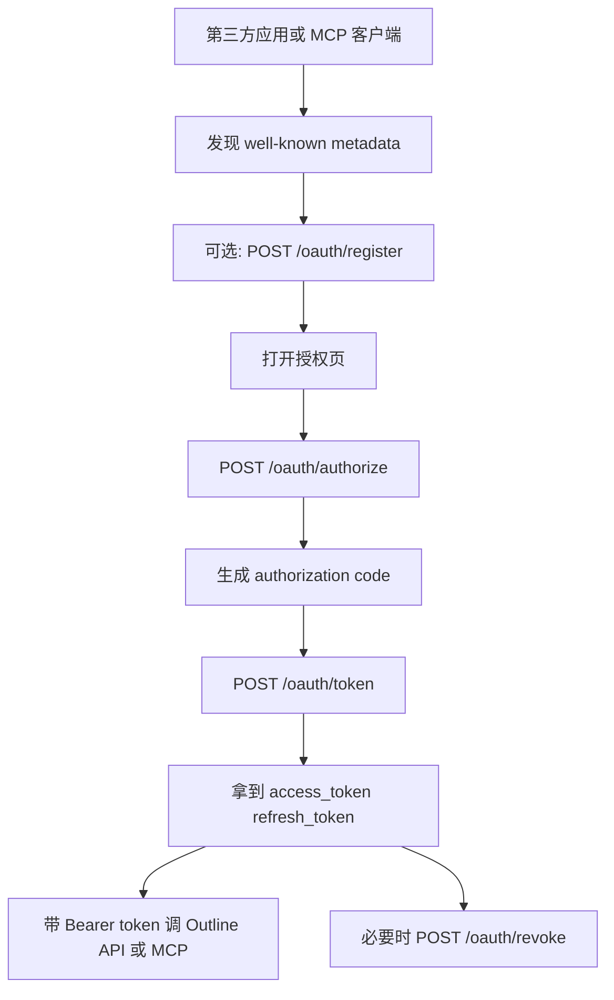
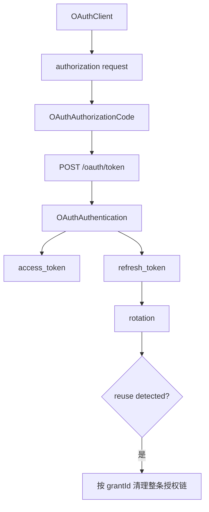

上一页讨论的是“外部身份怎样登录进 Outline”。这一页是另一半：**Outline 自己怎样作为 OAuth 2.0 授权服务器，对外发 client、发 authorization code、发 access token，并把这套能力进一步提供给 MCP 客户端或其他集成应用。**

Sources: [server/routes/oauth/index.ts](server/routes/oauth/index.ts), [server/routes/oauth/schema.ts](server/routes/oauth/schema.ts), [server/routes/oauth/middlewares/registrationAuth.ts](server/routes/oauth/middlewares/registrationAuth.ts), [server/routes/oauth/middlewares/oauthErrorHandler.ts](server/routes/oauth/middlewares/oauthErrorHandler.ts), [server/routes/index.ts](server/routes/index.ts), [server/utils/oauth/OAuthInterface.ts](server/utils/oauth/OAuthInterface.ts), [server/models/oauth/OAuthClient.ts](server/models/oauth/OAuthClient.ts), [server/models/oauth/OAuthAuthentication.ts](server/models/oauth/OAuthAuthentication.ts), [server/models/oauth/OAuthAuthorizationCode.ts](server/models/oauth/OAuthAuthorizationCode.ts), [server/presenters/oauthClient.ts](server/presenters/oauthClient.ts), [app/scenes/Login/OAuthAuthorize.tsx](app/scenes/Login/OAuthAuthorize.tsx), [app/scenes/Login/OAuthScopeHelper.ts](app/scenes/Login/OAuthScopeHelper.ts), [server/routes/oauth/oauth.test.ts](server/routes/oauth/oauth.test.ts)

## 先把这套 OAuth 链路和上一页的“外部登录”分开

可以先把当前实现压成下面这张图：

这条链路和上一页 `26` 页讲的 Google/Azure/Slack/OIDC 登录是两回事：

- `26` 页解决“用户怎么进入 Outline”
- 这一页解决“外部应用怎么被用户授权访问 Outline”

两套能力会在同一个用户会话里相遇，但职责完全不同。

## 路由层把 OAuth 服务器压缩成 6 个关键端点

`server/routes/oauth/index.ts` 当前主要暴露：

- `POST /oauth/authorize`
- `POST /oauth/token`
- `POST /oauth/revoke`
- `POST /oauth/register`
- `GET /oauth/register/:clientId`
- `PUT /oauth/register/:clientId`
- `DELETE /oauth/register/:clientId`

而真正的协议核心由 `@node-oauth/oauth2-server` 驱动，Koa 路由更像一层：

- 参数校验
- rate limit
- 当前用户/团队上下文注入
- RFC 风格响应包装

也就是说，Outline 没有自己从零手写授权码机，而是把协议细节交给成熟库，再把产品约束压进外层路由和模型。

## `/oauth/authorize` 的职责很单纯：要求当前用户已登录，然后生成授权码

`/oauth/authorize` 这条路由有几个关键约束：

- 必须先过 `auth()`，也就是用户已经登录到 Outline
- 请求里必须带 `client_id`
- 会先把 `client_id` 查成 `OAuthClient`
- 然后用 `authorize(user, "read", client)` 确认这个用户有资格授权这个 client

真正生成 code 的工作交给 `oauth.authorize(...)`：

- `allowEmptyState: false`，强制要求 `state`
- `authorizationCodeLifetime` 取 `OAuthAuthorizationCode.authorizationCodeLifetime`
- `authenticateHandler.handle()` 返回当前用户，让库知道是谁在授权

这一层最重要的产品语义是：**Outline 的 OAuth authorize 不是匿名授权页，而是“当前已登录用户，把自己的工作区能力委托给外部应用”。**

如果底层库返回 `302`，路由还会把它重新变成 Koa redirect，最终把 `code` 带回 `redirect_uri`。

Sources: [server/routes/oauth/index.ts](server/routes/oauth/index.ts)

## `/oauth/token` 做了一个很现实的补丁：公开客户端能刷新，机密客户端必须带 `client_secret`

`OAuth2Server` 初始化时配置了：

- 支持 grant：`authorization_code`、`refresh_token`
- `requireClientAuthentication.refresh_token = false`
- `alwaysIssueNewRefreshToken = true`

第二项看起来像放松了 refresh token 校验，但路由马上手工补了一层：

- 如果是 `refresh_token` grant 且没带 `client_secret`
- 会先查 `client_id`
- 如果该 client 是 `confidential`
- 就直接报错“Missing client_secret for confidential client”

这段逻辑很关键，因为 Outline 同时支持两类客户端：

- `public`：比如桌面端、CLI、本地 agent，不适合安全保存密钥
- `confidential`：比如后端服务，可以安全持有 secret

所以当前策略不是“一刀切都必须带 secret”，而是按 client 类型收紧。

## refresh token rotation 在这里不是可选增强，而是默认安全策略

`alwaysIssueNewRefreshToken: true` 已经明确要求每次刷新都换新 token。更关键的是 `OAuthInterface.getRefreshToken()` 还做了 **reuse detection**：

1. 如果找不到这枚 refresh token
2. 会去带 `paranoid: false` 的历史记录里查 hash
3. 如果发现它属于某个 `grantId`
4. 就把这个 grant 下的 `OAuthAuthentication` 和 `OAuthAuthorizationCode` 全部删除

这代表的安全语义是：**一旦怀疑 refresh token 被重复使用，就把整条授权链全部作废。**

这不是“实现一个能用的刷新流程”，而是在向 RFC 推荐实践靠拢。

Sources: [server/routes/oauth/index.ts](server/routes/oauth/index.ts), [server/utils/oauth/OAuthInterface.ts](server/utils/oauth/OAuthInterface.ts)

## 这套实现真正的核心在三个模型：`OAuthClient`、`OAuthAuthorizationCode`、`OAuthAuthentication`

### `OAuthClient`：对外应用的主记录

它保存的是应用级元数据：

- `name`
- `description`
- `developerName`
- `developerUrl`
- `avatarUrl`
- `clientId`
- `clientType`
- `redirectUris`
- `published`
- `lastActiveAt`

还有两类凭据：

- `clientSecret`，前缀 `ol_sk_`
- `registrationAccessToken`，前缀 `ol_rat_`

其中 registration access token 不直接持久化明文，而是存 `registrationAccessTokenHash`。只有创建或轮转时，虚拟字段上才会临时暴露明文。

### `OAuthAuthorizationCode`：短生命周期的授权码记录

它保存：

- `authorizationCodeHash`
- `codeChallenge`
- `codeChallengeMethod`
- `grantId`
- `scope`
- `redirectUri`
- `expiresAt`

这里最关键的是 PKCE 相关字段已经进入正式模型，不是临时 query 参数。这意味着授权码和 code verifier 的约束是数据库级链路的一部分。

### `OAuthAuthentication`：真正被第三方拿去调用 API 的 token 记录

它保存：

- `accessTokenHash`，前缀 `ol_at_`
- `refreshTokenHash`，前缀 `ol_rt_`
- 过期时间
- `grantId`
- `scope`
- `lastActiveAt`

它还承担两件事：

- `updateActiveAt()` 顺带把父 `OAuthClient.lastActiveAt` 一起刷新
- `canAccess(path)` 决定 token 能不能访问普通 API 或 `/mcp`

其中 `/mcp` 是特例，只要 scope 非空即可进入，细粒度控制交给工具层。这也解释了为什么 OAuth server 和 MCP server 会紧密相连。

Sources: [server/models/oauth/OAuthClient.ts](server/models/oauth/OAuthClient.ts), [server/models/oauth/OAuthAuthorizationCode.ts](server/models/oauth/OAuthAuthorizationCode.ts), [server/models/oauth/OAuthAuthentication.ts](server/models/oauth/OAuthAuthentication.ts)

## `OAuthInterface` 才是真正的协议适配器，它把库要求的回调接到 Outline 模型上

这个文件回答了一个最核心的问题：**node-oauth2-server 需要的那些 protocol callbacks，最终怎么映射到 Outline 的数据库和业务规则？**

它主要做了下面几件事。

## 1. 生成带前缀的 token/code

不是裸随机字符串，而是：

- authorization code 前缀 `ol_ac_`
- access token 前缀 `ol_at_`
- refresh token 前缀 `ol_rt_`

这让日志、排查和 token 类型识别都更容易。

## 2. 用 hash 存储敏感凭据

`saveAuthorizationCode` 和 `saveToken` 存的都是 hash，而不是明文。真正明文只在协议返回时短暂存在。

## 3. `validateRedirectUri(...)` 把 Web 和本地应用都考虑进来了

它要求：

- URI 必须在已注册 `redirectUris` 里
- 不能包含 `#` 或 `*`
- 普通 Web redirect 必须是 HTTPS
- 但 loopback 地址 `127.0.0.1` / `::1` / `localhost` 可以走 `http://`

最后这条是典型的 native app / CLI 场景支持。它说明 Outline 的 OAuth server 不是只服务网页集成，也在考虑本地桌面应用和本地 agent。

## 4. `validateScope(...)` 同时支持粗粒度和细粒度 scope

它允许：

- `read`
- `write`
- `documents.info` 这类一段式资源 scope
- `documents:read` 这类 namespace + coarse scope 形式

这给上层集成留出了比较大的 scope 表达空间，而不强制只能用两三个固定枚举。

Sources: [server/utils/oauth/OAuthInterface.ts](server/utils/oauth/OAuthInterface.ts)

## Dynamic Client Registration 不是附属功能，而是整个 MCP 集成能力的重要入口

`/oauth/register` 及其管理端点对应的是 RFC 7591 / 7592 风格的 Dynamic Client Registration。

这条线有几个非常明确的产品约束：

1. `env.OAUTH_DISABLE_DCR` 为真时，整个入口直接 `404`
2. 需要先从 host/context 里识别出当前 team
3. 当前 team 必须启用了 `TeamPreference.MCP`

也就是说，Outline 不是对整站无差别开放 DCR，而是：**只有准备开放 MCP 的 workspace，才暴露给外部应用动态注册 client 的入口。**

## `token_endpoint_auth_method` 决定 public / confidential

当前实现只认两种：

- `none` -> `public`
- `client_secret_post` -> `confidential`

这在 `schema.ts` 和 `register` 路由里都是同一套语义。

## DCR 返回值也严格按 RFC 语义分场景

`presentDCRClient(...)` 会根据场景决定响应里带什么：

- 初次 `POST`：带 `registration_access_token`，如有需要也带 `client_secret`
- `GET`：不带 registration token，也不带 client secret
- `PUT`：轮转 registration token，并返回新的 token

这点在测试里也被明确覆盖了，尤其是：

- 机密客户端初次注册时能拿到 `client_secret`
- `GET` 不应再返回 `client_secret`
- registration access token 会在更新时轮转

## `registrationAuth()` 单独实现了 RFC 7592 的管理认证

管理端点不是普通用户 cookie session，也不是 client_secret，而是：

- `Authorization: Bearer <registration_access_token>`

middleware 会：

1. 解析 Bearer token
2. 按 hash 查 `OAuthClient`
3. 再确认这个 token 对应的 `clientId` 和 URL 参数里的 `:clientId` 是同一个

这让 client metadata 的读改删都能不依赖后台管理员会话，而是由 client 自己持有的注册凭据管理。

Sources: [server/routes/oauth/index.ts](server/routes/oauth/index.ts), [server/routes/oauth/schema.ts](server/routes/oauth/schema.ts), [server/routes/oauth/middlewares/registrationAuth.ts](server/routes/oauth/middlewares/registrationAuth.ts), [server/presenters/oauthClient.ts](server/presenters/oauthClient.ts)

## 授权页前端并不是薄壳，它承担了参数校验、工作区分流和 scope 可读化

`app/scenes/Login/OAuthAuthorize.tsx` 这部分很值得看，因为它把 OAuth 流真正落到了用户体验上。

## 根域场景下会先决定“你到底在哪个 workspace 授权”

组件开头先判断：

- 当前是否已经处于某个 team 上下文
- 是否 cloud-hosted 且当前在根域
- 是否存在已登录 sessions

如果用户在云端根域且本机保存了多个工作区登录态，会先走 `TeamSwitcher`，而不是直接展示授权页。这是多团队产品必须补的一层 UX。

## 参数缺失和 client 装载错误都在前端显式提示

它会检查：

- `client_id`
- `redirect_uri`
- `response_type`
- `state`

同时用 `/oauthClients.info` 预取 client 元数据，并把几类异常分开展示：

- client 不存在
- redirect URI 非法
- workspace 子域不匹配

## scope 会先被翻译成人类能看懂的能力描述

`OAuthScopeHelper.normalizeScopes(...)` 会把 scope 归一成类似：

- Read all data
- Write all data
- Read documents
- Write users

这让用户授权时看到的是能力描述，而不是原始 token 字符串。

## 最后通过隐藏表单回 POST `/oauth/authorize`

这一步没有走额外 JS API，而是直接提交表单，并把这些字段带回去：

- `client_id`
- `redirect_uri`
- `response_type`
- `state`
- `scope`
- `code_challenge`
- `code_challenge_method`

如果 redirect URI 是 loopback，本地应用场景下 UI 还会给出更合适的提示文案。

Sources: [app/scenes/Login/OAuthAuthorize.tsx](app/scenes/Login/OAuthAuthorize.tsx), [app/scenes/Login/OAuthScopeHelper.ts](app/scenes/Login/OAuthScopeHelper.ts)

## `.well-known` 元数据说明：Outline 把自己当成一个标准 OAuth/MCP 资源提供方

`server/routes/index.ts` 暴露了两组发现端点：

- `/.well-known/oauth-authorization-server`
- `/.well-known/oauth-protected-resource`

它们会告诉外部客户端：

- `authorization_endpoint`
- `token_endpoint`
- `revocation_endpoint`
- 条件性 `registration_endpoint`
- 支持的 `grant_types`
- 支持的 `token_endpoint_auth_methods`
- `code_challenge_methods_supported = ["S256"]`

对 protected resource 来说，还会声明：

- `resource = <origin>/mcp`
- `authorization_servers = [origin]`

这等于把“Outline 的 OAuth server”和“Outline 的 MCP resource server”用标准元数据绑到了一起。

## `oauthErrorHandler()` 也说明这是一条被认真当成协议实现的路径

它没有沿用主 API 的统一错误格式，而是专门输出：

- `error`
- `error_description`

并按 OAuth 语义把常见 HTTP 状态映射成：

- `invalid_request`
- `invalid_client`
- `server_error`

这类细节通常只有在你真的打算让第三方标准客户端接入时才会补齐。

Sources: [server/routes/index.ts](server/routes/index.ts), [server/routes/oauth/middlewares/oauthErrorHandler.ts](server/routes/oauth/middlewares/oauthErrorHandler.ts)

## 测试覆盖面说明：这套 OAuth 能力不是“只够 happy path”

`server/routes/oauth/oauth.test.ts` 当前覆盖了不少关键边界：

- public client / confidential client 注册
- DCR metadata 返回字段
- GET 不返回 `client_secret`
- registration token 轮转
- 错误参数校验
- team 不存在或功能关闭时的行为

再结合 `OAuthInterface` 里的 refresh token reuse detection，可以看出当前实现关注的不是“能拿到 token 就行”，而是：

- 多客户端类型
- 标准发现与注册
- PKCE
- 安全吊销与轮换
- 和 MCP 的联动

## 为什么 Outline 的 OAuth server 会长成今天这样

这套设计背后的现实约束至少有这些：

1. **第三方应用和 AI 客户端需要标准 OAuth 接入，而不是私有 token 粘贴。**
2. **同一套授权必须能覆盖 Web 集成、本地应用、CLI、MCP 客户端。**
3. **多工作区、多子域和 cloud/self-hosted 差异必须被 host-aware 地处理。**
4. **安全上不能只停留在“能发 token”，还要考虑 PKCE、rotation、reuse detection 和 DCR 管理。**

所以 Outline 的策略是：

- 用标准 OAuth 库承接协议骨架
- 用 `OAuthInterface` 接到现有模型
- 用 DCR 让外部客户端自己注册
- 用 `.well-known` 让发现流程标准化
- 用同一套 access token 同时服务 REST API 和 MCP server

这让它不只是“有一个 OAuth 登录页”，而是真的具备了授权服务器能力。

## 建议继续阅读

- 想看这套 OAuth token 最终怎样被 MCP server 消费成工具权限：读 [MCP（Model Context Protocol）服务与 AI 工具集成](27-mcp-model-context-protocol-fu-wu-yu-ai-gong-ju-ji-cheng)
- 想看用户最初怎样通过 Google、OIDC、Azure、Slack 或 Passkeys 登录到 Outline：读 [认证集成：Google、OIDC、Azure、Slack 与 Passkeys](26-ren-zheng-ji-cheng-google-oidc-azure-slack-yu-passkeys)
- 想看授权后的 API/模型访问为什么还能被 policy 继续约束：读 [权限系统：基于 CanCan 的策略（Policies）与授权机制](20-quan-xian-xi-tong-ji-yu-cancan-de-ce-lue-policies-yu-shou-quan-ji-zhi)
- 想看 presenter 为什么要把 OAuth client 元数据按不同受众拆开序列化：读 [数据 Presenter 层：模型序列化与前后端数据契约](21-shu-ju-presenter-ceng-mo-xing-xu-lie-hua-yu-qian-hou-duan-shu-ju-qi-yue)
- 想看这些授权端点在测试里是怎样被构造、启动和验证的：读 [测试策略：Jest 配置、工厂函数与测试辅助工具](29-ce-shi-ce-lue-jest-pei-zhi-gong-han-han-shu-yu-ce-shi-fu-zhu-gong-ju)
- 想看生产环境里 OAuth 生命周期还会受哪些环境变量、日志和关闭流程影响：读 [生产环境配置：环境变量、日志、监控与优雅关闭](32-sheng-chan-huan-jing-pei-zhi-huan-jing-bian-liang-ri-zhi-jian-kong-yu-you-ya-guan-bi)
