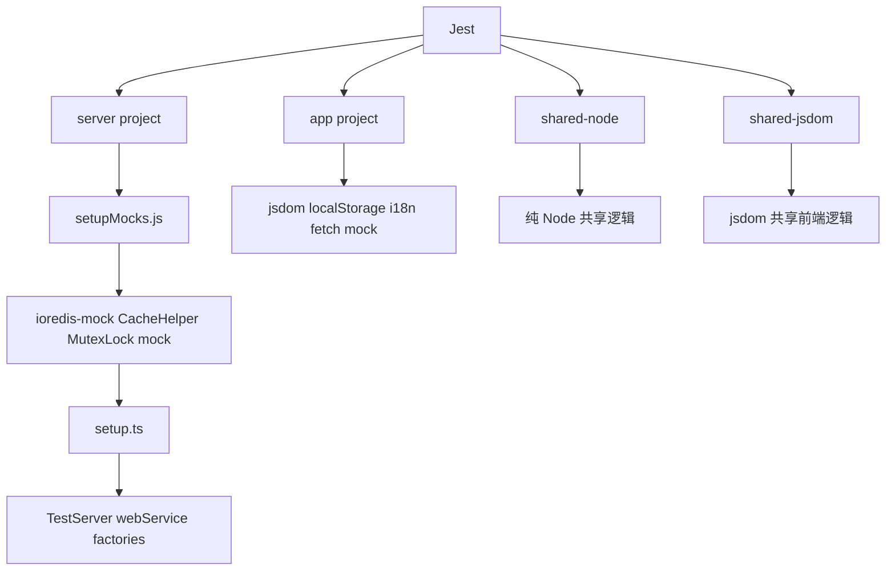
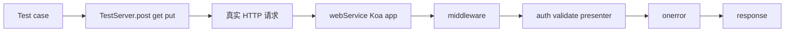

Outline 的测试体系不是“每个包各跑一套随意配置的 Jest”，而是一套围绕 monorepo、Koa 服务、浏览器端、共享模块和插件系统组织起来的多项目测试基座。真正重要的不是 `jest` 这个命令本身，而是：**仓库怎样把数据库、Redis、fetch、S3、i18n 和 HTTP 服务都压缩成可重复运行的测试环境。**

Sources: [.jestconfig.json](.jestconfig.json), [package.json](package.json), [server/test/setup.ts](server/test/setup.ts), [server/test/setupMocks.js](server/test/setupMocks.js), [server/test/TestServer.ts](server/test/TestServer.ts), [server/test/support.ts](server/test/support.ts), [server/test/factories.ts](server/test/factories.ts), [server/test/globalTeardown.js](server/test/globalTeardown.js), [app/test/setup.ts](app/test/setup.ts), [shared/test/setup.ts](shared/test/setup.ts)

## 先把测试基座看成一张分层图

这张图对应的是当前仓库的一个核心取舍：不是强迫所有测试共享同一种环境，而是按运行语义拆分基座，再在各自层里把依赖 mock、HTTP 服务和工厂函数串起来。

## 先看最外层：Jest 在这个仓库里是一个多项目调度器

`.jestconfig.json` 把测试拆成 4 个 project：

- `server`
- `app`
- `shared-node`
- `shared-jsdom`

这个拆法很合理，因为它直接对应了仓库里的四种运行语义：

- Koa / Sequelize / Redis / 插件服务端代码
- React Web 前端代码
- 共享模块里的纯 Node 逻辑
- 共享模块里依赖 DOM/jsdom 的逻辑

## `server` project 甚至把 `plugins/` 一起纳入 roots

`server` 的 roots 是：

- `<rootDir>/server`
- `<rootDir>/plugins`

这说明插件的服务端测试不会单独再建一套环境，而是共享主服务端测试基座。这和 Outline 的插件设计是一致的：插件并不是另一个进程，而是主服务运行时的一部分。

## `app` 和 `shared-jsdom` 明确运行在 `jsdom`

前端和共享前端逻辑需要 DOM，所以它们：

- `testEnvironment = "jsdom"`
- `testEnvironmentOptions.url = "http://localhost"`

而 `server` 与 `shared-node` 则保持 `node` 环境。

## 命令层也明确鼓励“按范围跑”

`package.json` 里主要脚本是：

- `yarn test`
- `yarn test:app`
- `yarn test:shared`
- `yarn test:server`

这和仓库说明里“优先跑指定文件，不要轻易全量跑”是吻合的。整体思路很清楚：**测试能力够完整，但默认使用方式应该尽量窄。**

Sources: [.jestconfig.json](.jestconfig.json), [package.json](package.json)

## 服务端测试环境的关键不在 Jest 本身，而在启动顺序和早期 mock

`server/test/setupMocks.js` 会在 test environment 初始化前最早执行，它做了几件很重要的事：

- 把 `ioredis` 整体替换成 `ioredis-mock`
- 提前 mock `MutexLock`
- 提前 mock `CacheHelper`
- mock `@aws-sdk/signature-v4-crt`

为什么一定要这么早？注释已经写得很明白：为了避免模块 import 阶段就初始化真实 Redis 客户端。也就是说，Outline 的服务端模块里有不少“加载即连接”的依赖，如果 mock 晚了，测试还没开始就已经把真实基础设施拉起来了。

## `server/test/setup.ts` 再做第二层运行时补丁

这份文件又补了几层很关键的能力：

- `reflect-metadata`
- 提高 `EventEmitter.defaultMaxListeners`
- 启用 `jest-fetch-mock`
- 但保存并恢复原生 `Response` / `Request` / `Headers`
- mock S3 client、upload、presigned post、signed URL
- 提前初始化数据库模型
- 每个测试后 `redis.flushall()`

### “先启用 fetch mock，再恢复原生 Web API” 这个细节非常值得注意

代码里的注释直说了原因：`jest-fetch-mock` 带来的 polyfill 不支持 MCP SDK 依赖的 Web Streams 语义。于是当前策略变成：

1. 先打开 fetch mocking 能力
2. 但把 `Response` / `Request` / `Headers` 还原成原生版本

这不是通用 Jest 模板，而是被具体功能反推出来的测试环境修正。它说明测试基座会随着新能力进入仓库而继续演化。

### `afterEach` 统一清 Redis，说明很多服务端测试默认共享“可写缓存世界”

每次测试后重新建一个 Redis 实例并 `flushall()`，可以看出当前服务端测试大量依赖：

- 缓存键
- challenge
- rate limiter
- 队列/锁相关状态

它不是完全隔绝外部状态的纯函数式环境，而是**有意构造一个“像真实服务一样会写 Redis，但每个 case 之后全量清空”的测试世界。**

Sources: [server/test/setupMocks.js](server/test/setupMocks.js), [server/test/setup.ts](server/test/setup.ts)

## `TestServer` 和 `getTestServer()` 把真实 Koa 应用压成了可测试 HTTP 服务

`server/test/TestServer.ts` 很短，但它定义了很多服务端测试的手感。

它会：

- 用传入的 Koa app 创建一个真正的 `http.Server`
- 监听随机端口
- 提供 `get/post/put/delete/...` 方法
- 如果 body 是对象且没声明 content type，就自动 JSON encode

这意味着很多测试不是“直接调 controller 函数”，而是通过真实 HTTP 边界发请求。

## `getTestServer()` 并不是起一个 mock app，而是起生产 `webService()`

`server/test/support.ts` 里：

- `webService()` 返回主 Web Koa 应用
- 再通过 `onerror(app)` 挂上统一错误处理
- 最后塞给 `TestServer`

这非常重要，因为它意味着路由测试默认会经过真实链路里的：

- middleware
- auth
- validate
- presenter
- onerror

它测到的不是某个 handler 局部逻辑，而是接近生产请求栈的行为。

## `withAPIContext(...)` 给 command 级测试保留了另一种入口

不是所有业务都必须通过 HTTP 才好测。`withAPIContext(user, fn)` 会：

- 开启一个 Sequelize transaction
- 构造 `state.auth`
- 构造 `request.ip`
- 调用 `createContext(...)`

这样 command 级逻辑既能拿到像路由里一样的上下文，又不必真的起 HTTP 请求。

## `toFormData(...)` 则明显是为 OAuth 这类协议测试准备的

当某些端点要求 `application/x-www-form-urlencoded` 时，不必每个测试手写编码过程。这个 helper 的存在也说明：当前仓库的测试不只覆盖 JSON API，还覆盖协议风格更强的接口。

Sources: [server/test/TestServer.ts](server/test/TestServer.ts), [server/test/support.ts](server/test/support.ts)

## `factories.ts` 是整个服务端测试世界的造数中心

这个文件的体量本身就说明了一件事：Outline 的测试不是靠零散 fixture 拼的，而是靠一套可组合工厂函数系统组织起来的。

它覆盖的对象非常多，包括：

- `Team`
- `User`
- `Collection`
- `Document`
- `Attachment`
- `Comment`
- `ApiKey`
- `OAuthClient`
- `OAuthAuthentication`
- `OAuthAuthorizationCode`
- `UserPasskey`
- 以及大量其他业务模型

## `buildTeam()` 默认就带一个 Slack `authenticationProvider`

这一点很能体现“工厂不是静态假数据，而是对真实业务前提的编码”。

在 Outline 里，很多用户/团队逻辑默认假设 workspace 已有某种 authentication provider，所以 `buildTeam()` 不是生成一个完全真空的 team，而是默认附上一条 Slack provider 记录。这样很多 auth 相关测试不需要每次从零补全背景数据。

## `buildUser()` 也会顺着 team 的 provider 自动补一条 authentication

也就是说，默认 build 出来的 user 更像“正常能登录、能参与业务流”的用户，而不是“只有一行 users 记录的裸对象”。

这种默认值策略很实用，因为它减少了大量测试样板，同时仍然保留 `overrides` 入口让 case 做精细定制。

## 工厂函数的目标不是模拟 ORM，而是快速拼出真实业务世界

从：

- invited user
- admin/viewer/guest
- share/star/subscription
- OAuth 模型
- Integration / Webhook / Import / Relationship

这些覆盖面可以看出，工厂函数承担的是“场景建模”职责，而不是简单表填充。

Sources: [server/test/factories.ts](server/test/factories.ts)

## 前端和共享模块测试基座更轻，但依然围绕真实运行前提搭建

`app/test/setup.ts` 主要做几件事：

- 初始化 `initI18n()`
- 挂 mocked `localStorage`
- 启用 fetch mock
- mock `~/utils/ApiClient`

这很贴近前端组件和 hooks 的日常依赖：国际化、浏览器存储、网络请求和统一 API client。

`shared/test/setup.ts` 则更极简，只 mock 了 `i18next-http-backend`。因为 shared 层很多逻辑不需要完整浏览器环境，只要把最容易外联的翻译加载器堵住就够了。

## `globalTeardown.js` 反映了一个真实问题：数据库连接如果不收，会变成 Jest 残留句柄

它在非 watch 模式下主动 `sequelize.close()`。这类文件往往只有当项目已经被 open handle、测试进程不退出这类问题折腾过之后才会出现。

所以别把它看成样板代码，它其实是仓库在长期演化里留下来的“稳定性补丁”。

Sources: [app/test/setup.ts](app/test/setup.ts), [shared/test/setup.ts](shared/test/setup.ts), [server/test/globalTeardown.js](server/test/globalTeardown.js)

## 从这些配置能看出 Outline 的测试策略是什么

它不是单纯偏向某一种测试风格，而是分了三层：

## 1. 真实 HTTP 集成测试

适合：

- 路由
- middleware
- presenter
- auth / OAuth / MCP

## 2. command / model 级上下文测试

适合：

- 跨模型业务逻辑
- 需要 transaction / actor / ip，但不必起 HTTP 的流程

## 3. 前端 / 共享模块的轻量单测

适合：

- hooks
- UI 组件
- utils
- i18n / date / editor shared logic

配合早期 mock、统一工厂和 Redis/DB 清理，这套体系的目标不是“绝对纯粹”，而是：**尽可能在可接受成本下，还原真实运行语境。**

## 为什么这套测试基座会长成今天这样

背后的原因大概有这些：

1. **仓库是 monorepo，前后端和共享层不能共用一种测试环境。**
2. **服务端严重依赖 DB、Redis、fetch、AWS SDK，不可能全靠手搓 stub。**
3. **像 OAuth、MCP、上传、错误处理中间件这类功能，必须从 HTTP 边界测才有意义。**
4. **插件系统和主服务深度耦合，插件测试必须复用 server 测试基座。**

所以最终形成的是：

- multi-project Jest
- 服务端“真 app + 假基础设施”
- 统一 factories
- 前端最小浏览器模拟

这套组合比“全部单测”更重，但比全量端到端测试便宜得多，也更适合当前项目体量。

## 建议继续阅读

- 想看 API 路由在被测试时到底会经过哪些 validate、auth 和错误处理中间件：读 [API 路由设计：Schema 验证、中间件与错误处理](17-api-lu-you-she-ji-schema-yan-zheng-zhong-jian-jian-yu-cuo-wu-chu-li)
- 想看 OAuth 和 MCP 为什么会逼着测试环境恢复原生 Web Streams 语义：读 [MCP（Model Context Protocol）服务与 AI 工具集成](27-mcp-model-context-protocol-fu-wu-yu-ai-gong-ju-ji-cheng) 和 [OAuth 2.0 服务端实现：客户端注册与授权流程](28-oauth-2-0-fu-wu-duan-shi-xian-ke-hu-duan-zhu-ce-yu-shou-quan-liu-cheng)
- 想看多语言初始化为什么会在前端测试 setup 里提前运行：读 [国际化（i18n）：多语言配置与翻译工作流](30-guo-ji-hua-i18n-duo-yu-yan-pei-zhi-yu-fan-yi-gong-zuo-liu)
- 想看命令层测试为何离不开 transaction 和 actor 上下文：读 [Command 模式：跨模型的复杂业务操作封装](19-command-mo-shi-kua-mo-xing-de-fu-za-ye-wu-cao-zuo-feng-zhuang)
- 想看 Redis/数据库 mock 和清理为什么会频繁出现在测试基座里：读 [Redis 缓存策略与会话管理](25-redis-huan-cun-ce-lue-yu-hui-hua-guan-li) 和 [数据库迁移管理：Sequelize 迁移与数据回填脚本](23-shu-ju-ku-qian-yi-guan-li-sequelize-qian-yi-yu-shu-ju-hui-tian-jiao-ben)
- 想看生产环境里日志、错误处理和优雅关闭为什么也会反过来影响测试设计：读 [生产环境配置：环境变量、日志、监控与优雅关闭](32-sheng-chan-huan-jing-pei-zhi-huan-jing-bian-liang-ri-zhi-jian-kong-yu-you-ya-guan-bi)
