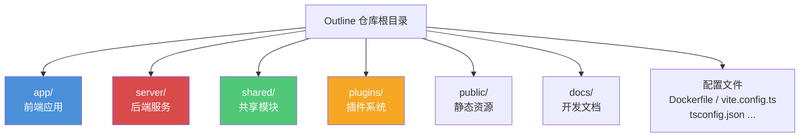
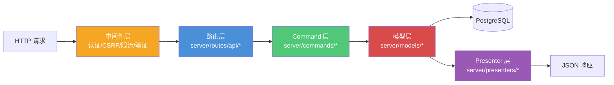

Outline 是一个开源的团队知识库与协作 Wiki 系统，其代码库采用**单体仓库（Monorepo）**架构，将前端、后端、共享模块和插件系统统一放置在同一个 Git 仓库中。这种组织方式让前后端共享类型定义和业务逻辑，同时保持了清晰的边界划分。本页将从宏观到微观，逐层拆解项目的目录结构，帮助你建立对整个代码库的心智模型。

Sources: [package.json](package.json#L1-L50), [Dockerfile](Dockerfile#L1-L48)

## 顶层目录全景

从仓库根目录出发，整个项目可以划分为以下几个核心区域：



下表汇总了顶层各目录和关键配置文件的职责定位：

| 目录/文件 | 用途 | 关键技术 |
|---|---|---|
| `app/` | **前端应用**：React SPA，包含组件、页面、路由、状态管理、Hooks | React, MobX, Styled Components, React Router |
| `server/` | **后端服务**：API 服务、协作编辑、定时任务、异步队列处理 | Koa, Sequelize, Bull, Hocuspocus |
| `shared/` | **共享模块**：前后端共用的编辑器定义、类型、工具函数、国际化 | Prosemirror, TypeScript 类型, i18next |
| `plugins/` | **插件系统**：独立的认证集成、第三方服务对接 | 按插件隔离的 client/server/shared 结构 |
| `public/` | **静态资源**：字体、图标、嵌入服务图标等 | 直接由 CDN 或 Vite 提供服务 |
| `docs/` | **开发文档**：架构说明、行为准则、安全策略 | Markdown |
| `__mocks__/` | Jest 测试 mock | 全局 mock 如 `localStorage`、`window` |
| `patches/` | 第三方依赖补丁 | `patch-package` 管理 |

Sources: [vite.config.ts](vite.config.ts#L157-L162), [package.json](package.json#L1-L50)

## 前端目录：`app/`

前端应用以 `app/index.tsx` 为入口，使用 **Vite** 作为构建工具，通过路径别名 `~` 指向 `app/` 目录。整个前端代码按关注点被组织为以下子目录：

| 子目录 | 职责 | 典型内容 |
|---|---|---|
| `components/` | **UI 组件库** — 可复用的 React 组件 | `Button.tsx`, `Modal.tsx`, `Sidebar/`, `Collection/` 等 |
| `scenes/` | **页面级组件** — 对应路由的顶层视图 | `Home.tsx`, `Search/`, `Settings/`, `Document/`, `Login/` |
| `routes/` | **路由定义** — 顶层路由与嵌套路由配置 | `index.tsx`（入口路由）, `authenticated.tsx`（需认证路由）, `settings.tsx` |
| `stores/` | **MobX 状态管理** — 每个数据模型对应一个 Store | `DocumentsStore.ts`, `AuthStore.ts`, `RootStore.ts` |
| `models/` | **前端数据模型** — 带有 MobX observable 的客户端模型 | `Document.ts`, `User.ts`, `Collection.ts` |
| `hooks/` | **自定义 Hooks** — 封装通用逻辑 | `useCurrentTeam.ts`, `useMobile.ts`, `usePolicy.ts` |
| `menus/` | **菜单组件** — 各类上下文菜单 | `DocumentMenu.tsx`, `CollectionMenu.tsx`, `UserMenu.tsx` |
| `actions/` | **Action 定义** — 命令栏与快捷键动作 | `definitions/`, `sections.ts`, `root.ts` |
| `editor/` | **编辑器集成层** — 前端编辑器组件与菜单栏 | `components/`, `menus/`, `extensions/` |
| `utils/` | **工具函数** — API 客户端、i18n、路由辅助等 | `ApiClient.ts`, `i18n.ts`, `history.ts`, `sentry.ts` |
| `styles/` | **全局样式** — 动画与主题入口 | `animations.ts`, `index.ts` |

前端入口文件 `app/index.tsx` 的核心结构是：用 `Provider` 注入 MobX stores → 用 `Router` 包裹路由 → 用 `Theme` 包裹主题 → 用 `ErrorBoundary` 捕获异常 → 用 `KBarProvider` 提供命令面板 → 最终渲染 `<Routes />`。

Sources: [app/index.tsx](app/index.tsx#L1-L93), [app/stores/index.ts](app/stores/index.ts#L1-L12)

## 后端目录：`server/`

后端服务以 `server/index.ts` 为入口，基于 **Koa** 框架构建 HTTP 服务。后端采用**多服务架构**，通过 `SERVICES` 环境变量控制启动哪些服务进程（web、collaboration、websockets、worker、cron、admin），由 `throng` 库管理多进程。

| 子目录 | 职责 | 典型内容 |
|---|---|---|
| `routes/` | **API 路由** — RESTful 端点定义 | `api/`（40+ 资源模块）, `auth/`, `oauth/`, `mcp/` |
| `models/` | **数据模型** — Sequelize ORM 模型定义 | `Document.ts`, `User.ts`, `Collection.ts` 等 40+ 模型 |
| `commands/` | **Command 模式** — 封装跨模型的复杂业务操作 | `documentCreator.ts`, `userProvisioner.ts`, `teamCreator.ts` |
| `policies/` | **权限策略** — 基于 CanCan 的授权规则 | `document.ts`, `collection.ts`, `team.ts` 等 |
| `presenters/` | **数据序列化** — 将模型转换为 API 响应格式 | `document.ts`, `user.ts`, `collection.ts` 等 |
| `middlewares/` | **中间件** — 认证、CSRF、限流、CSP 等 | `authentication.ts`, `csrf.ts`, `rateLimiter.ts` |
| `queues/` | **异步队列** — Bull 任务处理器与任务定义 | `processors/`（30+ 处理器）, `tasks/`（70+ 任务） |
| `collaboration/` | **实时协作** — Hocuspocus WebSocket 服务扩展 | `PersistenceExtension.ts`, `AuthenticationExtension.ts` |
| `services/` | **服务启动** — 各服务的初始化与挂载逻辑 | `web.ts`, `collaboration.ts`, `worker.ts` |
| `migrations/` | **数据库迁移** — 282 个迁移文件（累计） | 从 `20160619` 到 `20260416` 的演进历史 |
| `storage/` | **存储层** — 数据库、Redis、文件存储连接 | `database.ts`, `redis.ts`, `files/` |
| `emails/` | **邮件模板** — 通知邮件的 React 渲染 | `mailer.tsx`, `templates/` |
| `scripts/` | **运维脚本** — 数据回填、SSL、发布等 | `bootstrap.ts`, `release.js` |
| `onboarding/` | **新手引导内容** — 内置的帮助文档 Markdown | `Getting Started.md`, `What is Outline.md` |

Sources: [server/index.ts](server/index.ts#L1-L50), [server/services/index.ts](server/services/index.ts#L1-L16), [server/routes/api/index.ts](server/routes/api/index.ts#L1-L144)

### 后端服务的分层架构

后端 API 的请求处理遵循一条清晰的分层管道，理解这条管道是掌握后端代码组织的关键：



**路由层**接收请求并调用 **Command 层**执行业务逻辑，Command 操作 **模型层**与数据库交互，最终通过 **Presenter 层**将结果序列化为 API 响应。**权限策略**穿插在路由和 Command 之间，确保只有授权用户才能执行操作。

Sources: [server/routes/api/index.ts](server/routes/api/index.ts#L55-L144), [server/policies/index.ts](server/policies/index.ts#L1-L1)

## 共享模块：`shared/`

`shared/` 是本项目架构的一大亮点——它被前后端同时引用，通过 Vite 的路径别名 `@shared` 访问。这个目录是**前后端数据契约**的核心所在。

| 子目录 | 职责 | 说明 |
|---|---|---|
| `editor/` | **富文本编辑器** — Prosemirror 节点、标记、扩展定义 | 34 个节点类型、8 个标记类型、10 个扩展 |
| `types.ts` | **共享类型定义** — 枚举与接口 | `UserRole`, `Scope`, `FileOperationFormat` 等 760+ 行类型 |
| `constants.ts` | **共享常量** — 分页、CSRF、默认偏好设置 | 前后端一致的配置值 |
| `i18n/` | **国际化** — 27 种语言的翻译文件 | `locales/` 下按语言代码组织 |
| `utils/` | **共享工具函数** — 纯逻辑无副作用 | `slugify.ts`, `date.ts`, `emoji.ts`, `urls.ts` 等 |
| `components/` | **共享 UI 组件** — 前后端（邮件模板）共用 | `Icon.tsx`, `EmojiText.tsx`, `Spinner.tsx` |
| `hooks/` | **共享 Hooks** — 前端与插件共用 | `useStores.ts`, `useIsMounted.ts` |
| `styles/` | **样式常量** — 断点、层级、主题定义 | `breakpoints.ts`, `depths.ts`, `theme.ts` |
| `validations.ts` | **验证规则** — 前后端共用的输入验证 | Zod schema 验证 |

编辑器节点按功能分层组合：`inlineExtensions`（行内格式）→ `basicExtensions`（加入列表）→ `richExtensions`（完整富文本，含表格、代码块、嵌入等），通过 `withComments()` 包装器可追加评论和 @提及 功能。

Sources: [shared/editor/nodes/index.ts](shared/editor/nodes/index.ts#L49-L134), [shared/types.ts](shared/types.ts#L1-L80), [shared/constants.ts](shared/constants.ts#L1-L50)

## 插件系统：`plugins/`

插件目录采用统一的目录结构规范，每个插件都以独立子目录存在，包含 `plugin.json` 元数据文件，并按需包含 `client/`、`server/`、`shared/` 子目录：

```
plugins/
├── google/           # Google 认证
│   ├── plugin.json   # 插件元数据
│   ├── client/       # 前端 UI 组件
│   └── server/       # 后端路由与逻辑
├── slack/            # Slack 集成
│   ├── plugin.json
│   ├── client/
│   ├── server/
│   └── shared/       # 前后端共享定义
├── search-postgres/  # PostgreSQL 全文搜索
│   ├── plugin.json
│   └── server/       # 仅后端，无前端组件
├── diagrams/         # 嵌入式图表
│   ├── plugin.json
│   └── client/       # 仅前端，无后端逻辑
└── ...               # 20+ 个插件
```

当前项目包含 **25+ 个插件**，涵盖三大类功能：

| 类型 | 插件示例 | 涉及模块 |
|---|---|---|
| **认证集成** | `google/`, `oidc/`, `azure/`, `slack/`, `gitlab/`, `passkeys/` | client + server |
| **嵌入与集成** | `figma/`, `github/`, `linear/`, `notion/`, `diagrams/` | client + server + shared |
| **分析与监控** | `googleanalytics/`, `matomo/`, `umami/` | client only |
| **基础设施** | `email/`, `storage/`, `iframely/`, `webhooks/`, `search-postgres/` | server only |

Sources: [plugins/google/plugin.json](plugins/google/plugin.json), [plugins/slack/plugin.json](plugins/slack/plugin.json)

## 关键配置文件

项目根目录散布着多个重要的配置文件，控制着构建、部署和开发工作流：

| 文件 | 用途 |
|---|---|
| `package.json` | 项目依赖、scripts 定义（`dev:watch`、`build`、`test` 等） |
| `vite.config.ts` | 前端构建配置，定义路径别名 `~` → `app/`、`@shared` → `shared/` |
| `tsconfig.json` | TypeScript 编译选项 |
| `.sequelizerc` | Sequelize CLI 迁移路径配置 |
| `.jestconfig.json` | Jest 测试框架配置 |
| `Dockerfile` | 生产镜像构建，基于多阶段构建 |
| `docker-compose.yml` | 本地开发用 PostgreSQL + Redis |
| `Makefile` | 常用操作快捷命令 |
| `.env.sample` | 环境变量模板 |
| `.nvmrc` | Node.js 版本锁定（≥20.12） |
| `build.js` | 后端 TypeScript 编译脚本 |

Sources: [vite.config.ts](vite.config.ts#L28-L50), [Dockerfile](Dockerfile#L1-L48), [docker-compose.yml](docker-compose.yml#L1-L16)

## 构建与运行命令速查

`package.json` 中定义的核心脚本构成了日常开发的工作流：

| 命令 | 用途 |
|---|---|
| `yarn dev:watch` | **全栈开发**：同时启动后端热重载 + 前端 Vite 开发服务器 |
| `yarn dev` | 仅启动后端（需先手动编译） |
| `yarn build` | 完整构建：前端 Vite 构建 + i18n 提取 + 后端编译 |
| `yarn start` | 启动生产服务器 |
| `yarn test` | 运行全部测试 |
| `yarn test:server` / `test:app` / `test:shared` | 按模块运行测试 |
| `yarn db:migrate` | 执行数据库迁移 |
| `yarn lint` | 运行 oxlint 代码检查 |

Sources: [package.json](package.json#L7-L36)

## 建议阅读路径

理解了项目的目录结构后，建议按以下路径深入探索：

1. **技术栈理解**：先阅读 [前端技术栈：React、MobX、Styled Components 与 Vite](4-qian-duan-ji-zhu-zhan-react-mobx-styled-components-yu-vite) 和 [后端技术栈：Koa、Sequelize、Redis 与 Bull 队列](5-hou-duan-ji-zhu-zhan-koa-sequelize-redis-yu-bull-dui-lie)，建立对所用技术的认知
2. **架构全局观**：阅读 [整体架构：前后端 Monorepo 与共享模块设计](6-zheng-ti-jia-gou-qian-hou-duan-monorepo-yu-gong-xiang-mo-kuai-she-ji)，理解各层如何协作
3. **后端服务拆分**：通过 [后端服务拆分：Web、Collaboration、Websockets、Worker 与 Cron](7-hou-duan-fu-wu-chai-fen-web-collaboration-websockets-worker-yu-cron) 了解多服务架构的设计意图
4. **插件机制**：通过 [插件系统：客户端与服务端的扩展机制](8-cha-jian-xi-tong-ke-hu-duan-yu-fu-wu-duan-de-kuo-zhan-ji-zhi) 理解可扩展性设计