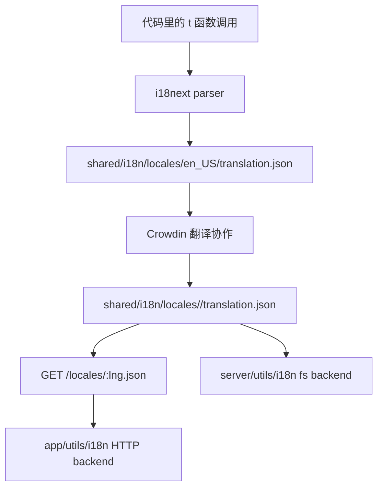
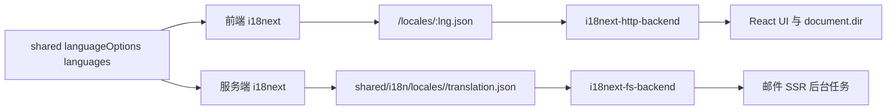

Outline 的 i18n 不是“前端组件里随手调一下 `t()`”那么简单。当前实现里，多语言能力跨越了共享语言注册表、浏览器端按需加载、服务端文件系统预加载、静态 locale 分发，以及一个明确约束的翻译生成工作流。真正重要的是：**前端、服务端和构建产物都围绕同一份 locale catalog 工作。**

Sources: [shared/i18n/index.ts](shared/i18n/index.ts), [app/utils/i18n.ts](app/utils/i18n.ts), [server/utils/i18n.ts](server/utils/i18n.ts), [server/routes/index.ts](server/routes/index.ts), [i18next-parser.config.js](i18next-parser.config.js), [shared/i18n/README.md](shared/i18n/README.md), [package.json](package.json)

## 先把整条 i18n 流转链压成一张图



这张图强调的是同一份 locale catalog 的双重消费路径：浏览器通过 HTTP 按需加载，服务端通过文件系统预加载，但两边都没有各自维护第二套翻译源。

## 先看最上游：支持哪些语言，不由前后端各自决定

`shared/i18n/index.ts` 把可用语言集中定义成：

- `languageOptions`
- `languages`

这份列表既包含展示标签，也包含内部使用的 locale code，比如：

- `zh_CN`
- `en_US`
- `fr_FR`
- `ja_JP`
- `he_IL`

文件顶部的注释还提醒了一件重要的事：如果修改可用语言，还要同步更新 `shared/utils/date.ts` 里的 locale 列表，才能让时间戳翻译也生效。

这说明语言支持不是单点配置，而是一张横跨：

- 文本翻译
- 日期/时间本地化
- UI 语言选择器

的共享注册表。

## 当前代码里的默认语言不是英文，而是 `zh_CN`

这点很值得注意，因为很多开源项目默认会落在 `en_US`。但在当前仓库状态里：

- 前端 `initI18n(defaultLanguage = "zh_CN")`
- 服务端 `env.DEFAULT_LANGUAGE` 默认也是 `zh_CN`

这意味着 fallback 行为、首屏 HTML `lang`、以及没有用户语言偏好时的服务端翻译，都会围绕 `zh_CN` 展开。

这不是抽象设计问题，而是当前代码库的实际产品默认值。

Sources: [shared/i18n/index.ts](shared/i18n/index.ts), [app/utils/i18n.ts](app/utils/i18n.ts), [server/env.ts](server/env.ts)

## 浏览器端的 i18n 策略是：按需从 `/locales/<lng>.json` 拉，而不是把所有翻译打进主 bundle

`app/utils/i18n.ts` 当前初始化流程是：

1. `i18next.use(backend).use(initReactI18next)`
2. `loadPath` 指向 `cdnPath(/locales/<lng>.json)`
3. `supportedLngs` 来自共享 `languages`
4. `fallbackLng` 设成当前默认语言
5. `keySeparator = false`
6. `returnNull = false`

这里有几个实现细节特别重要。

## `cdnPath(...)` 说明 locale 文件被视为静态分发资产

翻译 JSON 不是只能从当前应用域读，它会走 `cdnPath(...)`，也就是和前端其他静态资源一样，允许被 CDN 重写分发地址。

这和服务端后面那条 `/locales/:lng.json` 路由是一套完整链路：

- 服务端负责把文件按 HTTP 资源暴露出来
- 前端只按需拉当前语言
- CDN 可以缓存这类相对稳定的 JSON

## `document.documentElement.dir` 会在初始化时同步设置

初始化时，如果语言是 RTL，代码会把：

- `document.documentElement.dir = "rtl"`

否则设成 `ltr`。

这意味着 i18n 在 Outline 里不只是“替换文案”，还直接影响文档方向和布局语义。

## `keySeparator = false` 是一个很关键的选择

它意味着翻译 key 可以直接使用自然语言字符串，而不会把 `.`、`:` 之类字符解释成 namespace/path 分隔符。这和后面的提取配置完全对齐。

Sources: [app/utils/i18n.ts](app/utils/i18n.ts)

## 服务端的策略不同：不是按需 HTTP 拉，而是启动时从文件系统预加载全部语言

`server/utils/i18n.ts` 用的是 `i18next-fs-backend`，它做了几件和前端明显不同的事：

- `loadPath` 直接指向 `shared/i18n/locales/<lng>/translation.json`
- `preload` 所有支持语言
- `lng` 取 `env.DEFAULT_LANGUAGE`
- `opts(user?)` 根据 `user.language` 或默认语言返回当前语言选项

这很合理，因为服务端需要翻译的场景往往不是浏览器交互，而是：

- 邮件
- 后台任务
- 服务端渲染的一些文案

这些场景不适合“临时发 HTTP 请求取翻译文件”，直接从本地文件系统预载入更稳定。



## 前后端共享同一份 locale catalog，是当前设计最重要的点

无论前端还是服务端，最终都在读：

- `shared/i18n/locales/<lng>/translation.json`

这避免了最常见的一类问题：前端和后端各自维护一套翻译文件，最后 key 漏同步、含义漂移、语言覆盖率不一致。

Sources: [server/utils/i18n.ts](server/utils/i18n.ts)

## `/locales/:lng.json` 路由把翻译 catalog 当成正式静态资源暴露出来

`server/routes/index.ts` 里有一条专门的 locale 路由：

- `GET /locales/:lng.json`

它不是简单 `sendFile`，而是额外补了好几层 HTTP 语义：

- `Last-Modified`
- `Cache-Control: public, max-age=7 days`
- `ETag`
- `Access-Control-Allow-Origin: *`

这几层头信息说明服务端非常明确地把翻译文件视为：

- 可缓存
- 可跨域分发
- 更新频率相对较低

的静态资产。

虽然这一页没展开完整实现，但从现有代码能看出它还会根据请求的 `lng` 先做支持语言校验，然后再映射到 `shared/i18n/locales/<lng>/translation.json`。

所以对前端来说，翻译加载看起来像一个 API；对服务端来说，它本质上是对共享 locale 目录的受控静态分发。

Sources: [server/routes/index.ts](server/routes/index.ts)

## 翻译提取流程也不是“手工维护 JSON”，而是代码驱动生成

`package.json` 里当前有两条关键脚本：

- `build:i18n`
- `copy:i18n`

其中 `build:i18n` 会运行：

```text
i18next --silent '{shared,app,server,plugins}/**/*.{ts,tsx}'
```

然后再把结果复制到 `build/shared/i18n`。

这说明翻译 key 的发现范围覆盖：

- `shared`
- `app`
- `server`
- `plugins`

也就是说，插件里新增的可翻译文案也走同一条主流程，不需要单独建第二套提取配置。

## `i18next-parser.config.js` 里编码了几条很重要的约束

### 1. 产物主输出是 `shared/i18n/locales/en_US/translation.json`

也就是说，英文 catalog 更像“源码事实表”，其他语言再围绕它演化。

### 2. `defaultValue` 直接等于 key

这意味着如果代码里写的是自然语言 key，英文 catalog 的默认值就直接等于它本身。

### 3. `keySeparator = false`

和前端运行时一致，避免自然语言 key 被误拆层级。

### 4. 输入不仅限于 React 组件

lexer 覆盖了：

- `ts`
- `tsx`
- `js`
- `jsx`
- `html`
- `hbs`

这为共享模块、服务端模板甚至插件场景留出了空间。

Sources: [package.json](package.json), [i18next-parser.config.js](i18next-parser.config.js)

## 这套工作流里，`/locales` 目录不是人手维护区，而是生成物

`shared/i18n/README.md` 说得很直接：

- 不要直接编辑 `/locales` 下的文件
- 它们是机器生成的
- 翻译内容通过 Crowdin 提供

这条规则非常重要，因为它回答了“谁是 source of truth”：

- 开发者在代码里增加/修改 key
- parser 生成或更新基准 catalog
- Crowdin 管理翻译内容
- 仓库消费最终 locale 文件

所以如果有人把 locale JSON 当普通配置文件直接手改，反而会破坏整条工作流。

## 这也解释了为什么 i18n 目录被放在 `shared/`

因为在当前项目里，翻译 catalog 既不是单纯前端资产，也不是单纯服务端资源。它同时服务于：

- React UI
- 服务端文本
- 测试初始化
- 构建产物复制

放在 `shared/i18n`，本质上是在表达“它属于全仓共享基础设施”。

Sources: [shared/i18n/README.md](shared/i18n/README.md), [package.json](package.json)

## 为什么 Outline 的 i18n 设计会长成今天这样

背后的现实约束其实很典型：

1. **前端和服务端都需要翻译，不能各管各的。**
2. **浏览器端不适合把所有语言打包进主 bundle。**
3. **服务端又不能依赖浏览器式按需拉取 locale。**
4. **插件和共享模块也会产生可翻译文案。**
5. **翻译内容应该来自可协作平台，而不是散落在代码 review 里手工改 JSON。**

所以最终形成的是：

- 共享语言注册表
- 前端 HTTP backend + CDN 分发
- 服务端 fs backend + 全量预加载
- parser 自动提取
- Crowdin 承接翻译协作

这比“前端一个 `i18n.ts` 文件”要复杂，但它更适合当前这种前后端一体、插件可扩展的 monorepo。

## 建议继续阅读

- 想看前端为什么能在测试启动时直接初始化 i18n：读 [测试策略：Jest 配置、工厂函数与测试辅助工具](29-ce-shi-ce-lue-jest-pei-zhi-gong-han-han-shu-yu-ce-shi-fu-zhu-gong-ju)
- 想看运行时 `window.env`、默认语言和静态资源路径是怎样注入到前端的：读 [生产环境配置：环境变量、日志、监控与优雅关闭](32-sheng-chan-huan-jing-pei-zhi-huan-jing-bian-liang-ri-zhi-jian-kong-yu-you-ya-guan-bi)
- 想看 React 前端整体技术栈如何消费这些翻译和样式方向信息：读 [前端技术栈：React、MobX、Styled Components 与 Vite](4-qian-duan-ji-zhu-zhan-react-mobx-styled-components-yu-vite)
- 想看服务端首页、分享页和静态资源路由怎样共同组成首屏响应：读 [整体架构：前后端 Monorepo 与共享模块设计](6-zheng-ti-jia-gou-qian-hou-duan-monorepo-yu-gong-xiang-mo-kuai-she-ji)
- 想看插件里的文案为什么也能走同一套翻译提取流程：读 [插件系统：客户端与服务端的扩展机制](8-cha-jian-xi-tong-ke-hu-duan-yu-fu-wu-duan-de-kuo-zhan-ji-zhi)
- 想看生产构建和容器镜像为什么需要把 `shared/i18n` 一起复制到 build 产物里：读 [Docker 部署：镜像构建与 docker-compose 配置](31-docker-bu-shu-jing-xiang-gou-jian-yu-docker-compose-pei-zhi)
