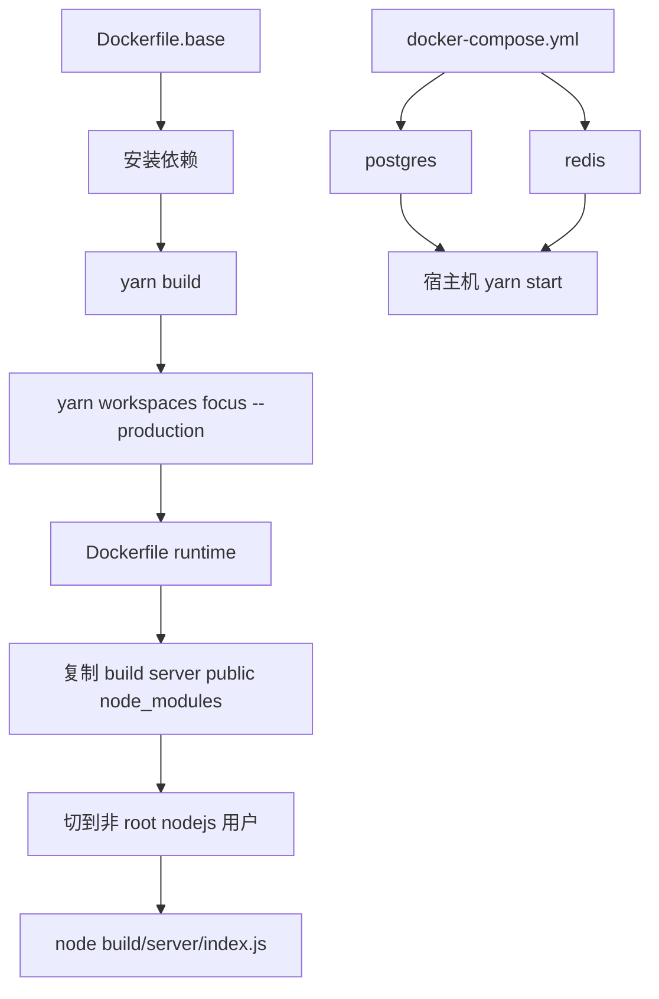
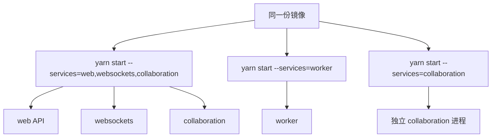

很多人第一次看这个仓库时会以为：既然有 `Dockerfile` 和 `docker-compose.yml`，那它应该提供了一套“开箱即用的完整容器编排”。但当前代码里的实际结构不是这样。**Outline 把容器化拆成了三件不同的事：构建基础镜像、打包运行时镜像，以及只为本地开发提供最小依赖栈。**

Sources: [Dockerfile.base](Dockerfile.base), [Dockerfile](Dockerfile), [docker-compose.yml](docker-compose.yml), [Procfile](Procfile), [server/collaboration/Procfile](server/collaboration/Procfile), [package.json](package.json), [server/index.ts](server/index.ts), [server/services/index.ts](server/services/index.ts)

## 先把当前容器化资产分成三层看

可以先压成下面这张图：



这张图已经说明了一个关键事实：**repo 内的 `docker-compose.yml` 不是完整部署编排，而是本地开发依赖容器。**

## `Dockerfile.base` 是“重活都在这里做完”的构建阶段

`Dockerfile.base` 当前从：

- `node:24.15.0`

开始，然后做几件重操作：

- 安装 `cmake`
- `corepack enable`
- `yarn install --immutable`
- `yarn build`
- `yarn workspaces focus --production`

这里的目标很明确：把编译和依赖裁剪都放在 build/base 阶段完成。

## 为什么这里既有 `yarn build`，又有 `workspaces focus --production`

它们解决的是两个不同问题：

- `yarn build` 负责产出前后端构建结果
- `yarn workspaces focus --production` 负责把运行时真正需要的依赖收缩出来

这很适合 monorepo。因为 Outline 不是一个单包应用，如果直接把开发期完整 `node_modules` 带进运行时镜像，体积和攻击面都会变大。

## `NODE_OPTIONS="--max-old-space-size=24000"` 说明构建阶段默认按“大仓库重编译”在设计

这不是轻量小项目的常见配置。它直白地承认：

- 这个仓库的构建比较重
- 容器内 build 时需要更高的 Node 堆内存预算

所以 `Dockerfile.base` 更像“CI/发布构建容器”，而不是开发时随手起一下的玩具镜像。

Sources: [Dockerfile.base](Dockerfile.base)

## `Dockerfile` 关注的不是怎么编译，而是怎么把运行时包收拾干净

运行时镜像基于：

- `node:24.15.0-slim`

并通过 `ARG BASE_IMAGE=outlinewiki/outline-base` 从前一个阶段或外部预构建基础镜像复制产物。

这意味着它支持两种使用方式：

1. 在同一条多阶段构建链里把 base 当中间阶段
2. 直接引用一个已经发布好的 `outline-base` 镜像做运行时装配

对于持续集成和镜像缓存来说，这很有价值，因为构建最重的那部分可以被复用。

## 运行时镜像里复制进来的内容也很克制

当前复制的主要是：

- `build`
- `server`
- `public`
- `.sequelizerc`
- `node_modules`
- `package.json`

也就是说，运行时不需要整个源码树，只需要：

- 编译结果
- 少量运行时仍按路径读取的文件
- 生产依赖

这是一个很标准但也很务实的 Node 服务镜像裁剪思路。

## 非 root 用户和本地文件存储目录是运行时设计的一部分

镜像会：

- 创建 uid/gid 都是 `1001` 的 `nodejs` 用户
- 创建 `/var/lib/outline`
- 设置 `FILE_STORAGE_LOCAL_ROOT_DIR=/var/lib/outline/data`
- 声明 `VOLUME /var/lib/outline/data`

这说明镜像默认考虑了至少一种存储模式：即使你不用 S3，对本地文件存储也有明确的数据目录约定。

权限上还做了：

- `chown`
- `chmod 1777`

所以这不是“应用随便往容器里写文件”，而是明确给本地存储留了一块可持久化且权限可控的区域。

## 健康检查直接命中 `/_health`

运行时镜像会额外安装 `wget`，只为了做：

```text
wget -qO- "http://localhost:${PORT:-3000}/_health" | grep -q "OK"
```

而 `server/index.ts` 里的 `/_health` 又不是空响应，它会同时检查：

- `sequelize.query("SELECT 1")`
- `Redis.defaultClient.ping()`

所以这个 healthcheck 的含义是：**应用进程活着不算健康，数据库和 Redis 都要可达才算健康。**

Sources: [Dockerfile](Dockerfile), [server/index.ts](server/index.ts)

## `docker-compose.yml` 故意非常小，只服务本地开发

repo 内的 `docker-compose.yml` 只定义了两个服务：

- `redis`
- `postgres`

而且都绑在 loopback：

- `127.0.0.1:6379:6379`
- `127.0.0.1:5432:5432`

Postgres 还直接给了最小开发凭据：

- `POSTGRES_USER=user`
- `POSTGRES_PASSWORD=pass`
- `POSTGRES_DB=outline`

这已经非常明确地说明：

- 它不是为生产设计的 compose stack
- 它不是“把 Outline 整站一键起起来”的编排
- 它只是让宿主机上的 `yarn start` 有数据库和 Redis 可连

这也和仓库的本地开发文档语境一致。

Sources: [docker-compose.yml](docker-compose.yml)

## Procfile 才更像当前项目对“进程拓扑”的正式表达

`Procfile` 当前定义的是：

- `web: yarn start --services=web,websockets,collaboration`
- `worker: yarn start --services=worker`

而 `server/collaboration/Procfile` 还提供了一个：

- `web: yarn start --services=collaboration`

这说明 Outline 的部署心智并不只是“一个 Node 容器跑全部”，而是把服务切成几类：

- Web/API
- WebSocket
- Collaboration
- Worker

然后再按部署环境决定是合并还是拆开。

## `server/index.ts` 进一步印证：真正的服务选择来自 `env.SERVICES`

启动时会遍历 `env.SERVICES`，从 `server/services/index.ts` 里加载：

- `web`
- `websockets`
- `collaboration`
- `worker`
- `cron`
- `admin`

也就是说，容器镜像本身并不强绑定某一种服务角色。**镜像只是运行介质，实际身份由进程启动参数和环境变量决定。**

这也是为什么 Procfile 比 compose 更重要，因为它更接近“如何把同一个镜像/代码包部署成不同职责进程”。

Sources: [Procfile](Procfile), [server/collaboration/Procfile](server/collaboration/Procfile), [server/index.ts](server/index.ts), [server/services/index.ts](server/services/index.ts)



## Docker 与启动流程之间还有一个很关键的耦合点：迁移与健康检查

`server/index.ts` 的 master 进程在真正拉起 worker 前，会做：

- 数据库连接检查
- pending migrations 检查
- 环境打印

这意味着容器启动成功不代表服务立即可接流量，中间还有：

- 迁移可能自动执行
- 数据库不可达会直接失败

所以从运维视角看，`Dockerfile` 只解决“怎么打包”；真正的“能不能稳定起来”，还取决于数据库、Redis、迁移状态和 `SERVICES` 配置。

这也是为什么 `/_health` 要同时探数据库和 Redis，而不是只看端口。

## 为什么 Outline 的容器化方案会长成今天这样

背后的原因其实很清楚：

1. **这是一个 monorepo，构建重，运行时又只需要部分产物。**
2. **应用既可能 self-hosted，也可能运行在 PaaS/多进程平台上。**
3. **同一份代码要支持 web、worker、collaboration 等多种进程角色。**
4. **本地开发对容器的需求主要是“把依赖服务起起来”，不是把所有业务都容器化。**

所以最后形成的是：

- `Dockerfile.base` 负责重构建
- `Dockerfile` 负责轻运行时
- `docker-compose.yml` 只负责本地依赖
- Procfile / `SERVICES` 决定进程编排

这套设计没有给你“一份巨大的全能 compose 文件”，但它更贴近当前项目的真实使用方式。

## 建议继续阅读

- 想看镜像启动后为什么还要经过环境校验、日志初始化和优雅关闭流程：读 [生产环境配置：环境变量、日志、监控与优雅关闭](32-sheng-chan-huan-jing-pei-zhi-huan-jing-bian-liang-ri-zhi-jian-kong-yu-you-ya-guan-bi)
- 想看服务为什么会拆成 web、websockets、collaboration、worker 和 cron：读 [后端服务拆分：Web、Collaboration、Websockets、Worker 与 Cron](7-hou-duan-fu-wu-chai-fen-web-collaboration-websockets-worker-yu-cron)
- 想看容器启动时自动检查的数据库迁移到底是什么结构：读 [数据库迁移管理：Sequelize 迁移与数据回填脚本](23-shu-ju-ku-qian-yi-guan-li-sequelize-qian-yi-yu-shu-ju-hui-tian-jiao-ben)
- 想看本地文件存储目录为什么会在镜像里被单独声明成 volume：读 [文件存储：S3 兼容存储与附件管理](24-wen-jian-cun-chu-s3-jian-rong-cun-chu-yu-fu-jian-guan-li)
- 想看 Redis 和数据库为什么会同时进入健康检查：读 [Redis 缓存策略与会话管理](25-redis-huan-cun-ce-lue-yu-hui-hua-guan-li)
- 想看本地开发环境里为何只需要用 compose 拉起依赖服务：读 [本地开发环境搭建指南](2-ben-di-kai-fa-huan-jing-da-jian-zhi-nan)
