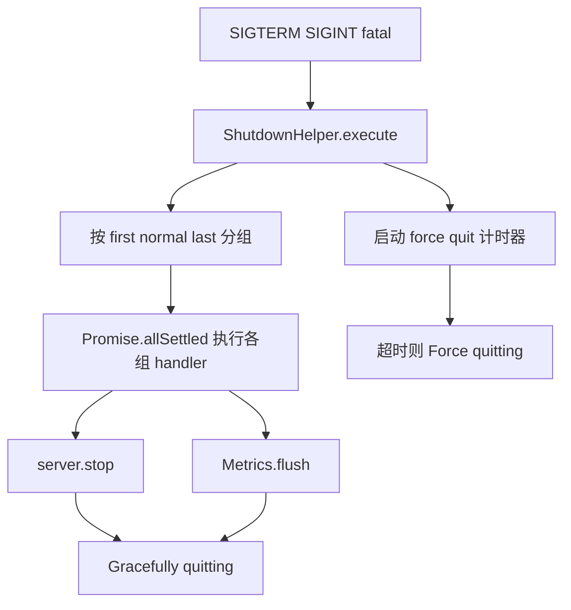

如果只把生产环境理解成“配几个环境变量，然后 `node build/server/index.js` 跑起来”，会漏掉 Outline 这套运行时最关键的三层结构：

- 环境配置如何被加载、校验并安全地暴露给前端
- 日志、指标、错误报告怎样统一起来
- 进程在启动、运行、异常和关闭时怎样保持可观测和可收尾

这一页的重点不是枚举所有 env 名称，而是理解：**Outline 怎样把配置、可观测性和生命周期管理串成一条完整的生产运行链。**

Sources: [server/utils/environment.ts](server/utils/environment.ts), [server/env.ts](server/env.ts), [server/utils/decorators/Public.ts](server/utils/decorators/Public.ts), [server/presenters/env.ts](server/presenters/env.ts), [server/routes/app.ts](server/routes/app.ts), [app/env.ts](app/env.ts), [shared/env.ts](shared/env.ts), [server/logging/Logger.ts](server/logging/Logger.ts), [server/logging/Metrics.ts](server/logging/Metrics.ts), [server/onerror.ts](server/onerror.ts), [server/utils/ShutdownHelper.ts](server/utils/ShutdownHelper.ts), [server/utils/startup.ts](server/utils/startup.ts), [server/index.ts](server/index.ts), [server/services/index.ts](server/services/index.ts)

## 先把这条生产运行链压成一张图

```mermaid
flowchart TD
  A[".env / .env.<env> / process.env / *_FILE"] --> B[environment.ts]
  B --> C[env.ts 校验]
  C --> D[@Public 收集]
  D --> E[renderApp 注入 window.env]
  E --> F[app env 与 shared env 消费]

  C --> G[server.index 启动前检查]
  G --> H[Logger Metrics Sentry onerror]
  H --> I[请求处理]

  I --> J[SIGTERM SIGINT fatal error]
  J --> K[ShutdownHelper]
  K --> L[server.stop]
  K --> M[Metrics.flush]
  K --> N[force quit timeout]
```

这张图很重要，因为它说明“生产环境”在这个仓库里不是一个文件，而是一整套时序。

## 第一层：环境变量不是直接 `process.env` 乱读，而是先经过装载、覆盖和秘密文件解析

`server/utils/environment.ts` 做的事情看似简单，实际上定义了当前仓库的配置装载语义。

它会先读：

- `.env`

再根据当前环境决定是否叠加：

- `.env.production`
- `.env.development`
- `.env.local`
- `.env.test`

最后再让真实 `process.env` 覆盖前面所有内容。

## `.env.local` 在开发场景里是被特殊对待的

代码里专门有 `isLocalDevelopment` 分支，这意味着：

- 即使 `NODE_ENV=development`
- 也会额外考虑 `.env.local`

这很符合本地开发心智：共享默认配置放 `.env`，个人机器覆写放 `.env.local`。

## `*_FILE` 支持说明这套配置考虑了容器/密钥文件场景

`resolveFileSecrets(...)` 会扫描所有以 `_FILE` 结尾的变量：

- 如果基础变量没设置
- 就去读取文件内容
- 再把内容填回基础 key

例如逻辑上支持这类模式：

```text
SECRET_KEY_FILE=/run/secrets/outline_secret_key
```

这对 Docker secret、Kubernetes secret volume 或其他文件挂载式密钥管理都很实用。

而且文件内容会 `trim()`，这也很符合 secret file 的真实使用习惯。

Sources: [server/utils/environment.ts](server/utils/environment.ts)

## 第二层：`server/env.ts` 把“字符串环境变量”升级成“被验证的配置对象”

`server/env.ts` 的核心不是变量多，而是它把 env 变成了一个 `Environment` 类，并用 `class-validator` 做校验。

这意味着：

- URL 要满足 URL 规则
- `SECRET_KEY` 必须是 64 位十六进制
- 端口和超时会被转成数字
- 枚举值要落在允许集合里
- 某些变量之间还会做互斥/依赖校验

如果校验失败，构造函数会在下一个 tick 输出错误并 `process.exit(1)`。也就是说，Outline 的策略不是“配置错了尽量凑合跑”，而是**尽早失败，避免带着半坏状态进入生产流量。**

## 这里真正重要的不是所有字段，而是字段被分了几类

从当前文件能看出至少有这些配置簇：

- 数据库与只读副本
- Redis 与协作 Redis
- 外部 URL / CDN / collaboration URL
- 端口、并发、请求超时
- 默认语言
- 日志级别
- OAuth 生命周期
- 限流与其他运行时行为

这说明 `env.ts` 不是单纯“收变量”，而是在定义整个应用的可调面。

Sources: [server/env.ts](server/env.ts)

## 第三层：只有被 `@Public` 标注的 env 才允许下发到浏览器

这部分是当前实现里一个非常关键的安全边界。

`server/utils/decorators/Public.ts` 提供了：

- `@Public`
- `PublicEnvironmentRegister`

任何被 `@Public` 装饰的环境字段，才会被登记进 `env.public`。

然后 `server/presenters/env.ts` 再把这些 public env 组装成一个前端可消费对象，并且还可以附带：

- analytics integration 的公开设置
- `ROOT_SHARE_ID`

文件顶部还特意写了注释：整个对象会被 stringified 到 HTML 里，所以不要把 secret/password 塞进去。

这已经非常清楚地表达出一个原则：**前端配置暴露不是“挑哪些不敏感”，而是“只有显式声明可公开的才允许出去”。**

Sources: [server/utils/decorators/Public.ts](server/utils/decorators/Public.ts), [server/presenters/env.ts](server/presenters/env.ts)

## 第四层：`renderApp` 在服务端渲染时把 public env 注入到 `window.env`

`server/routes/app.ts` 会在 HTML 模板里注入：

```html
<script>
  window.env = ...
</script>
```

实现上还有几个细节值得注意：

- 注入前会 `JSON.stringify(...)`
- 还会把 `<` 转义成 `\\u003c`，避免脚本注入边界问题
- 前端静态资源路径、lang、manifest、prefetch 等也都在这一层一起拼

于是配置流就变成：

1. 服务端校验 env
2. 只挑 public env
3. 随首屏 HTML 下发
4. 浏览器端直接读 `window.env`

## `app/env.ts` 和 `shared/env.ts` 分别给前端和跨端代码一个统一入口

`app/env.ts` 会在 `window.env` 缺失时直接抛错，并附带 troubleshooting 文档链接。它不是容错式读取，而是明确认为“没有 env 就是不正常部署”。

`shared/env.ts` 则更简单：

- 服务端返回 `process.env`
- 浏览器返回 `window.env`

这让共享代码不必关心自己到底跑在哪一端。

Sources: [server/routes/app.ts](server/routes/app.ts), [app/env.ts](app/env.ts), [shared/env.ts](shared/env.ts)

## 日志层的目标不是“打印到控制台”，而是同时服务开发排查、生产结构化输出和错误上报

`server/logging/Logger.ts` 基于 Winston，但做了明显的双态输出设计：

- 生产环境：JSON logs
- 非生产环境：彩色、可读性更高的人类日志

这很合理，因为本地开发需要快速阅读，生产环境需要被日志系统结构化采集。

## 生产环境日志会主动清洗敏感字段

`sanitize(...)` 在生产模式下会过滤：

- `accessToken`
- `refreshToken`
- `token`
- `password`
- `content`

而且是递归清洗对象和数组，不是只做顶层替换。

这点很关键，因为 Outline 里很多错误上下文都可能带请求体、模型属性或编辑器内容。没有这层清洗，结构化日志很容易顺手把敏感信息打出去。

## `warn` / `error` 不只是日志，还会顺带打 metrics

- `warn()` -> `Metrics.increment("logger.warning")`
- `error()` -> `Metrics.increment("logger.error", { name: error.name })`

同时如果配置了 `SENTRY_DSN`，还会把异常送进 Sentry。

## `fatal()` 会直接触发关闭流程

它不是简单 `process.exit(1)`，而是：

1. 先 `error(...)`
2. 再 `ShutdownHelper.execute(1)`

这说明即使是致命错误，Outline 也优先尝试按既定关闭顺序收尾。

Sources: [server/logging/Logger.ts](server/logging/Logger.ts)

## 指标层很轻，但它明确承担了“实例级运行信号”职责

`server/logging/Metrics.ts` 基于 `hot-shots`：

- 前缀固定 `outline.`
- 全局 tag 带 `env`
- 支持 `gauge`
- 支持 `gaugePerInstance`
- 支持 `increment`
- 支持 `flush`

其中 `gaugePerInstance` 会优先取：

- `INSTANCE_ID`
- `HEROKU_DYNO_ID`
- 否则退回 `process.pid`

这说明它考虑了多实例/多 dyno 部署形态，不把所有指标都混成一条。

更重要的是，`flush()` 会在关闭流程里被显式调用，避免进程退出时最后一批指标丢失。

Sources: [server/logging/Metrics.ts](server/logging/Metrics.ts), [server/index.ts](server/index.ts)

## 请求期错误处理不是“抛了就 500”，而是做了规范化、上报决策和响应格式选择

`server/onerror.ts` 是整套生产稳定性的关键一环。

它会先把各种奇怪的 thrown value 归一成 `Error`：

- 跨 realm Error
- 普通对象
- 非 Error 文本

## 客户端中断上传会被映射成 `499`

如果捕获到 `formidable` 的 client abort 场景，不再把它当普通 `500`，而是改成 `ClientClosedRequestError()`。这非常务实，因为文件上传这类路径里，用户中途取消并不应该污染服务端错误率。

## 是否上报到 Sentry 是按“错误可报告性”决定的

逻辑大致是：

- 显式 `isReportable === true` 的上报
- 未明确标记但属于未知/500 类错误的也上报
- 明确 `isReportable === false` 的不报

对于不该报的异常，还会清掉 tracing span 上自动打的 error tag，避免把业务拒绝类异常误标成系统故障。

## JSON 错误响应也有稳定格式

如果请求接受 JSON，返回体大致是：

- `ok: false`
- `error: snake_case(err.id)`
- `status`
- `message`
- `data`

这让客户端能稳定解析，而不是被 Koa 默认行为左右。

Sources: [server/onerror.ts](server/onerror.ts)

## 启动流程不是“监听端口前什么都不做”，而是先跑一轮系统自检

`server/index.ts` 在 master 进程里会先执行：

- `checkConnection(sequelize)`
- `checkPendingMigrations()`
- `printEnv()`

如果开了 telemetry 且是生产环境，还会周期性 `checkUpdates()`。

## `checkPendingMigrations()` 自带分布式锁意识

`server/utils/startup.ts` 里会用 `MutexLock.acquire("migrations", ...)` 包住迁移检查。说明仓库已经考虑到多实例同时启动时，不能让所有实例并发跑迁移。

如果：

- 存在 pending migrations
- 又传了 `--no-migrate`

就会直接 `Logger.fatal(...)` 退出。

对于某些旧版本升级路径，代码甚至会在检测到历史数据迁移未完成时硬失败并打印脚本提示。

这再次说明：Outline 把“能否安全启动”放在“先把服务跑起来”之前。

Sources: [server/index.ts](server/index.ts), [server/utils/startup.ts](server/utils/startup.ts)

## worker 进程的运行期也被严密包起来了

真正启动服务时，`start(...)` 会做这些事：

- 加载插件
- 开发模式下清理部分缓存
- 根据 SSL 配置决定 HTTP / HTTPS
- 安装 `helmet`
- 挂 `onerror`
- 应用默认 rate limiter
- 注册 `/_health`
- 根据 `env.SERVICES` 逐个启动 `web`、`worker`、`collaboration` 等服务

其中 `/_health` 会同时检查：

- `SELECT 1`
- `Redis.defaultClient.ping()`

这就是 Docker 健康检查那一页看到的应用侧配合点。

## `throng` 说明多进程并发也是运行时的一等问题

`server/index.ts` 会根据：

- `env.WEB_CONCURRENCY`
- 当前是否启用了 collaboration
- 是否配置了 `REDIS_COLLABORATION_URL`

决定 worker 数量。

特别是没配协作 Redis 时，会强制 collaboration 相关进程数退回 1。因为多进程协作服务没有共享 Redis 支撑会出一致性问题。

Sources: [server/index.ts](server/index.ts), [server/services/index.ts](server/services/index.ts)

## 优雅关闭被单独抽成 `ShutdownHelper`，而不是在各处散落 `process.on(...)`

`server/utils/ShutdownHelper.ts` 提供了一个很清楚的关闭协议：

- 顺序分组：`first`、`normal`、`last`
- 连接宽限：`5s`
- 强制退出超时：`60s`

调用 `execute()` 后，会：

1. 防重入
2. 启动 force quit 计时器
3. 按组执行 handler
4. 组内用 `Promise.allSettled(...)`
5. 全部完成后 `process.exit(code)`

这比“收到 SIGTERM 直接 exit”稳健得多，因为它允许不同资源按顺序收尾。



## 当前 server 至少注册了两类关闭动作

在 `server/index.ts` 里能看到：

- `server.stop(...)`，先停止接收新连接，再等已有连接完成或超时
- `Metrics.flush()`，把最后一批指标送出去

同时还挂了：

- `process.once("SIGTERM", ...)`
- `process.once("SIGINT", ...)`
- `process.on("unhandledRejection", ...)`

这让“容器被停”“本地 Ctrl+C”“运行期未处理 promise 错误”都能进入同一套运维语义，而不是各自为政。

Sources: [server/utils/ShutdownHelper.ts](server/utils/ShutdownHelper.ts), [server/index.ts](server/index.ts)

## 为什么 Outline 的生产运行体系会长成今天这样

这套设计背后的现实约束至少有这些：

1. **同一套代码既要跑 self-hosted，也要跑 cloud，还要兼容多进程与多服务拆分。**
2. **部分配置必须给前端看，但秘密绝不能顺手泄漏到浏览器。**
3. **日志既要适合本地调试，也要适合生产采集和异常上报。**
4. **数据库迁移、Redis 可达性、协作进程并发、安全关闭都不是“可选细节”，而是上线稳定性的核心。**

所以 Outline 的答案是：

- 用 `environment.ts + env.ts` 定义配置装载与校验边界
- 用 `@Public` 和 `presentEnv` 定义前端可见边界
- 用 `Logger + Metrics + onerror` 定义可观测边界
- 用 `startup + ShutdownHelper + throng` 定义进程生命周期边界

这让“生产环境”不只是若干环境变量，而是一套成型的运行时纪律。

## 建议继续阅读

- 想看容器镜像和健康检查怎样接上这里的启动与关闭逻辑：读 [Docker 部署：镜像构建与 docker-compose 配置](31-docker-bu-shu-jing-xiang-gou-jian-yu-docker-compose-pei-zhi)
- 想看数据库迁移为什么会在启动前被硬性检查：读 [数据库迁移管理：Sequelize 迁移与数据回填脚本](23-shu-ju-ku-qian-yi-guan-li-sequelize-qian-yi-yu-shu-ju-hui-tian-jiao-ben)
- 想看 Redis 在健康检查、缓存和 challenge 流程里还承担了哪些角色：读 [Redis 缓存策略与会话管理](25-redis-huan-cun-ce-lue-yu-hui-hua-guan-li)
- 想看服务拆分为什么会进一步影响 `SERVICES`、并发和关闭顺序：读 [后端服务拆分：Web、Collaboration、Websockets、Worker 与 Cron](7-hou-duan-fu-wu-chai-fen-web-collaboration-websockets-worker-yu-cron)
- 想看前端的 `window.env` 和默认语言为什么会从这里一路传到浏览器：读 [国际化（i18n）：多语言配置与翻译工作流](30-guo-ji-hua-i18n-duo-yu-yan-pei-zhi-yu-fan-yi-gong-zuo-liu)
- 想看统一错误格式、认证中间件和 presenter 在请求期怎样继续配合：读 [API 路由设计：Schema 验证、中间件与错误处理](17-api-lu-you-she-ji-schema-yan-zheng-zhong-jian-jian-yu-cuo-wu-chu-li)
