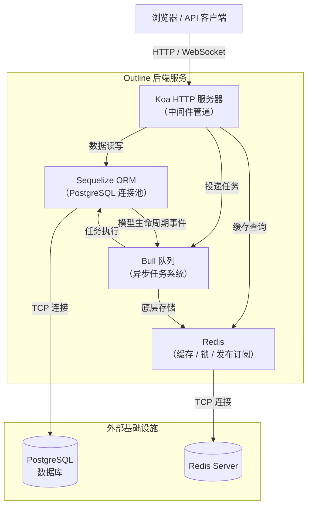
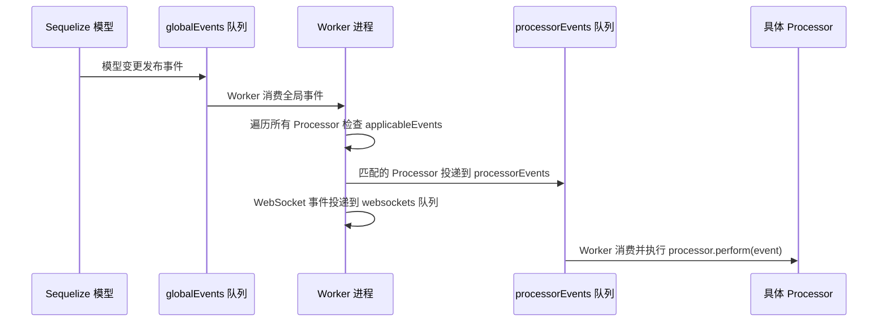

Outline 的后端构建在四个核心技术之上——**Koa** 提供 HTTP 服务、**Sequelize** 管理 PostgreSQL 数据库、**Redis** 作为高速缓存与消息中间件、**Bull** 处理异步任务队列。这四者协同工作，共同支撑起一个可靠、可扩展的知识库系统。本文将从整体架构出发，逐一介绍每个技术的定位、集成方式和在项目中的实际运用。

Sources: [index.ts](server/index.ts#L1-L266), [services/index.ts](server/services/index.ts#L1-L16)

## 整体架构总览

在深入每个技术之前，先通过一张架构图理解这四者如何配合运转：



**核心数据流**可以这样理解：用户请求到达 Koa → 中间件链依次处理（认证、验证、限流等） → 通过 Sequelize 读写数据库 → 对于耗时操作（如邮件发送、文件导出），将任务投递到 Bull 队列 → Bull 依赖 Redis 存储队列状态并调度 Worker 进程异步执行。Redis 同时还承担缓存与分布式锁的职责，确保多进程环境下数据一致性。

Sources: [index.ts](server/index.ts#L77-L98), [web.ts](server/services/web.ts#L28-L103), [database.ts](server/storage/database.ts#L48-L161)

## Koa：轻量级 HTTP 服务框架

### Koa 是什么

Koa 是由 Express 原班团队打造的下一代 Node.js Web 框架。它最显著的特征是**中间件级联**机制——通过 `async/await` 实现一种类似"洋葱模型"的请求处理流程：请求从外层中间件逐层穿透到核心逻辑，响应再从内层逐层返回。这使得在请求前后插入处理逻辑（如日志记录、错误捕获）变得极为自然。

### Outline 中 Koa 的集成方式

Outline 在 `server/index.ts` 中创建 Koa 应用实例，并组装基础中间件管道：

| 中间件 | 作用 | 来源 |
|--------|------|------|
| `koa-helmet` | 设置安全响应头（CSP、XSS 防护等） | 安全防护 |
| `koa-logger` | HTTP 请求日志（仅在 DEBUG=http 时启用） | 调试 |
| `onerror` | 全局错误捕获，自动设置状态码和响应头 | 错误处理 |
| `defaultRateLimiter` | 全局限流，防止 API 滥用 | 流量控制 |

随后，根据环境变量 `SERVICES` 的配置，启动不同的服务模块。默认启动四个服务：`web`、`websockets`、`worker`、`collaboration`。每个服务接收共享的 Koa 实例和 HTTP Server 对象，在其上挂载各自的路由和处理器。

Sources: [index.ts](server/index.ts#L77-L98), [index.ts](server/index.ts#L180-L189)

### Web 服务与 API 路由

Web 服务（`server/services/web.ts`）是 Koa 最重要的使用者。它组装了完整的中间件栈：

```
请求 → HTTPS 强制跳转 → userAgent 解析 → gzip 压缩 → API 路由(/api)
     → CSRF Token → CSP 安全策略 → 认证路由(/auth) → OAuth 路由(/oauth)
     → 前端页面渲染
```

API 路由在 `server/routes/api/index.ts` 中定义，这是一个**独立的 Koa 子应用**，通过 `koa-mount` 挂载到主应用的 `/api` 路径下。这种设计使得 API 层拥有独立的中间件栈：

| API 中间件 | 作用 |
|------------|------|
| `requestContext` | 建立请求上下文（AsyncLocalStorage） |
| `koa-body` | 解析请求体（JSON、multipart 表单） |
| `coalesceBody` | 合并请求体数据 |
| `requestTracer` | 分布式追踪标注 |
| `apiResponse` | 统一响应格式 |
| `apiErrorHandler` | 统一错误处理 |
| `apiContext` | 注入数据库事务和认证上下文 |
| `verifyCSRFToken` | CSRF 防护验证 |

API 路由覆盖了 30+ 资源模块（documents、collections、users、teams 等），每个模块使用 `koa-router` 定义具体的路由端点。

Sources: [web.ts](server/services/web.ts#L28-L103), [api/index.ts](server/routes/api/index.ts#L55-L143)

### 健康检查端点

所有服务共享一个 `/_health` 健康检查端点，同时验证数据库和 Redis 的连通性——这也体现了四大技术栈的紧密协作：

Sources: [index.ts](server/index.ts#L158-L176)

## Sequelize：TypeScript ORM 与数据库管理

### Sequelize 是什么

Sequelize 是 Node.js 生态中最成熟的基于 Promise 的 ORM，支持 PostgreSQL、MySQL 等多种数据库。Outline 通过 `sequelize-typescript` 使用**装饰器**语法定义模型，并配合 TypeScript 获得完整的类型推断。

### 数据库连接与配置

数据库连接在 `server/storage/database.ts` 中建立。支持两种配置方式：

| 配置方式 | 环境变量 | 适用场景 |
|----------|----------|----------|
| **连接字符串** | `DATABASE_URL` | 生产环境（如 Heroku Postgres） |
| **分离组件** | `DATABASE_HOST` + `DATABASE_NAME` + `DATABASE_USER` + `DATABASE_PASSWORD` | 自托管部署 |

连接池配置提供了精细的控制参数：

```typescript
pool: {
  max: poolMax,        // 最大连接数，默认 5
  min: poolMin,        // 最小连接数，默认 0
  acquire: 30000,      // 获取连接超时 30 秒
  idle: 10000,         // 空闲连接回收 10 秒
}
```

此外，系统支持**只读副本**（`DATABASE_READ_ONLY_URL`），读副本的连接池大小会自动翻倍（`poolMax * 2`），因为读操作不存在写竞争，可以更激进地利用连接。

Sources: [database.ts](server/storage/database.ts#L20-L97), [database.ts](server/storage/database.ts#L268-L288)

### 模型系统

Outline 定义了 30+ 个 Sequelize 模型，核心模型包括：

| 模型 | 说明 |
|------|------|
| `Document` | 文档——系统的核心实体 |
| `Collection` | 文档集合——文档的容器 |
| `User` | 用户 |
| `Team` | 团队（多租户） |
| `Revision` | 文档修订版本 |
| `Event` | 系统事件——驱动异步处理的核心 |
| `Collection` | 集合权限与结构管理 |

所有模型继承自 `server/models/base/Model.ts` 中的自定义 `Model` 基类。这个基类扩展了 Sequelize 原生 Model，添加了 **`withCtx` 系列方法**（如 `saveWithCtx`、`createWithCtx`、`destroyWithCtx`），使得模型的增删改操作自动发布事件到 Bull 队列，实现数据变更的事件驱动处理。

Sources: [models/index.ts](server/models/index.ts#L1-L81), [base/Model.ts](server/models/base/Model.ts#L50-L109)

### 迁移管理

数据库迁移使用 **Umzug** 库管理（而非 Sequelize 内置迁移工具），迁移脚本存放在 `server/migrations/` 目录下，按时间戳命名，从 2016 年至今已有 200+ 个迁移文件。迁移记录存储在数据库的 `SequelizeMeta` 表中。

Sources: [database.ts](server/storage/database.ts#L182-L229), [.sequelizerc](.sequelizerc#L1-L12)

## Redis：缓存、锁与消息中间件

### Redis 在 Outline 中的角色

Redis 在 Outline 中扮演多重角色，是连接各个组件的关键基础设施：

| 角色 | 实现方式 | 用途 |
|------|----------|------|
| **Bull 队列存储** | `ioredis` 客户端 | 任务状态持久化与调度 |
| **Socket.IO 适配器** | `socket.io-redis` | WebSocket 多进程消息广播 |
| **分布式锁** | `redlock` 库 | 防止并发操作冲突 |
| **数据缓存** | `CacheHelper` | URL 预览、集合结构等缓存 |
| **协作编辑** | `@hocuspocus/extension-redis` | 实时编辑状态同步 |

Sources: [redis.ts](server/storage/redis.ts#L1-L124)

### Redis 连接管理

`server/storage/redis.ts` 定义了 `RedisAdapter` 类（继承自 `ioredis`），提供三个静态单例客户端：

| 客户端 | 用途 | 特点 |
|--------|------|------|
| `defaultClient` | 通用操作（缓存、锁、Bull 的 client 模式） | `maxRetriesPerRequest: 20` |
| `defaultSubscriber` | 发布订阅（Bull 的 subscriber 模式、Socket.IO） | `maxRetriesPerRequest: null`（永不超时） |
| `collaborationClient` | 协作编辑专用（可选，需设置 `REDIS_COLLABORATION_URL`） | 水平扩展协作服务 |

重连策略采用指数退避（`times * 500ms`，上限 3000ms），确保 Redis 暂时不可用时系统能自动恢复。

Sources: [redis.ts](server/storage/redis.ts#L13-L123)

### 分布式锁（MutexLock）

基于 `redlock` 库实现的 `MutexLock` 工具类提供了两种加锁方式：

- **`acquire(resource, timeout)`**：手动获取和释放锁
- **`using(resource, timeout, routine)`**：自动管理的锁上下文，锁会在例程执行期间自动续期

锁的默认超时为 4000ms，重试次数 120 次，重试间隔 1000ms。这种设计确保在多 Worker 进程竞争同一资源时（如更新文档流行度分数），只有一个进程能执行操作。

Sources: [MutexLock.ts](server/utils/MutexLock.ts#L16-L109)

### 缓存辅助（CacheHelper）

`CacheHelper` 封装了 Redis 的缓存读写操作，核心方法是 `getDataOrSet`，实现了**带锁保护的缓存回填模式**：

1. 先从 Redis 读取缓存数据
2. 缓存命中 → 直接返回
3. 缓存未命中 → 获取分布式锁 → 双重检查缓存 → 调用回调获取数据 → 写入缓存 → 释放锁

这种"双重检查 + 分布式锁"的模式，既防止了缓存击穿（大量请求同时回填），又保证了缓存一致性。缓存键通过 `RedisPrefixHelper` 统一管理前缀（如 `unfurl:`、`cd:`、`uc:` 等）。

Sources: [CacheHelper.ts](server/utils/CacheHelper.ts#L38-L143), [RedisPrefixHelper.ts](server/utils/RedisPrefixHelper.ts#L1-L46)

## Bull：异步任务队列系统

### Bull 是什么

Bull 是基于 Redis 的高性能 Node.js 消息队列库。它支持任务优先级、延迟执行、指数退避重试、并发控制等特性，非常适合处理耗时操作（如发送邮件、导出文件、清理过期数据）。

### 四大队列

Outline 在 `server/queues/index.ts` 中定义了四个核心队列：

| 队列名 | 用途 | 重试策略 |
|--------|------|----------|
| `globalEvents` | 全局事件总线——接收所有模型生命周期事件 | 5 次重试，指数退避（1 秒基数） |
| `processorEvents` | 处理器事件——分发事件到具体的 Processor | 5 次重试，指数退避（10 秒基数） |
| `websockets` | WebSocket 事件推送 | 10 秒超时 |
| `tasks` | 通用异步任务（文件导出、数据清理等） | 5 次重试，指数退避（10 秒基数） |

每个队列通过 `createQueue` 工厂函数创建，该函数统一配置 Redis 连接复用、完成/失败任务自动清理、监控指标收集和优雅关闭钩子。

Sources: [queues/index.ts](server/queues/index.ts#L1-L55), [queue.ts](server/queues/queue.ts#L10-L68)

### 事件处理流程：Processor 模式

事件处理采用**两阶段分发**架构：



**第一阶段**（globalEvents）：模型通过 `withCtx` 方法（如 `saveWithCtx`）触发 Sequelize 生命周期钩子（`AfterCreate`、`AfterUpdate`、`AfterDestroy`），将事件投递到全局事件队列。

**第二阶段**（processorEvents）：Worker 从全局队列消费事件，检查每个 Processor 声明的 `applicableEvents` 列表，将匹配的事件投递到处理器专属队列。

这种两阶段设计的好处是**关注点分离**——全局队列只负责接收和分发，各 Processor 独立消费、独立重试、互不影响。系统目前有 30+ 个 Processor，例如：

| Processor | 监听事件 | 功能 |
|-----------|----------|------|
| `EmailsProcessor` | `notifications.create` | 发送通知邮件 |
| `RevisionsProcessor` | `documents.update` | 创建文档修订版本 |
| `BacklinksProcessor` | `documents.create` / `documents.update` | 维护反向链接 |
| `SearchIndexProcessor` | 多个文档相关事件 | 更新搜索索引 |
| `WebsocketsProcessor` | 所有事件（`*`） | 通过 WebSocket 推送给客户端 |

Sources: [worker.ts](server/services/worker.ts#L17-L179), [BaseProcessor.ts](server/queues/processors/BaseProcessor.ts#L1-L18)

### 异步任务：Task 模式

除了事件驱动的 Processor，Bull 还承载独立的**异步任务**（Task）。每个 Task 继承自 `BaseTask`，通过 `schedule()` 方法将自身投递到 `tasks` 队列：

```typescript
// 任务调度示例
await new EmailTask().schedule({
  to: "user@example.com",
  template: "welcome",
});
```

Task 系统支持优先级调度（Background、Low、Normal、High）和自动重试（5 次指数退避）。项目中有 60+ 个 Task，涵盖：

| 类别 | 示例 Task |
|------|-----------|
| 文件操作 | `ExportMarkdownZipTask`、`ImportJSONTask`、`DeleteAttachmentTask` |
| 定时清理 | `CleanupDeletedDocumentsTask`、`CleanupExpiredFileOperationsTask` |
| 通知发送 | `DocumentPublishedNotificationsTask`、`CommentCreatedNotificationsTask` |
| 数据维护 | `UpdateDocumentsPopularityScoreTask`、`RollupDocumentInsightsTask` |
| 用户管理 | `InviteReminderTask`、`ValidateSSOAccessTask` |

Sources: [BaseTask.ts](server/queues/tasks/base/BaseTask.ts#L1-L62), [worker.ts](server/services/worker.ts#L133-L174)

### 定时任务：Cron 调度

`server/services/cron.ts` 实现了轻量级的定时任务调度。继承自 `CronTask` 的任务按 `TaskInterval.Day`（每日）或 `TaskInterval.Hour`（每小时）的频率执行：

- **每日任务**：清理过期附件、清理旧通知、更新团队存储用量等
- **每小时任务**：错误超时文件操作标记、清理过期 OAuth 授权码等

CronTask 还内置了 **UUID 范围分区**机制，支持在多个 Worker 实例间均匀分配工作负载，避免单个 Worker 成为瓶颈。

Sources: [cron.ts](server/services/cron.ts#L1-L37), [CronTask.ts](server/queues/tasks/base/CronTask.ts#L1-L196)

### 健康监控

`HealthMonitor` 对每个队列实施持续监控——如果某个队列在 30 秒内无任何活动且等待任务超过 50 个，会触发致命错误日志，提示运维人员干预。这种机制确保了队列系统的可靠性，防止"静默故障"。

Sources: [HealthMonitor.ts](server/queues/HealthMonitor.ts#L1-L48)

## 技术栈协作实例：一个完整的请求流程

以「用户发布一篇文档」为例，四大技术栈的协作如下：

1. **Koa** 接收 `POST /api/documents.publish` 请求
2. 中间件链依次处理：认证 → CSRF 验证 → 请求体解析 → Zod Schema 校验
3. 路由处理器调用 `documentUpdater` 命令
4. **Sequelize** 执行数据库事务，更新文档状态
5. 模型的 `AfterUpdate` 钩子触发，通过 `saveWithCtx` 将事件发布到 **Bull** 的 `globalEvents` 队列
6. **Redis** 作为 Bull 的底层存储，保存任务状态
7. Worker 进程消费事件，分发到 `NotificationsProcessor`、`EmailsProcessor`、`SearchIndexProcessor` 等
8. `NotificationsProcessor` 创建通知记录（Sequelize），`EmailsProcessor` 调度邮件发送任务（Bull）
9. WebSocket 进程通过 `WebsocketsProcessor` 将更新推送给所有在线用户（Redis 作为 Socket.IO 的发布订阅后端）

整个流程中，Koa 只负责同步的请求-响应环，所有耗时和异步操作都卸载到 Bull 队列异步处理，Redis 在背后串联一切。

## 环境变量速查

以下是四大技术栈相关的核心环境变量：

| 变量 | 说明 | 默认值 |
|------|------|--------|
| `DATABASE_URL` | PostgreSQL 连接字符串 | 无（必填） |
| `DATABASE_READ_ONLY_URL` | 只读副本连接字符串 | 无 |
| `DATABASE_CONNECTION_POOL_MAX` | 连接池最大连接数 | 5 |
| `REDIS_URL` | Redis 连接地址 | 无（必填） |
| `REDIS_COLLABORATION_URL` | 协作服务专用 Redis | 无 |
| `SERVICES` | 启用的服务列表 | `collaboration,websockets,worker,web` |
| `PORT` | 服务监听端口 | 3000 |

Sources: [env.ts](server/env.ts#L84-L200), [env.ts](server/env.ts#L320-L334)

## 下一步阅读

了解了四大后端技术栈之后，建议继续阅读以下页面以深入理解各组件的详细设计：

- [整体架构：前后端 Monorepo 与共享模块设计](6-zheng-ti-jia-gou-qian-hou-duan-monorepo-yu-gong-xiang-mo-kuai-she-ji)——理解前后端代码组织方式
- [后端服务拆分：Web、Collaboration、Websockets、Worker 与 Cron](7-hou-duan-fu-wu-chai-fen-web-collaboration-websockets-worker-yu-cron)——深入各服务进程的职责与通信
- [API 路由设计：Schema 验证、中间件与错误处理](17-api-lu-you-she-ji-schema-yan-zheng-zhong-jian-jian-yu-cuo-wu-chu-li)——掌握 API 层的完整请求处理流程
- [数据模型层：Sequelize 模型定义、关联与生命周期钩子](18-shu-ju-mo-xing-ceng-sequelize-mo-xing-ding-yi-guan-lian-yu-sheng-ming-zhou-qi-gou-zi)——深入模型定义与关联关系
- [异步任务与事件驱动：Bull 队列、Processor 与 Task 体系](22-yi-bu-ren-wu-yu-shi-jian-qu-dong-bull-dui-lie-processor-yu-task-ti-xi)——全面理解事件驱动架构