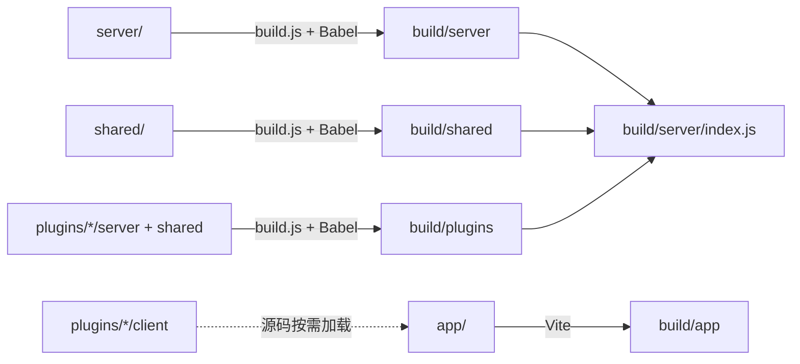

Outline 的 monorepo 并不是“把前后端代码放在同一个 Git 仓库里”这么简单。更准确地说，它是一种**围绕共享编辑器、共享类型、共享校验和共享工具构建出来的单仓工程组织方式**。你读这个仓库时，如果还在用“前端项目”和“后端项目”两套完全独立代码库的思路去看，就会一直觉得很多目录边界不自然。真正的边界其实是：哪些逻辑必须依赖浏览器，哪些必须依赖 Node，哪些两边都应该共用。

Sources: [docs/ARCHITECTURE.md](docs/ARCHITECTURE.md), [package.json](package.json), [tsconfig.json](tsconfig.json)

## 这不是 Yarn workspaces 式 monorepo，而是单包大仓

很多 monorepo 会拆成 `packages/*` 或多个子 package，再用 workspace 串起来。Outline 走的不是这条路。当前仓库只有一个根 `package.json`，所有依赖、脚本和构建入口都集中在这里管理：

- 前端构建由 `vite.config.ts` 驱动
- 后端构建由 `build.js` 驱动
- `shared/` 不单独发包，而是直接参与前后端编译
- `plugins/` 也不是独立 npm 包，而是被主工程在构建和运行时动态吸收

这种方式的好处是简单直接。团队不需要维护多份 lockfile、多套发布版本和复杂的跨包依赖图；代价则是仓库边界更多依赖约定，而不是 package manager 帮你隔离。

Sources: [package.json](package.json), [build.js](build.js), [vite.config.ts](vite.config.ts)

## 目录边界背后的设计意图

从顶层看，Outline 的目录可以分成五个真正有架构含义的区域：

| 目录 | 角色 | 为什么单独存在 |
|---|---|---|
| `app/` | 浏览器端 React 应用 | 这里允许直接依赖 DOM、浏览器 API、路由、动画和界面状态 |
| `server/` | Node.js / Koa 后端服务 | 这里允许直接依赖数据库、Redis、文件系统、HTTP 服务端能力 |
| `shared/` | 前后端共用契约与纯逻辑 | 避免编辑器、类型、校验和工具在两端各写一份 |
| `plugins/` | 可插拔扩展层 | 把认证、搜索、嵌入、分析等变体从核心代码里抽开 |
| `public/` 与 `server/static/` | 静态资源 | 让前端构建产物和服务端直接提供的资源分工明确 |

这种划分看起来朴素，但它解决的是一个很现实的问题：Outline 不是“后端 API + 简单前端壳”，而是一个包含富文本编辑器、协作协议、权限模型、集成插件和异步任务系统的产品。共享边界如果画错，代码重复和契约漂移会非常快地失控。

Sources: [docs/ARCHITECTURE.md](docs/ARCHITECTURE.md), [server/index.ts](server/index.ts), [app/index.tsx](app/index.tsx)

## `shared/` 才是这套 monorepo 的真正核心

### 为什么一定要有 `shared/`

假设没有 `shared/`，Outline 至少会立刻遇到三类重复问题：

1. **前后端类型不一致**：比如用户角色、文档权限、导出格式这些枚举，前端写一套、后端再写一套，很快就会漂。
2. **编辑器协议分叉**：浏览器里怎么渲染 Prosemirror，服务端就必须怎么解析和序列化，否则导入导出、搜索索引、协作持久化都会出问题。
3. **输入校验口径不统一**：前端限制了某种输入，后端又按另一套规则校验，用户体验和错误定位都会很糟糕。

`shared/` 的存在，本质上是在强迫系统维护一份共同语言。

### `shared/` 里放的不是“任何通用代码”，而是“必须同构”的代码

当前仓库里，`shared/` 至少承担了下面几类职责：

| 模块 | 作用 | 为什么必须共享 |
|---|---|---|
| `shared/types.ts` | 枚举、接口、数据契约 | 前后端都要说同一种“业务语言” |
| `shared/validations.ts` | 共享校验规则 | 输入规则要前后端一致 |
| `shared/editor/` | Prosemirror 节点、标记、扩展、命令 | 浏览器编辑和服务端解析必须共用同一套 schema |
| `shared/i18n/` | 语言列表和翻译资源 | 客户端显示与服务端邮件/模板不能各说各话 |
| `shared/utils/` | 纯逻辑工具函数 | 避免重复实现和行为差异 |
| `shared/styles/` | 主题 token、断点、层级 | 让视觉常量成为系统资产而不是零散魔法数字 |

这里的关键标准不是“它通用吗”，而是“它是否必须在两端保持同一个语义”。这也是为什么一些明显可复用的东西仍然留在 `app/` 或 `server/` 里，因为它们只在单端有意义。

Sources: [docs/ARCHITECTURE.md](docs/ARCHITECTURE.md), [tsconfig.json](tsconfig.json), [app/editor/index.tsx](app/editor/index.tsx), [server/editor/index.ts](server/editor/index.ts)

## 一个最典型的共享案例：编辑器内核

如果你想最快感受到这套 monorepo 的价值，直接看编辑器这条线最直观。

前端编辑器组件 [app/editor/index.tsx](app/editor/index.tsx) 并没有自己重新定义 Prosemirror 节点，而是直接引用：

- `@shared/editor/lib/ExtensionManager`
- `@shared/editor/nodes`
- `@shared/editor/commands`
- `@shared/editor/plugins`

服务端的 [server/editor/index.ts](server/editor/index.ts) 也在使用同一套共享扩展管理器和节点集合，去构建 parser、serializer 和 schema。换句话说：

- 浏览器端负责“交互和渲染”
- 服务端负责“解析、转换和持久化”
- 两边共用同一套文档语法定义

这背后的 WHY 很重要：Outline 的文档不是普通字符串，而是富文本结构数据。只要前后端对 schema 的理解稍微有一点偏差，协作、搜索、导出、历史版本都会出错。共享编辑器内核不是工程整洁问题，而是数据正确性问题。

Sources: [app/editor/index.tsx](app/editor/index.tsx), [server/editor/index.ts](server/editor/index.ts), [shared/editor](shared/editor)

## 路径别名揭示了仓库的依赖方向

`tsconfig.json` 定义了三组别名：

| 别名 | 指向 | 主要使用方 |
|---|---|---|
| `~/*` | `./app/*` | 前端浏览器代码 |
| `@shared/*` | `./shared/*` | 前后端共同使用 |
| `@server/*` | `./server/*` | 服务端与测试 |

而 `vite.config.ts` 只暴露了 `~` 和 `@shared` 两组前端需要的别名。这一点非常说明问题：

- 浏览器端可以拿到 `app/` 与 `shared/`
- 浏览器端**不应该**直接 import `server/`
- 服务端可以 import `shared/`，但不应反过来让 `shared/` 依赖 Node 专属实现

所以真正的依赖方向应该是：

```text
app  -> shared
server -> shared
plugins/client -> app + shared
plugins/server -> server + shared
```

而不是 `shared -> server` 或 `shared -> app`。一旦共享层反向依赖具体运行时，整个 monorepo 就会开始失去“共享”的资格。

Sources: [tsconfig.json](tsconfig.json), [vite.config.ts](vite.config.ts)

## 构建链路如何把这几层重新装配起来

这套仓库在开发时是源码目录，在运行时则会被重组成一套 build 产物。可以把构建流程理解成下面这样：



这里有两个细节很关键：

### 前端和后端不是同一条编译链

前端由 Vite 输出到 `build/app`，偏重浏览器模块、代码分割和静态资源管理；后端由 `build.js` 用 Babel 编译到 `build/server`，偏重 Node 运行与插件聚合。两套链路分开，是因为它们服务的运行时根本不同。

### 插件是在构建后重新“并回主程序”的

`build.js` 会遍历 `plugins/` 下的目录，把每个插件的 `server/` 和 `shared/` 编译进 `build/plugins/<plugin>`，同时拷贝 `plugin.json`。然后服务端的 `PluginManager` 再从 `build/plugins/*/server` 里动态加载插件后端入口。

也就是说，插件既不是运行时下载的外部包，也不是前端专属小组件，而是和主仓库一起编译、一起部署、按钩子挂进系统。

Sources: [build.js](build.js), [server/utils/PluginManager.ts](server/utils/PluginManager.ts), [vite.config.ts](vite.config.ts)

## 前端和后端如何通过 shared 建立“软连接”

从代码组织上看，Outline 并没有强迫前后端互相了解对方太多实现细节。它们是通过 `shared/` 和数据契约发生联系的。

### 前端这一侧

`app/index.tsx` 把 React、MobX、Router、主题、插件和全局 Provider 组到一起，真正面向浏览器运行。`RootStore` 则在 `app/stores/RootStore.ts` 中集中注册 30 多个 store，把 API 返回的数据转成可观察状态。

### 后端这一侧

`server/index.ts` 负责服务启动编排，`server/routes/api/index.ts` 负责请求进入点，模型和命令负责业务逻辑，队列负责异步扩散。

### 中间这条 shared 连接层

两边共享的是：

- 类型和枚举
- 编辑器 schema
- 校验规则
- 一部分 URL、时间、字符串和集合处理工具

这让前端不必知道数据库结构细节，后端也不必关心组件树状态，但双方仍然可以围绕同一套文档结构和业务词汇协作。

Sources: [app/index.tsx](app/index.tsx), [app/stores/RootStore.ts](app/stores/RootStore.ts), [server/index.ts](server/index.ts), [server/routes/api/index.ts](server/routes/api/index.ts)

## 为什么这套设计适合 Outline，而不一定适合所有项目

Outline 之所以非常适合 monorepo + shared 模式，是因为它有三个强约束：

1. **富文本编辑器跨端一致性要求极高**  
   文档结构不是普通 JSON，解析和渲染必须同口径。

2. **前后端都深度使用 TypeScript**  
   共享类型和工具的收益很快就能抵掉 monorepo 的复杂度。

3. **插件需要同时接入 UI、路由、任务、认证和搜索**  
   如果拆成多仓或多包，插件开发者要处理的边界会陡增。

反过来说，如果一个系统没有共享编辑器、没有共享校验、没有扩展插件，也没有这么多跨端契约，那么类似设计可能反而会显得过重。Outline 这样组织，是因为它确实在解决真实耦合，不是为了追求时髦架构。

## 下一步应该读哪里

理解了 monorepo 的边界之后，后面的阅读顺序会顺很多：

- 想看“服务如何拆开跑”：读 [后端服务拆分：Web、Collaboration、Websockets、Worker 与 Cron](7-hou-duan-fu-wu-chai-fen-web-collaboration-websockets-worker-yu-cron)
- 想看“扩展点如何插进去”：读 [插件系统：客户端与服务端的扩展机制](8-cha-jian-xi-tong-ke-hu-duan-yu-fu-wu-duan-de-kuo-zhan-ji-zhi)
- 想看“前端状态怎么围绕共享契约组织”：读 [状态管理：MobX Model、Store 与 RootStore 架构](9-zhuang-tai-guan-li-mobx-model-store-yu-rootstore-jia-gou)
- 想看“编辑器共享内核如何工作”：读 [编辑器架构：基于 Prosemirror 的节点、标记与扩展体系](14-bian-ji-qi-jia-gou-ji-yu-prosemirror-de-jie-dian-biao-ji-yu-kuo-zhan-ti-xi)
