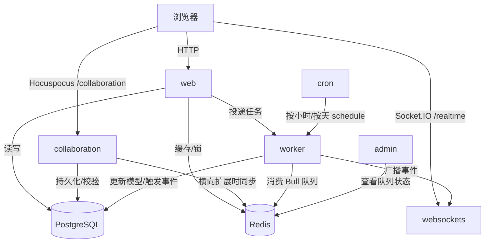

Outline 的后端不是一个“大而全的 Koa 服务器”，而是一组通过同一个入口协调启动的服务集合。你在代码里看到的 `web`、`collaboration`、`websockets`、`worker`、`cron` 和 `admin`，并不是为了“模块划分好看”才存在，而是为了把同步请求、实时协作、事件广播、异步任务和定时调度拆到最合适的执行模型里。理解这层拆分之后，再去看 API、队列或协作代码，思路会清楚得多。

Sources: [server/index.ts](server/index.ts), [server/services/index.ts](server/services/index.ts), [docs/SERVICES.md](docs/SERVICES.md)

## 服务清单：每个进程到底负责什么

先把角色表立起来：

| 服务名 | 主要职责 | 典型入口/协议 | 为什么不和别的逻辑完全揉在一起 |
|---|---|---|---|
| `web` | 提供 API、认证、OAuth、MCP 与前端页面 | HTTP | 请求响应链路需要稳定、可观测、易加中间件 |
| `collaboration` | 处理多人协作编辑 | WebSocket (`/collaboration`) | CRDT 同步和文档持久化有独立的连接模型与吞吐特征 |
| `websockets` | 推送非协作文档的实时事件 | Socket.IO (`/realtime`) | 通知广播和房间订阅与协作编辑不是一回事 |
| `worker` | 消费事件和异步任务队列 | Bull / Redis | 耗时任务不该阻塞同步请求 |
| `cron` | 定期调度小时/天级任务 | 定时器 | 定时逻辑需要与请求流量解耦 |
| `admin` | Bull Board 队列面板 | HTTP `/admin` | 只用于开发和排障，不应干扰主业务路径 |

从这个表里能看出一个核心原则：**拆分不是按代码目录拆，而是按运行时压力模型拆**。HTTP 请求讲究延迟，协作连接讲究长连接和状态同步，队列讲究吞吐和重试，Cron 讲究周期触发。把它们塞进一锅里当然也能跑，但很难同时跑得优雅。

Sources: [docs/SERVICES.md](docs/SERVICES.md), [server/services](server/services)

## 服务是如何被同一个入口编排起来的

`server/index.ts` 是所有服务的总入口。它做的事情并不复杂，但顺序非常关键：

1. 启动前先检查数据库连接、待执行迁移和环境变量
2. 统一创建 Koa app 与 HTTP/HTTPS server
3. 注入所有服务共享的基础中间件，例如 `helmet`、全局限流和统一错误处理
4. 挂一个所有服务都能访问的 `/_health` 健康检查端点
5. 根据 `SERVICES` 环境变量或 `--services` CLI 参数，循环启动指定服务

也就是说，Outline 的服务拆分不是“每个服务独立一个仓库、独立一套 bootstrap”，而是**共享同一条基础启动骨架，再按职责挂载不同能力**。这让基础设施能力保持一致，比如：

- 所有服务都能共享数据库和 Redis 健康检查
- 所有服务都能遵守统一的关停顺序
- 所有服务都能继承同一套日志、监控和限流基线

Sources: [server/index.ts](server/index.ts), [server/env.ts](server/env.ts)

## 服务选择是显式的，不是写死的

服务列表的来源有两个：

- `SERVICES` 环境变量
- 启动命令里的 `--services=...` 参数

默认值定义在 `server/env.ts`，是：

```text
collaboration,websockets,worker,web
```

而开发脚本 `yarn dev` 明确指定为：

```text
cron,collaboration,websockets,admin,web,worker
```

这两个默认值不同，背后有很明显的意图：

- **生产默认值**更克制，只保留真正支撑业务闭环的服务
- **开发默认值**更激进，把调试队列的 `admin` 和本地调度的 `cron` 一起带上，方便完整验证行为

所以当你看到“为什么开发环境有 `/admin`，线上却没有”时，不要去找奇怪的 feature flag，先看启动服务集合本身。

Sources: [server/env.ts](server/env.ts), [package.json](package.json), [docs/SERVICES.md](docs/SERVICES.md)

## 进程模型：为什么 `collaboration` 有时会强制单进程

`server/index.ts` 在启动前会计算一个 `webProcessCount`，通常来自 `WEB_CONCURRENCY`。但这里有个非常值得注意的特殊分支：

- 如果启用了 `collaboration`
- 且没有设置 `REDIS_COLLABORATION_URL`

那么进程数会被强制收缩到 `1`

WHY 很简单：协作编辑本质上是有状态的长连接系统。如果没有 Redis 作为跨进程同步后端，多进程协作服务就会各自维护一份文档状态，结果不是“性能更高”，而是“状态更乱”。这条保护逻辑其实是在替开发者兜底，防止看似正常的扩容方式把协作一致性悄悄破坏掉。

Sources: [server/index.ts](server/index.ts), [server/env.ts](server/env.ts)

## 一张图看懂这几个服务怎么协作



这个图里最重要的不是箭头多少，而是职责边界：

- `web` 是同步入口
- `worker` 是异步扩散器
- `websockets` 是实时广播器
- `collaboration` 是协作状态机
- `cron` 是定时触发器

只要记住这几个角色，后面遇到“这个逻辑为什么不直接在路由里做掉”的问题，通常都能自己推出来答案。

## `web`：同步请求入口和浏览器世界的门面

`server/services/web.ts` 负责挂载真正面向浏览器的那部分能力。它做了几件关键的事：

1. 生产环境下按配置决定是否强制 HTTPS
2. 注入 `koa-useragent`、压缩、CSP、CSRF token 附着等浏览器相关中间件
3. 挂载 `/api`、`/mcp`、`/auth`、`/oauth` 与最终页面路由

特别要注意它的中间件顺序：

- `/api` 和 `/mcp` 先挂
- 非 API 请求才附带 CSRF token
- CSP 在浏览器响应链路里再启用

这说明 `web` 服务并不只是“API 服务器”，它还承担了页面壳和浏览器安全策略的组织工作。所以把它理解成“边缘网关 + 业务 HTTP 入口”会比单纯理解成 Koa app 更准确。

Sources: [server/services/web.ts](server/services/web.ts), [server/routes/api/index.ts](server/routes/api/index.ts)

## `collaboration`：专门为多人编辑保留的长连接通道

协作服务挂载在 `/collaboration`，用的是 Hocuspocus + Y.js 这一套实时协作栈。它的配置里有几类很有代表性的扩展：

- `Throttle`：限制协作请求频率
- `ConnectionLimitExtension`：限制单文档最大连接数
- `AuthenticationExtension`：把协作连接接进现有权限体系
- `PersistenceExtension`：把协作状态落到后端持久层
- 可选的 Redis 扩展：在多实例下同步协作状态

这条链路说明一件事：Outline 并没有把协作编辑当作“WebSocket 版 API”。它是一个独立协议入口，有自己的一致性、节流、鉴权和持久化要求。把这部分单独拉出来，是为了让协作层有足够大的空间做对，而不是被普通业务路由思维绑住。

Sources: [server/services/collaboration.ts](server/services/collaboration.ts)

## `websockets`：负责通知广播，而不是文档协作

很多人第一次看 Outline 会把 `/realtime` 和 `/collaboration` 混为一谈。源码恰恰在强调它们是两种完全不同的实时通道：

- `/collaboration` 处理文档协同编辑
- `/realtime` 处理普通事件广播，例如团队、集合、通知、评论等更新

`server/services/websockets.ts` 做了三件非常关键的事情：

1. 用 Socket.IO 建立房间系统
2. 用 Redis adapter 支持多进程广播
3. 在连接建立后按 `team-*`、`user-*`、`collection-*`、`group-*` 这些房间维度分发事件

WHY 要单独拆出这个服务？因为协作文档同步和普通实体通知的语义完全不同。前者关注的是一份文档状态如何连续演进，后者关注的是“谁应该收到哪一类变化消息”。复用同一条 WebSocket 通道看似省事，长期看会让协议变得非常难维护。

Sources: [server/services/websockets.ts](server/services/websockets.ts)

## `worker`：把同步操作后面的“尾巴”全部吃掉

`worker` 是后端拆分里最能体现工程成熟度的一层。它处理三类事情：

1. **全局事件队列**：模型变更后先进入 `globalEvents`
2. **处理器队列**：再分发给各类 Processor
3. **任务队列**：独立的 Task，例如导出、通知、清理、回填

看起来像绕了一圈，其实 WHY 很明确：

- 路由层只管把同步请求处理完
- 模型层只负责发布发生了什么
- `worker` 决定这些事件后续要触发哪些副作用

这让业务代码不用在请求链路里同时操心“改数据库、发通知、建修订、更新索引、广播实时消息”。同步路径更短，失败重试也更清晰。

Sources: [server/services/worker.ts](server/services/worker.ts), [server/queues/processors/index.ts](server/queues/processors/index.ts), [server/queues/tasks/index.ts](server/queues/tasks/index.ts)

## `cron`：不是另一个 Worker，而是 Worker 的调度前台

`server/services/cron.ts` 的实现很轻，但角色很清楚。它只是按小时或按天扫描 `CronTask`，然后调用对应任务的 `schedule()` 方法。真正执行任务的仍然是 `worker`。

这个拆法的 WHY 在于：**“决定何时触发”** 和 **“实际怎么执行”** 是两个问题。

- `cron` 负责时间维度
- `worker` 负责执行维度

如果把两者揉到一起，你很快就会得到一套同时承担调度、消费、重试和监控的混合怪物。当前做法更朴素，也更稳。

Sources: [server/services/cron.ts](server/services/cron.ts), [server/queues/tasks/base/CronTask.ts](server/queues/tasks/base/CronTask.ts)

## `admin`：调试入口而不是业务能力

`admin` 服务的代码最短，但作用非常实际。它通过 Bull Board 把 `globalEvents`、`processorEvents`、`websockets` 和 `tasks` 这几条队列暴露在 `/admin` 路径下，方便开发和排障时直接看队列积压、失败和重试情况。

它之所以没有混进主业务路由，是因为这类能力天然偏运维。如果天天和核心 API 混在一起，权限与安全边界都不够清晰。

Sources: [server/services/admin.ts](server/services/admin.ts), [docs/SERVICES.md](docs/SERVICES.md)

## 对排障最有帮助的两个实现细节

### 所有服务共享 `/_health`

`server/index.ts` 在服务加载前就先挂了 `/_health`，并且同时检查 PostgreSQL 与 Redis。这个设计很实用，因为很多所谓“Web 服务挂了”的问题，本质上其实是外部依赖挂了。

### 协作与实时通知共享同一个 HTTP server，但分流不同 upgrade 路径

`collaboration.ts` 和 `websockets.ts` 都在监听 `upgrade`，但一个认 `/collaboration`，一个认 `/realtime`。这意味着它们可以共进程部署，也可以只启其中之一，而不需要各自绑不同端口。这个技巧比“每种连接单独起一个 Node 进程监听一个端口”更节省部署复杂度。

Sources: [server/index.ts](server/index.ts), [server/services/collaboration.ts](server/services/collaboration.ts), [server/services/websockets.ts](server/services/websockets.ts)

## 读完这一层后，接下来该往哪里钻

- 想看同步请求路径：读 [API 路由设计：Schema 验证、中间件与错误处理](17-api-lu-you-she-ji-schema-yan-zheng-zhong-jian-jian-yu-cuo-wu-chu-li)
- 想看协作编辑底层：读 [实时协作编辑：Hocuspocus、Y.js CRDT 与 WebSocket 持久化](15-shi-shi-xie-zuo-bian-ji-hocuspocus-y-js-crdt-yu-websocket-chi-jiu-hua)
- 想看异步任务系统：读 [异步任务与事件驱动：Bull 队列、Processor 与 Task 体系](22-yi-bu-ren-wu-yu-shi-jian-qu-dong-bull-dui-lie-processor-yu-task-ti-xi)
- 想看扩展点如何插入这些服务：读 [插件系统：客户端与服务端的扩展机制](8-cha-jian-xi-tong-ke-hu-duan-yu-fu-wu-duan-de-kuo-zhan-ji-zhi)
