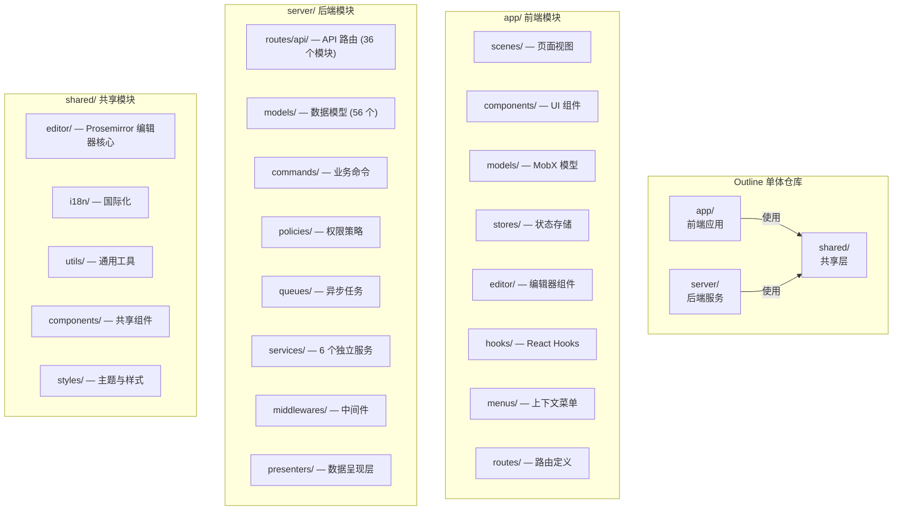
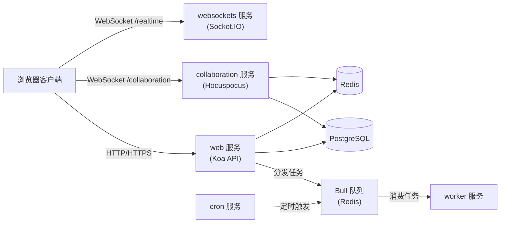
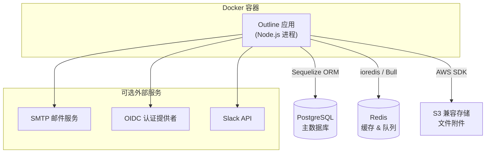

Outline 是一个**开源的团队知识库平台**，定位于为团队提供快速、协作式的文档管理体验。它以 React 和 Node.js 为技术基础，采用 TypeScript 全栈开发，提供类似 Notion / Confluence 的文档协作能力，但以**自托管（Self-hosted）**和**开源可控**作为核心差异化优势。Outline 由 General Outline, Inc. 维护，同时提供托管版本（[getoutline.com](https://www.getoutline.com)）和可自行部署的源代码版本，当前版本为 **1.7.1**，采用 **BSL 1.1（Business Source License）** 许可证，计划于 2030 年转为 Apache 2.0 开源许可。

Sources: [README.md](README.md#L1-L30), [package.json](package.json#L1-L6), [LICENSE](LICENSE#L1-L23)

## 核心价值与定位

Outline 的核心定位可以用一句话概括：**一个为团队而生的快速、协作式知识库**。从产品视角来看，它解决的核心问题是让团队的文档、知识、流程有一个统一的归属地——组织成"集合（Collections）"，支持深层嵌套和文档间互链，便于构建知识网络。典型使用场景包括：团队文档、产品计划与 RFC、销售手册、入职指南、公司政策、会议纪要等。

从技术视角来看，Outline 的差异化优势体现在以下几个层面：

| 维度 | 能力 | 技术实现 |
|------|------|----------|
| **实时协作** | 多人同时编辑同一文档，类似 Google Docs | Hocuspocus + Yjs (CRDT) |
| **富文本编辑** | 基于 Prosemirror 的高度可定制编辑器 | 自定义节点、标记、插件体系 |
| **全文搜索** | 支持多维度过滤的快速检索 | PostgreSQL tsvector / 可插拔搜索引擎 |
| **权限控制** | 集合级别、文档级别的细粒度权限管理 | CanCan 策略系统 |
| **第三方集成** | Slack、GitHub、Google 等 22 个内置插件 | 可扩展插件架构 |
| **多认证方式** | Google、Azure OIDC、Slack、Email Magic Link 等 | Passport.js + 插件化认证提供者 |
| **AI 集成** | 通过 MCP 协议支持 AI 工具访问 | Model Context Protocol 服务器 |
| **国际化** | 支持 30+ 语言 | i18next |

Sources: [server/onboarding/What is Outline.md](server/onboarding/What is Outline.md#L1-L20), [server/services/collaboration.ts](server/services/collaboration.ts#L24-L71)

## 技术栈全景

Outline 是一个**TypeScript 全栈单体仓库（Monorepo）**，前后端共享同一份代码库，通过 `app/`、`server/`、`shared/` 三个顶层目录进行职责划分。以下为完整的技术栈图谱：

```
┌─────────────────────────────────────────────────────────────────┐
│                        Outline 技术栈                           │
├─────────────────────────────────────────────────────────────────┤
│                                                                 │
│  前端 (app/)                   后端 (server/)                   │
│  ├─ React 17                   ├─ Koa (HTTP 框架)               │
│  ├─ MobX (状态管理)            ├─ Sequelize (ORM)               │
│  ├─ Styled Components          ├─ Bull (任务队列)                │
│  ├─ Prosemirror (编辑器)       ├─ Passport.js (认证)            │
│  ├─ React Router 5             ├─ Hocuspocus (协作服务器)        │
│  ├─ Vite (构建工具)            ├─ Socket.IO (实时通信)           │
│  └─ KBar (命令面板)            └─ MCP SDK (AI 集成)             │
│                                                                 │
│  共享层 (shared/)               数据层                          │
│  ├─ Prosemirror 编辑器核心      ├─ PostgreSQL (主数据库)         │
│  ├─ i18n 国际化配置             ├─ Redis (缓存/会话/队列)        │
│  ├─ 通用工具函数                └─ S3 兼容存储 (文件附件)        │
│  └─ 共享类型与验证                                                │
│                                                                 │
└─────────────────────────────────────────────────────────────────┘
```

Sources: [docs/ARCHITECTURE.md](docs/ARCHITECTURE.md#L1-L69), [package.json](package.json#L54-L275)

## Package.json 分析
这份 `package.json` 文件属于 **Outline**（一个开源的团队知识库平台）。由于它是一个全栈的单体仓库（Monorepo），这份文件集中管理了前端、后端以及共享代码的所有依赖和运行脚本。

以下是对该文件内容和关键点的详细拆解：

### 1. 基础信息与许可协议 (Metadata & License)

* **`"name": "outline"` 和 `"version": "1.7.1"**`：明确了项目名称和当前版本。
* **`"private": true`**：防止该项目被意外发布到 npm 公共仓库，因为它是一个应用而不是一个库。
* **`"license": "Business Source License 1.1"`**：这是一个非常关键的协议（BSL 1.1）。它意味着代码是公开的，你可以免费用于内部部署和开发，但在一定条件下（通常是商业化竞争）会受限。根据官方计划，Outline 往往会在几年后将旧版本的 BSL 协议转为完全开源的 Apache 2.0。

### 2. 核心技术栈分析 (`dependencies`)

通过依赖列表，我们可以清晰地看出项目的全栈技术架构：

* **前端生态 (React + MobX)：**
* 使用了较老的稳定版 `react@17.0.2` 和 `react-router-dom@5.3.4`。
* 状态管理没有使用 Redux，而是使用了响应式的 `mobx` 和 `mobx-react`。
* UI 样式库使用了 `styled-components`，并大量集成了 `@radix-ui/*` 提供的无头（Headless）无障碍组件。


* **后端生态 (Node.js + Koa)：**
* 基于 `koa` 及其生态（`koa-router`, `koa-body` 等）构建后端 API。
* 数据库 ORM 使用了 `sequelize` 和 `sequelize-typescript`，底层连接 PostgreSQL (`pg`)。
* 任务队列使用了 `bull`，配合 `ioredis` 操作 Redis。
* 身份认证依赖 `passport` 以及多种 OAuth 策略（如 Google, Slack 等）。


* **核心亮点：富文本与实时协作：**
* **编辑器：** 大量使用了 `prosemirror-*` 系列包。Prosemirror 是目前构建复杂、可定制化富文本编辑器的行业标准。
* **实时协作：** 使用了 `yjs`（基于 CRDT 算法的共享类型库）和 `@hocuspocus/server`（用于将 Yjs 与 WebSocket 结合的协作后端），实现了类似 Google Docs 的多人实时协同编辑。


* **其他关键集成：**
* AWS S3 存储 (`@aws-sdk/client-s3`) 用于附件上传。
* 集成 `socket.io` 处理普通的实时双向通信。
* `zod` 用于强类型的数据校验。


### 3. 工程化与构建脚本 (`scripts`)

项目通过 `scripts` 定义了复杂的开发和部署流程，体现了 Monorepo 的协作模式：

* **开发环境 (`dev` 系列)：** * `dev:watch` 通过 `concurrently` 同时启动后端 (`dev:backend`) 和前端 (`vite:dev`)。
* 后端使用了 `nodemon` 监听文件变化，并支持多服务架构启动（`--services=cron,collaboration,websockets...`），说明后端是微服务友好的结构。


* **构建流程 (`build` 系列)：**
* 前端使用现代且极速的 `vite:build` 进行打包（实际底层引擎配置了 `rolldown-vite`）。
* 支持国际化编译 (`build:i18n`)，提取散落在 `shared,app,server,plugins` 目录中的 `i18next` 翻译。


* **数据库管理 (`db:*`)：** 封装了标准的 Sequelize 迁移命令（建表、迁移、回滚）。
* **质量保证：**
* `lint`: 使用了极速的 Rust 编写的 linter `oxlint` 替代传统的 ESLint。
* `format`: 使用 `prettier` 保证代码风格一致。
* `test`: 统一使用 `vitest` 进行测试，并区分了 `test:app`, `test:shared`, `test:server` 等不同环境。


### 4. 运行环境限制

* **`"engines": { "node": ">=20.12 <21 || 22 || 24" }`**：对 Node.js 版本有极其严格的要求，强制要求使用较新的 LTS 版本（Node 20, 22, 或 24），且排除了某些不稳定的中间版本（如 21）。
* **`"packageManager": "yarn@4.11.0"`**：指定了使用 Yarn Berry (v4) 作为包管理器，这通常配合 Corepack 使用，确保所有开发者使用完全一致的包管理工具和解析策略。

### 5. 版本锁定策略 (`resolutions`)

使用 `resolutions` 强制覆盖了底层依赖的版本（例如统一锁定 `@types/react` 为 `17.0.91`，升级特定的 `zod` 或 `lodash` 版本），这通常是为了解决依赖冲突（Dependency Hell）或修复底层包的紧急安全漏洞。

### 总结

这是一个**非常典型的现代化、企业级 TypeScript 单体仓库**。它不仅融合了大量前沿工具（Vite, Vitest, Oxlint, Yarn v4），还展示了构建一个复杂的协同办公软件（涉及富文本 CRDT、多种中间件调度、严格的数据模型）所需的庞大技术支撑。

## 仓库结构与三大模块

Outline 的代码库围绕三个核心目录组织，每个目录承担明确的职责边界：



**`app/` — 前端应用**：基于 React 17 构建的单页应用，使用 MobX 管理客户端状态。核心组织模式为 **Scenes（场景）→ Components（组件）→ Stores（存储）→ Models（模型）**。场景代表完整页面视图，组件是可复用的 UI 单元，存储管理数据集合与 API 调用，模型则定义了客户端侧的数据结构与可观察状态。

**`server/` — 后端服务**：基于 Koa 框架的 Node.js 服务端，使用 Sequelize 作为 ORM 操作 PostgreSQL。核心设计模式包括：**Commands（命令模式）** 封装复杂业务逻辑、**Policies（策略模式）** 基于 CanCan 实现授权、**Presenters（呈现器）** 负责模型到 API 响应的序列化转换、**Queues（队列）** 基于 Bull 处理异步任务。

**`shared/` — 共享层**：前后端共用的代码，主要包含 Prosemirror 编辑器的核心定义（节点、标记、规则等）、国际化配置与翻译文件、通用工具函数以及共享类型定义。这一层的存在减少了前后端的重复代码，确保了编辑器行为的一致性。

Sources: [docs/ARCHITECTURE.md](docs/ARCHITECTURE.md#L1-L69), [app/index.tsx](app/index.tsx#L57-L93)

## 后端六大服务

Outline 的后端并非单一进程，而是拆分为 **6 个可独立部署的服务**，通过环境变量 `SERVICES` 或 CLI 参数 `--services` 选择启动哪些服务。这种设计允许在生产环境中根据负载需求灵活扩展。

| 服务 | 职责 | 必需性 |
|------|------|--------|
| **web** | 主 Web 服务器，托管前端应用与 API 路由 | ✅ 至少一个进程 |
| **worker** | 异步任务处理器，消费 Bull 队列任务 | ✅ 至少一个进程 |
| **collaboration** | 实时协作编辑服务器，基于 Hocuspocus | 可独立部署 |
| **websockets** | WebSocket 服务器，前后端实时通信 | 可独立部署 |
| **cron** | 定时任务调度器 | 可选 |
| **admin** | 开发环境队列监控面板（`/admin`） | 仅开发环境 |

默认的 Docker 容器会启动所有生产服务。在水平扩展场景下，可以将 `collaboration` 和 `websockets` 部署到独立节点，通过 `COLLABORATION_URL` 环境变量指定公开访问地址。



Sources: [server/services/index.ts](server/services/index.ts#L1-L16), [docs/SERVICES.md](docs/SERVICES.md#L1-L46), [server/services/collaboration.ts](server/services/collaboration.ts#L24-L71)

## 核心数据模型

Outline 的数据层围绕 **团队（Team）→ 集合（Collection）→ 文档（Document）** 三级层次结构组织。集合是文档的顶层容器，文档支持无限嵌套形成树形结构。以下是核心数据模型及其关系概览：

```
Team（团队）
 ├── Collection（集合）── 权限控制的基本单元
 │    ├── Document（文档）── 核心内容实体
 │    │    ├── Comment（评论）
 │    │    ├── Revision（修订版本）
 │    │    ├── Reaction（表情反应）
 │    │    └── View（浏览记录）
 │    └── GroupMembership（组权限）
 │
 ├── User（用户）
 │    ├── UserAuthentication（认证信息）
 │    └── UserMembership（文档级权限）
 │
 ├── Group（用户组）
 │    └── GroupUser（组成员）
 │
 ├── Integration（第三方集成）
 ├── Share（分享链接）
 ├── Notification（通知）
 ├── Star（收藏）
 ├── Pin（置顶）
 ├── Subscription（订阅）
 └── WebhookSubscription（Webhook 订阅）
```

后端共有 **56 个 Sequelize 模型文件**，覆盖了从核心业务实体（Document、Collection、User）到辅助功能（Notification、Reaction、ShareSubscription）的完整数据域。前端则有对应的 **36 个 MobX Store**，通过 API 与后端同步状态。模型之间的关系通过 Sequelize 装饰器（`@BelongsTo`、`@HasMany`、`@BelongsToMany`）声明式定义。

Sources: [server/models/Document.ts](server/models/Document.ts#L1-L60), [server/models/Collection.ts](server/models/Collection.ts#L1-L60), [server/routes/api/index.ts](server/routes/api/index.ts#L88-L122)

## 插件系统与内置插件

Outline 采用**可扩展的插件架构**，通过 `PluginManager` 统一管理插件的注册与生命周期。插件可以注册以下类型的 Hook：API 路由、认证提供者、搜索提供者、事件处理器、异步任务、邮件模板、链接展开器、用户组同步器等。

当前仓库内置了 **22 个插件**，按功能可分为以下几类：

| 类别 | 插件 | 说明 |
|------|------|------|
| **认证** | Google、Azure、OIDC、Slack、Discord、Email、Passkeys | 7 种认证方式 |
| **第三方集成** | Slack、GitHub、GitLab、Linear、Figma、Notion | 链接展开、数据导入 |
| **搜索** | PostgreSQL Search | 基于 tsvector 的全文搜索 |
| **存储** | Storage (S3) | 文件存储后端 |
| **分析** | Google Analytics、Matomo、Umami | 网站分析集成 |
| **自动化** | Webhooks、Zapier | 事件驱动的自动化 |
| **编辑器** | Diagrams.net | 嵌入式图表编辑 |
| **邮件** | Email | 邮件发送服务 |

每个插件通过 `plugin.json` 声明元数据（ID、名称、优先级、描述），服务端插件提供具体的功能实现，客户端插件可注册 UI 组件。

Sources: [server/utils/PluginManager.ts](server/utils/PluginManager.ts#L1-L55), [plugins/](plugins/)

## API 架构与请求处理

Outline 的 API 层基于 **Koa + koa-router** 构建，采用模块化的路由组织方式。后端共有 **36 个 API 路由模块**，每个模块遵循统一的目录结构：`index.ts`（路由注册入口）、`schema.ts`（请求参数验证定义，使用 Zod）、`*.ts`（路由处理器）、`*.test.ts`（测试）。

请求从客户端到达后端后，依次经过以下中间件链处理：

```
请求 → koa-body（请求体解析）→ coalesceBody → userAgent → requestTracer
     → apiResponse → apiErrorHandler → editor → apiContext → verifyCSRFToken
     → authentication（认证）→ validate（参数验证）→ 路由处理器 → 响应
```

这种分层设计确保了每一层职责单一：安全层（CSRF、Helmet）→ 认证层（Passport.js）→ 上下文层（请求追踪、团队隔离）→ 业务层（路由处理器）。数据从数据库模型到 API 响应的转换则由 **Presenters（呈现器）** 负责，实现了后端内部表示与对外 API 契约的解耦。

Sources: [server/routes/api/index.ts](server/routes/api/index.ts#L56-L145), [server/middlewares/authentication.ts](server/middlewares/authentication.ts#L1-L10)

## 部署与运维基础

Outline 的部署模型以 **Docker 容器化**为核心，对外依赖两个基础服务：**PostgreSQL**（主数据库）和 **Redis**（缓存、会话、队列）。项目提供了 `docker-compose.yml` 作为本地开发的基础设施模板。



运行环境要求 **Node.js ≥ 20.12**（支持 20、22、24 三个大版本），使用 **Yarn 4.11** 作为包管理器。前端构建使用 **Vite**（实际为 rolldown-vite），后端 TypeScript 编译使用 **Babel + SWC**。测试框架为 **Vitest**，代码质量通过 **Oxlint**（替代 ESLint）和 **Prettier** 保障。

Sources: [Dockerfile](Dockerfile#L1-L48), [docker-compose.yml](docker-compose.yml#L1-L16), [package.json](package.json#L44-L47), [Makefile](Makefile#L1-L29)

## 推荐阅读路径

作为 Outline 项目的入门指南，本文档为你建立了整体认知框架。接下来，建议按照以下顺序深入了解各个技术维度：

1. **搭建开发环境**：[快速开始：本地开发环境搭建与运行](2-kuai-su-kai-shi-ben-di-kai-fa-huan-jing-da-jian-yu-yun-xing) — 亲手运行项目，获得第一手体感
2. **理解架构全景**：[项目整体架构：前后端与共享层的协作关系](3-xiang-mu-zheng-ti-jia-gou-qian-hou-duan-yu-gong-xiang-ceng-de-xie-zuo-guan-xi) — 深入理解三大模块如何协同工作
3. **前端入门**：[React 应用结构：场景（Scenes）、组件与路由体系](4-react-ying-yong-jie-gou-chang-jing-scenes-zu-jian-yu-lu-you-ti-xi) — 了解前端代码的组织模式
4. **后端入门**：[API 路由与控制器：请求处理流程与验证机制](9-api-lu-you-yu-kong-zhi-qi-qing-qiu-chu-li-liu-cheng-yu-yan-zheng-ji-zhi) — 掌握后端请求处理全链路