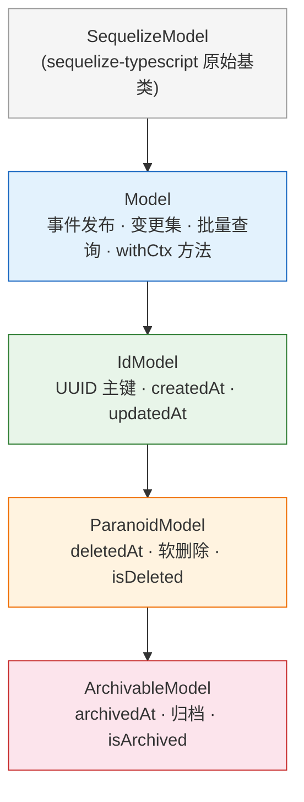
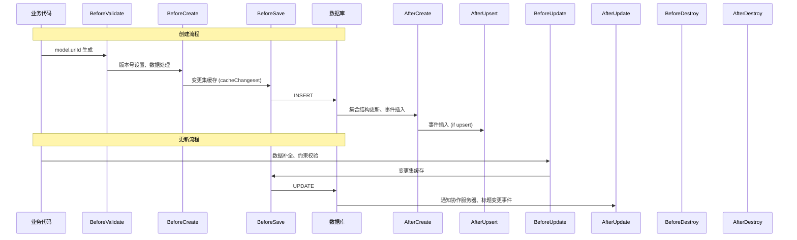
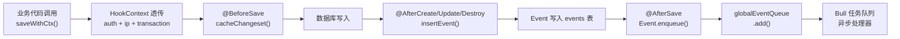

Outline 后端的数据持久层构建在 **Sequelize** ORM 之上，并通过 **sequelize-typescript** 装饰器语法实现声明式模型定义。该层不仅仅是简单的字段映射——它在基类中内置了**事件自动发布**、**变更集追踪**、**上下文感知操作**等横切关注点，使业务模型本身成为系统事件流的源头。理解这一层的设计，是掌握后端命令模式、权限策略、异步队列等上游模块的前提。

Sources: [Model.ts](server/models/base/Model.ts#L1-L484), [database.ts](server/storage/database.ts#L1-L284)

## 模型继承体系：四层基类架构

Outline 的 40+ 业务模型并非直接继承 Sequelize 的原始 `Model`，而是沿一条精心设计的继承链逐层叠加能力。每个层级解决一个特定的横切关注点，形成一个**从通用到具体**的能力累积管道。



| 基类 | 核心职责 | 提供的字段/方法 | 继承此基类的典型模型 |
|---|---|---|---|
| **Model** | 事件发布、变更集追踪、上下文传递 | `saveWithCtx`, `changeset`, `findAllInBatches`, `insertEvent` | `AuthenticationProvider`, `GroupUser`, `Notification`, `SearchQuery` |
| **IdModel** | 主键与时间戳标准化 | `id`(UUIDv4), `createdAt`, `updatedAt` | `Event`, `Pin`, `Star`, `View`, `ApiKey`, `Share` |
| **ParanoidModel** | 软删除支持 | `deletedAt`, `isDeleted` | `User`, `Team`, `Collection`, `Document`(间接), `Group`, `Comment` |
| **ArchivableModel** | 归档语义（在软删除基础上） | `archivedAt`, `isArchived` | `Document` |

**IdModel** 为所有需要唯一标识的模型提供统一主键方案：UUIDv4 自动生成、`createdAt`/`updatedAt` 由 Sequelize 自动管理。这意味着整个系统中任何可寻址实体都共享相同的 ID 格式，简化了跨模型引用和通用工具函数的设计。

**ParanoidModel** 通过 Sequelize 的 paranoid 模式实现软删除：删除操作不会真正移除数据库行，而是设置 `deletedAt` 时间戳，后续查询默认自动排除已删除记录。这一机制保护了知识库中文档、用户、团队等核心实体的数据完整性，使"恢复"操作成为可能。

Sources: [IdModel.ts](server/models/base/IdModel.ts#L1-L31), [ParanoidModel.ts](server/models/base/ParanoidModel.ts#L1-L23), [ArchivableModel.ts](server/models/base/ArchivableModel.ts#L1-L26)

## 核心基类 Model：事件驱动架构的基石

`Model` 基类是整个模型体系中最关键的抽象层。它在 Sequelize 生命周期钩子中植入了**自动事件生成**机制——任何通过 `withCtx` 系列方法执行的模型变更都会自动记录到 `events` 表，并推送到异步任务队列。

### 上下文感知操作：`withCtx` 方法族

传统 Sequelize 操作（`model.save()`、`model.destroy()`）不携带请求上下文信息。Outline 通过一组 `withCtx` 方法将 API 请求的认证信息、事务、IP 地址等上下文透传到生命周期钩子中：

```typescript
// 实例方法——在已有模型实例上操作
model.saveWithCtx(ctx, options?, eventOpts?)
model.updateWithCtx(ctx, keys, eventOpts?)
model.destroyWithCtx(ctx, eventOpts?)
model.restoreWithCtx(ctx, eventOpts?)

// 静态方法——创建新记录
Model.createWithCtx(ctx, values?, eventOpts?, createOpts?)
Model.findOrCreateWithCtx(ctx, options, eventOpts?)
```

这些方法内部构造一个 `HookContext` 对象，将 `ctx.context`（包含 `auth`、`ip`、`transaction`）和 `event` 配置合并后传递给 Sequelize 原始操作。`eventOpts` 参数允许覆盖默认的事件名称（`name`）和附加数据（`data`），甚至控制是否持久化事件（`persist: false`）或完全跳过发布。

Sources: [Model.ts](server/models/base/Model.ts#L61-L201)

### 生命周期钩子与事件自动生成

基类 `Model` 注册了六个 Sequelize 生命周期钩子，构成一个完整的**变更事件捕获管道**：

| 钩子 | 触发时机 | 生成事件名称 |
|---|---|---|
| `@BeforeSave` | 保存前（创建和更新均触发） | 缓存变更集（不生成事件） |
| `@AfterCreate` | 创建后 | `{namespace}.create` |
| `@AfterUpsert` | 插入或更新后 | `{namespace}.create` |
| `@AfterUpdate` | 更新后 | `{namespace}.update` |
| `@AfterDestroy` | 销毁后 | `{namespace}.delete` |
| `@AfterRestore` | 恢复后 | `{namespace}.create` |

其中 `@BeforeSave` 钩子调用 `cacheChangeset()` 记录即将变更的字段及其先前值。后续的 After 钩子通过 `insertEvent()` 将变更集连同模型 ID、关联实体 ID、操作者信息等写入 `events` 表。事件名称的 `{namespace}` 部分取自模型的 `eventNamespace` 静态属性或默认的表名，形成如 `documents.create`、`users.update` 这样的标准格式。

Sources: [Model.ts](server/models/base/Model.ts#L204-L337)

### 变更集追踪：细粒度的字段级差异

`changeset` 属性是基类 Model 提供的核心能力之一，它在模型保存前捕获**哪些字段发生了变化以及变化前后的值**：

```typescript
team.name = "New Name";
team.changeset;
// => { attributes: { name: "New Name" }, previous: { name: "Old Name" } }
```

变更集的实现有几个精巧之处：它自动过滤掉虚拟字段（`DataTypes.VIRTUAL`）和二进制大对象字段（`DataTypes.BLOB`），避免无意义的噪声；对于对象类型的字段，它执行**浅层差异比较**而非整体替换，只记录实际变化的子键；通过 `@SkipChangeset` 装饰器标记的字段（如 `state`、`content`、`popularityScore`）会被排除出变更集，防止大型协作状态或频繁更新的计数器污染审计记录。

Sources: [Model.ts](server/models/base/Model.ts#L381-L481), [Changeset.ts](server/models/decorators/Changeset.ts#L1-L24)

### 批量查询：`findAllInBatches`

当需要处理大量数据（如数据迁移、批量通知）时，直接 `findAll()` 会导致内存溢出。基类提供了 `findAllInBatches` 静态方法，自动按批次游标式查询并回调处理：

```typescript
await User.findAllInBatches<User>(
  { where: { teamId }, batchLimit: 100, totalLimit: 500 },
  async (batch, query) => { /* 处理每批数据 */ }
);
```

该方法支持 `batchLimit`（每批大小）和 `totalLimit`（总处理上限），确保在可控内存消耗下完成大规模数据操作。

Sources: [Model.ts](server/models/base/Model.ts#L346-L374)

## 模型定义范式：声明式装饰器驱动

Outline 的每个业务模型都遵循统一的定义范式，以装饰器声明字段、关联、验证和钩子。以 `Document` 模型为例，这一范式的核心要素包括：

### 1. 类装饰器：表映射与兼容修正

```typescript
@DefaultScope(() => ({ ... }))
@Scopes(() => ({ ... }))
@Table({ tableName: "documents", modelName: "document" })
@Fix
class Document extends ArchivableModel<...> { ... }
```

- **`@Table`**：映射到数据库表名和 Sequelize 内部模型名。
- **`@DefaultScope` / `@Scopes`**：定义默认查询范围和命名查询范围。
- **`@Fix`**：一个关键的兼容性装饰器，解决 babel 与 TypeScript 在 sequelize-typescript 中的属性描述符冲突——它为每个 `rawAttribute` 和 `association` 动态生成 `getter/setter`，确保装饰器属性（如 `@Encrypted`）能正确工作。

Sources: [Document.ts](server/models/Document.ts#L100-L275), [Fix.ts](server/models/decorators/Fix.ts#L1-L71)

### 2. 字段定义与验证

```typescript
@Length({ max: DocumentValidation.maxTitleLength, msg: "..." })
@Column
title: string;

@Default(false)
@Column
fullWidth: boolean;

@Column(DataType.ARRAY(DataType.UUID))
collaboratorIds: string[] = [];

@Column(DataType.BLOB)
@SkipChangeset
state?: Uint8Array | null;
```

字段通过装饰器链定义其类型、默认值和验证规则。常见的验证装饰器包括 `@IsEmail`、`@IsIP`、`@IsDate`、`@IsNumeric`、`@AllowNull` 等，以及 Outline 自定义的验证器如 `@IsHexColor`、`@Length`（Unicode 字符计数）、`@NotContainsUrl`、`@IsFQDN`。`@SkipChangeset` 装饰器将字段排除出变更集追踪，常用于大型字段（如文档内容、协作状态）或高频更新字段。

Sources: [Document.ts](server/models/Document.ts#L276-L394), [Length.ts](server/models/validators/Length.ts#L1-L28), [IsHexColor.ts](server/models/validators/IsHexColor.ts#L1-L18)

### 3. 关联声明

```typescript
@BelongsTo(() => Collection, "collectionId")
collection: Collection | null;

@ForeignKey(() => Collection)
@Column(DataType.UUID)
collectionId?: string | null;

@HasMany(() => Revision)
revisions: Revision[];

@BelongsToMany(() => User, () => UserMembership)
users: User[];

@CounterCache(() => Comment, {
  as: "unresolvedComments",
  foreignKey: "documentId",
  where: { resolvedAt: { [Op.is]: null } },
})
commentCount: Promise<number>;
```

关联通过 `@BelongsTo`、`@HasMany`、`@BelongsToMany` 等装饰器声明，外键通过 `@ForeignKey` + `@Column` 组合定义。`@CounterCache` 是一个特殊的关联装饰器，它为模型添加一个**基于 Redis 缓存的计数器属性**，自动在关联模型创建/删除时失效缓存。

Sources: [Document.ts](server/models/Document.ts#L603-L688)

### 4. 查询范围（Scopes）

Outline 大量使用 Sequelize 的 Scope 机制来封装复杂的预加载逻辑。`Document` 模型定义了多个参数化 Scope：

| Scope 名称 | 用途 |
|---|---|
| `defaultScope` | 默认加载 `createdBy`/`updatedBy` 用户，仅查询已发布文档 |
| `withCollection` | 预加载所属集合 |
| `withViews(userId)` | 预加载当前用户的阅读记录 |
| `withMembership(userId)` | 预加载集合权限和文档级权限（含组权限展开） |
| `withAllMemberships` | 预加载所有权限记录，用于管理操作 |

这种设计使得复杂的关联预加载逻辑从业务代码中解耦，通过 `Document.scope(['withMembership', userId]).findByPk(id)` 即可获得完整权限上下文的文档实例。

Sources: [Document.ts](server/models/Document.ts#L100-L269)

## 生命周期钩子的实战模式

生命周期钩子是 Outline 模型体系中最具业务表达力的机制。不同模型根据自身需求注册了丰富的钩子，涵盖数据补全、约束校验、级联操作、缓存失效等场景。

### 钩子执行顺序总览



Sources: [Model.ts](server/models/base/Model.ts#L204-L248)

### Document 模型钩子：复杂业务规则的教科书

Document 模型拥有最丰富的钩子集合，展示了如何利用生命周期管理知识库文档的完整性约束：

| 钩子 | 功能描述 |
|---|---|
| `@BeforeValidate` | 自动生成 `urlId`（10位随机 URL 标识符） |
| `@BeforeCreate` | 设置文档版本号，执行 `processUpdate` 数据补全 |
| `@BeforeSave` | 标题/图标变更时更新所属 Collection 的文档结构树 |
| `@BeforeUpdate` (×2) | ① `processUpdate`：标题历史记录、协作者追加、版本号递增 ② `checkParentDocument`：检测无限循环嵌套 |
| `@AfterCreate` | 将新文档添加到 Collection 的结构树中 |
| `@AfterUpdate` (×2) | ① 发布 `title_change` 事件 ② 通知协作服务器（Hocuspocus）文档状态已更新 |

其中 `checkParentDocument` 是一个精妙的防御性钩子：它递归查询文档的所有子文档 ID，确保父文档的变更不会引入循环引用。`notifyCollaborationServer` 钩子展示了**事务后回调**模式——通过 `transaction.afterCommit()` 将协作服务器的通知推迟到事务提交成功之后，避免读到未提交数据。

Sources: [Document.ts](server/models/Document.ts#L443-L601)

### User 模型钩子：安全与数据一致性守护

User 模型的钩子专注于**账户安全约束**和**数据清理**：

- **`@BeforeDestroy` × 3**：依次检查是否为团队最后一个用户、最后一个管理员，最后移除个人身份信息（email、name、avatar 设为 null/"Unknown"）。
- **`@BeforeCreate`**：为每个新用户生成随机的 JWT 密钥（`jwtSecret`），用于撤销令牌等安全操作。
- **`@BeforeUpdate`**：角色降级时检查团队至少保留一个管理员。
- **`@AfterUpdate` × 3**：角色降级时将用户的所有集合权限降为只读；用户暂停/恢复时失效相关组的成员计数缓存；头像变更时调度旧附件的异步删除。

Sources: [User.ts](server/models/User.ts#L729-L923)

### Collection 模型钩子：结构完整性与缓存管理

Collection 模型在钩子中维护文档结构树的缓存一致性和创建者权限：

- **`@BeforeValidate`**：自动生成 `urlId`。
- **`@BeforeSave`**：将 description 转换为 ProseMirror JSON 格式；`documentStructure` 变更时清除 Redis 缓存。
- **`@AfterSave`**：`documentStructure` 变更后在事务提交后重新写入 Redis 缓存。
- **`@BeforeDestroy` × 2**：检查是否为最后一个集合；将集合下所有未归档文档标记为已删除。
- **`@BeforeCreate`**：计算 fractional index 排序值并处理冲突。
- **`@AfterCreate`**：自动为创建者添加集合的 Admin 权限（`UserMembership`）。
- **`@BeforeUpdate` × 2**：索引冲突处理；权限或共享设置变更时发布 `permission_changed` 事件。

Sources: [Collection.ts](server/models/Collection.ts#L340-L498)

## 装饰器系统：横切关注点的优雅封装

Outline 为 Sequelize 模型开发了一套专用装饰器，将横切关注点从业务逻辑中解耦：

### @Fix：Babel/TypeScript 兼容性桥接

`@Fix` 必须应用在每个模型类上。它解决 sequelize-typescript 在 Babel 编译环境下的属性描述符丢失问题——为每个数据库字段和关联动态注入 `getter/setter`，确保其他装饰器（如 `@Encrypted`）能正确拦截属性访问。这是一个底层设施装饰器，开发者通常不需要关心其存在。

Sources: [Fix.ts](server/models/decorators/Fix.ts#L1-L71)

### @Encrypted：数据库字段加密

`@Encrypted` 将数据库列的存储加密，通过 getter/setter 透明地处理加密解密。加密使用服务端 `SECRET_KEY` 环境变量，存储格式为 BLOB。该装饰器**必须**是属性上的第一个装饰器（在 `@Column` 之前），否则会触发 fatal 错误。典型应用场景是 User 模型的 `jwtSecret` 字段。

Sources: [Encrypted.ts](server/models/decorators/Encrypted.ts#L1-L76)

### @CounterCache：基于 Redis 的关联计数

`@CounterCache` 为模型添加一个虚拟的计数属性，首次访问时从 Redis 缓存读取或回源到数据库计算。它自动在关联模型的 `afterCreate` 和 `afterDestroy` 钩子中注册缓存失效逻辑，失效操作在事务提交后执行以保证一致性。Document 模型使用它追踪未解决评论数（`commentCount`），Group 模型使用它追踪成员数（`members`）。

Sources: [CounterCache.ts](server/models/decorators/CounterCache.ts#L1-L109)

### @SkipChangeset：变更集排除

标记字段排除出变更集追踪。适用于大型字段（文档内容、协作状态）、频繁更新字段（热度分数、最后活跃时间）等不应出现在审计日志中的属性。

Sources: [Changeset.ts](server/models/decorators/Changeset.ts#L1-L24)

## 事件系统：从模型变更到异步处理管道

模型层的核心产出之一是 **Event 记录**。整个流程形成一个清晰的管道：



`Event` 模型本身也有一个关键钩子：`@AfterSave` 中的 `enqueue()` 方法将新创建的 Event 推入 `globalEventQueue`。如果存在事务，推入操作会延迟到事务提交后执行——这保证了事件处理器读取到的是已提交的数据。这种**事务后延迟分发**模式贯穿整个模型层。

Event 模型还提供了 `schedule()` 静态方法，用于在不持久化到数据库的情况下直接将事件推入队列——适用于不需要审计记录但需要触发异步处理的场景。

Sources: [Event.ts](server/models/Event.ts#L1-L198)

## 数据库初始化与模型注册

Outline 的 Sequelize 实例通过 `createDatabaseInstance()` 工厂函数创建。所有模型通过 `import * as models from "../models"` 批量注册到 Sequelize 实例中（`models: Object.values(input)`）。实例创建时还注册了全局钩子：在每次 `beforeFind` / `beforeCount` 时检查 HTTP 请求 socket 是否已销毁（客户端断开），如果是则抛出 `ClientClosedRequestError` 以避免浪费数据库资源。

Sources: [database.ts](server/storage/database.ts#L48-L161), [index.ts](server/models/index.ts#L1-L83)

## 模型全览与继承关系

下表列出 Outline 中所有业务模型及其基类选择和关键特征：

| 基类 | 模型 | 关键特征 |
|---|---|---|
| **Model** | `AuthenticationProvider`, `GroupUser`, `Notification`, `SearchQuery` | 无标准主键或使用复合策略 |
| **IdModel** | `Event`, `Pin`, `Star`, `View`, `Share`, `ApiKey`, `Reaction`, `Relationship`, `Attachment`, `WebhookDelivery`, `TeamDomain`, `UserAuthentication`, `UserPasskey`, `UserMembership`, `ShareSubscription`, `DocumentInsight`, `Emoji`, `ImportTask`, `OAuthAuthorizationCode`, `AccessRequest` | 标准 UUID 主键，无软删除 |
| **ParanoidModel** | `User`, `Team`, `Collection`, `Group`, `Comment`, `Revision`, `Subscription`, `Template`, `WebhookSubscription`, `FileOperation`, `Integration`, `ApiKey`, `GroupMembership`, `Import`, `OAuthAuthentication`, `OAuthClient` | 软删除支持 |
| **ArchivableModel** | `Document` | 软删除 + 归档双层状态 |

Sources: [index.ts](server/models/index.ts#L1-L83), [Document.ts](server/models/Document.ts#L272-L274), [User.ts](server/models/User.ts#L136-L139), [Event.ts](server/models/Event.ts#L33-L36)

## 设计理念总结

Outline 的模型层体现了几个核心设计决策：

**事件源模型（Event Sourcing Lite）**：基类 Model 将所有通过 `withCtx` 执行的变更自动转化为 Event 记录，使模型层成为系统事件流的唯一源头。业务代码无需手动创建事件，降低了遗漏的风险。

**事务感知的一致性保障**：大量钩子使用 `transaction.afterCommit()` 模式，确保缓存失效、协作通知等副作用在数据真正持久化后才执行，避免中间状态泄露。

**声明式优于命令式**：通过装饰器声明字段类型、验证规则、关联关系和生命周期钩子，使模型定义本身就是一份可读的"数据契约"，减少散落在业务代码中的隐式逻辑。

在继续深入后端其他模块时，建议按以下顺序阅读以获得连贯的理解：
- [权限与授权：基于 CanCan 的策略（Policies）系统](11-quan-xian-yu-shou-quan-ji-yu-cancan-de-ce-lue-policies-xi-tong) — 理解模型层的关联预加载如何支撑权限判断
- [命令模式（Commands）：复杂业务逻辑的组织方式](12-ming-ling-mo-shi-commands-fu-za-ye-wu-luo-ji-de-zu-zhi-fang-shi) — 了解 `withCtx` 方法在命令层如何被调用
- [异步任务队列：Bull 队列、事件处理器与定时任务](13-yi-bu-ren-wu-dui-lie-bull-dui-lie-shi-jian-chu-li-qi-yu-ding-shi-ren-wu) — 追踪 Event 从模型层到异步处理的完整链路