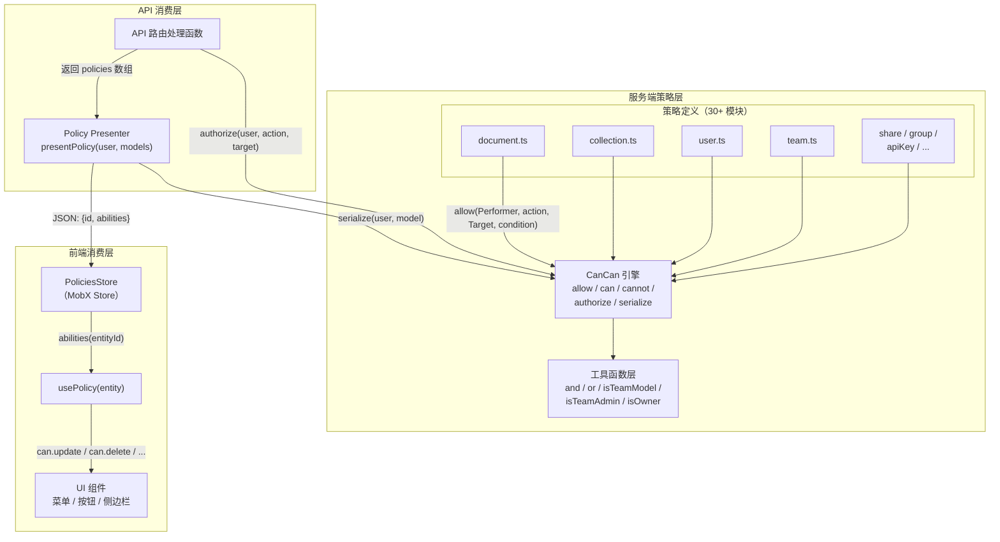

Outline 的权限系统是其安全架构的基石，采用了源自 Ruby on Rails 生态中经典 **CanCan** 库的设计理念，用 TypeScript 重新实现为了一套声明式的授权引擎。该系统围绕"谁可以对什么对象执行什么操作"这一核心问题，构建了一套前后端统一的策略体系——服务端通过 `authorize` 守卫 API 入口，前端通过序列化的 Policy 对象驱动 UI 展示。本文将深入解析这套策略引擎的架构设计、核心 API、条件组合语义、成员资格（Membership）追踪机制，以及前后端协作的完整数据流。

Sources: [cancan.ts](server/policies/cancan.ts#L1-L305), [index.ts](server/policies/index.ts#L1-L34)

## 架构总览：声明式授权引擎

整个策略系统由四个核心层次组成，从底层的授权引擎到上层的策略定义，再到前后端协作的传输与消费层，形成了一条完整的授权数据链路。



**CanCan 引擎**是一个单例对象，它维护一个双层索引 `Map<Performer构造函数, Map<action字符串, Ability[]>>` 来实现高效的权限查找。`allow()` 方法在模块加载时注册能力规则，`can()` 方法在运行时查询匹配的能力并评估条件，而 `authorize()` 方法则在查询结果为"不允许"时抛出 `AuthorizationError`。整个系统的策略定义以副作用形式存在——通过 `import "./document"` 这样的导入语句，在应用启动时将所有策略规则注册到 CanCan 单例中。

Sources: [cancan.ts](server/policies/cancan.ts#L27-L71), [cancan.ts](server/policies/cancan.ts#L240-L278)

## CanCan 核心 API 详解

CanCan 类暴露五个关键方法，构成了授权系统的完整 API 面：

| 方法 | 签名 | 用途 | 使用场景 |
|------|------|------|----------|
| **`allow`** | `(model, actions, targets, condition?)` | 声明"某类主体可以对某类目标执行某些操作" | 策略定义文件 |
| **`can`** | `(performer, action, target, options?)` | 查询"此主体是否可以对此目标执行此操作" | 条件嵌套检查 |
| **`cannot`** | `(performer, action, target, options?)` | `can` 的逻辑取反 | 条件分支 |
| **`authorize`** | `(performer, action, target, options?)` | 断言"可以"，否则抛出 `AuthorizationError` | API 路由守卫 |
| **`serialize`** | `(performer, target)` | 生成目标对象的完整能力映射 | Policy Presenter |

**`allow`** 是整个系统的声明式入口。它接受四个参数：`model`（执行者类型，如 `User`）、`actions`（一个或多个操作名称）、`targets`（目标类型，如 `Document`、`Collection`，或特殊字符串 `"all"`）、以及一个可选的 `condition` 函数。condition 函数接收 `(performer, target, options)` 三个参数，返回 `boolean` 或 `string`（后者用于成员资格追踪，下文详述）。

Sources: [cancan.ts](server/policies/cancan.ts#L36-L71), [cancan.ts](server/policies/cancan.ts#L82-L120), [cancan.ts](server/policies/cancan.ts#L127-L155), [cancan.ts](server/policies/cancan.ts#L182-L191)

### 查找与匹配算法

`can()` 方法的核心逻辑在 `getMatchingAbilities` 私有方法中。它使用双层索引快速定位匹配的能力规则：首先检查 `performer instanceof model`，然后在 action 维度查找精确匹配和 `"manage"` 通配符。目标匹配支持三种模式——目标类型构造函数的 `instanceof` 检查、严格相等比较、以及特殊字符串 `"all"` 的全局匹配。

```typescript
// cancan.ts 核心匹配逻辑简化
for (const [model, actionMap] of this.abilities.entries()) {
  if (!(performer instanceof model)) continue;
  
  // 精确 action 匹配
  const specificAbilities = actionMap.get(action);
  // "manage" 通配符匹配
  const manageAbilities = actionMap.get("manage");
  // 对每个匹配的 ability 检查 target 类型
}
```

当存在多个匹配的能力规则时，`can()` 方法采用**合并策略**——它收集所有条件函数的返回值，将 `string` 类型的返回值（成员资格 ID）聚合成数组，将 `boolean` 类型的返回值合并为"是否存在至少一个 true"。最终结果要么是成员资格 ID 数组，要么是一个布尔值。这种设计使得前端可以精确追踪"是哪条成员资格赋予了这个能力"。

Sources: [cancan.ts](server/policies/cancan.ts#L195-L238), [cancan.ts](server/policies/cancan.ts#L82-L120)

### 序列化机制：从条件到 Policy 对象

`serialize()` 方法是连接前后端的关键桥梁。它遍历所有已注册的能力规则，筛选出"执行者是 `performer` 的类型"且"目标是 `target` 的类型"的所有 action，然后对每个 action 调用 `can()` 方法，生成一个 `{ [action: string]: boolean | string[] }` 映射。这个映射就是前端 Policy 对象的 `abilities` 字段。

Sources: [cancan.ts](server/policies/cancan.ts#L127-L155), [policy.ts](server/presenters/policy.ts#L1-L24)

## 条件组合语义：`and` / `or` 工具函数

策略条件的表达能力依赖于 [utils.ts](server/policies/utils.ts) 中定义的组合子函数。这些函数模仿了逻辑表达式的短路求值语义：

| 函数 | 行为 | 返回值语义 |
|------|------|-----------|
| `and(...args)` | 所有参数为真才通过 | 返回参数数组（真值）或 `false` |
| `or(...args)` | 任一参数为真即通过 | 返回第一个真值或 `false` |
| `isTeamModel(actor, model)` | 检查 actor 和 model 属于同一团队 | 布尔值 |
| `isOwner(actor, model)` | 检查 actor 是 model 的创建者 | 布尔值 |
| `isTeamAdmin(actor, model)` | 检查 actor 是 model 所属团队的管理员 | 布尔值 |
| `isTeamMember(actor, model)` | 检查 actor 是 model 所属团队的成员 | 布尔值 |
| `isTeamMutable(actor)` | 检查团队是否可变更（当前始终为 true） | 布尔值 |
| `isGroupAdmin(actor, group)` | 检查 actor 是群组管理员或团队管理员 | 布尔值 |

`and` 函数的特殊之处在于它返回的是**参数数组**而非简单的 `true`。这意味着当 `and` 内部包含成员资格 ID（字符串）时，该 ID 可以被正确地向上传递到 `can()` 方法的聚合逻辑中。这种设计使得嵌套的 `and`/`or` 表达式能够透明地携带成员资格追踪信息。

Sources: [utils.ts](server/policies/utils.ts#L1-L146)

## 权限层级体系

Outline 的权限系统建立在三重层级之上，每一层都对用户的操作范围产生约束。

### 用户角色层级

| 角色 | 权限范围 |
|------|----------|
| **Admin** | 全局管理权限：团队设置、用户管理、所有集合的完全控制 |
| **Member** | 标准权限：创建文档、编辑有权限的内容、使用模板 |
| **Viewer** | 只读权限：浏览内容、评论、下载（取决于团队设置） |
| **Guest** | 受限权限：仅能访问通过成员资格明确授权的内容 |

Sources: [types.ts](shared/types.ts#L1-L7)

### 集合权限层级

| 权限 | 值 | 能力范围 |
|------|------|----------|
| **Admin** | `"admin"` | 管理集合设置、导出、归档、删除；文档完全控制 |
| **ReadWrite** | `"read_write"` | 创建/编辑/删除文档；分享文档 |
| **Read** | `"read"` | 仅浏览文档内容、评论、收藏、订阅 |

### 文档权限层级

| 权限 | 值 | 能力范围 |
|------|------|----------|
| **Admin** | `"admin"` | 管理文档用户、归档、移动、重复 |
| **ReadWrite** | `"read_write"` | 编辑内容、移动、恢复 |
| **Read** | `"read"` | 仅浏览、评论、收藏、订阅 |

Sources: [types.ts](shared/types.ts#L214-L224)

## 策略定义实践：以 Document 为例

Document 策略是系统中最为复杂的策略之一，它定义了 20 余种操作的授权规则。以下通过几个典型场景展示策略的编写模式：

### 基础读取权限

```typescript
// 读取权限：同团队 + (成员资格 OR 草稿作者 OR 集合读取权限)
allow(User, "read", Document, (actor, document) =>
  and(
    isTeamModel(actor, document),
    or(
      includesMembership(document, [
        DocumentPermission.Read,
        DocumentPermission.ReadWrite,
        DocumentPermission.Admin,
      ]),
      and(!!document?.isDraft, actor.id === document?.createdById),
      can(actor, "readDocument", document?.collection)
    )
  )
);
```

读取权限的条件链展示了一个常见的模式：首先验证基础约束（同团队），然后用 `or` 组合多个授权来源——直接文档成员资格、草稿作者身份、或来自父集合的继承权限。

### 级联授权：能力之间的引用

策略之间通过 `can()` 调用形成**能力引用链**。例如，文档的 `update` 权限依赖于 `read` 权限，而 `delete` 权限又依赖于 `update` 权限：

```
update → requires read → AND
  (includesMembership([ReadWrite, Admin]) OR can(updateDocument, collection) OR isDraftAuthor)
delete → requires (isTeamModel AND isTeamMutable) AND
  (can(unarchive) OR can(update) OR isDraftAuthorWithoutCollection)
```

这种级联设计确保了权限的**最小特权原则**——一个无法读取文档的用户自然无法编辑它，而编辑权限又是删除和归档的前提。

Sources: [document.ts](server/policies/document.ts#L1-L304)

### 成员资格追踪：`includesMembership` 函数

`includesMembership` 是策略系统中追踪成员资格来源的核心机制。它检查文档或集合上预加载的 `memberships` 和 `groupMemberships` 关联数据，筛选出匹配权限级别的成员资格记录，并返回成员资格 ID 数组而非简单的布尔值：

```typescript
function includesMembership(document, permissions) {
  const permissionSet = new Set(permissions);
  const membershipIds: string[] = [];
  
  for (const membership of document.memberships) {
    if (permissionSet.has(membership.permission)) {
      membershipIds.push(membership.id);  // 返回 ID 而非 true
    }
  }
  for (const membership of document.groupMemberships) {
    if (permissionSet.has(membership.permission)) {
      membershipIds.push(membership.id);
    }
  }
  return membershipIds.length > 0 ? membershipIds : false;
}
```

这种设计使得 `can()` 方法能够精确知道"是哪条成员资格赋予了这个能力"，前端据此可以在成员资格被撤销时正确地更新 UI 状态。

Sources: [document.ts](server/policies/document.ts#L270-L303), [collection.ts](server/policies/collection.ts#L208-L241)

### 预加载要求与 invariant 守卫

成员资格数据不是默认加载的。策略文件使用 `invariant` 断言来确保数据已正确预加载：

```typescript
invariant(
  document.memberships,
  "Development: document memberships should be preloaded, did you forget withMembership scope?"
);
```

这意味着在调用 `authorize` 或 `serialize` 之前，必须通过 `withMembership` scope 加载数据，例如：

```typescript
const document = await Document.findByPk(doc.id, { userId: user.id });
// 此处 document 已包含 memberships 和 groupMemberships
```

Sources: [document.ts](server/policies/document.ts#L278-L285), [Document.ts](server/models/Document.ts#L179-L233)

## API 路由中的授权守卫

在 API 路由处理函数中，`authorize` 是最常见的守卫调用。它采用**断言模式**——如果用户没有权限，则直接抛出 `AuthorizationError`，中间件会将其转化为 HTTP 403 响应：

```typescript
// server/routes/api/documents/documents.ts
authorize(user, "read", document);       // 无权限 → 403
authorize(user, "update", document);     // 无权限 → 403
authorize(user, "updateDocument", collection);  // 集合级权限检查
```

`cannot` 方法则用于条件分支，不抛出异常：

```typescript
isPublic = cannot(user, "read", document);
// 用于决定返回公开版还是私有版内容
```

Sources: [cancan.ts](server/policies/cancan.ts#L182-L191), [documents.ts](server/routes/api/documents/documents.ts#L68)

## 前端 Policy 系统：从序列化到 UI

### Policy 传输

API 响应中通过 `presentPolicies` 函数将序列化的策略数据附加到响应中。几乎所有返回模型数据的 API 端点都会附带 `policies` 数组：

```typescript
// server/presenters/policy.ts
function presentPolicy(user, models) {
  return models.map(model => ({
    id: model.id,                              // 与模型 ID 相同
    abilities: serialize(user, model),          // 能力映射
  }));
}
```

Sources: [policy.ts](server/presenters/policy.ts#L1-L24)

### Policy 模型与 Store

前端的 [Policy 模型](app/models/Policy.ts) 是一个 MobX observable 对象，其 `abilities` 字段直接映射后端序列化结果。`flattenedAbilities` 计算属性将 `string[]` 类型的值统一转换为 `boolean`，简化 UI 消费逻辑：

```typescript
@computed
get flattenedAbilities() {
  const abilities: Record<string, boolean> = {};
  for (const [key, value] of Object.entries(this.abilities)) {
    abilities[key] = Array.isArray(value) ? value.length > 0 : value;
  }
  return abilities;
}
```

[PolicyStore](app/stores/PoliciesStore.ts) 提供了 `abilities(id)` 方法来获取指定模型的扁平化能力映射，以及 `removeForMembership(id)` 方法用于在成员资格被撤销时级联更新所有相关的策略对象。

Sources: [Policy.ts](app/models/Policy.ts#L1-L65), [PoliciesStore.ts](app/stores/PoliciesStore.ts#L1-L63)

### `usePolicy` Hook

[usePolicy](app/hooks/usePolicy.ts) 是前端组件消费策略数据的标准接口。它接收一个模型实例或 ID，返回该模型的扁平化能力映射。如果策略数据尚不存在，它会自动触发 `loadRelations()` 来获取：

```typescript
const can = usePolicy(document);
// can.update → boolean
// can.delete → boolean
// can.share → boolean
```

在 UI 组件中，`can` 对象被用于条件渲染：

```typescript
// 菜单项仅在拥有权限时显示
if (!can.update) return null;
// 按钮状态根据权限调整
<MenuItem visible={can.archive} onClick={handleArchive} />
```

Sources: [usePolicy.ts](app/hooks/usePolicy.ts#L1-L39), [DocumentMenu.tsx](app/menus/DocumentMenu.tsx#L61-L137)

### 成员资格撤销的级联更新

当用户失去某个成员资格（如被移出群组）时，`removeForMembership` 方法遍历所有策略对象，移除引用该成员资格 ID 的能力值。如果某个能力的所有成员资格 ID 都被移除，则该能力变为 `false`：

```typescript
@action
removeForMembership(id: string) {
  this.data.forEach((policy) => {
    Object.keys(policy.abilities).forEach((key) => {
      let can = policy.abilities[key];
      if (Array.isArray(can) && can.includes(id)) {
        can = can.filter((i) => i !== id);
        policy.abilities[key] = can.length === 0 ? false : can;
      }
    });
  });
}
```

Sources: [PoliciesStore.ts](app/stores/PoliciesStore.ts#L22-L47)

## 策略注册表：全部策略模块一览

以下表格列出了 [server/policies/](server/policies/index.ts) 目录中所有已注册的策略模块及其管理的核心操作：

| 策略文件 | 主体模型 | 核心操作 |
|----------|----------|----------|
| `document.ts` | User → Document | read, update, delete, archive, share, move, publish, comment, pin... |
| `collection.ts` | User → Collection | read, readDocument, updateDocument, createDocument, share, update, archive... |
| `user.ts` | User → User | read, update, delete, activate, suspend, promote, demote, invite... |
| `team.ts` | User → Team | read, update, delete, share, createTeam, audit... |
| `share.ts` | User → Share | createShare, listShares, read, update, revoke |
| `group.ts` | User → Group | createGroup, listGroups, read, update, delete |
| `apiKey.ts` | User → ApiKey | createApiKey, listApiKeys, read, update, delete |
| `attachment.ts` | User → Attachment | createAttachment, read, update, delete |
| `comment.ts` | User → Comment | create, update, delete |
| `revision.ts` | User/Draft → Revision | read, restore |
| `template.ts` | User → Template | read, update, delete, create... |
| `pin.ts` | User → Pin | create, update, delete |
| `notification.ts` | User → Notification | read, update |
| `subscription.ts` | User → Subscription | subscribe, unsubscribe |
| `integration.ts` | User → Integration | create, update, delete |
| `webhookSubscription.ts` | User → WebhookSubscription | create, update, delete, list |
| `oauthClient.ts` | User → OAuthClient | create, read, update, delete, list |
| `userMembership.ts` | User → UserMembership | create, update, delete |
| `fileOperation.ts` | User → FileOperation | create, read, update, delete |
| `import.ts` | User → Import | create, read, update, delete |

Sources: [index.ts](server/policies/index.ts#L1-L34)

## 策略编写模式总结

通过分析现有的策略代码，可以提炼出以下编写模式：

**模式一：基础约束 + 多路径授权**

```typescript
allow(User, "action", Target, (actor, target) =>
  and(
    // 基础约束：同团队、团队可变更
    isTeamModel(actor, target),
    isTeamMutable(actor),
    or(
      // 路径1：管理员
      isTeamAdmin(actor, target),
      // 路径2：直接成员资格
      includesMembership(target, [Permission.Admin]),
      // 路径3：所有者
      isOwner(actor, target)
    )
  )
);
```

**模式二：能力引用链**

```typescript
// 高级能力依赖基础能力
allow(User, "delete", Document, (actor, document) =>
  and(
    isTeamModel(actor, document),
    isTeamMutable(actor),
    or(
      can(actor, "update", document),       // 引用 update 能力
      can(actor, "unarchive", document)     // 引用 unarchive 能力
    )
  )
);
```

**模式三：特殊身份快捷路径**

```typescript
allow(User, "read", Collection, (user, collection) => {
  if (!collection || user.teamId !== collection.teamId) return false;
  if (user.isAdmin) return true;    // 管理员快捷通过
  if (collection.isPrivate || user.isGuest) {
    return includesMembership(collection, ...);  // 私有集合需要成员资格
  }
  return true;  // 公开集合对团队成员开放
});
```

Sources: [collection.ts](server/policies/collection.ts#L34-L47), [document.ts](server/policies/document.ts#L174-L185), [user.ts](server/policies/user.ts#L1-L106)

## 与其他系统的关联

策略系统与 Outline 架构中的多个子系统紧密协作：

- **[API 路由与控制器](9-api-lu-you-yu-kong-zhi-qi-qing-qiu-chu-li-liu-cheng-yu-yan-zheng-ji-zhi)**：每个 API 端点通过 `authorize()` 守卫入口，确保只有通过策略检查的请求才能执行业务逻辑。
- **[数据模型层](10-shu-ju-mo-xing-ceng-sequelize-orm-mo-xing-ti-xi-yu-sheng-ming-zhou-qi-gou-zi)**：模型的 `withMembership` scope 为策略检查预加载必要的成员资格数据。
- **[中间件体系](14-zhong-jian-jian-ti-xi-ren-zheng-xian-liu-csrf-yu-qing-qiu-shang-xia-wen)**：认证中间件解析用户身份后，将用户对象注入请求上下文，供策略系统使用。
- **[MobX 状态管理](5-mobx-zhuang-tai-guan-li-mo-xing-models-yu-cun-chu-stores-de-she-ji-mo-shi)**：前端通过 PoliciesStore 和 Policy 模型管理策略数据，实现响应式的 UI 更新。