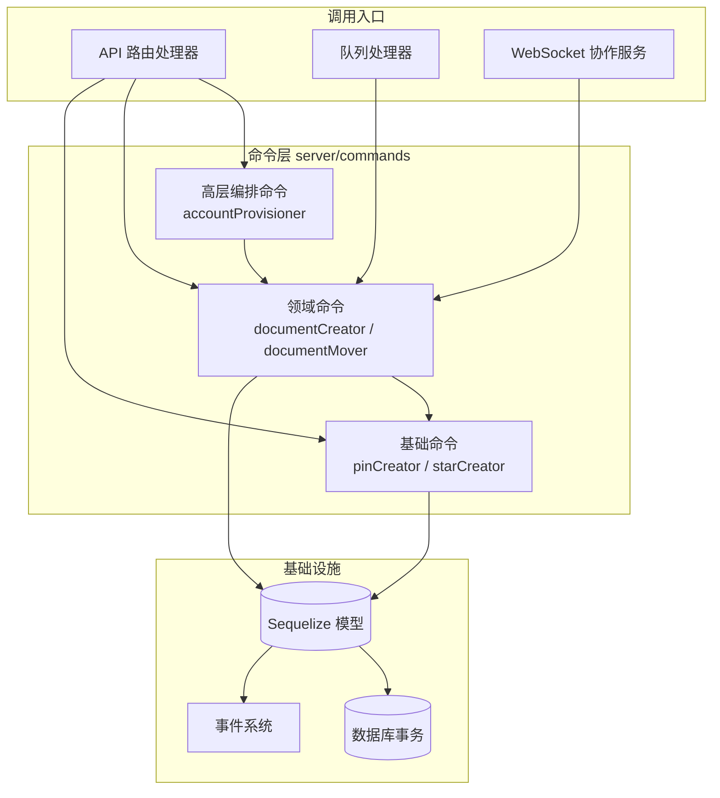
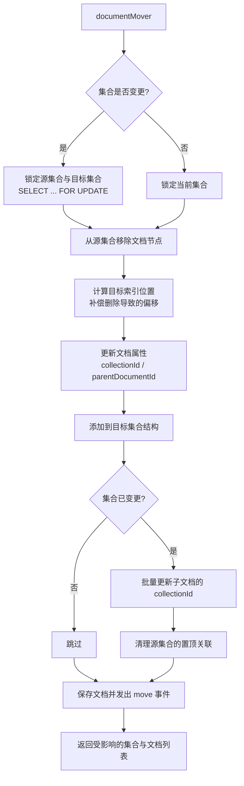
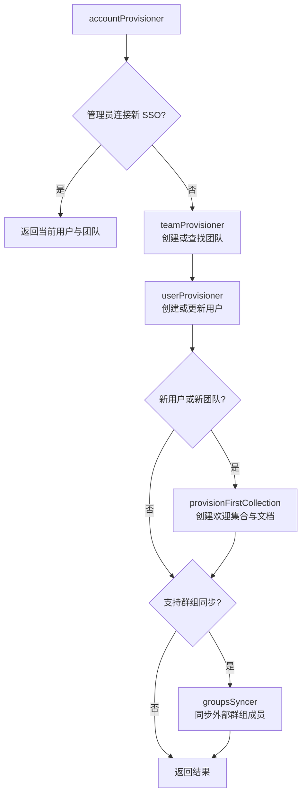

Outline 后端的 `server/commands` 目录承载了整个系统中最核心、最复杂的业务逻辑。这些**命令函数**（Command Functions）是对"写操作"的封装——它们不处理 HTTP 请求解析、不负责参数验证、不做权限判断，而是专注于**纯粹的业务流程编排**：在事务内协调多个模型的创建、更新和删除，触发关联事件，确保数据一致性。理解命令模式是掌握 Outline 后端架构的关键一步。

Sources: [commands/](server/commands)

## 设计动机：为什么需要命令层？

在一个典型的 Web 应用中，业务逻辑往往散落在路由处理器中，导致控制器变得臃肿且难以测试。Outline 采用命令层将**"做什么"**（API 路由负责）与**"怎么做"**（命令函数负责）彻底分离。这种分层带来了三个核心收益：

- **可测试性**：命令函数接受纯参数对象和上下文，不依赖 HTTP 请求对象，可以独立进行单元测试
- **可复用性**：同一个命令可以被 API 路由、队列处理器、协作服务等多种入口调用，无需重复实现
- **可组合性**：高层命令（如 `accountProvisioner`）可以调用底层命令（如 `teamProvisioner`、`userProvisioner`），形成清晰的调用层级



Sources: [commands/](server/commands), [routes/api/documents/documents.ts](server/routes/api/documents/documents.ts#L25-L30), [collaboration/PersistenceExtension.ts](server/collaboration/PersistenceExtension.ts#L130), [queues/processors/RevisionsProcessor.ts](server/queues/processors/RevisionsProcessor.ts#L53)

## 命令分类与职责一览

`server/commands` 目录下的 21 个命令文件可以按职责分为六个类别，每个类别遵循统一的命名约定——`{资源}{动作}` 的组合：

| 类别 | 命令文件 | 核心职责 | 复杂度 |
|---|---|---|---|
| **创建者** | `documentCreator`, `pinCreator`, `starCreator`, `subscriptionCreator`, `attachmentCreator` | 创建新实体并建立关联关系 | 中等 |
| **更新者** | `documentUpdater`, `documentCollaborativeUpdater`, `teamUpdater` | 修改实体属性并触发相应事件 | 中等 |
| **移动者** | `documentMover` | 在集合间移动文档及其子树 | 高 |
| **删除者** | `documentPermanentDeleter`, `teamPermanentDeleter` | 永久删除实体及关联数据 | 高 |
| **加载者** | `documentLoader`, `shareLoader` | 按业务规则加载并验证实体 | 低 |
| **编排者** | `accountProvisioner`, `teamProvisioner`, `userProvisioner`, `userInviter`, `documentDuplicator`, `documentImporter`, `collectionExporter`, `groupsSyncer`, `teamCreator`, `revisionCreator` | 协调多个子操作完成复杂流程 | 高 |

Sources: [commands/](server/commands)

## 统一的函数签名模式

尽管各命令的职责差异巨大，它们共享一套高度一致的函数签名模式。理解这个模式就能快速读懂任何命令的实现。

### 上下文传递：APIContext

几乎所有命令的第一个参数都是 `ctx: APIContext`，它是 Outline 中业务操作的**执行上下文**，封装了三样关键信息：

1. **认证信息**（`ctx.state.auth`）：当前操作的用户和认证类型
2. **数据库事务**（`ctx.state.transaction`）：确保所有数据库操作在同一事务中执行
3. **请求元数据**（`ctx.context`）：IP 地址、认证类型等审计信息

```typescript
// APIContext 的核心结构
export interface APIContext extends ParameterizedContext<AppState> {
  input: ReqT;                                    // 已验证的请求输入
  context: {
    transaction?: Transaction;                     // 数据库事务
    auth: Authentication;                          // 认证信息
    ip?: string;                                   // 客户端 IP
  };
}
```

这种设计使得命令函数完全脱离了 Koa 的请求/响应模型——`APIContext` 本质上是一个**薄的抽象层**，既可以在 HTTP 请求处理中由中间件自动构建，也可以通过 `createContext()` 工厂函数在非 HTTP 场景（如队列处理器、协作服务）中手动创建。

Sources: [types.ts](server/types.ts#L91-L108), [context.ts](server/context.ts#L9-L32)

### 参数类型：Props 模式

每个命令都定义了自己的 `Props` 类型作为第二个参数，采用**显式类型 + JSDoc 注释**的方式文档化每个字段的含义。这种模式使得命令的输入契约一目了然：

```typescript
// documentMover 的 Props 定义——清晰表达了移动操作的完整参数空间
type Props = {
  /** Document which is being moved */
  document: Document;
  /** Destination collection to which the document is moved */
  collectionId: string | null;
  /** ID of parent under which the document is moved */
  parentDocumentId?: string | null;
  /** Position of moved document within document structure */
  index?: number;
};
```

值得注意的是，命令函数通常接收**已加载的模型实例**（如 `Document`、`Collection`），而非原始 ID。这意味着数据加载和验证的职责由调用方（API 路由）承担，命令函数可以专注于纯粹的业务逻辑。

Sources: [commands/documentMover.ts](server/commands/documentMover.ts#L6-L15), [commands/documentCreator.ts](server/commands/documentCreator.ts#L8-L36)

## 四种典型命令深度解析

### 1. 简单创建命令：pinCreator

`pinCreator` 是最简单的一类命令——创建一个"置顶"关联，涉及单个模型的创建和分数索引（fractional index）的计算。它展示了命令模式的基本骨架：

```typescript
export default async function pinCreator({
  ctx, user, documentId, collectionId, ...rest
}: Props): Promise<Pin> {
  // ① 业务校验：置顶数量上限
  const count = await Pin.count({ where });
  if (count >= PinValidation.max) {
    throw ValidationError(...);
  }

  // ② 自动计算索引位置（如未指定）
  if (!index) {
    const pins = await Pin.findAll({ where, order: [...] });
    index = fractionalIndex(pins.length ? pins[0].index : null, null);
  }

  // ③ 使用模型的上下文感知方法创建记录（自动触发事件）
  const [pin] = await Pin.findOrCreateWithCtx(ctx, { ... });
  return pin;
}
```

这类命令的特征是：**单一模型操作 + 简单前置逻辑 + 返回创建的实体**。`findOrCreateWithCtx` 是 Outline 模型层的约定方法，它在创建记录的同时自动记录审计事件。

Sources: [commands/pinCreator.ts](server/commands/pinCreator.ts#L30-L77)

### 2. 复杂更新命令：documentMover

`documentMover` 代表了命令层中最复杂的场景之一——移动文档不仅涉及文档本身的属性更新，还需要处理**集合文档结构的重排**、**子文档的级联更新**、**置顶关联的清理**等多个关联操作：



关键设计细节：`documentMover` 使用 `Transaction.LOCK.UPDATE` 行级锁来防止并发移动导致的集合结构冲突，并通过批量 `Document.update()` 操作一次性更新所有子文档的 `collectionId`，避免了 N+1 查询问题。

Sources: [commands/documentMover.ts](server/commands/documentMover.ts#L23-L211)

### 3. 级联删除命令：documentPermanentDeleter

永久删除是另一个高复杂度场景。`documentPermanentDeleter` 需要处理**附件引用检查**（一个附件可能被多个文档引用，只有无引用时才删除）、**批量删除**（分批处理以缩短锁持有时间）、**竞态条件防护**（在删除前重新确认文档仍处于已删除状态）：

```typescript
// 核心流程片段
// 1. 安全检查：确保文档已被软删除
const activeDocument = documents.find((doc) => !doc.deletedAt);
if (activeDocument) { throw new Error(...); }

// 2. 检查每个附件是否被其他文档引用
for (const document of documents) {
  const attachmentIds = uniq([...attachmentIdsInText, ...attachmentIdsForDocument]);
  for (const attachmentId of attachmentIds) {
    const [{ count }] = await sequelize.query(query, { ... });
    if (parseInt(count) === 0) {
      await new DeleteAttachmentTask().schedule({ attachmentId, teamId });
    }
  }
}

// 3. 分批删除（每批 100 条，控制锁窗口）
const BATCH_SIZE = 100;
for (const batch of batches) {
  // 先解除父子关系
  await Document.update({ parentDocumentId: null }, { where: { parentDocumentId: { [Op.in]: batch } } });
  // 再强制删除
  await Document.scope("withDrafts").destroy({ where: { id: batch }, force: true });
}
```

Sources: [commands/documentPermanentDeleter.ts](server/commands/documentPermanentDeleter.ts#L1-L127)

### 4. 编排命令：accountProvisioner

`accountProvisioner` 是最高层的编排命令，它协调了**团队创建/查找**、**用户创建/更新**、**欢迎集合初始化**、**群组同步**等多个子流程。这类命令体现了命令层的**可组合性**——高层命令通过调用底层命令来编排复杂流程：



`accountProvisioner` 的另一个亮点是**错误恢复设计**：当团队已创建但用户创建失败时，下次登录会检测到团队存在但无集合，从而重新触发欢迎集合的创建，而不是盲目地因为"团队已存在"就跳过初始化。

Sources: [commands/accountProvisioner.ts](server/commands/accountProvisioner.ts#L87-L332)

## 事务管理策略

命令层的事务管理遵循一条核心原则：**事务由调用方控制，命令在调用方的事务内执行**。这意味着：

- **API 路由**通过 `transaction()` 中间件自动开启事务，将 `ctx.state.transaction` 传递给命令
- **队列处理器**和**协作服务**通过 `createContext()` 手动创建带事务的上下文
- 命令函数本身**不负责事务的开启和提交**，只使用 `ctx.state.transaction` 进行数据库操作

```typescript
// API 路由中的典型调用模式
router.post("documents.move",
  auth(),                           // 认证
  validate(T.DocumentsMoveSchema),  // 参数验证
  transaction(),                    // 开启事务
  async (ctx: APIContext) => {
    // 权限检查、数据加载...
    const result = await documentMover(ctx, { document, collectionId, ... });
    // 响应构造...
  }
);
```

唯一的例外是少数独立运行的命令（如 `revisionCreator`、`documentCollaborativeUpdater`），它们在内部自行管理事务，因为它们被非 HTTP 入口调用时没有外部事务可用。

Sources: [commands/revisionCreator.ts](server/commands/revisionCreator.ts#L18-L30), [commands/documentCollaborativeUpdater.ts](server/commands/documentCollaborativeUpdater.ts#L32-L33), [routes/api/documents/documents.ts](server/routes/api/documents/documents.ts#L1456)

## 链路追踪集成

多个核心命令通过 `traceFunction` 高阶函数包装，实现了与 Datadog APM 的无缝集成。这个包装器在非测试环境下自动为命令创建追踪 Span，记录执行时间和错误：

```typescript
// 命令定义 + 追踪包装
async function documentMover(ctx, props): Promise<Result> { ... }
export default traceFunction({ spanName: "documentMover" })(documentMover);

async function accountProvisioner(ctx, props): Promise<Result> { ... }
export default traceFunction({ spanName: "accountProvisioner" })(accountProvisioner);
```

在测试环境中，`traceFunction` 直接返回原始函数，不产生任何追踪开销。这种模式让生产环境的性能监控和开发测试的简洁性兼得。

Sources: [logging/tracing.ts](server/logging/tracing.ts#L59-L127), [commands/documentMover.ts](server/commands/documentMover.ts#L209-L211), [commands/accountProvisioner.ts](server/commands/accountProvisioner.ts#L330-L332)

## 测试策略

命令的测试采用**工厂模式 + `withAPIContext` 辅助函数**的组合。测试辅助函数 `withAPIContext` 自动在事务中构造完整的 `APIContext`，使每个测试用例都在隔离的数据库事务中运行，测试结束后自动回滚：

```typescript
// 典型的命令测试模式
it("should move document to another collection", async () => {
  const user = await buildUser();
  const collection = await buildCollection({ userId: user.id, teamId: user.teamId });
  const document = await buildDocument({ userId: user.id, collectionId: collection.id });

  const result = await withAPIContext(user, (ctx) =>
    documentMover(ctx, { document, collectionId: newCollection.id })
  );

  expect(result.collections.length).toEqual(2);
  expect(result.documents[0].collectionId).toBe(newCollection.id);
});
```

这种测试模式的优势在于：测试直接调用命令函数，传入真实（但由工厂构建的）模型实例和上下文，验证的是完整的业务逻辑而非模拟行为。

Sources: [commands/documentMover.test.ts](server/commands/documentMover.test.ts#L1-L107), [test/support.ts](server/test/support.ts#L58-L79)

## 命令层与其他层的关系

命令层在 Outline 后端架构中处于**承上启下**的位置。理解它与上下各层的交互边界，有助于在正确的层级放置代码：

| 层级 | 职责 | 命令层的交互方式 |
|---|---|---|
| **API 路由** | 参数验证、权限检查、数据加载、响应构造 | 路由加载模型实例后传入命令 |
| **命令层** | 业务流程编排、多模型协调、事件触发 | 使用模型的 `*WithCtx` 方法操作数据 |
| **模型层** | 数据访问、生命周期钩子、辅助方法 | 提供 `saveWithCtx`、`createWithCtx` 等上下文感知方法 |
| **事件系统** | 异步事件处理、通知推送 | 命令通过模型的 `*WithCtx` 方法间接触发事件 |

**一个关键的架构约束**：命令层**不直接调用其他命令来处理跨领域逻辑**，而是通过事件系统实现松耦合。例如，`documentUpdater` 更新文档后触发 `documents.update` 事件，由 `RevisionsProcessor` 异步消费并调用 `revisionCreator` 创建版本。这种设计避免了命令间的循环依赖。

Sources: [commands/documentUpdater.ts](server/commands/documentUpdater.ts#L100-L125), [queues/processors/RevisionsProcessor.ts](server/queues/processors/RevisionsProcessor.ts#L40-L64)

## 延伸阅读

- **命令的调用入口**：[API 路由与控制器：请求处理流程与验证机制](9-api-lu-you-yu-kong-zhi-qi-qing-qiu-chu-li-liu-cheng-yu-yan-zheng-ji-zhi) 展示了命令在 API 路由中的完整调用链
- **数据操作基础**：[数据模型层：Sequelize ORM 模型体系与生命周期钩子](10-shu-ju-mo-xing-ceng-sequelize-orm-mo-xing-ti-xi-yu-sheng-ming-zhou-qi-gou-zi) 解释了命令依赖的 `saveWithCtx`、`createWithCtx` 等模型方法
- **权限前置检查**：[权限与授权：基于 CanCan 的策略（Policies）系统](11-quan-xian-yu-shou-quan-ji-yu-cancan-de-ce-lue-policies-xi-tong) 说明了命令执行前的权限验证机制
- **异步事件处理**：[异步任务队列：Bull 队列、事件处理器与定时任务](13-yi-bu-ren-wu-dui-lie-bull-dui-lie-shi-jian-chu-li-qi-yu-ding-shi-ren-wu) 揭示了命令触发的事件如何被异步消费
- **协作场景**：[实时协作服务：WebSocket、文档持久化与冲突解决](15-shi-shi-xie-zuo-fu-wu-websocket-wen-dang-chi-jiu-hua-yu-chong-tu-jie-jue) 展示了 `documentCollaborativeUpdater` 在实时编辑中的应用