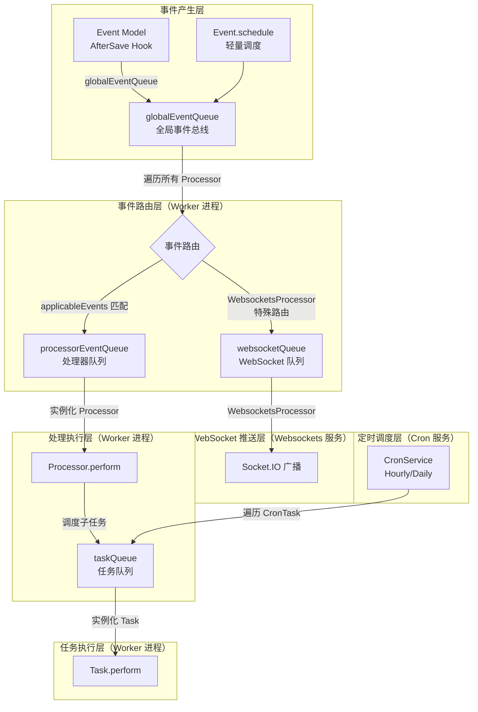
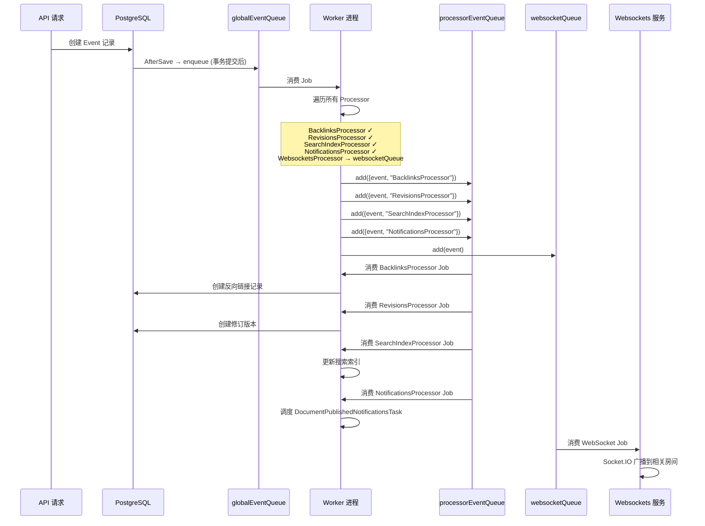

Outline 的异步任务系统是整个后端架构的核心枢纽之一——几乎所有不在 HTTP 请求-响应周期内完成的工作，都通过这一机制异步执行。该系统基于 **Bull**（Redis 驱动的分布式任务队列）构建，采用事件驱动架构，将领域事件（Event）的路由、处理器（Processor）的调度、任务（Task）的执行以及定时任务（CronTask）的管理统一在一个分层队列体系内。理解这一体系，是掌握 Outline 后端数据流和副作用处理的关键前提。

Sources: [queue.ts](server/queues/queue.ts#L1-L69), [index.ts](server/queues/index.ts#L1-L55), [worker.ts](server/services/worker.ts#L1-L180)

## 架构总览：四层队列体系

Outline 的队列系统由四个功能各异的 Bull 队列组成，它们协同工作形成一条从事件产生到副作用完成的完整处理管线。



**四种队列的职责划分**如下表所示：

| 队列名称 | 职责 | 并发控制 | 重试策略 |
|---|---|---|---|
| `globalEvents` | 全局事件总线，接收所有 Event 模型的 `AfterSave` 触发，路由到各处理器 | `WORKER_CONCURRENCY_EVENTS`（默认 10） | 5 次，指数退避，初始 1 秒 |
| `processorEvents` | 处理器专属队列，仅包含匹配 `applicableEvents` 的事件 | `WORKER_CONCURRENCY_EVENTS`（默认 10） | 5 次，指数退避，初始 10 秒 |
| `websockets` | WebSocket 推送队列，由 websockets 服务独立消费 | 由 websockets 服务控制 | 超时 10 秒，无额外重试 |
| `tasks` | 通用任务队列，执行独立的异步任务和定时任务 | `WORKER_CONCURRENCY_TASKS`（默认 10） | 5 次，指数退避，初始 10 秒 |

Sources: [index.ts](server/queues/index.ts#L1-L55), [env.ts](server/env.ts#L526-L542)

## 队列基础设施：createQueue 工厂函数

所有队列实例通过统一的 `createQueue` 工厂函数创建。该函数封装了 Redis 连接复用、指标收集和优雅关闭三个横切关注点。

**Redis 连接复用策略**是其中的关键设计。Bull 需要三种 Redis 连接：`client`（常规操作）、`subscriber`（发布/订阅）和 `bclient`（阻塞操作）。Outline 将前两种连接复用全局 Redis 客户端（`Redis.defaultClient` 和 `Redis.defaultSubscriber`），仅 `bclient` 为每个队列创建独立连接，以此控制 Redis 连接总数。所有队列还设置了 `removeOnComplete: true` 和 `removeOnFail: true`，确保已完成的 Job 自动清理，避免 Redis 内存膨胀。

每个队列在创建时自动注册三个监控机制：队列指标的定时采集（每 5 秒一次，含 Job 计数和延迟计数）、队列事件的 Metrics 埋点（`stalled`、`completed`、`error`、`failed`）以及 `ShutdownHelper` 中的优雅关闭钩子。

Sources: [queue.ts](server/queues/queue.ts#L1-L69)

## 事件模型与入队机制

Outline 中的异步处理始于**事件（Event）的产生**。`Event` 模型是一个 Sequelize 持久化模型，存储于 `events` 表中。它通过 `@AfterSave` 生命周期钩子将自身自动入队到 `globalEventQueue`：

```typescript
// Event 模型的 AfterSave 钩子——所有异步处理的起点
@AfterSave
static async enqueue(model: Event, options: SaveOptions) {
  if (options.transaction) {
    // 在事务提交后才入队，保证数据一致性
    (options.transaction.parent || options.transaction).afterCommit(
      () => void globalEventQueue().add(model)
    );
    return;
  }
  void globalEventQueue().add(model);
}
```

这一设计有两个值得注意的细节：其一，当事件在事务中创建时，入队操作被延迟到 **事务提交之后**（`afterCommit`），确保处理器读到的数据状态与事件语义一致；其二，`Event.schedule` 静态方法提供了一种"幽灵事件"机制——事件被推入队列但不持久化到数据库，适用于不需要审计追踪的轻量级事件调度。

Sources: [Event.ts](server/models/Event.ts#L84-L150)

## 事件类型体系

Outline 定义了超过 20 种事件类型，覆盖文档、集合、用户、评论、Webhook 等核心领域。所有事件类型在 [types.ts](server/types.ts) 中以 TypeScript 联合类型声明，确保编译期类型安全。每种事件类型都包含 `teamId`、`actorId`、`ip`、`authType` 等基础字段，以及与具体领域相关的 `documentId`、`collectionId`、`modelId` 等关联字段。

部分代表性事件类型如下表所示：

| 事件类别 | 事件名称 | 触发时机 |
|---|---|---|
| 文档 | `documents.publish`, `documents.update`, `documents.delete` | 文档发布、更新、删除 |
| 文档（延迟） | `documents.update.delayed`, `documents.update.debounced` | 文档更新后的防抖处理 |
| 集合 | `collections.create`, `collections.update`, `collections.delete` | 集合的 CRUD 操作 |
| 用户 | `users.create`, `users.delete`, `users.suspend`, `users.demote` | 用户生命周期事件 |
| 通知 | `notifications.create` | 通知创建时触发邮件发送 |
| 评论 | `comments.create`, `comments.update`, `comments.add_reaction` | 评论和表情回应 |
| 导入 | `imports.create`, `imports.processed`, `imports.delete` | 导入流程的状态转换 |
| 文件操作 | `fileOperations.create` | 导入/导出操作的创建 |

Sources: [types.ts](server/types.ts#L110-L522)

## 事件处理器（Processor）体系

### 基类与契约

所有事件处理器继承自 `BaseProcessor` 抽象类，核心契约极其简洁：

```typescript
export default abstract class BaseProcessor {
  static applicableEvents: (Event["name"] | "*")[] = [];
  public abstract perform(event: Event): Promise<void>;
  public onFailed(event: Event): Promise<void> { return Promise.resolve(); }
}
```

- **`applicableEvents`**（静态属性）：声明本处理器关注的事件名称列表。支持通配符 `"*"` 表示处理所有事件。Worker 在路由阶段仅将匹配的事件派发给对应处理器。
- **`perform`**（抽象方法）：处理器的核心逻辑，接收匹配的事件对象。
- **`onFailed`**（可选覆写）：所有重试次数耗尽后的最终失败回调，用于执行清理或状态标记。

Sources: [BaseProcessor.ts](server/queues/processors/BaseProcessor.ts#L1-L18)

### 处理器注册与自动发现

处理器的注册通过**文件系统自动发现**机制实现。[processors/index.ts](server/queues/processors/index.ts) 使用 `requireDirectory` 扫描 `processors/` 目录下的所有模块，以文件名作为注册键。同时通过 `PluginManager.getHooks(Hook.Processor)` 支持插件注册自定义处理器。整个注册过程被包裹在 `createLazyRegistry` 中——一个基于 `Proxy` 的懒加载代理，仅在首次访问时执行加载逻辑。

Sources: [processors/index.ts](server/queues/processors/index.ts#L1-L24), [lazyRegistry.ts](server/utils/lazyRegistry.ts#L1-L41)

### 核心 Processor 详解

Outline 内置了约 30 个处理器，覆盖搜索索引、通知、邮件、反向链接、修订版本、WebSocket 推送等关键功能。以下列举几个具有代表性的处理器及其设计模式：

#### DebounceProcessor —— 分布式防抖

`DebounceProcessor` 实现了一种**基于队列延迟的分布式防抖**机制。当文档更新事件到达时，它不立即处理，而是将事件以 5 分钟延迟（开发环境为 30 秒）重新入队为 `documents.update.delayed`。当延迟事件到达时，检查文档的 `updatedAt` 是否比事件的 `createdAt` 更新——若是，说明有更新的编辑操作已经进入队列，当前事件可以安全丢弃。最终未被丢弃的事件被重新发布为 `documents.update.debounced`，触发修订版本创建。

```
documents.update → (5min delay) → documents.update.delayed → (检查是否过时) → documents.update.debounced
```

Sources: [DebounceProcessor.ts](server/queues/processors/DebounceProcessor.ts#L1-L55)

#### RevisionsProcessor —— 协同编辑的快照生成

`RevisionsProcessor` 监听 `documents.publish`、`documents.update` 和 `documents.update.debounced` 事件。对于 `documents.update` 事件，它仅在 `data.done === true` 时（表示编辑会话结束）才触发。处理器从 Redis 中读取自上次修订以来的协作者 ID 集合，与上一版本进行内容对比（通过 `fast-deep-equal`），仅在内容实际变化时创建新修订记录。

Sources: [RevisionsProcessor.ts](server/queues/processors/RevisionsProcessor.ts#L1-L66)

#### NotificationsProcessor —— 处理器到任务的委派模式

`NotificationsProcessor` 展示了一种重要的架构模式：**处理器作为调度器，将实际工作委派给 Task**。它本身不执行任何业务逻辑，而是根据事件类型选择并调度相应的 Notification Task。这种分离使得通知逻辑可以独立于事件路由进行测试和扩展。

Sources: [NotificationsProcessor.ts](server/queues/processors/NotificationsProcessor.ts#L1-L138)

#### FileOperationCreatedProcessor —— 策略模式分发

`FileOperationCreatedProcessor` 采用**策略模式**，根据文件操作的类型（Import/Export）和格式（JSON/MarkdownZip/HTMLZip）选择对应的 Task 实现来执行。它是事件驱动到任务执行的典型桥梁。

Sources: [FileOperationCreatedProcessor.ts](server/queues/processors/FileOperationCreatedProcessor.ts#L1-L57)

#### 全部处理器一览

| 处理器 | 监听事件 | 核心职责 |
|---|---|---|
| `BacklinksProcessor` | `documents.publish/update/delete` | 维护文档间反向链接关系 |
| `DebounceProcessor` | `documents.update` | 分布式防抖，延迟修订创建 |
| `RevisionsProcessor` | `documents.publish/update/debounced` | 创建文档修订版本 |
| `SearchIndexProcessor` | `documents.*`, `collections.*`, `comments.*` | 同步外部搜索引擎索引 |
| `NotificationsProcessor` | 多种事件 | 委派通知逻辑到各类 Notification Task |
| `EmailsProcessor` | `notifications.create` | 将通知转化为邮件发送 |
| `WebsocketsProcessor` | 所有事件（特殊路由） | 通过 Socket.IO 向客户端推送实时更新 |
| `FileOperationCreatedProcessor` | `fileOperations.create` | 根据格式分发导入/导出任务 |
| `UserDeletedProcessor` | `users.delete` | 级联清理用户关联数据 |
| `UserDemotedProcessor` | `users.demote` | 清理降权用户的管理员权限数据 |
| `CollectionsProcessor` | `collections.*` | 集合相关的事件处理 |
| `ImportsProcessor` | `imports.*` | 处理外部数据导入流程 |
| `UserCreatedProcessor` | `users.create` | 新用户注册后的初始化 |
| `AvatarProcessor` | 用户/团队更新 | 头像上传处理 |

Sources: [processors/](server/queues/processors/)

## 异步任务（Task）体系

### BaseTask 基类

与 Processor 不同，Task 是**主动调度**的异步执行单元。`BaseTask<T>` 是所有任务的抽象基类，泛型参数 `T` 定义了任务的输入属性类型：

```typescript
export abstract class BaseTask<T extends object> {
  public schedule(props: T, options?: JobOptions): Promise<Job>;
  public abstract perform(props: T): Promise<unknown>;
  public onFailed(props: T): Promise<void>;
  public get options(): JobOptions { /* 默认重试配置 */ }
}
```

**`schedule` 方法**是任务的入口——它将 `{ name: this.constructor.name, props }` 封装为 Bull Job 推入 `taskQueue`。Worker 进程在消费时通过类名查找对应的 Task 类，实例化后调用 `perform`。

任务还内置了**优先级体系**（`TaskPriority`）：`Background`（40）、`Low`（30）、`Normal`（20）、`High`（10），数值越低优先级越高，Bull 调度器会优先处理高优先级 Job。

Sources: [BaseTask.ts](server/queues/tasks/base/BaseTask.ts#L1-L62)

### CronTask 基类与定时任务

`CronTask` 继承自 `BaseTask`，是所有定时任务的基类。它引入了两个关键能力：**调度间隔声明**和**UUID 空间分区**。

```typescript
export abstract class CronTask extends BaseTask<Props> {
  public abstract get cron(): TaskSchedule;
}
```

每个 CronTask 通过 `cron` getter 声明自己的调度配置：

| 配置项 | 说明 |
|---|---|
| `interval` | `TaskInterval.Hour`（每小时）或 `TaskInterval.Day`（每天） |
| `partitionWindow` | 可选，在该时间窗口内分散任务的启动时间，避免同时启动 |

Sources: [CronTask.ts](server/queues/tasks/base/CronTask.ts#L1-L196)

#### UUID 空间分区

`CronTask` 的 `getPartitionWhereClause` 方法实现了一种精巧的**基于 UUID 范围的数据分区**策略。它将 UUID 的前 32 位（8 个十六进制字符）空间均匀划分为 N 个区间，每个分区处理一个区间的数据：

```
分区 0: 00000000-... 到 55555554-...
分区 1: 55555555-... 到 aaaaaaa9-...
分区 2: aaaaaaaa-... 到 ffffffff-...
```

这种设计使得在多 Worker 实例部署时，可以通过设置不同的 `partitionIndex` 和 `partitionCount`，让各 Worker 处理不相交的数据子集，避免重复处理和锁竞争。

Sources: [CronTask.ts](server/queues/tasks/base/CronTask.ts#L96-L194)

### Cron 服务调度器

[CronService](server/services/cron.ts) 负责定时触发所有 CronTask。它通过两个 `setInterval` 分别以小时和天为间隔运行，每次运行时遍历所有注册的任务，筛选出匹配当前调度间隔的 CronTask 并调用其 `schedule` 方法：

```typescript
setInterval(() => void run(TaskInterval.Day), Day.ms);
setInterval(() => void run(TaskInterval.Hour), Hour.ms);
```

首次启动延迟 5 秒执行，确保其他服务已完成初始化。

Sources: [cron.ts](server/services/cron.ts#L1-L37)

### 定时任务（CronTask）一览

| 任务 | 间隔 | 职责 |
|---|---|---|
| `CleanupDeletedDocumentsTask` | 每小时 | 永久删除 30 天前标记删除的文档 |
| `CleanupDeletedTeamsTask` | 每小时 | 清理已删除团队的数据 |
| `CleanupExpiredFileOperationsTask` | 每小时 | 清理过期的文件操作记录 |
| `CleanupExpiredAttachmentsTask` | 每小时 | 清理过期的附件 |
| `CleanupOldEventsTask` | 每小时 | 清理旧事件记录 |
| `CleanupOldNotificationsTask` | 每小时 | 清理旧通知 |
| `CleanupOldImportsTask` | 每天 | 清理旧导入记录 |
| `CleanupDocumentInsightsTask` | 每天 | 清理旧文档洞察数据 |
| `CleanupDemotedUserTask` | 每小时 | 清理降权用户的权限数据 |
| `CleanupDynamicOAuthClientsTask` | 每天 | 清理动态 OAuth 客户端 |
| `CleanupOAuthAuthorizationCodeTask` | 每天 | 清理 OAuth 授权码 |
| `EmptyTrashTask` | 每小时 | 清空回收站 |
| `InviteReminderTask` | 每天 | 向 2-3 天前未激活的邀请用户发送提醒 |
| `RollupDocumentInsightsTask` | 每天 | 汇总文档洞察数据 |
| `RollupWeeklyDocumentInsightsTask` | 每天 | 汇总周度文档洞察 |
| `UpdateTeamsAttachmentsSizeTask` | 每天 | 更新各团队附件总大小 |
| `UpdateDocumentsPopularityScoreTask` | 每小时 | 更新文档热度评分 |

Sources: [tasks/](server/queues/tasks/)

### 按需任务（非定时）一览

| 任务 | 触发方式 | 职责 |
|---|---|---|
| `EmailTask` | 邮件系统调度 | 通用邮件发送任务 |
| `ExportMarkdownZipTask` | FileOperationCreatedProcessor | Markdown 格式导出 |
| `ExportHTMLZipTask` | FileOperationCreatedProcessor | HTML 格式导出 |
| `ExportJSONTask` | FileOperationCreatedProcessor | JSON 格式导出 |
| `ImportJSONTask` | FileOperationCreatedProcessor | JSON 格式导入 |
| `DocumentImportTask` | 导入流程 | 单文档导入 |
| `DocumentUpdateTextTask` | RevisionsProcessor | 提取文档纯文本用于搜索 |
| `UploadAttachmentFromUrlTask` | 附件处理 | 从 URL 下载并上传附件 |
| `UploadUserAvatarTask` | 用户相关操作 | 上传用户头像 |
| `UploadTeamAvatarTask` | 团队相关操作 | 上传团队头像 |
| `ValidateSSOAccessTask` | SSO 登录流程 | 验证 SSO 访问权限 |
| `DocumentPublishedNotificationsTask` | NotificationsProcessor | 文档发布通知分发 |
| `CommentCreatedNotificationsTask` | NotificationsProcessor | 评论创建通知分发 |
| `RevisionCreatedNotificationsTask` | NotificationsProcessor | 修订创建通知分发 |
| `DeleteAttachmentTask` | 附件删除流程 | 异步删除附件文件 |
| `MarkdownAPIImportTask` | API 导入流程 | Markdown API 导入 |

Sources: [tasks/](server/queues/tasks/)

## Worker 进程：队列消费与服务编排

Worker 进程是所有队列的消费者。它在 [worker.ts](server/services/worker.ts) 中初始化，依次启动三个队列的消费者：

**第一层——全局事件队列消费**：Worker 从 `globalEventQueue` 取出事件 Job，遍历所有已注册的 Processor，通过 `applicableEvents` 过滤匹配的处理器，将匹配的事件以 `{ event, name }` 格式推入 `processorEventQueue`。`WebsocketsProcessor` 是特例——它的事件被路由到独立的 `websocketQueue`，由 websockets 服务而非 Worker 消费。

**第二层——处理器事件队列消费**：Worker 从 `processorEventQueue` 取出 Job，通过 `name` 字段查找对应的 Processor 类，实例化后调用 `perform(event)`。如果最后一次重试仍然失败，则调用 `processor.onFailed(event)`。

**第三层——任务队列消费**：Worker 从 `taskQueue` 取出 Job，通过 `name` 字段查找对应的 Task 类，实例化后调用 `perform(props)`。同样，最终失败时调用 `task.onFailed(props)`。

每一层消费者都使用 `traceFunction` 进行链路追踪，为每个 Job 创建独立的 tracing span，确保可观测性从入口贯穿到执行完成。

Sources: [worker.ts](server/services/worker.ts#L1-L180)

## WebSocket 推送的特殊路径

WebSocket 推送走了一条与其他处理器完全不同的路径。在 Worker 进程的路由阶段，`WebsocketsProcessor` 的事件被识别后推入 `websocketQueue`。该队列的消费者不在 Worker 进程中，而是在 **websockets 服务**中——[websockets.ts](server/services/websockets.ts) 在初始化时注册了 `websocketQueue` 的 `process` 回调，收到事件后调用 `WebsocketsProcessor.perform(event, io)` 将变更广播到对应的 Socket.IO 房间（如 `team-{teamId}`、`collection-{collectionId}`、`user-{userId}`）。

这种分离设计确保了 WebSocket 推送只在拥有 Socket.IO 服务器实例的进程中执行，而不是在无状态的 Worker 进程中。

Sources: [websockets.ts](server/services/websockets.ts#L145-L168)

## 健康监控与容错

`HealthMonitor` 为每个活跃队列注册了健康检测。它监听队列的 `active`、`completed` 和 `failed` 事件来更新最后活动时间。每 30 秒检查一次：如果超过 30 秒没有活动，且等待中的 Job 数量超过 50 个，则调用 `Logger.fatal` 终止进程——这假设了进程调度器（如 Heroku 或 Docker）会自动重启不健康的实例。

Sources: [HealthMonitor.ts](server/queues/HealthMonitor.ts#L1-L48)

## 队列初始化与懒加载模式

四种队列的实例化采用了**延迟初始化的单例模式**。以 `globalEventQueue` 为例：

```typescript
let cachedGlobalEventQueue: ReturnType<typeof createQueue> | undefined;
export const globalEventQueue = () => {
  if (!cachedGlobalEventQueue) {
    cachedGlobalEventQueue = createQueue("globalEvents", { ... });
  }
  return cachedGlobalEventQueue;
};
```

这种设计确保队列在首次调用 `globalEventQueue()` 时才创建 Bull 实例并建立 Redis 连接，避免在模块加载阶段（如测试或不需要队列的场景中）产生不必要的副作用。

Sources: [index.ts](server/queues/index.ts#L4-L16)

## 服务进程模型

Outline 通过 `SERVICES` 环境变量控制当前进程启动哪些服务，默认值为 `collaboration,websockets,worker,web`。各服务的职责如下：

| 服务 | 入口文件 | 职责 |
|---|---|---|
| `web` | [web.ts](server/services/web.ts) | HTTP API 服务器，处理 REST 请求 |
| `worker` | [worker.ts](server/services/worker.ts) | 消费事件队列和任务队列 |
| `websockets` | [websockets.ts](server/services/websockets.ts) | Socket.IO 服务器，消费 WebSocket 队列 |
| `collaboration` | [collaboration.ts](server/services/collaboration.ts) | Hocuspocus 实时协作服务器 |
| `cron` | [cron.ts](server/services/cron.ts) | 定时任务调度器 |
| `admin` | [admin.ts](server/services/admin.ts) | 管理后台服务 |

在典型部署中，所有服务运行在同一进程中；在需要水平扩展的场景下，可以通过 `SERVICES` 环境变量将它们拆分到不同进程，例如 `--services=worker` 仅启动 Worker 进程。

Sources: [env.ts](server/env.ts#L343-L357), [services/index.ts](server/services/index.ts#L1-L16)

## 完整事件处理流程示例

以"文档发布"（`documents.publish`）为例，追踪一个事件从产生到所有副作用完成的完整路径：



Sources: [Event.ts](server/models/Event.ts#L84-L99), [worker.ts](server/services/worker.ts#L21-L79)

## 测试策略

队列系统的测试依赖 `__mocks__/bull.ts` 中的 Bull 模拟实现。该 Mock 将 `queue.add()` 和 `queue.process()` 直接串联——调用 `add` 时立即同步执行已注册的 `process` 回调，使测试无需等待真实的 Redis 和异步调度。对于处理器本身的逻辑测试（如 [BacklinksProcessor.test.ts](server/queues/processors/BacklinksProcessor.test.ts)），可以直接实例化处理器并调用 `perform` 方法，完全绕过队列层。

Sources: [bull.ts](server/__mocks__/bull.ts#L1-L42)

---

### 延伸阅读

- 关于事件在 API 请求中如何被创建，参见 [API 路由与控制器：请求处理流程与验证机制](9-api-lu-you-yu-kong-zhi-qi-qing-qiu-chu-li-liu-cheng-yu-yan-zheng-ji-zhi)
- 关于 Worker 使用的 Redis 连接基础设施，参见 [缓存与会话：Redis 的多种用途与存储策略](17-huan-cun-yu-hui-hua-redis-de-duo-chong-yong-tu-yu-cun-chu-ce-lue)
- 关于可观测性（Metrics、Tracing）如何集成到队列处理中，参见 [可观测性：日志、指标收集、Sentry 错误追踪与链路追踪](25-ke-guan-ce-xing-ri-zhi-zhi-biao-shou-ji-sentry-cuo-wu-zhui-zong-yu-lian-lu-zhui-zong)
- 关于 WebSocket 推送的完整实现细节，参见 [实时协作服务：WebSocket、文档持久化与冲突解决](15-shi-shi-xie-zuo-fu-wu-websocket-wen-dang-chi-jiu-hua-yu-chong-tu-jie-jue)