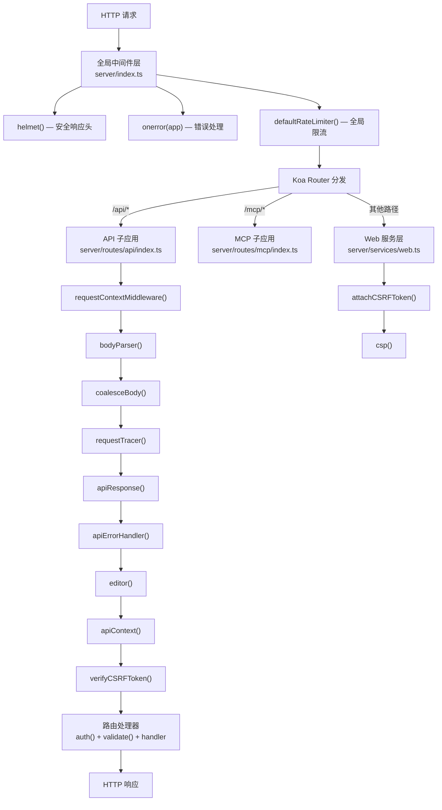
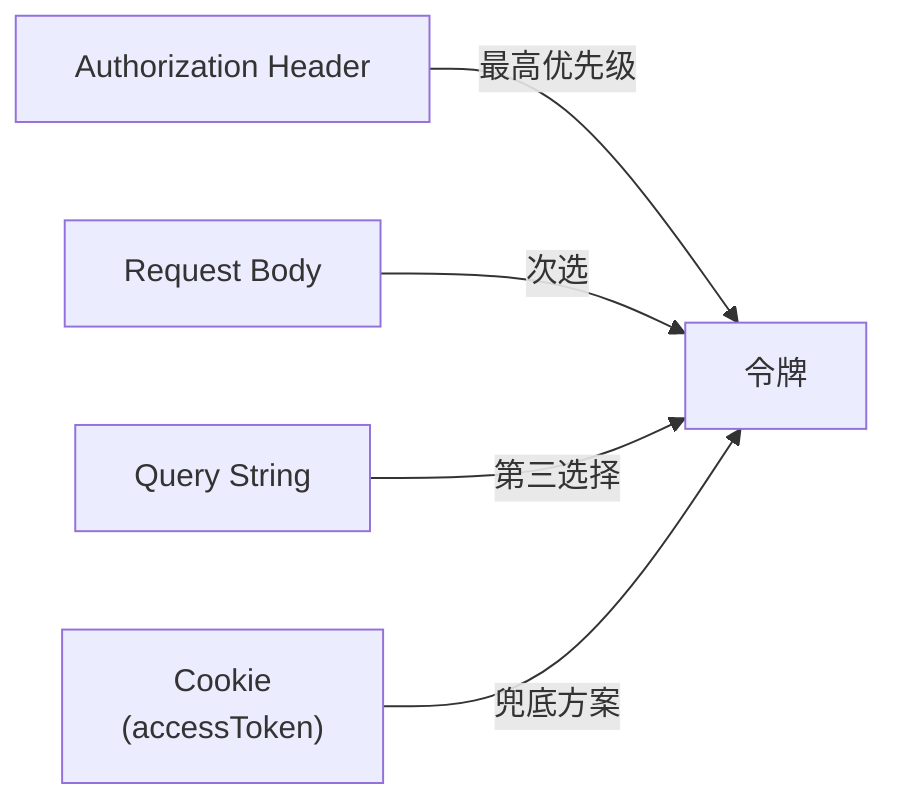
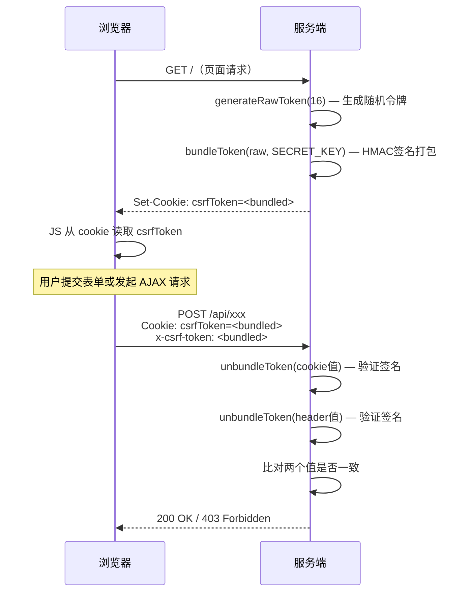

Outline 的后端基于 Koa.js 框架构建，其中间件体系是请求处理管道的核心骨架。每一段 HTTP 请求从接收到响应，都依次穿过一层层中间件——全局级别的限流与安全头、子应用级别的请求上下文与 CSRF 校验、路由级别的认证与参数验证。理解这套中间件的注册顺序、职责边界和协作模式，是深入掌握 Outline 后端请求处理流程的关键前提。

本文将按照请求从入口到路由的实际流转顺序，依次剖析每一层中间件的设计意图与实现细节。

Sources: [index.ts](server/index.ts#L86-L98), [web.ts](server/services/web.ts#L28-L103), [index.ts](server/routes/api/index.ts#L56-L81)

## 中间件注册架构：三层管道模型

Outline 的中间件并非全部堆叠在一个平面——它们被精心分布在三个不同的层级中，每一层对应不同的请求处理阶段和作用域。

**第一层：全局中间件**（在 `server/index.ts` 中注册）应用于所有进入服务器的请求，包括健康检查端点：`helmet` 安全头、全局错误处理、默认限流器。**第二层：Web 服务中间件**（在 `server/services/web.ts` 中注册）针对面向浏览器的请求，包括 HTTPS 重定向、压缩、CSRF 令牌附加、CSP 策略等。**第三层：API 子应用中间件**（在 `server/routes/api/index.ts` 中注册）专门处理 `/api` 前缀的请求，包括请求体解析、请求上下文注入、CSRF 验证、响应格式化等。

下面的 Mermaid 图展示了完整的请求流转路径。在阅读该图之前，需要理解一个关键前提：Koa 的中间件栈遵循洋葱模型——`app.use(middleware)` 的调用顺序决定了请求"穿入"的顺序，而响应则按相反顺序"穿出"。



Sources: [index.ts](server/index.ts#L86-L98), [web.ts](server/services/web.ts#L76-L100), [index.ts](server/routes/api/index.ts#L56-L81)

## 认证中间件：多传输方式与多凭证类型

认证中间件是整个中间件体系中逻辑最复杂、覆盖面最广的组件。它是一个**工厂函数**——调用 `auth(options)` 返回一个定制的 Koa 中间件，而非直接注册为全局中间件。这意味着每个需要认证的路由可以独立配置其认证要求。

### 配置选项与认证类型

工厂函数接受三个可选参数：

| 参数 | 类型 | 说明 |
|------|------|------|
| `role` | `UserRole` | 要求用户具备的最低角色（如 `admin`） |
| `type` | `AuthenticationType \| AuthenticationType[]` | 限制允许的认证类型 |
| `optional` | `boolean` | 若为 `true`，认证失败时不抛错，而是设置 `ctx.state.auth = {}` |

Outline 定义了四种认证类型：**APP**（JWT 会话令牌）、**API**（API 密钥）、**OAUTH**（OAuth 访问令牌）和 **MCP**（Model Context Protocol 认证）。中间件会根据令牌的格式特征自动判断类型——`OAuthAuthentication.match(token)` 检测 OAuth 格式，`ApiKey.match(token)` 检测 API 密钥前缀，其余则按 JWT 处理。

Sources: [authentication.ts](server/middlewares/authentication.ts#L19-L76), [types.ts](server/types.ts#L46-L51)

### 令牌解析：四种传输通道

`parseAuthentication` 函数按优先级依次尝试从四个通道提取令牌：



**Authorization 头**是最优先的通道，要求 `Bearer <token>` 格式。如果 Authorization 头不存在，中间件依次检查请求体的 `token` 字段、URL 查询参数的 `token` 字段，最后是名为 `accessToken` 的 Cookie。这种设计确保了浏览器场景（Cookie）、API 客户端场景（Header）和特殊嵌入场景（Query/Body）都能正确传递凭证。

一个关键的安全约束是：**OAuth 令牌必须通过 Authorization 头传递**，**API 密钥禁止通过 Cookie 传递**。这些限制在验证逻辑中被强制执行。

Sources: [authentication.ts](server/middlewares/authentication.ts#L84-L133)

### 凭证验证与授权检查

在提取到令牌后，中间件根据令牌类型执行不同的验证路径：

**JWT 会话令牌**通过 `getUserForJWT(token)` 验证签名并加载用户及其关联的团队信息。**API 密钥**通过 `ApiKey.findByToken(token)` 查询数据库，检查过期时间和作用域权限（`canAccess(ctx.originalUrl)`）。**OAuth 访问令牌**通过 `OAuthAuthentication.findByAccessToken(token)` 查询数据库，验证过期时间并检查作用域权限。

通过凭证验证后，中间件执行两项通用检查：首先检查用户是否被暂停（`user.isSuspended`），若被暂停则抛出 `UserSuspendedError`，包含执行暂停操作的管理员邮箱；然后检查角色要求（`options.role`）和认证类型要求（`options.type`）。

最终，中间件将验证结果写入 `ctx.state.auth`，包含 `user`、`token`、`type`、`service`、`scope` 五个字段。同时通过分布式追踪器（tracer）将 `userId`、`teamId`、`authType` 标记到当前请求的根 Span 上，便于链路追踪。

一个值得注意的细节是：认证成功后会并行更新用户和团队的 `activeAt` 时间戳（`user.updateActiveAt(ctx)` 和 `user.team?.updateActiveAt()`），这保证了"最近活跃"数据的实时性。

Sources: [authentication.ts](server/middlewares/authentication.ts#L135-L278)

### 路由级使用示例

在路由定义中，认证中间件通常作为第一个中间件使用：

```typescript
// documents.ts — 需要认证的列表接口
router.post("documents.list", auth(), validate(T.DocumentsListSchema), handler);

// documents.ts — 需要 API 认证类型
router.post("documents.export",
  rateLimiter(RateLimiterStrategy.TwentyFivePerMinute),
  auth(),
  validate(T.DocumentsExportSchema),
  handler
);

// mcp/index.ts — 限制多种认证类型
router.post("/",
  auth({ type: [AuthenticationType.MCP, AuthenticationType.OAUTH, AuthenticationType.API] }),
  handler
);
```

Sources: [documents.ts](server/routes/api/documents/documents.ts#L100-L105), [documents.ts](server/routes/api/documents/documents.ts#L770-L776), [index.ts](server/routes/mcp/index.ts#L69-L78)

## CSRF 防护：HMAC 签名的双重提交模式

Outline 的 CSRF 防护采用了**带签名的双重提交 Cookie（Signed Double-Submit Cookie）**模式，这是一种无需服务端会话存储即可防御 CSRF 攻击的方案。整个机制由两个中间件协作完成：`attachCSRFToken` 负责签发令牌，`verifyCSRFToken` 负责校验令牌。

### 令牌生命周期



`attachCSRFToken` 中间件在全局 Web 服务层注册，仅对 `GET`、`HEAD`、`OPTIONS` 等安全方法生效。它生成 16 字节随机令牌，使用 `SECRET_KEY`（环境变量，64 位十六进制字符串）进行 HMAC-SHA256 签名，将原始令牌和签名拼接后设为 `csrfToken` Cookie（`httpOnly: false`，`sameSite: "lax"`）。前端通过 `useCsrfToken` React Hook 从 Cookie 中读取令牌值。

`verifyCSRFToken` 中间件在 API 子应用层注册，拦截所有非安全方法的请求。其校验逻辑包含三层智能判断：

1. **传输方式检查**：如果请求未使用 Cookie 认证（即使用了 Authorization 头或 Query 参数传递令牌），则跳过 CSRF 校验——因为 CSRF 攻击的前提正是浏览器自动携带 Cookie。
2. **只读接口豁免**：对于 API 路由，通过 `AuthenticationHelper.canAccess(path, [Scope.Read])` 判断该接口是否可仅凭只读权限访问。如果是只读接口，则跳过 CSRF 校验，因为这些操作不会改变服务端状态。
3. **双重提交验证**：对未豁免的请求，从 Cookie 和请求头（`x-csrf-token`）或表单字段（`_csrf`）中分别提取令牌，验证两者的 HMAC 签名，并比对是否完全一致。

CSRF 常量定义在共享层，确保前后端使用一致的名称：Cookie 名 `csrfToken`、请求头名 `x-csrf-token`、表单字段名 `_csrf`。

Sources: [csrf.ts](server/middlewares/csrf.ts#L1-L109), [csrf.ts](server/utils/csrf.ts#L1-L55), [constants.ts](shared/constants.ts#L19-L23), [useCsrfToken.ts](app/hooks/useCsrfToken.ts#L10-L30)

## 限流体系：全局默认 + 路由定制的双层架构

Outline 的限流系统建立在 `rate-limiter-flexible` 库之上，以 Redis 作为后端存储，采用**令牌桶算法**实现。整个体系分为两个层次：全局默认限流器和路由级别定制限流器。

### 全局限流器

`defaultRateLimiter()` 在 `server/index.ts` 中注册，应用于所有进入服务器的请求。它使用 `RateLimiterRedis`（以 Redis 为存储后端的限流器），并配置了一个 `RateLimiterMemory` 作为"保险限流器"——当 Redis 不可用时自动降级为内存限流，避免 Redis 故障导致限流失效。

限流的标识键（Key）选择遵循智能策略：对于 JWT 会话令牌，通过 Redis 缓存的 `token → userId` 映射以用户 ID 为键（避免 NAT 后多用户共享同一 IP 的问题）；对于 API 密钥和 OAuth 令牌，直接使用客户端 IP（因为这些凭证已通过其他机制关联到具体客户端）；未携带令牌的请求也以 IP 为键。当 JWT 验证失败时，优雅地降级为 IP 键。

Sources: [rateLimiter.ts](server/middlewares/rateLimiter.ts#L23-L93), [RateLimiter.ts](server/utils/RateLimiter.ts#L8-L110)

### 路由级限流器

`rateLimiter(config)` 工厂函数用于在单个路由上注册自定义限流规则。它的工作方式比较巧妙：**首次调用时在 `RateLimiter.rateLimiterMap` 中注册限流器配置，后续请求直接复用已注册的配置**。实际的限流判断仍由 `defaultRateLimiter` 完成——它会根据当前请求的完整路径查找是否有匹配的路由级限流器，若找到则使用该限流器的配置，否则使用默认限流器。

Outline 预定义了一组常用限流策略（`RateLimiterStrategy`）：

| 策略 | 窗口时长 | 请求数 | 典型用途 |
|------|----------|--------|----------|
| `FivePerMinute` | 60s | 5 | 极敏感操作 |
| `TenPerMinute` | 60s | 10 | 敏感操作 |
| `TwentyFivePerMinute` | 60s | 25 | 导出、删除等重操作 |
| `OneHundredPerMinute` | 60s | 100 | 常规写操作 |
| `TenPerHour` | 3600s | 10 | 低频操作 |
| `FiftyPerHour` | 3600s | 50 | 中频操作 |
| `OneHundredPerHour` | 3600s | 100 | 长周期操作 |
| `OneThousandPerHour` | 3600s | 1000 | MCP 等高频接口 |

限流触发时，响应包含标准 HTTP 头信息：`Retry-After`（建议等待秒数）、`RateLimit-Limit`（窗口内允许的总请求数）、`RateLimit-Remaining`（剩余可用请求数）、`RateLimit-Reset`（配额重置时间）。同时通过 `Metrics.increment("rate_limit.exceeded")` 记录指标。

### 环境变量配置

限流系统通过四个环境变量控制：

| 环境变量 | 默认值 | 说明 |
|----------|--------|------|
| `RATE_LIMITER_ENABLED` | `true` | 是否启用限流 |
| `RATE_LIMITER_REQUESTS` | `1000` | 默认窗口内允许的请求数 |
| `RATE_LIMITER_DURATION_WINDOW` | `60` | 默认窗口时长（秒） |
| `RATE_LIMITER_MULTIPLIER` | `1` | 路由级限流的乘数因子 |

`RATE_LIMITER_MULTIPLIER` 是一个运维友好的设计——它允许部署者在不修改代码的情况下统一缩放所有路由级限流阈值。有效限流值计算为 `Math.max(1, Math.round(config.requests * multiplier))`，确保乘数极小时也不会降到 0。

Sources: [rateLimiter.ts](server/middlewares/rateLimiter.ts#L55-L145), [RateLimiter.ts](server/utils/RateLimiter.ts#L115-L161), [env.ts](server/env.ts#L545-L595)

## 请求上下文：AsyncLocalStorage 与上下文传递

请求上下文中间件解决的是一个横切关注点问题：**如何在 Sequelize 生命周期钩子、事务处理和业务逻辑之间传递当前请求的信息，而无需显式地在每个函数签名中添加 `ctx` 参数？**

### AsyncLocalStorage 请求上下文

`requestContextMiddleware` 使用 Node.js 的 `AsyncLocalStorage` API，为每个 HTTP 请求创建一个独立的存储上下文。它将原始的 `IncomingMessage` 对象（`ctx.req`）封装在存储中，使得下游任何代码都可以通过 `requestContext.getStore()` 访问到当前请求对象。

这种设计的核心价值在于：Sequelize 的生命周期钩子（如 `beforeCreate`、`beforeUpdate`）可以检查请求关联的 Socket 是否已被销毁（例如因为请求超时），从而**在数据库层面短路已取消的请求**，避免不必要的 I/O 操作。

Sources: [requestContext.ts](server/middlewares/requestContext.ts#L1-L15), [requestContext.ts](server/storage/requestContext.ts#L1-L11)

### API 上下文聚合器

`apiContext` 中间件通过 `Object.defineProperty` 在 `ctx` 上定义了一个 `context` **惰性 getter**。每次访问 `ctx.context` 时，它动态聚合三个来源的信息：

- **`auth`**：来自 `ctx.state.auth`，由认证中间件设置
- **`transaction`**：来自 `ctx.state.transaction`，由事务中间件设置
- **`ip`**：来自 `ctx.request.ip`

这个聚合上下文被数据库变更辅助函数（如 `saveWithCtx`、`destroyWithCtx`）消费，确保每次数据库写操作都能获取到完整的请求上下文——操作者身份、事务边界和来源 IP。

Sources: [apiContext.ts](server/middlewares/apiContext.ts#L1-L26)

## 事务中间件：声明式数据库事务

`transaction` 中间件提供了一种简洁的声明式事务管理模式。将其放在路由中间件链中，即可自动将整个请求处理包装在一个 Sequelize 事务中：

```typescript
router.post("documents.create",
  auth(),
  validate(T.DocumentsCreateSchema),
  transaction(),  // 整个 handler 运行在事务中
  async (ctx: APIContext) => { /* ... */ }
);
```

中间件内部通过 `sequelize.transaction(async (t) => { ... })` 创建事务，并将事务实例挂载到 `ctx.state.transaction`。如果 handler 或其调用的任何命令抛出异常，事务自动回滚；正常完成则自动提交。下游的数据库操作通过传递 `transaction: ctx.state.transaction` 选项参与到同一事务中。

Sources: [transaction.ts](server/middlewares/transaction.ts#L1-L20)

## 参数验证：Zod Schema 驱动的类型安全

`validate` 中间件接收一个 Zod Schema，对请求对象（`ctx.request`）进行解析和验证。验证通过后，解析结果被合并到 `ctx.input` 中，供下游 handler 以类型安全的方式使用。

```typescript
// 典型使用模式
router.post("documents.list",
  auth(),
  pagination(),
  validate(T.DocumentsListSchema),  // Zod schema 验证
  async (ctx: APIContext<T.DocumentsListReq>) => {
    const { sort, direction, collectionId } = ctx.input.body;  // 类型安全
    // ...
  }
);
```

验证失败时，中间件提取 ZodError 的第一个 issue，以 `字段名: 错误消息` 的格式抛出 `ValidationError`，确保客户端收到清晰的错误提示。`ctx.input` 的设计允许同一个路由上叠加多个 `validate` 调用——后一个的解析结果通过对象展开合并到前一个的结果中。

Sources: [validate.ts](server/middlewares/validate.ts#L1-L29)

## 辅助中间件一览

除了上述核心中间件外，Outline 还提供了一系列辅助中间件，处理特定场景的横切关注点：

| 中间件 | 文件 | 职责 |
|--------|------|------|
| `feature(preference)` | [feature.ts](server/middlewares/feature.ts) | 检查团队是否启用了某项功能偏好 |
| `timeout(ms)` | [timeout.ts](server/middlewares/timeout.ts) | 临时延长 Socket 超时时间，用于长时间操作 |
| `multipart({ maximumFileSize })` | [multipart.ts](server/middlewares/multipart.ts) | 校验文件上传的 Content-Type 和大小限制 |
| `validateWebhook({ secretKey, ... })` | [validateWebhook.ts](server/middlewares/validateWebhook.ts) | HMAC 签名验证，用于第三方 Webhook 回调 |
| `requestTracer()` | [requestTracer.ts](server/middlewares/requestTracer.ts) | 将请求中的 ID 类参数标记到分布式追踪 Span |
| `editor()` | [editor.ts](server/routes/api/middlewares/editor.ts) | 检查客户端编辑器版本是否兼容 |
| `csp()` | [csp.ts](server/middlewares/csp.ts) | Content Security Policy，带 nonce 的脚本白名单 |
| `shareDomains()` | [shareDomains.ts](server/middlewares/shareDomains.ts) | 自定义域名下的分享页解析 |
| `apexRedirect()` | [apexRedirect.ts](server/middlewares/apexRedirect.ts) | 裸域名到 www 子域名的重定向 |
| `apexAuthRedirect()` | [apexAuthRedirect.ts](server/middlewares/apexAuthRedirect.ts) | 认证流程中的跨子域名重定向 |
| `coalesceBody()` | [coaleseBody.ts](server/middlewares/coaleseBody.ts) | 修复 koa-body 的 `null` body 问题 |

`feature` 中间件与团队偏好系统协作，当某项功能未启用时抛出 `ValidationError`。`timeout` 中间件使用 Socket 级别的超时设置，在 `finally` 块中恢复原始超时值，确保不会影响后续请求。`validateWebhook` 支持两种模式：HMAC 签名模式（对请求体计算 SHA256 签名并比对）和直接比对模式（将 secret 本身作为签名值），适配不同第三方服务的 Webhook 验证方式。

Sources: [feature.ts](server/middlewares/feature.ts#L1-L19), [timeout.ts](server/middlewares/timeout.ts#L1-L25), [multipart.ts](server/middlewares/multipart.ts#L1-L43), [validateWebhook.ts](server/middlewares/validateWebhook.ts#L1-L49), [requestTracer.ts](server/middlewares/requestTracer.ts#L1-L24), [editor.ts](server/routes/api/middlewares/editor.ts#L1-L30)

## 中间件组合模式：典型路由的中间件链

综合以上各节，一个典型的需要认证、参数验证和数据库事务的 API 路由，其中间件组合如下：

```typescript
router.post(
  "documents.move",                           // 路由名称
  rateLimiter(RateLimiterStrategy.OneHundredPerMinute),  // 1. 路由级限流注册
  auth(),                                     // 2. 认证 + 授权
  validate(T.DocumentsMoveSchema),            // 3. 参数验证
  transaction(),                              // 4. 数据库事务包装
  async (ctx: APIContext<T.DocumentsMoveReq>) => {
    // 5. 业务处理器
    // ctx.state.auth → 用户信息
    // ctx.input → 验证后的请求参数
    // ctx.state.transaction → 活跃事务
    // ctx.context → 聚合上下文 { auth, transaction, ip }
  }
);
```

这个链式组合体现了清晰的关注点分离原则：**限流**（防止滥用）→ **认证**（确认身份）→ **验证**（确保数据合法）→ **事务**（保证数据一致性）→ **业务逻辑**。每个中间件只负责一个明确的职责，通过 Koa 的洋葱模型形成层层递进的防护管道。

Sources: [documents.ts](server/routes/api/documents/documents.ts#L770-L776), [index.ts](server/routes/api/index.ts#L56-L81)

## 延伸阅读

- 中间件最终的认证结果会被 [权限与授权：基于 CanCan 的策略（Policies）系统](11-quan-xian-yu-shou-quan-ji-yu-cancan-de-ce-lue-policies-xi-tong) 中的策略检查器消费，完成细粒度的资源访问控制。
- 请求上下文中的事务机制与 [命令模式（Commands）：复杂业务逻辑的组织方式](12-ming-ling-mo-shi-commands-fu-za-ye-wu-luo-ji-de-zu-zhi-fang-shi) 紧密协作，命令函数通过 `ctx.context` 获取事务和认证信息。
- 限流器使用 Redis 作为后端存储，Redis 的更多用途可参考 [缓存与会话：Redis 的多种用途与存储策略](17-huan-cun-yu-hui-hua-redis-de-duo-chong-yong-tu-yu-cun-chu-ce-lue)。
- 全局中间件的错误处理链路在 [可观测性：日志、指标收集、Sentry 错误追踪与链路追踪](25-ke-guan-ce-xing-ri-zhi-zhi-biao-shou-ji-sentry-cuo-wu-zhui-zong-yu-lian-lu-zhui-zong) 中有更详细的追踪体系说明。