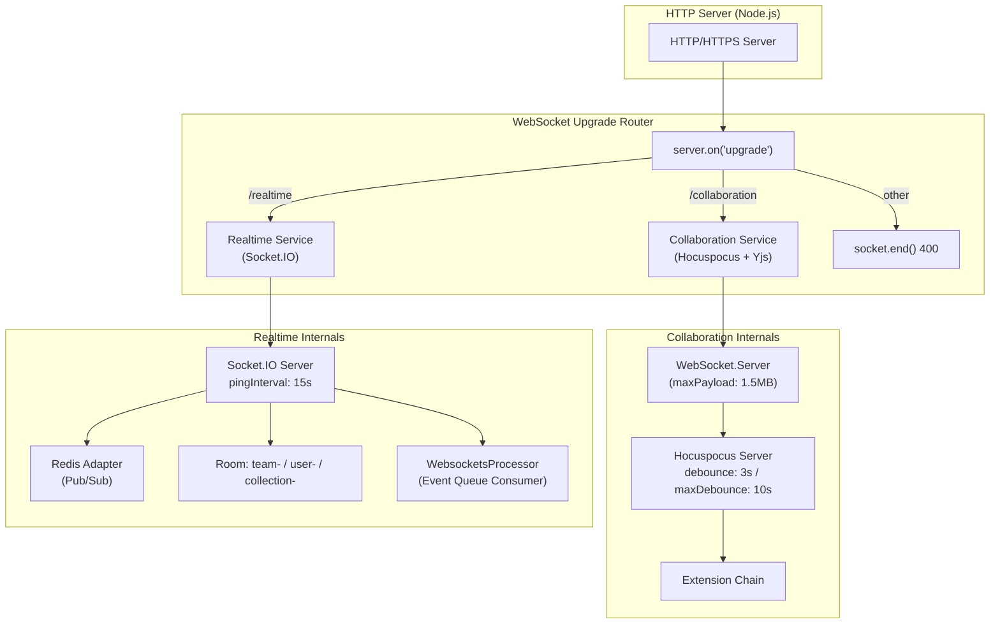
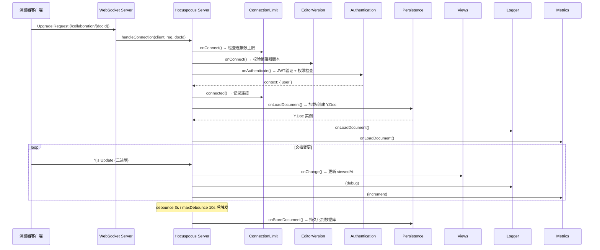
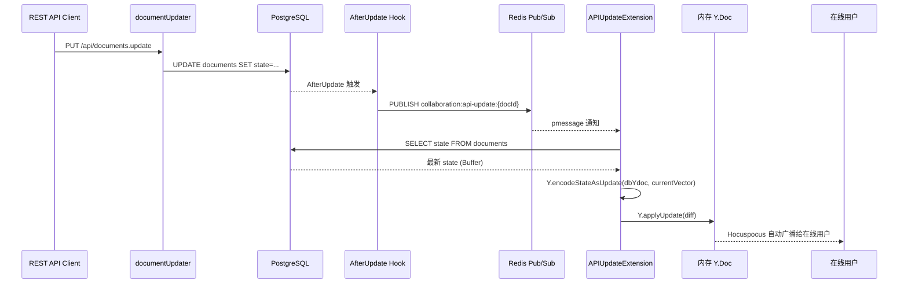

Outline 的实时协作系统是一个建立在 **Yjs CRDT** 引擎和 **Hocuspocus** 协作服务器之上的工业级方案。它与一套基于 Socket.IO 的通用事件推送系统并行运行，共同构成了"多人同时编辑一份文档"的完整能力闭环。本页将深入剖析这两套 WebSocket 通道的架构差异、协作编辑器的服务端扩展链、文档状态的持久化与冲突解决机制，以及前端的 Provider 集成模式。

Sources: [collaboration.ts](server/services/collaboration.ts#L1-L144), [websockets.ts](server/services/websockets.ts#L1-L247)

## 双通道 WebSocket 架构总览

Outline 运行两套独立的 WebSocket 系统，各自承载不同的职责域：

| 维度 | 协作通道 (Collaboration) | 事件通道 (Realtime) |
|------|--------------------------|---------------------|
| **路径** | `/collaboration` | `/realtime` |
| **底层协议** | 原生 WebSocket (ws 库) | Socket.IO |
| **核心引擎** | Hocuspocus Server + Yjs | Socket.IO + Redis Adapter |
| **主要职责** | 文档 CRDT 状态同步、光标感知 | 实体变更广播（增删改归档） |
| **数据格式** | Yjs 二进制更新 (Update) | JSON 事件载荷 |
| **水平扩展** | 需要 `REDIS_COLLABORATION_URL` | 通过 Redis Pub/Sub 适配器 |
| **独立部署** | 可通过 Procfile 独立进程 | 与 web 服务同进程 |

两套系统共享同一个 HTTP Server 的 `upgrade` 事件处理器，通过 URL 前缀 `/collaboration` 和 `/realtime` 进行请求分发。未被任何通道匹配的升级请求将被直接关闭。

Sources: [collaboration.ts](server/services/collaboration.ts#L67-L100), [websockets.ts](server/services/websockets.ts#L57-L98), [index.ts](server/index.ts#L35-L42)



Sources: [collaboration.ts](server/services/collaboration.ts#L30-L100), [websockets.ts](server/services/websockets.ts#L30-L98)

## 协作服务的扩展链

Hocuspocus 服务器通过**扩展（Extension）**机制实现关注点分离。每个扩展在连接生命周期的特定钩子中被调用，形成一个有序的处理管道。Outline 注册了以下扩展，按照依赖关系和执行优先级排列：



Sources: [collaboration.ts](server/services/collaboration.ts#L44-L95), [ConnectionLimitExtension.ts](server/collaboration/ConnectionLimitExtension.ts#L1-L102)

### 连接准入控制：ConnectionLimitExtension 与 EditorVersionExtension

**ConnectionLimitExtension** 维护一个 `Map<documentName, Set<socketId>>` 结构，在每个文档维度追踪活跃连接数。当连接数达到 `COLLABORATION_MAX_CLIENTS_PER_DOCUMENT`（默认 100）时，新的连接将在 `onConnect` 钩子中被拒绝，返回 `TooManyConnections`（关闭码 4503）。连接断开时在 `onDisconnect` 中清理计数。

**EditorVersionExtension** 在连接建立时从请求参数中提取 `editorVersion`，将其主版本号与服务端的 `EDITOR_VERSION` 常量比较。若客户端主版本号落后，连接将被拒绝并返回 `EditorUpdateRequired`（关闭码 4999），强制用户刷新页面获取新版本。这一机制避免了不兼容的编辑器版本同时操作同一文档导致的不可预测行为。

Sources: [ConnectionLimitExtension.ts](server/collaboration/ConnectionLimitExtension.ts#L56-L80), [EditorVersionExtension.ts](server/collaboration/EditorVersionExtension.ts#L1-L47), [CloseEvents.ts](shared/collaboration/CloseEvents.ts#L1-L53)

### 认证与授权：AuthenticationExtension

认证扩展从 Hocuspocus 的 `token` 参数中提取 JWT，通过 `getUserForJWT` 进行验证（限定 `session` 和 `collaboration` 两种认证类型）。认证成功后，系统加载文档并使用 CanCan 策略引擎执行双重权限检查：

1. **读取权限** — `can(user, "read", document)` 失败则拒绝连接
2. **写入权限** — `can(user, "update", document)` 失败则将连接标记为 `readOnly`，此时 Hocuspocus 不会接受该客户端的变更同步

这种设计使得只读用户仍能实时看到其他人的编辑，但自身不会产生任何 Yjs 更新操作。

Sources: [AuthenticationExtension.ts](server/collaboration/AuthenticationExtension.ts#L1-L42)

### WebSocket 错误码体系

Outline 定义了一套自定义 WebSocket 关闭码，用于区分不同类型的连接中断原因：

| 关闭码 | 常量名 | 含义 |
|--------|--------|------|
| 1009 | `DocumentTooLarge` | 文档状态超过 1.5MB 的 `maxPayload` 限制 |
| 4401 | `AuthenticationFailed` | JWT 无效或缺失 |
| 4403 | `AuthorizationFailed` | 用户无权访问该文档 |
| 4408 | `ConnectionTimeout` | 服务器等待超时 |
| 4503 | `TooManyConnections` | 单文档连接数超过上限 |
| 4999 | `EditorUpdateError` | 客户端编辑器版本过旧 |

前端 `ConnectionStatus` 组件根据这些关闭码显示对应的本地化提示信息。

Sources: [CloseEvents.ts](shared/collaboration/CloseEvents.ts#L1-L53), [ConnectionStatus.tsx](app/scenes/Document/components/ConnectionStatus.tsx#L1-L106)

## 文档持久化：PersistenceExtension

`PersistenceExtension` 是协作系统中最核心的扩展，负责 Y.Doc 的加载与持久化。它实现了 Hocuspocus 的三个关键生命周期钩子：

### onLoadDocument：文档状态的懒加载

当第一个用户连接到某文档时，Hocuspocus 触发 `onLoadDocument`。该钩子采用**三级回退策略**加载文档状态：

1. **内存缓存** — 检查 Hocuspocus 是否已有该字段（`"default"`）的非空 Y.Doc，若有则直接返回，避免重复加载
2. **数据库 state 列** — 查询 `Document.state`（`bytea` 类型的 Yjs 编码状态），若存在则 `Y.applyUpdate` 还原为 Y.Doc
3. **首次迁移** — 若 `state` 列为空（旧文档尚未迁移到 CRDT），在事务锁保护下将 `content`（Prosemirror JSON）或 `text`（Markdown）通过 `ProsemirrorHelper.toYDoc` 转换为 Y.Doc，并将生成的 `state` 回写数据库

第三步的"双检锁"（Double-Check Locking）模式至关重要：先在事务外快速检查 `state` 是否存在，仅在确实为空时才进入 `SELECT ... FOR UPDATE` 事务，避免了每次加载都获取排他锁的性能开销。

Sources: [PersistenceExtension.ts](server/collaboration/PersistenceExtension.ts#L18-L95), [ProsemirrorHelper.tsx](server/models/helpers/ProsemirrorHelper.tsx#L108-L130)

### onChange：协作者追踪

每次文档变更时，`onChange` 钩子将当前用户的 ID 追加到 Redis 的 `collaborators:{documentId}` 集合中。这个集合用于在持久化时确定**哪些用户参与了本次编辑会话**，从而正确归因 `lastModifiedById`。

Sources: [PersistenceExtension.ts](server/collaboration/PersistenceExtension.ts#L97-L112)

### onStoreDocument：防抖持久化

Hocuspocus 配置了 `debounce: 3000`（3 秒防抖）和 `maxDebounce: 10000`（10 秒最大延迟），确保在频繁编辑时不会对数据库造成过大压力，同时保证即使持续编辑也不会无限延迟持久化。`onStoreDocument` 钩子的核心流程如下：

1. 从 Redis 获取 `sessionCollaboratorIds`（本次会话的参与者集合）
2. 若集合为空则跳过（没有实际变更）
3. 调用 `documentCollaborativeUpdater` 执行数据库写入

Sources: [PersistenceExtension.ts](server/collaboration/PersistenceExtension.ts#L114-L145), [collaboration.ts](server/services/collaboration.ts#L45-L47)

### documentCollaborativeUpdater：事务性状态写入

`documentCollaborativeUpdater` 是实际执行数据库写入的命令函数，它在数据库事务中完成以下操作：

1. 设置 15 秒的锁超时（`SET LOCAL lock_timeout = '15s'`）
2. 通过 `SELECT ... FOR UPDATE` 获取文档行的排他锁，防止并发写入冲突
3. 将当前 Y.Doc 编码为 Prosemirror JSON（`yDocToProsemirrorJSON`）和二进制状态（`Y.encodeStateAsUpdate`）
4. 使用 `fast-deep-equal` 对比新旧 `content`，若完全一致则跳过写入
5. 合并协作者 ID 列表（来自数据库记录 + 本次会话 + Yjs PermanentUserData）
6. 更新文档的 `content`、`state`、`lastModifiedById`、`collaboratorIds`、`editorVersion`
7. 调度异步事件 `documents.update`（标记 `multiplayer: true`）

关键设计决策：**更新操作禁用了 Sequelize hooks**（`hooks: false`），这是为了避免触发 Document 模型的 `AfterUpdate` 钩子导致无限循环处理。

Sources: [documentCollaborativeUpdater.ts](server/commands/documentCollaborativeUpdater.ts#L1-L121)

## API 与协作的双向同步：APIUpdateExtension

Outline 存在两条修改文档的路径：**协作通道**（WebSocket → Yjs → 数据库）和 **API 通道**（REST API → `documentUpdater` → 数据库）。`APIUpdateExtension` 解决了两条路径之间的状态同步问题。

### 机制原理

当文档通过 API 更新时，Document 模型的 `AfterUpdate` 钩子 `notifyCollaborationServer` 检测到 `state` 字段变化后，调用 `APIUpdateExtension.notifyUpdate(documentId, actorId)` 向 Redis 发布频道 `collaboration:api-update:{documentId}` 发送通知。

协作服务实例中的 `APIUpdateExtension` 订阅了 `collaboration:api-update:*` 频道模式。当收到消息时：

1. 查找该文档的内存 Y.Doc（`this.documents` Map）
2. 若文档未被当前实例加载（无人在线编辑），忽略
3. 从数据库加载最新 `state`，创建临时 Y.Doc
4. 使用 `Y.encodeStateAsUpdate(dbYdoc, currentStateVector)` 计算**差异更新**
5. 将差异通过 `Y.applyUpdate` 合并到内存中的活跃 Y.Doc

这一设计巧妙地利用了 Yjs 的**增量状态向量**机制：不是替换整个文档，而是只传输缺失的变更，最小化内存中的状态操作开销。

Sources: [APIUpdateExtension.ts](server/collaboration/APIUpdateExtension.ts#L1-L211), [Document.ts](server/models/Document.ts#L580-L608)



Sources: [APIUpdateExtension.ts](server/collaboration/APIUpdateExtension.ts#L139-L190), [Document.ts](server/models/Document.ts#L580-L608)

## 前端协作集成

### MultiplayerEditor：协作编辑器的入口

`MultiplayerEditor` 组件是前端协作编辑的核心容器，负责初始化并管理三个关键的客户端对象：

1. **Y.Doc** — 通过 `useState(() => new Y.Doc())` 创建，整个组件生命周期内保持单一实例
2. **IndexeddbPersistence** — 本地持久化层，将 Y.Doc 状态缓存到浏览器 IndexedDB，实现离线编辑和快速重连恢复
3. **HocuspocusProvider** — 与服务端 Hocuspocus 的 WebSocket 连接，传递 `editorVersion` 参数和 JWT token

组件在 `useLayoutEffect` 中初始化 Provider（而非 `useState` 或 `useMemo`），这是为了避免 React StrictMode 的双重渲染导致孤儿 WebSocket 连接。

Sources: [MultiplayerEditor.tsx](app/scenes/Document/components/MultiplayerEditor.tsx#L1-L200)

### 连接生命周期管理

MultiplayerEditor 实现了精细的连接状态管理：

- **认证失败重试**：监听 `authenticationFailed` 事件，使用指数退避策略重新获取 token 后重连
- **空闲断连**：利用 `useIdle` 和 `usePageVisibility` 钩子，当用户空闲且页面不可见时主动断开 WebSocket，恢复可见时自动重连，减少不必要的连接占用
- **本地/远程同步检测**：通过 `isLocalSynced`（IndexedDB）和 `isRemoteSynced`（Hocuspocus）两个标志位协调编辑器就绪状态
- **缓存降级渲染**：在协作文档加载期间，先以只读模式渲染 IndexedDB 或 API 缓存的内容，避免编辑器空白闪烁

Sources: [MultiplayerEditor.tsx](app/scenes/Document/components/MultiplayerEditor.tsx#L200-L361)

### Multiplayer Extension：Prosemirror 的协作桥梁

`Multiplayer` 扩展是 Yjs 与 Prosemirror 编辑器之间的桥梁，它向编辑器注入三个核心插件：

| 插件 | 功能 |
|------|------|
| `ySyncPlugin` | 将 Yjs 的 `XmlFragment` 类型绑定到 Prosemirror 的文档模型，实现双向同步 |
| `yCursorPlugin` | 通过 Awareness 协议渲染远程用户的光标和选区，支持颜色区分和自动隐藏（10 秒无更新后透明度归零） |
| `yUndoPlugin` | 提供协作环境下的撤销/重做功能（与 Yjs 的事务历史集成） |

扩展还实现了 **PermanentUserData 映射**：在用户首次做出实际编辑时，将 `clientId → userId` 的映射写入 Y.Doc 的持久化用户数据中，确保协作者身份信息在 Yjs 状态中持久保留。

Sources: [Multiplayer.ts](app/editor/extensions/Multiplayer.ts#L1-L140)

### Presence 系统：实时在线感知

**DocumentPresenceStore** 是一个 MobX 可观察存储，追踪每个文档的在线用户及其编辑状态。它通过两种方式接收更新：

1. **Awareness 事件**：`HocuspocusProvider` 的 `awarenessChange` 事件携带每个客户端的 `{ user, cursor }` 状态，PresenceStore 据此更新 `isEditing` 标志
2. **Touch 机制**：远程同步完成后调用 `presence.touch(documentId, userId, false)` 标记用户在线，并设置 30 秒超时自动离场

前端 `Collaborators` 组件消费 PresenceStore 数据，按"当前在线 > 历史协作者"的优先级排序渲染头像，并支持点击头像进入**跟随模式**（Observing Mode）。

Sources: [DocumentPresenceStore.ts](app/stores/DocumentPresenceStore.ts#L1-L133), [Collaborators.tsx](app/components/Collaborators.tsx#L1-L184)

## Yjs CRDT 与冲突解决机制

### 核心原理

Yjs 使用 **Conflict-free Replicated Data Type (CRDT)** 算法解决并发编辑冲突。与 Operational Transformation (OT) 不同，CRDT 不需要中央服务器参与冲突裁决——每个客户端可以独立地合并任何顺序的更新操作。

Yjs 内部将文档表示为**有序项的双向链表**，每个项拥有全局唯一的 `clientId + clock` 标识符。当两个客户端同时编辑同一段落时：

1. 各自生成独立的 Yjs Update（二进制格式）
2. Update 通过 Hocuspocus 广播给所有在线客户端
3. 每个客户端通过 `Y.applyUpdate` 将新项插入链表的正确位置
4. 若存在位置冲突（两个项被插入到同一锚点之后），Yjs 使用 `clientId` 作为确定性排序依据，保证所有客户端最终收敛到相同状态

### 协作者归因

`documentCollaborativeUpdater` 通过三路合并确定 `lastModifiedById`（文档的最后修改者）：

```
数据库 collaboratorIds + Redis 会话 collaboratorIds + Yjs PermanentUserData clientId→userId
```

三者的并集构成完整的协作者列表，而最后一个会话协作者被选为 `lastModifiedById`（除非文档已被删除）。

Sources: [documentCollaborativeUpdater.ts](server/commands/documentCollaborativeUpdater.ts#L56-L96), [multiplayer.ts](shared/editor/lib/multiplayer.ts#L1-L50)

## Realtime 事件通道：Socket.IO

Socket.IO 通道承载**非协作性**的实时通知，采用基于房间（Room）的发布-订阅模型。用户认证后自动加入以下房间：

- `team-{teamId}` — 团队级广播
- `user-{userId}` — 用户级定向消息
- `collection-{collectionId}` — 集合级变更通知（权限过滤）
- `group-{groupId}` — 群组级通知

`WebsocketsProcessor` 从 Bull 队列消费事件，根据事件类型查询数据库并序列化为 JSON，通过 `socketio.to(room).emit(event, data)` 推送给相关用户。这一通道处理的事件类型涵盖：文档创建/更新/删除/归档、集合变更、评论、通知、星标、订阅、导入状态等。

Sources: [websockets.ts](server/services/websockets.ts#L130-L210), [WebsocketsProcessor.ts](server/queues/processors/WebsocketsProcessor.ts#L1-L50)

## 水平扩展与部署考量

协作服务的水平扩展依赖 Redis：

- **无 Redis 模式**：若未设置 `REDIS_COLLABORATION_URL`，协作服务**强制单进程运行**（`webProcessCount = 1`），因为 Y.Doc 状态仅存在于单进程内存中
- **Redis 模式**：`@hocuspocus/extension-redis` 通过 Redis Pub/Sub 在多个进程间同步 Yjs 更新，支持多实例部署
- **独立进程部署**：协作服务可通过 `--services=collaboration` 参数作为独立进程启动（见 `Procfile`），与 web 服务解耦

配置方面，关键环境变量包括 `COLLABORATION_URL`（WebSocket 地址，自动从 HTTP URL 转换为 WS 协议）、`COLLABORATION_MAX_CLIENTS_PER_DOCUMENT`（单文档最大连接数）和 `RATE_LIMITER_COLLABORATION_REQUESTS`（协作频率限制）。

Sources: [index.ts](server/index.ts#L35-L42), [collaboration.ts](server/services/collaboration.ts#L48-L52), [env.ts](server/env.ts#L265-L285), [Procfile](server/collaboration/Procfile#L1-L2)

## 延伸阅读

- 关于前端编辑器的底层架构，参见 [Prosemirror 富文本编辑器：节点、标记、插件与扩展机制](7-prosemirror-fu-wen-ben-bian-ji-qi-jie-dian-biao-ji-cha-jian-yu-kuo-zhan-ji-zhi)
- 关于 Yjs 与 Hocuspocus 的集成原理，参见 [实时协同编辑：Yjs 与 Hocuspocus 的集成原理](8-shi-shi-xie-tong-bian-ji-yjs-yu-hocuspocus-de-ji-cheng-yuan-li)
- 关于异步事件队列的处理机制，参见 [异步任务队列：Bull 队列、事件处理器与定时任务](13-yi-bu-ren-wu-dui-lie-bull-dui-lie-shi-jian-chu-li-qi-yu-ding-shi-ren-wu)
- 关于 Redis 的多种用途，参见 [缓存与会话：Redis 的多种用途与存储策略](17-huan-cun-yu-hui-hua-redis-de-duo-chong-yong-tu-yu-cun-chu-ce-lue)
- 关于部署配置，参见 [部署指南：Docker 容器化与环境变量配置](24-bu-shu-zhi-nan-docker-rong-qi-hua-yu-huan-jing-bian-liang-pei-zhi)