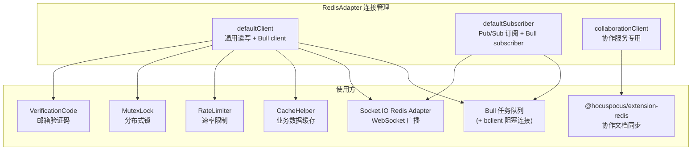
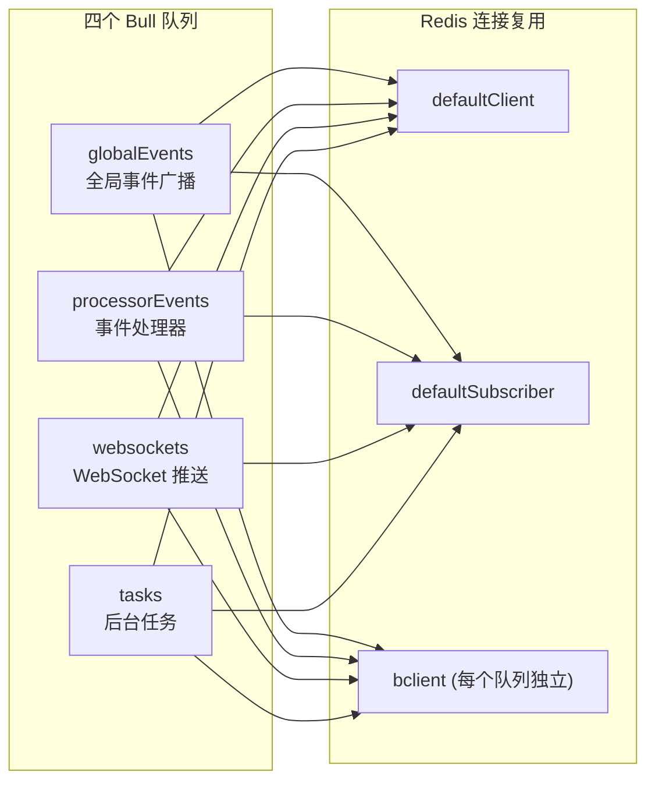
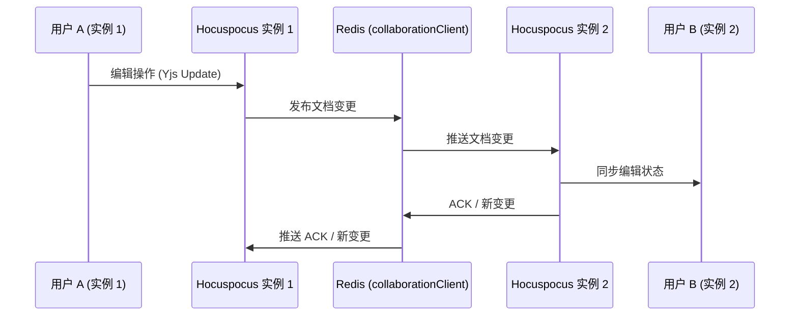
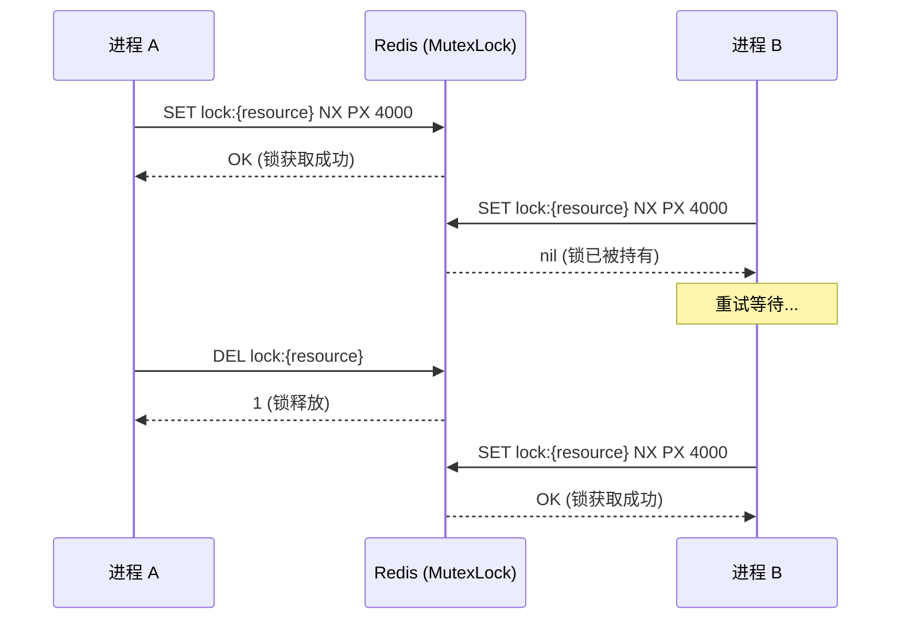

Redis 在 Outline 中并非单一用途的缓存组件——它是支撑异步任务队列、实时协作同步、WebSocket 消息广播、分布式锁、速率限制、验证码管理以及业务数据缓存的核心基础设施。本文将从连接管理架构出发，逐层剖析 Redis 在 Outline 中的 **六大职责域**，帮助中级开发者建立对 Redis 在整个系统中角色的精确认知。

## Redis 连接架构：三种角色的连接池

Outline 的 Redis 客户端封装在 `RedisAdapter` 中，继承自 `ioredis` 的 `Redis` 类，并通过静态属性管理三种不同角色的连接实例。每种连接的职责和配置策略各不相同。

**defaultClient** 是最核心的连接，几乎所有直接数据操作都通过它完成——包括缓存读写、分布式锁、速率限制和验证码存取。**defaultSubscriber** 专门用于 Pub/Sub 订阅场景，它设置了 `maxRetriesPerRequest: null`（不限制单次请求重试次数），因为阻塞式命令（如 BLPOP、SUBSCRIBE）需要连接长期挂起等待，超时限制会导致命令中断。Bull 的 subscriber 角色正是利用这种长连接监听任务事件。**collaborationClient** 是可选的独立连接，当配置了 `REDIS_COLLABORATION_URL` 时才会创建，用于 Hocuspocus 协作服务跨实例的文档状态同步；若未配置，协作服务退回到使用 `defaultClient`，但此时协作服务只能以单进程运行。

连接的健康检查机制同样值得注意：非阻塞连接上会启动定时 PING 检测（默认 30 秒间隔，5 秒超时），若 PING 超时则强制断开重连。而阻塞连接和 Pub/Sub 连接被跳过，因为 PING 会排在正在执行的阻塞命令之后，造成虚假超时。连接还内置了 TLS 支持——当 `REDIS_URL` 以 `rediss://` 开头时自动启用加密传输，并兼容 Heroku Redis 的证书策略。

Sources: [redis.ts](server/storage/redis.ts#L1-L164), [utils.ts](server/storage/utils.ts#L1-L14), [env.ts](server/env.ts#L190-L223)

### 连接配置参数

| 环境变量 | 默认值 | 说明 |
|---|---|---|
| `REDIS_URL` | 必填 | 主 Redis 连接地址，支持 `redis://`、`rediss://` 和 `ioredis://`（Base64 编码配置） |
| `REDIS_COLLABORATION_URL` | 空 | 协作服务专用 Redis，配置后支持协作服务多实例部署 |
| `REDIS_HEALTHCHECK_INTERVAL` | `30000` | 健康检查间隔（毫秒） |
| `REDIS_HEALTHCHECK_TIMEOUT` | `5000` | PING 超时阈值（毫秒），超时后强制重连 |

Sources: [.env.sample](.env.sample#L70-L83)

## 职责一：异步任务队列（Bull）

Bull 是 Outline 异步任务处理的骨架，完全依赖 Redis 作为消息代理。Outline 定义了四个队列，每个队列需要三种 Redis 连接：**client**（常规命令，复用 `defaultClient`）、**subscriber**（监听事件，复用 `defaultSubscriber`）和 **bclient**（阻塞式命令，每次创建新连接）。

| 队列名 | 用途 | 重试策略 |
|---|---|---|
| `globalEvents` | 跨进程的全局事件广播 | 5 次，指数退避（起始 1s） |
| `processorEvents` | 事件处理器分发（如 Webhook 投递、邮件发送） | 5 次，指数退避（起始 10s） |
| `websockets` | 通过 Socket.IO 向客户端推送实时事件 | 无重试，10s 超时 |
| `tasks` | 后台任务（如附件删除、SSO 验证、导入） | 5 次，指数退避（起始 10s） |

队列的 Redis Key 前缀格式为 `queue.{snake_case_name}`，例如 `queue.global_events`。Bull 在 Redis 中存储的数据包括：待处理任务列表（List）、活跃任务（List）、延迟任务（Sorted Set）、失败/完成任务（List）以及任务事件（Pub/Sub 消息）。

Sources: [queue.ts](server/queues/queue.ts#L1-L69), [index.ts](server/queues/index.ts#L1-L55)

## 职责二：实时协作与 WebSocket 广播

Outline 的实时通信分为两条路径，各自使用不同的 Redis 机制。

**Socket.IO Redis Adapter** 负责非协作类实时事件（如文档更新通知、权限变更、用户状态变化）的跨进程广播。它使用 `defaultClient` 作为发布端、`defaultSubscriber` 作为订阅端，通过 Redis Pub/Sub 将事件从产生事件的进程传递到所有持有 WebSocket 连接的进程。

**Hocuspocus Redis Extension** 负责协作编辑场景。当配置了 `REDIS_COLLABORATION_URL` 时，多个协作服务实例通过 Redis 共享 Yjs 文档状态，使得不同用户连接到不同实例时仍然可以实时协同编辑。这是横向扩展协作服务的前提条件——未配置时，系统强制限制 `webProcessCount = 1`，确保协作服务以单进程运行。

Sources: [websockets.ts](server/services/websockets.ts#L95-L108), [collaboration.ts](server/services/collaboration.ts#L44-L71), [index.ts](server/index.ts#L34-L47)

## 职责三：业务数据缓存（CacheHelper + RedisPrefixHelper）

`CacheHelper` 提供了统一的缓存读写接口，底层使用 `defaultClient`。它支持泛型数据类型，所有数据在存储前经过 `JSON.stringify` 序列化，读取时通过 `JSON.parse` 反序列化。默认缓存过期时间为 **1 天**（`Day.seconds`）。

`CacheHelper.getDataOrSet` 是最核心的方法，实现了 **带分布式锁的 Cache-Aside 模式**：先查缓存，命中则直接返回；未命中时获取分布式锁（防止缓存击穿导致多个请求同时回源），双重检查缓存后执行回调获取数据并写入缓存。这种模式确保了在高并发场景下，即使缓存过期，也只有一个请求穿透到数据库。

`RedisPrefixHelper` 集中管理所有缓存 Key 的生成规则，建立了统一的命名空间：

| 缓存类别 | Key 格式 | 过期策略 | 用途 |
|---|---|---|---|
| Unfurl 数据 | `unfurl:{teamId}:{url}` | 默认 1 天 | 链接预览卡片数据缓存 |
| 集合文档结构 | `cd:{collectionId}` | 60 秒 | 集合的文档树形导航结构 |
| Embed 检查 | `embed:{url}` | 默认 1 天 | URL 嵌入检查结果 |
| 用户集合权限 | `uc:{userId}` | 10 秒 | 用户可访问的集合 ID 列表 |
| 计数器缓存 | `count:{Model}:{relation}:{id}` | 默认 1 天 | 关联关系计数（如成员数、未解决评论数） |

Sources: [CacheHelper.ts](server/utils/CacheHelper.ts#L1-L157), [RedisPrefixHelper.ts](server/utils/RedisPrefixHelper.ts#L1-L62)

### 缓存失效策略

Outline 的缓存失效遵循两个核心原则：**精确失效**和**事务感知**。

**精确失效**通过 `CacheHelper.removeData`（单 Key 删除）和 `CacheHelper.clearData`（前缀批量删除）实现。例如，当集合的 `documentStructure` 字段变更时，`Collection.onBeforeSave` 钩子会清除该集合的文档结构缓存；当 `UserMembership` 创建或删除时，会清除对应用户的集合权限 ID 缓存。

**事务感知**体现在缓存的写入和失效时机上。`Collection.cacheDocumentStructure` 在事务提交后才将新数据写入缓存（通过 `transaction.afterCommit`），确保其他并发读取者不会在事务回滚后读到脏数据。`CounterCache` 装饰器同样遵循这一模式——在 `afterCreate`/`afterDestroy` 钩子中延迟失效到事务提交后执行。

Sources: [Collection.ts](server/models/Collection.ts#L347-L380), [UserMembership.ts](server/models/UserMembership.ts#L227-L317), [CounterCache.ts](server/models/decorators/CounterCache.ts#L50-L73), [Comment.ts](server/models/Comment.ts#L210-L224)

### CounterCache 装饰器

`CounterCache` 是一个基于 TypeScript 装饰器的关联计数缓存方案。它将 `getDataOrSet` 模式封装为属性描述符，使得模型可以直接以属性访问的方式获取关联计数。例如，`Group` 模型的 `members` 属性被装饰后，读取 `group.members` 时自动从 Redis 缓存获取，缓存未命中时执行 `SELECT COUNT(*)` 并回填。当关联的子模型（如 `GroupUser`）创建或销毁时，装饰器注册的 `afterCreate`/`afterDestroy` 钩子自动使缓存失效。

Sources: [CounterCache.ts](server/models/decorators/CounterCache.ts#L1-L109)

## 职责四：分布式互斥锁（MutexLock / Redlock）

`MutexLock` 基于 Redlock 算法实现分布式互斥锁，使用 `defaultClient` 作为锁存储后端。Redlock 通过在多个 Redis 实例上设置带 TTL 的 Key 来实现锁语义，Outline 当前使用单 Redis 实例（一个节点的 Redlock），但保留了 Redlock 的完整重试和错误处理框架。

锁的配置参数：重试次数 120 次、重试间隔 1 秒、抖动 100 毫秒。默认锁超时 4 秒。

分布式锁在 Outline 中有三个关键应用场景：

**数据库迁移锁**（`startup.ts`）——确保多进程部署时只有一个进程执行 pending 的数据库迁移。锁超时设为 10 分钟（`10 * Minute.ms`），并通过 `releaseOnShutdown` 选项注册到 `ShutdownHelper`，确保进程优雅退出时释放锁。

**SSO 访问验证锁**（`ValidateSSOAccessTask`）——使用 `MutexLock.using` 模式执行自动续期的锁。在验证用户的 SSO 身份有效性期间持有锁，通过 `RedlockAbortSignal` 在锁无法续期时中断执行，避免在用户身份验证结果不确定的情况下继续执行后续操作。

**缓存写入锁**（`CacheHelper.getDataOrSet`）——在缓存回源时防止缓存击穿，多个并发请求只有一个会穿透到数据源。

Sources: [MutexLock.ts](server/utils/MutexLock.ts#L1-L110), [startup.ts](server/utils/startup.ts#L12-L51), [ValidateSSOAccessTask.ts](server/queues/tasks/ValidateSSOAccessTask.ts#L1-L69)

## 职责五：API 速率限制（RateLimiter）

Outline 的速率限制基于 `rate-limiter-flexible` 库，以 Redis 作为令牌桶的持久化存储。每个请求按用户 ID（已认证）或 IP 地址（未认证）作为限流 Key。

**Token-to-User 缓存**是一个巧妙的优化：首次验证 JWT Token 后，将 Token 的 SHA-256 哈希与用户 ID 的映射存入 Redis（Key 格式 `rl:tok:{sha256(token)}`，TTL 3600 秒）。后续请求只需一次 Redis `GET` 即可获取用户 ID，避免了每次请求都执行 JWT 解码和数据库查询的昂贵开销。用户登出时通过 `clearCachedToken` 立即删除映射，使已撤销的 Token 停止享受用户级限流配额。

速率限制还设计了**保险机制**：当 Redis 不可用时，自动降级到内存限流器（`RateLimiterMemory`），确保 Redis 故障不会导致限流完全失效。

系统预定义了多种限流策略，按 API 路由粒度配置：

| 策略 | 窗口 | 请求数 | 典型场景 |
|---|---|---|---|
| `FivePerMinute` | 60s | 5 | 敏感操作（如密码修改） |
| `TenPerMinute` | 60s | 10 | 中等敏感操作 |
| `TwentyFivePerMinute` | 60s | 25 | 一般写入操作 |
| `OneHundredPerMinute` | 60s | 100 | 高频读取操作 |
| `FivePerHour` | 3600s | 5 | 极敏感操作 |
| `TenPerHour` | 3600s | 10 | 邮件发送等 |

Sources: [RateLimiter.ts](server/utils/RateLimiter.ts#L1-L162), [rateLimiter.ts](server/middlewares/rateLimiter.ts#L1-L146)

## 职责六：验证码、OAuth 意图与临时状态

### 邮箱验证码

`VerificationCode` 使用 Redis 存储 6 位数字验证码，Key 格式为 `email_verification_code:{teamId}:{email}`，TTL 为 10 分钟。验证时同步维护 `email_verification_attempts:{teamId}:{email}` 计数器，超过 10 次尝试自动删除验证码，防止暴力破解。首次创建尝试计数器时设置与验证码相同的过期时间（`pexpire`），确保计数器不会无限期残留。

Sources: [VerificationCode.ts](server/utils/VerificationCode.ts#L1-L151)

### OAuth 意图存储

OAuth 跨域流程中，`passport.ts` 使用 Redis 实现了一次性意图令牌。当用户从自定义域名发起 OAuth 登录时，系统生成一个签名意图令牌并存入 Redis（Key 格式 `oauth:intent:{hash(token)}`，TTL 10 分钟），然后重定向到主域名。主域名回调时使用 `GETDEL` 命令原子性地读取并删除令牌，确保每个意图令牌只能被消费一次（consume-once 语义），防止重放攻击。

Sources: [passport.ts](server/utils/passport.ts#L380-L396)

### 协作者追踪

在实时协作编辑期间，`PersistenceExtension` 使用 Redis Set 追踪每个文档的编辑者。每当用户修改文档时，通过 `SADD` 将用户 ID 添加到 `collaborators:{documentId}` 集合中。当文档持久化触发时（Hocuspocus 的 `onStoreDocument` 回调），读取集合并获取所有参与编辑的用户 ID，写入修订版本的 `collaboratorIds` 字段，然后删除该集合。这一机制确保了协作者信息的准确性——即使多个用户同时编辑，每个贡献者都被正确记录。

Sources: [PersistenceExtension.ts](server/collaboration/PersistenceExtension.ts#L95-L135), [Document.ts](server/models/Document.ts#L420-L428), [RevisionsProcessor.ts](server/queues/processors/RevisionsProcessor.ts#L20-L35)

### 软件更新通知

`updates.ts` 使用 Redis 缓存软件版本更新检查的结果。每次检查时先删除旧的 `UPDATES_KEY`，然后向更新服务器查询。若发现有重要更新，将严重级别、消息和链接缓存到 Redis（不设 TTL，永久有效直到下次检查覆盖）。

Sources: [updates.ts](server/utils/updates.ts#L1-L62)

## Redis Key 命名空间总览

以下是 Outline 中所有 Redis Key 的命名空间汇总，按前缀分类：

| Key 前缀 | 类型 | 数据类型 | TTL | 所属模块 |
|---|---|---|---|---|
| `queue.*` | Bull 管理 | List/Sorted Set/Hash | 按任务配置 | 任务队列 |
| `rl:{identifier}` | 速率限制 | String (计数器) | 按窗口时长 | RateLimiter |
| `rl:tok:{hash}` | Token 缓存 | String (userId) | 3600s | RateLimiter |
| `email_verification_code:{teamId}:{email}` | 验证码 | String | 10min | VerificationCode |
| `email_verification_attempts:{teamId}:{email}` | 尝试计数 | String (整数) | 10min | VerificationCode |
| `unfurl:{teamId}:{url}` | 链接预览 | JSON | 1d | CacheHelper |
| `cd:{collectionId}` | 集合文档结构 | JSON | 60s | CacheHelper |
| `embed:{url}` | 嵌入检查 | JSON | 1d | CacheHelper |
| `uc:{userId}` | 用户集合权限 | JSON (string[]) | 10s | CacheHelper |
| `count:{Model}:{relation}:{id}` | 计数缓存 | Number | 1d | CounterCache |
| `collaborators:{documentId}` | 协作者集合 | Set | 编辑期间 | PersistenceExtension |
| `oauth:intent:{hash}` | OAuth 意图 | String ("1") | 10min | passport.ts |
| `UPDATES_KEY` | 更新通知 | JSON | 无限 | updates.ts |
| `lock:{key}` | 分布式锁 | String | 按锁超时 | MutexLock/Redlock |

Sources: [RedisPrefixHelper.ts](server/utils/RedisPrefixHelper.ts#L1-L62), [RateLimiter.ts](server/utils/RateLimiter.ts#L13-L17), [VerificationCode.ts](server/utils/VerificationCode.ts#L30-L37), [passport.ts](server/utils/passport.ts#L28-L29), [updates.ts](server/utils/updates.ts#L12), [Document.ts](server/models/Document.ts#L426-L428)

## 健康检查与运维考量

Outline 在 `/_health` 端点同时检查 PostgreSQL 和 Redis 的连通性。对 Redis 执行 `PING` 命令，失败时返回 HTTP 500。这一设计使得负载均衡器和监控系统可以统一检测所有关键依赖的健康状态。

Redis 连接本身还内置了周期性健康检查（`RedisAdapter` 构造函数中），以可配置的间隔执行 PING，超时后主动断开并触发 `retryStrategy` 重连。连接名（connection name）基于进程 ID（开发环境）或固定字符串 "outline"（生产环境）加上服务名后缀，便于在 Redis `CLIENT LIST` 中识别各连接的用途。

Sources: [index.ts](server/index.ts#L157-L176), [redis.ts](server/storage/redis.ts#L86-L122)

## 延伸阅读

- Redis 连接管理直接支撑了[异步任务队列：Bull 队列、事件处理器与定时任务](13-yi-bu-ren-wu-dui-lie-bull-dui-lie-shi-jian-chu-li-qi-yu-ding-shi-ren-wu)中的 Bull 队列基础设施
- 协作服务的 Redis 扩展是[实时协作服务：WebSocket、文档持久化与冲突解决](15-shi-shi-xie-zuo-fu-wu-websocket-wen-dang-chi-jiu-hua-yu-chong-tu-jie-jue)中多实例部署的核心前提
- 缓存层与[数据模型层：Sequelize ORM 模型体系与生命周期钩子](10-shu-ju-mo-xing-ceng-sequelize-orm-mo-xing-ti-xi-yu-sheng-ming-zhou-qi-gou-zi)中的生命周期钩子紧密耦合
- 速率限制机制的完整请求处理流程参见[中间件体系：认证、限流、CSRF 与请求上下文](14-zhong-jian-jian-ti-xi-ren-zheng-xian-liu-csrf-yu-qing-qiu-shang-xia-wen)