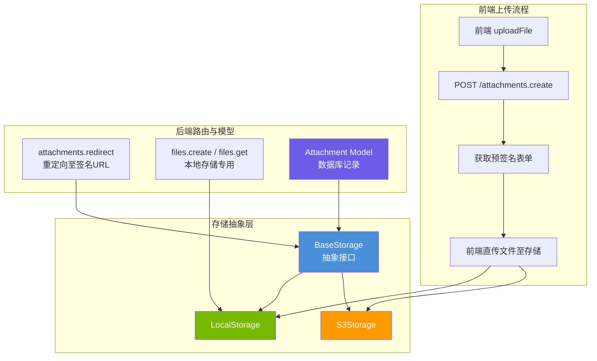
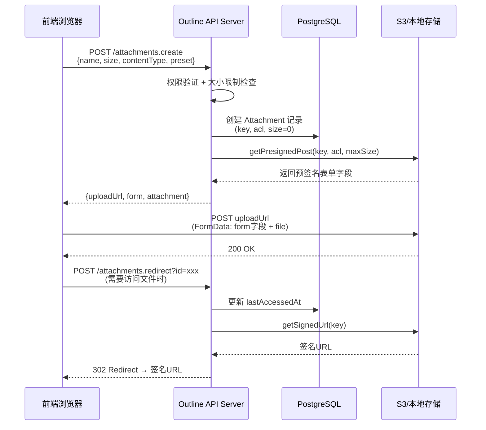

Outline 的文件存储系统采用了**策略模式（Strategy Pattern）**设计，通过统一的抽象层同时支持 S3 兼容对象存储和本地文件系统存储两种后端。整个体系涵盖了从前端文件上传、预签名 URL 生成、后端存储适配，到附件模型的完整生命周期管理。理解这一体系，是掌握 Outline 图片、文档附件、头像以及数据导入等核心功能的基础。

Sources: [index.ts](server/storage/files/index.ts#L1-L9), [BaseStorage.ts](server/storage/files/BaseStorage.ts#L1-L14)

## 存储架构总览

Outline 的文件存储由三层结构组成：**存储抽象层**（`BaseStorage`）定义统一接口，**具体实现层**（`S3Storage` / `LocalStorage`）适配不同后端，**附件模型层**（`Attachment`）负责数据库记录与业务逻辑。存储后端的选择通过环境变量 `FILE_STORAGE` 在启动时单例化——系统只会实例化一种存储实现。



存储后端的实例化逻辑极为简洁——根据 `FILE_STORAGE` 环境变量在模块加载时确定唯一实现：

```typescript
const storage =
  env.FILE_STORAGE === "local" ? new LocalStorage() : new S3Storage();
export default storage;
```

这意味着整个应用生命周期内只有一个存储实例，所有文件操作都通过同一个单例完成。默认值为 `"s3"`，因此不配置时系统会尝试连接 S3 兼容存储。

Sources: [index.ts](server/storage/files/index.ts#L1-L9), [env.ts](server/env.ts#L671-L672)

## BaseStorage：统一存储接口

`BaseStorage` 是一个抽象类，定义了所有存储后端必须实现的 **10 个核心方法**，同时提供了 `storeFromUrl` 和 `getFileBuffer` 等基于核心方法组合的通用实现。

| 方法 | 用途 | 返回值 |
|------|------|--------|
| `getPresignedPost()` | 生成客户端直传所需的预签名表单 | `Promise<Partial<PresignedPost>>` |
| `getFileStream()` | 获取文件读取流，支持 Range 请求 | `Promise<ReadableStream \| null>` |
| `getUploadUrl()` | 获取上传目标 URL | `string` |
| `getUrlForKey()` | 根据 key 生成文件访问 URL | `string` |
| `getSignedUrl()` | 生成带签名的临时访问 URL | `Promise<string>` |
| `store()` | 将文件内容写入存储 | `Promise<string \| undefined>` |
| `getFileHandle()` | 获取本地临时文件路径（用于处理） | `Promise<{path, cleanup}>` |
| `getFileExists()` | 检查文件是否存在 | `Promise<boolean>` |
| `moveFile()` | 移动（重命名）文件 | `Promise<void>` |
| `deleteFile()` | 删除文件 | `Promise<void>` |

`storeFromUrl` 是一个值得深入理解的通用实现：它接受一个远程 URL 或 base64 数据 URL，先下载内容到内存，校验文件大小后调用 `store()` 写入存储。内置了多层防护——base64 URL 会验证解码后的字节长度，远程 URL 的 `fetch` 限制最多 3 次重定向且超时 10 秒，大小校验取调用方传入的 `maxUploadSize` 和全局 `FILE_STORAGE_UPLOAD_MAX_SIZE` 的较小值。对于已存储在本存储中的文件（URL 以 endpoint 开头或是内部 URL），方法会直接返回 `undefined` 避免重复上传。

Sources: [BaseStorage.ts](server/storage/files/BaseStorage.ts#L1-L305)

## S3Storage：S3 兼容存储实现

`S3Storage` 基于 AWS SDK v3 的 `@aws-sdk/client-s3` 实现，天然兼容 AWS S3、MinIO、Ceph 等 S3 协议存储服务。其核心设计特点包括：

**客户端初始化**支持三种配置模式：标准 AWS S3（自动推导 endpoint）、S3 加速端点（通过 `AWS_S3_ACCELERATE_URL`）、以及第三方兼容存储（通过 `AWS_S3_UPLOAD_BUCKET_URL` + `AWS_S3_FORCE_PATH_STYLE`）。`forcePathStyle` 默认为 `true`，这对 MinIO 等非 AWS 服务至关重要，因为它使用路径风格 URL（`host/bucket/key`）而非虚拟主机风格 URL（`bucket.host/key`）。

**预签名上传（Presigned Post）** 的条件策略限制了上传大小范围（`content-length-range`）和内容类型前缀（`starts-with $Content-Type`），有效期为 1 小时。如果配置了 `AWS_S3_ACL`，会将其作为表单字段注入。

**签名 URL 生成**使用了 `@aws-sdk/s3-request-presigner`，默认过期时间为 300 秒（5 分钟），最大不超过 AWS S3 Signature V4 的 7 天限制（604800 秒）。在 Docker 环境下（检测 `http://s3:` URL 模式），签名 URL 会退化为普通 URL，因为本地 fake-s3 不需要签名验证。

Sources: [S3Storage.ts](server/storage/files/S3Storage.ts#L1-L288)

## LocalStorage：本地文件系统存储

`LocalStorage` 是为单机部署场景设计的简化实现。它将文件直接存储在本地文件系统的 `FILE_STORAGE_LOCAL_ROOT_DIR`（默认 `/var/lib/outline/data`）目录下，不依赖任何外部存储服务。

**关键差异点**在于本地模式下文件的上传和下载都通过 Outline 应用自身代理：

| 特性 | S3Storage | LocalStorage |
|------|-----------|-------------|
| 上传 URL | S3 endpoint 或加速 URL | `/api/files.create` |
| 文件访问 URL | S3 bucket URL + key | `/api/files.get?key=<key>` |
| 预签名方式 | AWS Signature V4 | JWT 签名（`SECRET_KEY`） |
| 签名 URL 格式 | S3 预签名 URL | `/api/files.get?sig=<jwt>` |
| 文件存在性检查 | `HeadObjectCommand` | `fs.pathExists()` |
| 文件移动 | Copy + Delete | `fs.move()` |

本地存储通过 `plugins/storage` 插件注册额外的 API 路由（`files.create` 和 `files.get`）来处理文件的接收和分发。`files.get` 端点支持 HTTP Range 请求，这对大文件（如视频）的流式播放至关重要。签名验证使用 JWT——令牌 payload 中包含 `key`（文件路径）和 `type: "attachment"` 类型标记，通过 `SECRET_KEY` 签发和验证。

Sources: [LocalStorage.ts](server/storage/files/LocalStorage.ts#L1-L189), [files.ts](plugins/storage/server/api/files.ts#L1-L211), [index.ts](plugins/storage/server/index.ts#L1-L43)

## Attachment 模型：数据层的核心

`Attachment` 是 Sequelize ORM 模型，存储在 `attachments` 数据库表中，记录每个文件的元数据和归属关系。其核心字段如下：

| 字段 | 类型 | 说明 |
|------|------|------|
| `id` | UUID | 主键 |
| `key` | string (max 4096) | 存储路径，格式为 `<bucket>/<userId>/<uuid>/<filename>` |
| `contentType` | string (max 255) | MIME 类型 |
| `size` | BIGINT | 文件大小（字节） |
| `acl` | enum | `"private"` 或 `"public-read"` |
| `lastAccessedAt` | Date | 最后访问时间（用于追踪） |
| `expiresAt` | Date | 过期时间（用于临时附件如导入文件） |
| `teamId` | UUID (FK) | 所属团队 |
| `documentId` | UUID (FK, nullable) | 关联文档 |
| `userId` | UUID (FK) | 上传者 |

**Key 的结构设计**值得特别关注。它遵循 `<bucket>/<userId>/<uuid>/<filename>` 格式，其中 `bucket` 由 `Buckets` 枚举定义（`uploads`、`public`、`avatars`），中间两段分别为用户 ID 和随机 UUID，确保了全局唯一性和路径遍历安全。Key 的验证（`ValidateKey.isValid`）要求格式为 3-4 段路径，第一段必须是有效 bucket 名，中间两段必须是 UUID。消毒逻辑（`ValidateKey.sanitize`）会过滤掉 `..`、`.` 等路径遍历字符，并对文件名调用 `sanitize-filename` 处理。

Sources: [Attachment.ts](server/models/Attachment.ts#L1-L270), [AttachmentHelper.ts](server/models/helpers/AttachmentHelper.ts#L1-L118), [validation.ts](server/validation.ts#L186-L223)

### 生命周期钩子

Attachment 模型注册了三个重要的 Sequelize 生命周期钩子：

**`@BeforeCreate` — `sanitizeKey`**：在记录创建前对 key 进行消毒，防止路径遍历攻击。

**`@BeforeUpdate` — `preventKeyChange`**：阻止修改已有附件的 key。一旦文件写入存储，其路径不可变更，这是数据一致性的基础保障。

**`@BeforeDestroy` — `deleteAttachmentFromS3`**：在数据库记录删除前，尝试删除存储中的物理文件。注意这里采用了容错设计——即使 S3 删除失败（如权限问题、网络中断），也不会阻塞数据库记录的删除，只会记录警告日志。

Sources: [Attachment.ts](server/models/Attachment.ts#L160-L190)

## 附件上传的完整流程

Outline 的文件上传采用了**客户端直传（Client-Side Direct Upload）**架构，这是云存储应用的最佳实践——文件不经过 Outline 应用服务器中转，而是直接从浏览器上传至 S3 或本地存储端点，大幅降低了服务器的带宽和内存压力。



### 第一阶段：创建附件记录

前端调用 `POST /attachments.create`，传入文件名、大小、内容类型和预设类型（`preset`）。服务端依次执行以下步骤：

1. 根据 `preset` 验证权限——Avatar 预设无需额外授权，DocumentAttachment 需要验证文档更新权限，Emoji 需要验证内容类型白名单
2. 根据 `preset` 计算最大上传大小和 ACL（例如 Import 预设的附件 24 小时后过期）
3. 生成唯一 key：`uploads/<userId>/<randomUUID>/<filename>`
4. 创建 Attachment 数据库记录（此时 `size` 可能为 0，待实际上传后更新）
5. 调用 `FileStorage.getPresignedPost()` 生成预签名表单
6. 返回 `uploadUrl`（S3 endpoint 或 `/api/files.create`）和 `form`（表单字段）

Sources: [attachments.ts](server/routes/api/attachments/attachments.ts#L82-L164), [files.ts](app/utils/files.ts#L46-L132)

### 第二阶段：客户端直传

前端收到响应后，将预签名表单字段和实际文件组装成 `FormData`，通过 `XMLHttpRequest`（而非 `fetch`，因为需要上传进度回调）直接 POST 到 `uploadUrl`。关键细节：如果 `uploadUrl` 与当前页面不同源，`xhr.withCredentials` 会被设为 `false`，避免 CORS 预检请求失败。

对于本地存储模式，文件上传到 `/api/files.create` 端点，该端点会验证上传者身份（通过 key 关联的 `attachment.userId`），并检查文件实际大小不超过声明大小。

Sources: [files.ts](app/utils/files.ts#L46-L132), [files.ts](plugins/storage/server/api/files.ts#L30-L85)

### 第三阶段：文件访问与重定向

当浏览器需要访问附件时（如渲染文档中的图片），分两种路径：

**公开附件（`acl: "public-read"`）**：直接通过 `canonicalUrl` 访问，无需服务端参与。

**私有附件（`acl: "private"`）**：通过 `/api/attachments.redirect?id=<uuid>` 重定向。服务端验证用户身份后（要求是附件所属团队的成员，而非文档级权限），生成签名 URL 并执行 302 重定向。同时更新 `lastAccessedAt` 用于追踪。缓存策略上，公开附件使用 `max-age=604800`（7 天），私有附件使用 `max-age=300`（5 分钟，与签名 URL 默认过期时间一致）。

Sources: [attachments.ts](server/routes/api/attachments/attachments.ts#L269-L322)

## AttachmentPreset：预设类型体系

`AttachmentPreset` 枚举定义了五种附件预设，每种预设决定了不同的上传限制、ACL 策略和过期行为：

| 预设 | 用途 | ACL | 最大大小 | 过期时间 |
|------|------|-----|---------|---------|
| `DocumentAttachment` | 文档内附件 | 由 `AWS_S3_ACL` 决定 | `FILE_STORAGE_UPLOAD_MAX_SIZE` | 永久 |
| `Avatar` | 用户/团队头像 | `public-read` | `FILE_STORAGE_UPLOAD_MAX_SIZE` | 永久 |
| `Emoji` | 自定义表情 | 由 `AWS_S3_ACL` 决定 | 1MB | 永久 |
| `Import` | 文档导入 | 由 `AWS_S3_ACL` 决定 | `FILE_STORAGE_IMPORT_MAX_SIZE` | 24 小时 |
| `WorkspaceImport` | 工作区导入 | 由 `AWS_S3_ACL` 决定 | `FILE_STORAGE_WORKSPACE_IMPORT_MAX_SIZE` | 24 小时 |

值得注意的是，默认的 `AWS_S3_ACL` 为 `"private"`，意味着文档附件默认是私有的，只有团队成员能通过签名 URL 访问。这是 Outline 安全设计的核心——附件的访问控制不在文档级别，而在团队级别。`AttachmentHelper.parseKey()` 方法将 key 解析为 bucket、userId、id、fileName 和 isPublicBucket 五个组成部分，用于在访问控制时快速判断是否需要授权。

Sources: [types.ts](shared/types.ts#L134-L140), [AttachmentHelper.ts](server/models/helpers/AttachmentHelper.ts#L1-L118), [validations.ts](shared/validations.ts#L1-L33)

## URL 上传与异步任务

除了客户端直传，Outline 还支持从远程 URL 创建附件。这通过 `POST /attachments.createFromUrl` 端点和 `UploadAttachmentFromUrlTask` 异步任务实现。

该流程的核心设计在于**同步等待机制**：创建 Attachment 记录后，调度 `UploadAttachmentFromUrlTask`（最多重试 3 次），然后通过 `job.finished()` 阻塞等待任务完成。任务执行时会调用 `FileStorage.storeFromUrl()` 下载远程文件并写入存储，然后更新 Attachment 记录的 `size`、`contentType` 等字段。如果任务失败，错误信息会通过 `job.finished()` 返回给客户端。

对于批量导入场景（如 Notion 导入），系统使用 `UploadAttachmentsForImportTask`，它接受一个 URL 列表，通过信号量（`async-sema`）控制并发上传数为 5，避免压垮存储服务或网络。

Sources: [attachments.ts](server/routes/api/attachments/attachments.ts#L166-L235), [UploadAttachmentFromUrlTask.ts](server/queues/tasks/UploadAttachmentFromUrlTask.ts#L1-L55), [UploadAttachmentsForImportTask.ts](server/queues/tasks/UploadAttachmentsForImportTask.ts#L1-L74)

## attachmentCreator 命令

`attachmentCreator` 是一个可复用的命令函数，封装了从 URL 或 Buffer 创建附件的完整逻辑。它被多个任务和命令调用：

- **`TextHelper`**：处理文档内容中引用的外部图片，将其下载为附件
- **`ImportTask`** / **`MarkdownAPIImportTask`**：导入过程中处理附件
- **`UploadTeamAvatarTask`** / **`UploadUserAvatarTask`**：头像上传
- **`UploadIntegrationLogoTask`**：集成服务 Logo 上传

该命令接受 `UrlProps`（远程 URL）或 `BufferProps`（内存缓冲区）两种输入，根据 `preset` 确定 ACL 和过期策略，生成唯一的存储 key，然后执行存储和数据库记录创建。

Sources: [attachmentCreator.ts](server/commands/attachmentCreator.ts#L1-L96)

## 环境变量配置

以下是文件存储相关的完整环境变量配置参考：

| 环境变量 | 默认值 | 说明 |
|---------|--------|------|
| `FILE_STORAGE` | `"s3"` | 存储后端：`"s3"` 或 `"local"` |
| `FILE_STORAGE_LOCAL_ROOT_DIR` | `/var/lib/outline/data` | 本地存储根目录 |
| `FILE_STORAGE_UPLOAD_MAX_SIZE` | `1000000` (1MB) | 附件最大上传大小（字节） |
| `FILE_STORAGE_IMPORT_MAX_SIZE` | 同上 | 文档导入附件最大大小 |
| `FILE_STORAGE_WORKSPACE_IMPORT_MAX_SIZE` | 同上 | 工作区导入最大大小 |
| `FILE_STORAGE_IMPORT_TIMEOUT` | `60000` | 远程文件下载超时（毫秒） |
| `AWS_ACCESS_KEY_ID` | — | S3 访问密钥 |
| `AWS_SECRET_ACCESS_KEY` | — | S3 密钥 |
| `AWS_REGION` | — | S3 区域 |
| `AWS_S3_UPLOAD_BUCKET_NAME` | — | S3 Bucket 名称 |
| `AWS_S3_UPLOAD_BUCKET_URL` | — | S3 Bucket 公开访问 URL |
| `AWS_S3_ACCELERATE_URL` | — | S3 传输加速 URL（可选） |
| `AWS_S3_FORCE_PATH_STYLE` | `true` | 是否使用路径风格 URL |
| `AWS_S3_ACL` | `"private"` | 默认 ACL 策略 |

Sources: [env.ts](server/env.ts#L620-L730), [.env.sample](.env.sample#L94-L123)

## 权限与安全

附件的权限控制遵循**最小权限原则**，分为多个层级：

**上传权限**：通过 CanCan 策略 `allow(User, "createAttachment", Team, isTeamModel)` 控制——只有团队成员才能上传附件。文档附件还需要通过文档级 `update` 权限验证。

**读取权限**：私有附件通过 `attachments.redirect` 端点访问时，验证用户是附件所属团队的成员。这是**团队级而非文档级**的访问控制——设计上，附件归属于团队而非单个文档，因为附件可以独立于文档存在。

**删除权限**：需要是管理员或附件的所有者（`isOwner`），且如果附件关联了文档，还需要文档的 `update` 权限。

**Key 安全**：`ValidateKey` 类确保所有文件 key 格式正确且不含路径遍历字符，`sanitize` 方法会过滤 `..`、`.` 并使用 `sanitize-filename` 处理文件名中的 `#` 等特殊字符。

Sources: [attachment.ts](server/policies/attachment.ts#L1-L13), [validation.ts](server/validation.ts#L186-L223), [attachments.ts](server/routes/api/attachments/attachments.ts#L279-L286)

## 前端集成

前端的文件上传逻辑集中在 `app/utils/files.ts`，提供两个核心函数：

**`uploadFile(file, options)`**：执行客户端直传流程。先调用 `/attachments.create` 获取预签名表单，再通过 `XMLHttpRequest` 直传文件，支持上传进度回调（`onProgress`）。对于 `Blob` 类型（如压缩后的头像），使用 `file.blob` 和 `file.file` 属性获取底层 File 对象。

**`uploadFileFromUrl(url, options)`**：服务端下载模式，直接调用 `/attachments.createFromUrl`，由后端异步下载并存储远程文件。

`ImageUpload` 组件（用于头像上传）展示了典型的前端上传模式：使用 `compressImage` 工具先压缩图片（最大 512×512），然后以 `AttachmentPreset.Avatar` 预设上传，利用 `react-avatar-editor` 提供裁剪交互。

Sources: [files.ts](app/utils/files.ts#L1-L198), [compressImage.ts](app/utils/compressImage.ts#L1-L15), [ImageUpload.tsx](app/scenes/Settings/components/ImageUpload.tsx#L39-L60)

---

**下一步建议**：理解附件系统后，可以继续探索 [异步任务队列：Bull 队列、事件处理器与定时任务](13-yi-bu-ren-wu-dui-lie-bull-dui-lie-shi-jian-chu-li-qi-yu-ding-shi-ren-wu)，深入了解 `UploadAttachmentFromUrlTask` 等任务的调度机制；或阅读 [插件系统：架构设计与内置插件一览](19-cha-jian-xi-tong-jia-gou-she-ji-yu-nei-zhi-cha-jian-lan)，了解本地存储如何通过插件机制注册路由。