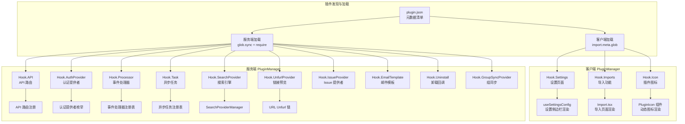
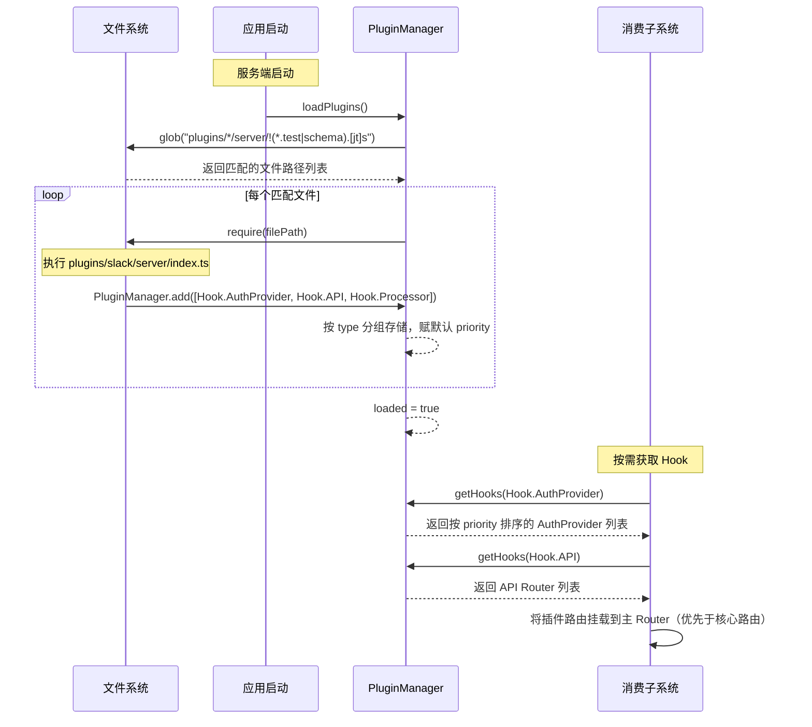

Outline 的插件系统是其可扩展性的核心机制。与许多采用复杂依赖注入容器或事件总线的框架不同，Outline 选择了一种**简洁而高效的双端注册式插件架构**——服务端和客户端各自拥有独立的 `PluginManager`，插件通过声明式 Hook 注册，由框架在特定生命周期节点统一调度。这种设计让功能的开启与关闭仅取决于环境变量配置，无需修改核心代码。

## 整体架构概览

Outline 的插件系统遵循「**约定优于配置**」的原则。每个插件是一个位于 `plugins/` 目录下的独立文件夹，内部按 `client/`、`server/`、`shared/` 三个子目录组织前端组件、后端逻辑和共享代码，并在根目录放置 `plugin.json` 作为元数据清单。框架通过文件系统约定自动发现并加载插件——服务端在启动时通过 `glob` 模式匹配加载 `plugins/*/server/` 下的入口文件，客户端则利用 Vite 的 `import.meta.glob` 懒加载 `plugins/*/client/index.tsx`。



Sources: [PluginManager.ts](server/utils/PluginManager.ts#L1-L154), [PluginManager.ts](app/utils/PluginManager.ts#L1-L175), [index.tsx](app/index.tsx#L32-L33), [index.ts](server/index.ts#L62-L64)

## 插件目录结构与约定

每个插件遵循统一的目录结构约定。一个功能完整的插件（如 Slack）通常包含以下结构：

```
plugins/<plugin-name>/
├── plugin.json           # 元数据清单（必需）
├── client/               # 前端代码
│   ├── index.tsx         # 入口文件，注册客户端 Hook
│   ├── Icon.tsx          # 插件图标组件
│   └── Settings.tsx      # 设置页面组件（可选）
├── server/               # 后端代码
│   ├── index.ts          # 入口文件，注册服务端 Hook
│   ├── env.ts            # 插件专属环境变量
│   ├── auth/             # 认证策略（仅认证插件）
│   ├── api/              # API 路由定义
│   ├── processors/       # 事件处理器
│   └── tasks/            # 异步任务
└── shared/               # 前后端共享代码（可选）
    └── <Plugin>Utils.ts  # 工具函数
```

`plugin.json` 是插件的身份证，定义了插件的唯一标识、显示名称、优先级和部署限制等元信息。其结构如下：

```json
{
  "id": "slack",                    // 唯一标识符
  "name": "Slack",                  // 显示名称
  "priority": 20,                   // 优先级（数值越小越靠前）
  "description": "Adds a Slack...", // 描述文本
  "deployments": ["cloud"],         // 部署限制（可选）
  "after": "github"                 // 在设置页排序位置（可选）
}
```

其中 `deployments` 字段控制插件仅在特定部署类型下生效：`cloud` 表示仅在 Outline 云托管版本中启用，`community` 和 `enterprise` 表示在自托管版本中启用。省略该字段意味着插件在所有部署类型中均可用。

Sources: [plugin.json](plugins/slack/plugin.json#L1-L6), [plugin.json](plugins/zapier/plugin.json#L1-L5), [plugin.json](plugins/matomo/plugin.json#L1-L6)

## 服务端 PluginManager：Hook 体系详解

服务端 `PluginManager` 定义了 **11 种 Hook 类型**，每种类型对应一个特定的扩展维度。插件通过 `PluginManager.add()` 方法注册 Hook，注册时需指定类型（`type`）、值（`value`）和可选的优先级（`priority`）。

### Hook 类型总览

| Hook 类型 | 值类型 | 用途 | 消费位置 |
|---|---|---|---|
| `API` | `Router` | 注册 API 路由 | API 路由初始化时挂载到主路由 |
| `AuthProvider` | `{ router, id }` | 注册认证提供者 | 认证系统枚举可用登录方式 |
| `Processor` | `typeof BaseProcessor` | 注册事件处理器 | 队列处理器注册表 |
| `Task` | `typeof BaseTask` | 注册异步任务 | 任务注册表 |
| `SearchProvider` | `BaseSearchProvider` | 注册搜索引擎 | `SearchProviderManager` |
| `UnfurlProvider` | `{ unfurl, cacheExpiry }` | 注册链接预览 | URL Unfurl API |
| `IssueProvider` | `BaseIssueProvider` | 注册 Issue 来源 | `CacheIssueSourcesTask` |
| `EmailTemplate` | `typeof BaseEmail` | 注册邮件模板 | 邮件模板注册表 |
| `Uninstall` | `UninstallSignature` | 注册卸载回调 | `IntegrationDeletedProcessor` |
| `GroupSyncProvider` | `{ id, provider }` | 注册组同步提供者 | `accountProvisioner` |

Sources: [PluginManager.ts](server/utils/PluginManager.ts#L26-L55)

### 条件注册模式

服务端插件普遍采用**条件注册**模式——在入口文件顶部检查环境变量是否满足要求，仅在条件满足时才调用 `PluginManager.add()`。这意味着未配置的插件不会产生任何运行时开销。例如 Slack 插件在注册前检查 `SLACK_CLIENT_ID` 和 `SLACK_CLIENT_SECRET` 是否存在：

```typescript
const enabled = !!env.SLACK_CLIENT_ID && !!env.SLACK_CLIENT_SECRET;
if (enabled) {
  PluginManager.add([/* ... hooks ... */]);
}
```

而 Webhooks 插件由于是核心功能，则无条件注册，始终可用。

Sources: [index.ts](plugins/slack/server/index.ts#L8-L27), [index.ts](plugins/webhooks/server/index.ts#L8-L27)

### 优先级机制

服务端定义了五个标准优先级等级（`PluginPriority` 枚举）：`VeryHigh`（0）、`High`（100）、`Normal`（200）、`Low`（300）、`VeryLow`（500）。`PluginManager.getHooks()` 返回的 Hook 列表始终按优先级升序排列。这在 UnfurlProvider 链中尤为关键——Iframely 作为通用链接预览服务被设为 `VeryLow` 优先级，确保所有专用 Unfurl 插件（如 GitHub、Figma）先被评估：

```typescript
// Iframely: 通用 fallback，最低优先级
PluginManager.add([{
  type: Hook.UnfurlProvider,
  value: { unfurl: Iframely.unfurl, cacheExpiry: Day.seconds },
  priority: PluginPriority.VeryLow,
}]);
```

Sources: [PluginManager.ts](server/utils/PluginManager.ts#L15-L21), [index.ts](plugins/iframely/server/index.ts#L18-L28)

### 服务端加载流程

服务端的插件加载发生在应用启动阶段（`server/index.ts` 中的 `start()` 函数内）。`PluginManager.loadPlugins()` 使用 `glob.sync` 扫描 `plugins/*/server/` 下所有非测试、非 schema 的 TypeScript/JavaScript 文件，并通过 `require()` 同步加载。这个过程仅执行一次（由 `loaded` 标志位守护），且在每个 forked worker 进程中独立触发。

加载完成后，各子系统在首次需要时调用 `getHooks()` 获取已注册的 Hook 列表。关键消费点包括：
- **API 路由**：插件路由在核心路由之前注册，允许插件覆盖默认行为
- **认证系统**：`AuthenticationHelper.providers` 枚举所有注册的 AuthProvider
- **队列系统**：Processor 和 Task 分别被注册到对应的 lazy registry
- **搜索引擎**：`SearchProviderManager` 根据 `SEARCH_PROVIDER` 环境变量匹配注册的 SearchProvider
- **链接预览**：URL Unfurl API 按优先级遍历所有 UnfurlProvider，找到第一个能处理的即返回

Sources: [index.ts](server/index.ts#L62-L64), [index.ts](server/routes/api/index.ts#L84-L86), [AuthenticationHelper.ts](server/models/helpers/AuthenticationHelper.ts#L16-L18), [processors/index.ts](server/queues/processors/index.ts#L18-L20), [tasks/index.ts](server/queues/tasks/index.ts#L16-L18), [SearchProviderManager.ts](server/utils/SearchProviderManager.ts#L20-L34), [urls.ts](server/routes/api/urls/urls.ts#L37-L38)

## 客户端 PluginManager：前端集成机制

客户端 `PluginManager` 同样采用注册-查询模式，但使用 MobX 的 `observable.map` 和 `observable.array` 管理插件状态，使得插件列表的变化能自动触发 React 组件的重新渲染。

### 客户端 Hook 类型

| Hook 类型 | 值类型 | 用途 |
|---|---|---|
| `Settings` | `{ group, icon, component, description, enabled?, after? }` | 注册设置页面项 |
| `Imports` | `{ title, subtitle, icon, action }` | 注册数据导入项 |
| `Icon` | `React.ElementType` | 注册插件图标组件 |

`Hook.Settings` 是最常用的客户端 Hook，它将一个懒加载的设置页面组件注册到管理后台侧边栏。`group` 字段决定设置项所属分组（如 `Integrations` 或 `Workspace`），`after` 字段控制排序位置，`enabled` 回调函数可以根据当前团队和用户状态动态控制可见性。例如 Matomo 插件仅对管理员可见：

```typescript
enabled: (_, user) => user.role === UserRole.Admin
```

Sources: [PluginManager.ts](app/utils/PluginManager.ts#L14-L49)

### 部署过滤

客户端 `PluginManager.register()` 在注册前会检查插件的 `deployments` 字段，根据当前运行环境（`isCloudHosted`）进行过滤。这使得 Zapier 等云托管专属插件不会出现在自托管部署的界面中。

Sources: [PluginManager.ts](app/utils/PluginManager.ts#L87-L95)

### 客户端消费点

客户端插件在各 UI 组件中被消费，核心消费场景包括：

- **设置页面**：`useSettingsConfig` hook 遍历所有 `Hook.Settings` 插件，将它们动态插入设置侧边栏配置列表，支持 `after` 定位和 `group` 分组
- **导入页面**：`Import.tsx` 场景遍历 `Hook.Imports` 插件，将导入入口添加到导入选项列表
- **插件图标**：`PluginIcon` 组件通过 `usePluginValue(Hook.Icon, id)` 获取特定插件的图标组件，实现图标渲染的解耦

`usePluginValue` 是一个便捷 Hook，它利用 MobX 的 `useComputed` 将插件查询结果转换为响应式计算值，当插件加载完成时自动触发组件更新。

Sources: [useSettingsConfig.ts](app/hooks/useSettingsConfig.ts#L262-L283), [Import.tsx](app/scenes/Settings/Import.tsx#L92-L94), [PluginIcon.tsx](app/components/PluginIcon.tsx#L18-L32), [PluginManager.ts](app/utils/PluginManager.ts#L169-L174)

## 内置插件一览

Outline 内置了 **20 个插件**，覆盖认证、搜索、链接预览、数据导入、Webhook、分析等核心领域。以下按功能分类进行梳理。

### 认证提供者插件

| 插件 | ID | 服务端 Hook | 条件 | 说明 |
|---|---|---|---|---|
| **Google** | `google` | `AuthProvider` | `GOOGLE_CLIENT_ID` + `GOOGLE_CLIENT_SECRET` | Google OAuth2 登录 |
| **Slack** | `slack` | `AuthProvider` + `API` + `Processor` | `SLACK_CLIENT_ID` + `SLACK_CLIENT_SECRET` | Slack OAuth2 登录 + `/outline` 命令 + 通知处理 |
| **Microsoft (Azure)** | `azure` | `AuthProvider` | `AZURE_CLIENT_ID` + `AZURE_CLIENT_SECRET` | Microsoft Azure AD OAuth2 登录 |
| **OIDC** | `oidc` | `AuthProvider` | 手动配置或 `OIDC_CLIENT_ID` + `OIDC_CLIENT_SECRET` + `OIDC_ISSUER_URL` | 通用 OpenID Connect 认证，支持 Discovery 模式 |
| **Discord** | `discord` | `AuthProvider` | `DISCORD_CLIENT_ID` + `DISCORD_CLIENT_SECRET` | Discord OAuth2 登录 |
| **Email** | `email` | `AuthProvider` | `SMTP_HOST` 或 `SMTP_SERVICE` | 邮件魔法链接登录 |
| **Passkeys** | `passkeys` | `AuthProvider` + `API` + `Processor` + `EmailTemplate` | 无条件注册 | WebAuthn/FIDO2 密钥认证 |

OIDC 插件支持两种配置模式：**手动模式**需要逐一指定授权端点、令牌端点和用户信息端点；**Discovery 模式**仅需提供 `OIDC_ISSUER_URL`，自动发现所有端点配置。Email 插件在开发环境下无条件启用。

Sources: [index.ts](plugins/google/server/index.ts#L6-L16), [index.ts](plugins/slack/server/index.ts#L1-L27), [index.ts](plugins/azure/server/index.ts#L1-L14), [index.ts](plugins/oidc/server/index.ts#L8-L35), [index.ts](plugins/discord/server/index.ts#L1-L14), [index.ts](plugins/email/server/index.ts#L1-L14), [index.ts](plugins/passkeys/server/index.ts#L1-L27)

### 搜索引擎插件

| 插件 | ID | 服务端 Hook | 说明 |
|---|---|---|---|
| **PostgreSQL Search** | `search-postgres` | `SearchProvider` | 基于 PostgreSQL `tsvector` 的全文搜索，通过 `SEARCH_PROVIDER` 环境变量选择 |

`BaseSearchProvider` 抽象类定义了搜索引擎的标准接口，包括用户搜索、团队搜索、标题搜索、集合搜索、索引管理、删除和元数据更新共 7 个抽象方法。`SearchProviderManager` 在首次调用 `getProvider()` 时匹配 `SEARCH_PROVIDER` 环境变量与已注册的 `SearchProvider.id`，找到后缓存实例。

Sources: [index.ts](plugins/search-postgres/server/index.ts#L1-L13), [BaseSearchProvider.ts](server/utils/BaseSearchProvider.ts#L59-L149), [SearchProviderManager.ts](server/utils/SearchProviderManager.ts#L20-L34)

### 链接预览（Unfurl）插件

| 插件 | ID | 服务端 Hook | 优先级 | 缓存时间 | 说明 |
|---|---|---|---|---|---|
| **GitHub** | `github` | `UnfurlProvider` + `API` + `IssueProvider` + `Task` + `Uninstall` | 10（默认） | 1 分钟 | GitHub Issue/PR 链接预览 |
| **GitLab** | `gitlab` | `UnfurlProvider` + `API` + `IssueProvider` + `Task` | 11（默认） | 1 分钟 | GitLab Issue/MR 链接预览 |
| **Linear** | `linear` | `UnfurlProvider` + `API` + `Task` + `Uninstall` | 15（默认） | 1 分钟 | Linear Issue 链接预览 |
| **Figma** | `figma` | `UnfurlProvider` + `API` | 15（默认） | 10 分钟 | Figma 设计稿链接预览 |
| **Slack** | `slack` | （包含在综合功能中） | — | — | Slack 链接展开（作为集成的一部分） |
| **Iframely** | （无 ID） | `UnfurlProvider` | `VeryLow`（500） | 1 天 | 通用 oEmbed/OpenGraph 预览，作为最终 fallback |

Unfurl 链的执行逻辑是按优先级从高到低遍历所有注册的 UnfurlProvider，每个提供者尝试解析目标 URL，返回有效结果则终止遍历。Iframely 被设为最低优先级，作为「万能兜底」处理所有未被专用插件覆盖的外部链接。

Sources: [index.ts](plugins/github/server/index.ts#L1-L42), [index.ts](plugins/gitlab/server/index.ts#L1-L27), [index.ts](plugins/linear/server/index.ts#L1-L32), [index.ts](plugins/figma/server/index.ts#L1-L22), [index.ts](plugins/iframely/server/index.ts#L1-L28), [urls.ts](server/routes/api/urls/urls.ts#L37-L38)

### 数据导入插件

| 插件 | ID | 客户端 Hook | 服务端 Hook | 说明 |
|---|---|---|---|---|
| **Notion** | `notion` | `Imports` | `API` + `Processor` + `Task` | 从 Notion 导入页面数据，包含 Notion 格式转换器 |

Notion 插件是唯一注册 `Hook.Imports` 的插件，它在导入页面中显示为独立的导入入口。其服务端包含完整的导入流水线：`NotionAPIImportTask` 负责 Notion API 数据拉取，`NotionConverter` 将 Notion 块结构转换为 ProseMirror 文档格式，`NotionImportsProcessor` 编排整个导入流程。

Sources: [index.tsx](plugins/notion/client/index.tsx#L1-L19), [index.ts](plugins/notion/server/index.ts#L1-L26)

### 分析与监控插件

| 插件 | ID | 客户端 Hook | 部署限制 | 说明 |
|---|---|---|---|---|
| **Google Analytics** | `google-analytics` | `Settings` | 无限制 | GA4 事件追踪 |
| **Matomo** | `matomo` | `Settings` | `community`, `enterprise` | 自托管隐私优先分析，仅管理员可见 |
| **Umami** | `umami` | `Settings` | `community`, `enterprise` | 自托管轻量分析，仅管理员可见 |

这三个分析插件都注册为 `Hook.Settings`，在设置页面的「集成」分组中显示配置界面。Matomo 和 Umami 限定了部署类型（仅自托管版本），并通过 `enabled` 回调限制仅管理员可见可配。

Sources: [index.tsx](plugins/googleanalytics/client/index.tsx#L1-L18), [index.tsx](plugins/matomo/client/index.tsx#L1-L20), [index.tsx](plugins/umami/client/index.tsx#L1-L20)

### Webhook 与自动化插件

| 插件 | ID | 服务端 Hook | 说明 |
|---|---|---|---|
| **Webhooks** | `webhooks` | `API` + `Processor` + 2 × `Task` | 核心 Webhook 功能，含投递和清理任务 |
| **Zapier** | `zapier` | 客户端 `Settings` | Zapier 集成设置，仅云托管部署 |

Webhooks 插件是系统核心功能，无条件注册。它包含完整的 Webhook 生命周期管理：`DeliverWebhookTask` 负责将事件以 JSON POST 发送到订阅者端点，`CleanupWebhookDeliveriesTask` 定期清理过期的投递记录，`WebhookProcessor` 监听系统事件并触发投递。

Sources: [index.ts](plugins/webhooks/server/index.ts#L1-L26), [index.tsx](plugins/zapier/client/index.tsx#L1-L18)

### 其他功能插件

| 插件 | ID | Hook 类型 | 说明 |
|---|---|---|---|
| **Storage** | （无 ID） | 服务端 `API` | 本地文件存储，当 `FILE_STORAGE=local` 时注册文件上传 API |
| **Diagrams.net** | `diagrams` | 客户端 `Settings` | 自定义 Diagrams.net 嵌入 URL，仅管理员可配 |
| **Enterprise** | — | — | 企业版翻译条目注册，不注册任何 Hook |

Storage 插件比较特殊——它没有 `plugin.json`，也不存在客户端代码。当 `FILE_STORAGE` 环境变量设为 `local` 时，它在服务端注册文件上传/下载 API 路由，并在启动时自动创建本地存储目录。

Sources: [index.ts](plugins/storage/server/index.ts#L1-L42), [index.tsx](plugins/diagrams/client/index.tsx#L1-L20)

## 插件注册的完整生命周期

以下 Mermaid 时序图展示了一个插件从发现到运行的完整生命周期，以 Slack 插件为例：



Sources: [PluginManager.ts](server/utils/PluginManager.ts#L138-L150), [index.ts](server/routes/api/index.ts#L83-L86)

## 编写自定义插件的关键模式

基于对内置插件的分析，一个典型的服务端插件入口遵循以下模式：

1. **导入框架**：引入 `PluginManager`、`Hook` 枚举和 `plugin.json` 配置
2. **条件检查**：通过插件专属 `env.ts` 检查所需环境变量是否配置
3. **注册 Hook**：在 `if (enabled)` 块内调用 `PluginManager.add()`，通过展开 `...config` 自动关联 `plugin.json` 元数据
4. **多 Hook 协作**：一个插件通常注册多个 Hook，它们在各自子系统中独立被消费

客户端插件入口同样简洁：导入 `PluginManager` 和 `Hook`，创建懒加载组件（`createLazyComponent`），然后调用 `PluginManager.add()` 注册。客户端无需条件检查——`deployments` 过滤和 `enabled` 回调在注册和渲染阶段自动生效。

Sources: [index.ts](plugins/slack/server/index.ts#L1-L27), [index.tsx](plugins/slack/client/index.tsx#L1-L24)

---

理解了插件系统的架构设计之后，建议继续阅读以下相关页面以获取更完整的上下文：

- [Webhook 与第三方集成：Slack、GitHub、GitLab 等](22-webhook-yu-di-san-fang-ji-cheng-slack-github-gitlab-deng)——深入了解 Webhooks 插件的投递机制和第三方集成细节
- [API 路由与控制器：请求处理流程与验证机制](9-api-lu-you-yu-kong-zhi-qi-qing-qiu-chu-li-liu-cheng-yu-yan-zheng-ji-zhi)——理解插件 API Hook 如何融入全局路由体系
- [异步任务队列：Bull 队列、事件处理器与定时任务](13-yi-bu-ren-wu-dui-lie-bull-dui-lie-shi-jian-chu-li-qi-yu-ding-shi-ren-wu)——了解 Processor 和 Task Hook 的底层队列机制
- [中间件体系：认证、限流、CSRF 与请求上下文](14-zhong-jian-jian-ti-xi-ren-zheng-xian-liu-csrf-yu-qing-qiu-shang-xia-wen)——认识 AuthProvider Hook 如何与认证中间件协作