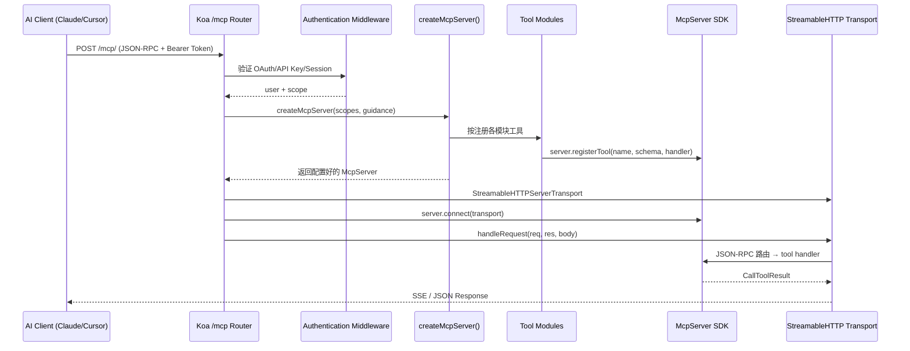

Outline 实现了一个完整的 **Model Context Protocol (MCP)** 服务器，允许 AI 客户端（如 Claude Desktop、Cursor 等）通过标准化协议以工具调用的方式与知识库进行深度交互——搜索文档、创建集合、管理评论乃至上传附件。本文将从传输层、认证与权限过滤、工具注册架构、上下文桥接、可观测性五个维度，逐层剖析这一 MCP 实现的设计决策与工程细节。

Sources: [index.ts](server/routes/mcp/index.ts#L1-L137), [web.ts](server/services/web.ts#L23-L77)

## 架构总览：请求的完整生命周期

MCP 服务器作为独立 Koa 子应用挂载于 `/mcp` 路径，采用 **StreamableHTTP** 传输协议，每个 POST 请求创建一个全新的 `McpServer` 实例，根据当前令牌的 OAuth scope 动态注册可用工具后立即处理请求。这种"无状态实例"模式使得 scope 过滤在工具注册阶段即完成，避免了运行时权限检查的冗余开销。



Sources: [index.ts](server/routes/mcp/index.ts#L41-L117), [web.ts](server/services/web.ts#L77)

## 传输层与协议约束

MCP 端点通过 `koa-mount` 挂载到主 Koa 应用的 `/mcp` 路径，严格遵循 **仅 POST** 约束。GET 和 DELETE 请求均返回 `405 Method Not Allowed`，并在 `Allow` 头中明确声明只接受 POST 方法。传输层采用 `@modelcontextprotocol/sdk` 提供的 `StreamableHTTPServerTransport`，响应通过 `text/event-stream` (SSE) 编码返回 JSON-RPC 结果。`sessionIdGenerator` 被设置为 `undefined`，意味着每个请求是无状态的——不维持跨请求的会话标识。

Sources: [index.ts](server/routes/mcp/index.ts#L69-L136)

传输错误（如客户端发送了错误的 `Accept` 头）通过 `transport.onerror` 捕获并以 `Logger.warn` 级别记录，而非上报到 Sentry——这是有意为之的设计，因为此类 4xx 错误属于客户端行为失误，不应污染错误追踪系统。请求体解析由 `koa-body` 中间件处理，位于路由之前，确保 JSON-RPC 负载在进入路由处理器前已被完整解析。

Sources: [index.ts](server/routes/mcp/index.ts#L96-L116)

## 认证体系：三方令牌的统一入口

MCP 端点接受三种认证类型，通过 `auth()` 中间件的 `type` 参数白名单控制：

| 认证类型 | 令牌来源 | Scope 来源 |
|----------|----------|------------|
| `AuthenticationType.OAUTH` | OAuth 访问令牌（Bearer 头） | `OAuthAuthentication.scope` |
| `AuthenticationType.API` | API Key（Bearer 头） | `ApiKey.scope`，默认 `["*"]` |
| `AuthenticationType.MCP` | 会话令牌（Bearer 头/Cookie） | 无 scope（`undefined`） |

认证中间件解析令牌后，将用户、令牌、scope 等信息写入 `ctx.state.auth`。随后 MCP 路由处理器将这些信息组装为 `AuthInfo` 对象，挂载到原始 `ctx.req` 上，使 MCP SDK 在调用工具处理器时能通过 `extra.authInfo` 传递认证上下文。

Sources: [authentication.ts](server/middlewares/authentication.ts#L37-L76), [index.ts](server/routes/mcp/index.ts#L108-L113)

关键的安全门控位于路由处理器内部：**团队偏好 `TeamPreference.MCP` 必须为 `true`**，否则直接抛出 `NotFoundError`。这意味着即使认证通过，如果工作区管理员未启用 MCP 功能，请求也会被静默拒绝（返回 404 而非 403，避免泄露 MCP 端点存在）。此外，用户首次成功调用 MCP 时，系统会设置 `UserFlag.MCP` 标记，用于后续分析和追踪 MCP 功能的采用情况。

Sources: [index.ts](server/routes/mcp/index.ts#L82-L87), [User.ts](server/models/User.ts#L79-L87)

## OAuth 发现端点：MCP 的开放生态衔接

Outline 在主路由上暴露了两个 **OAuth 2.0 授权服务器元数据** 端点，专门服务于 MCP 客户端的自动发现和配置：

| 端点 | 路径 | 用途 |
|------|------|------|
| Authorization Server Metadata | `/.well-known/oauth-authorization-server[/mcp]` | 发布授权端点、注册端点、支持的 grant 类型等 |
| Protected Resource Metadata | `/.well-known/oauth-protected-resource[/mcp]` | 声明受保护资源（`/mcp`）及其授权服务器 |

这两个端点的响应会根据 `TeamPreference.MCP` 的状态动态调整——当 MCP 被禁用时，Protected Resource Metadata 返回 404，Authorization Server Metadata 中省略 `registration_endpoint`。这种设计确保 MCP 客户端能自动检测工作区是否支持 MCP，并发现正确的 OAuth 配置参数，无需手动配置。

Sources: [index.ts (routes)](server/routes/index.ts#L116-L175)

## 工具注册架构：Scope 感知的动态工具集

MCP 的核心价值在于将知识库操作封装为 AI 可调用的工具。Outline 采用 **模块化注册** 模式，六个工具模块各自导出一个注册函数：

```mermaid
graph TD
    A[createMcpServer] --> B[attachmentTools]
    A --> C[collectionTools]
    A --> D[commentTools]
    A --> E[documentTools]
    A --> F[fetchTool]
    A --> G[userTools]

    B --> B1["create_attachment<br/>(attachments.create)"]
    C --> C1["list_collections<br/>(collections.list)"]
    C --> C2["create_collection<br/>(collections.create)"]
    C --> C3["update_collection<br/>(collections.update)"]
    C --> C4["delete_collection<br/>(collections.delete)"]
    D --> D1["list_documents<br/>(documents.list)"]
    D --> D2["list_collection_documents<br/>(collections.documents)"]
    D --> D3["create_document<br/>(documents.create)"]
    D --> D4["update_document<br/>(documents.update)"]
    D --> D5["move_document<br/>(documents.move)"]
    D --> D6["delete_document<br/>(documents.delete)"]
    E --> E1["fetch<br/>(documents.info + ...)"]
    F --> F1["list_users<br/>(users.list)"]
    D --> D7["create_comment<br/>(comments.create)"]
    D --> D8["list_comments<br/>(comments.list)"]
    D --> D9["update_comment<br/>(comments.update)"]
    D --> D10["delete_comment<br/>(comments.delete)"]

    style A fill:#4A90D9,color:#fff
    style E1 fill:#E8A838,color:#fff
```



每个模块的注册函数签名统一为 `(server: McpServer, scopes: string[])`。在注册任何工具之前，模块先调用 `AuthenticationHelper.canAccess()` 检查当前令牌是否拥有足够的 scope。例如，`documents.list` 需要 `Scope.Read`，而 `documents.create` 需要 `Scope.Create`。如果 scope 不满足，该工具 **根本不会被注册到 McpServer 实例上**，客户端的 `tools/list` 请求也就看不到它。这种"注册时过滤"策略比"运行时拒绝"更安全、更高效。

Sources: [documents.ts](server/tools/documents.ts#L59-L65), [collections.ts](server/tools/collections.ts#L28-L31), [AuthenticationHelper.ts](shared/helpers/AuthenticationHelper.ts#L36-L68)

### Scope 到工具的映射关系

`AuthenticationHelper` 维护一个方法到 scope 的映射表，未列出的方法默认需要 `Scope.Write`：

| Scope 级别 | 可访问的操作类型 | 说明 |
|------------|-----------------|------|
| `read` | `list`, `info`, `search`, `config`, `documents`, `drafts`, `viewed`, `export` | 所有只读工具 |
| `create` | `create` 类操作 | 创建文档、集合、评论、附件 |
| `write` | 所有操作（包含 `read` 和 `create`） | 完整读写权限 |
| `*` (通配符) | 所有工具 | API Key 默认 scope，无限制 |

Sources: [AuthenticationHelper.ts](shared/helpers/AuthenticationHelper.ts#L12-L22), [authentication.ts](server/middlewares/authentication.ts#L240)

## 工具实现深度解析

### fetch —— 统一资源获取器

`fetch` 工具是一个 **多态资源获取器**，通过 `resource` 参数区分资源类型，支持 `document`、`collection`、`user`、`attachment` 四种资源。它的特别之处在于 `id` 参数既接受纯 ID，也接受完整 URL——`extractId()` 函数会从 URL 中提取最后一段路径或 `?id=` 查询参数作为标识符。对于 `user` 类型，还支持 `self`/`me`/`current_user` 等特殊令牌，直接返回当前认证用户。

Sources: [fetch.ts](server/tools/fetch.ts#L33-L48), [fetch.ts](server/tools/fetch.ts#L107-L203)

`fetch` 工具的注册本身也有条件——它仅在客户端拥有至少一个 `*.info` scope 时才会注册，且 `resource` 的 `z.enum` 选项会根据已授予的 scope 动态生成。这意味着拥有 `documents.info` 但没有 `collections.info` 的令牌，`fetch` 工具的 `resource` 参数只会接受 `"document"`、`"user"`、`"attachment"`。

Sources: [fetch.ts](server/tools/fetch.ts#L57-L86)

### update_document —— 四种编辑模式

文档更新工具实现了四种内容编辑模式，通过 `editMode` 参数控制：

| 模式 | 行为 | 适用场景 |
|------|------|----------|
| `replace` | 完全替换文档内容 | 全文重写 |
| `append` | 在文档末尾追加内容 | 添加章节 |
| `prepend` | 在文档开头插入内容 | 添加前言/更新说明 |
| `patch` | 精确查找替换指定文本片段 | 局部修正，保留富文本格式 |

`patch` 模式是 AI 编辑文档的关键机制。调用者通过 `findText` 指定原文中需要替换的精确 Markdown 片段，`text` 参数提供替换内容。这允许 AI 在不破坏文档中其他富文本格式（高亮、嵌入、mention 等）的情况下，进行外科手术式的精确修改。

Sources: [documents.ts](server/tools/documents.ts#L538-L655), [types.ts](shared/types.ts#L735-L744)

### create_comment —— 锚点文本与行内评论

评论创建工具支持 **行内锚定** 功能，通过 `anchorText`、`anchorPrefix`、`anchorSuffix` 三个参数实现精确的文本定位。当提供 `anchorText` 时，系统会在 ProseMirror 文档状态中查找匹配文本并应用 comment mark。为了防止并发评论覆盖，工具在事务中对文档行加排他锁（`LOCK.UPDATE`），确保 comment mark 的应用是原子的。

Sources: [comments.ts](server/tools/comments.ts#L224-L347)

### create_attachment —— 预签名上传流程

附件创建工具不直接上传文件，而是返回一个预签名的上传 URL 和表单字段，附带一条可直接执行的 `curl` 命令。AI 客户端可以使用这个 URL 通过 multipart POST 将文件上传到 S3 兼容存储。上传完成后，返回的附件 URL 可以直接嵌入文档内容。

Sources: [attachments.ts](server/tools/attachments.ts#L29-L134)

## 上下文桥接：从 MCP 到 APIContext

MCP 工具的处理器接收的上下文对象与 Outline 内部的 `APIContext`（Koa 风格）结构不同。`buildAPIContext()` 函数负责将 MCP 的 `AuthInfo` 转换为模拟的 Koa 上下文，使得现有的命令层函数（如 `documentCreator`、`documentUpdater`）可以无感知地复用：

```typescript
// MCP 上下文 → APIContext 桥接
export function buildAPIContext(context: McpContext) {
  const user = context.authInfo?.extra?.user as User;
  const token = context.authInfo?.token ?? "";
  const ip = context.authInfo?.extra?.ip as string | undefined;

  return {
    state: { auth: { user, token, type: AuthenticationType.MCP } },
    context: { auth: { user, token, type: AuthenticationType.MCP }, ip },
    cookies: { get: () => undefined, set: () => undefined },
  } as unknown as APIContext;
}
```

这种桥接模式使得 MCP 工具无需重新实现业务逻辑，直接委托给已有的命令函数。事务管理通过手动设置 `ctx.state.transaction` 和 `ctx.context.transaction` 实现，与命令层的事务传播机制完全兼容。

Sources: [util.ts](server/tools/util.ts#L32-L48)

## 工作区指导（Guidance）系统

`createMcpServer()` 接受一个可选的 `guidance` 参数，来源于 Team 模型的 `guidanceMCP` 字段。这段文本被追加到 MCP 服务器的默认 `instructions` 之后，成为 AI 客户端接收到的系统级指令的一部分。工作区管理员可以在此定制 AI 的行为规范，例如限制操作范围、指定文档模板、或提供领域特定的写作指导。

默认 instructions 包含三条关键约束：
1. 文档 Markdown 内容不得以一级标题开头（标题作为独立字段存储）
2. `@mention` 使用 `@[Display Name](mention://user/userId)` 语法
3. 附件读取需通过 `fetch` 工具获取签名 URL

Sources: [index.ts](server/routes/mcp/index.ts#L27-L44), [Team.ts](server/models/Team.ts#L227-L233)

## 可观测性：Datadog 链路追踪

每个 MCP 工具的处理器都通过 `withTracing()` 高阶函数包装，为每次工具调用创建一个 Datadog trace span，归属 `outline-mcp` 服务，以工具名为 resource name。span 上自动附加 `mcp.tool`、`request.userId`、`request.teamId` 标签，使运维团队能够按工具、用户、团队维度分析 MCP 调用的性能和频率。

Sources: [util.ts](server/tools/util.ts#L108-L129)

## 响应格式规范

所有工具使用统一的响应格式函数：

- **`success<T>(data)`**：将数据序列化为 JSON 字符串，包装在 `{ type: "text", text: "..." }` 内容块中。数组数据会展开为多个内容块
- **`error(err)`**：提取错误消息，设置 `isError: true` 标记

文档类工具（`create_document`、`update_document`、`fetch`）使用双内容块响应：第一个块包含文档元数据（JSON），第二个块包含纯文本 Markdown 内容。这种分离使 AI 客户端能够分别处理结构化元数据和可读内容。

Sources: [util.ts](server/tools/util.ts#L73-L97), [documents.ts](server/tools/documents.ts#L386-L400)

## 测试体系

MCP 测试基础设施提供了完整的端到端测试工具链：

| 工具 | 用途 |
|------|------|
| `buildOAuthUser()` | 创建用户并签发含 Read/Write/Create scope 的 OAuth 令牌 |
| `mcpRequest(method, params)` | 构建 JSON-RPC 2.0 请求体 |
| `mcpHeaders(accessToken)` | 构造带 Bearer 令牌和 SSE Accept 的请求头 |
| `callMcpTool(server, token, name, args)` | 一键调用 MCP 工具并解析 SSE 响应 |
| `parseMcpResponse(res)` | 从 SSE 流中提取 JSON-RPC 响应 |

测试覆盖了认证拒绝、JWT 令牌拒绝、MCP 偏好禁用、scope 粒度控制（只读令牌不能创建/更新/删除）、Write scope 隐含 Read 和 Create 等场景。

Sources: [McpHelper.ts](server/test/McpHelper.ts#L1-L123), [index.test.ts](server/routes/mcp/index.test.ts#L1-L272)

## 完整工具清单

下表汇总了所有 MCP 工具及其 scope 要求和读写属性：

| 工具名 | 所需 Scope | 只读 | 功能描述 |
|--------|-----------|------|----------|
| `list_documents` | `documents.list` (Read) | ✓ | 全文搜索或列出最近文档 |
| `list_collection_documents` | `collections.documents` (Read) | ✓ | 获取集合内完整文档层级树 |
| `create_document` | `documents.create` (Create) | ✗ | 创建新文档 |
| `update_document` | `documents.update` (Write) | ✗ | 更新文档（支持 replace/append/prepend/patch） |
| `move_document` | `documents.move` (Write) | ✗ | 移动或重新排序文档 |
| `delete_document` | `documents.delete` (Write) | ✗ | 删除或归档文档 |
| `list_collections` | `collections.list` (Read) | ✓ | 列出或搜索集合 |
| `create_collection` | `collections.create` (Create) | ✗ | 创建新集合 |
| `update_collection` | `collections.update` (Write) | ✗ | 更新集合属性 |
| `delete_collection` | `collections.delete` (Write) | ✗ | 删除或归档集合 |
| `list_comments` | `comments.list` (Read) | ✓ | 列出文档或集合的评论 |
| `create_comment` | `comments.create` (Create) | ✗ | 创建评论（支持行内锚定） |
| `update_comment` | `comments.update` (Write) | ✗ | 更新评论内容或解决状态 |
| `delete_comment` | `comments.delete` (Write) | ✗ | 删除评论 |
| `create_attachment` | `attachments.create` (Create) | ✗ | 获取预签名上传 URL |
| `fetch` | 至少一个 `*.info` (Read) | ✓ | 统一资源获取（文档/集合/用户/附件） |
| `list_users` | `users.list` (Read) | ✓ | 列出工作区用户 |

Sources: [documents.ts](server/tools/documents.ts#L59-L712), [collections.ts](server/tools/collections.ts#L28-L332), [comments.ts](server/tools/comments.ts#L57-L467), [attachments.ts](server/tools/attachments.ts#L28-L135), [fetch.ts](server/tools/fetch.ts#L57-L209), [users.ts](server/tools/users.ts#L25-L176)

## 延伸阅读

- 要了解 MCP 认证所依赖的 OAuth 2.0 完整实现，参阅 [OAuth 2.0 服务端：客户端注册、授权流程与令牌管理](21-oauth-2-0-fu-wu-duan-ke-hu-duan-zhu-ce-shou-quan-liu-cheng-yu-ling-pai-guan-li)
- MCP 工具委托的命令函数在 [命令模式（Commands）：复杂业务逻辑的组织方式](12-ming-ling-mo-shi-commands-fu-za-ye-wu-luo-ji-de-zu-zhi-fang-shi) 中有详细解析
- 权限策略系统的工作原理参见 [权限与授权：基于 CanCan 的策略（Policies）系统](11-quan-xian-yu-shou-quan-ji-yu-cancan-de-ce-lue-policies-xi-tong)
- MCP 请求经过的限流和认证中间件在 [中间件体系：认证、限流、CSRF 与请求上下文](14-zhong-jian-jian-ti-xi-ren-zheng-xian-liu-csrf-yu-qing-qiu-shang-xia-wen) 中介绍