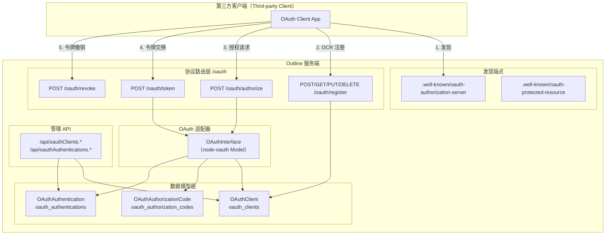
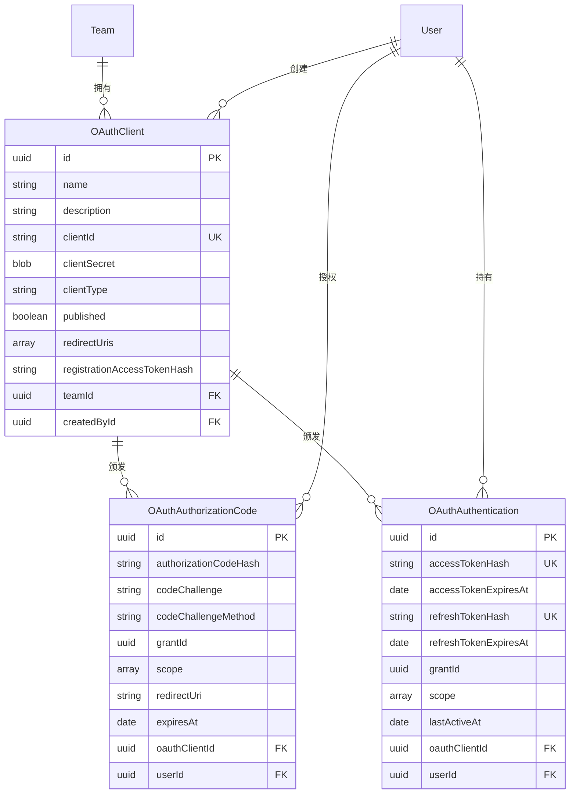
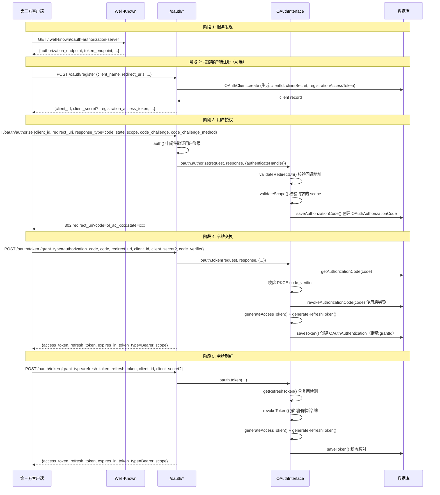

Outline 实现了完整的 **OAuth 2.0 授权服务器**（Authorization Server），允许第三方应用以标准化协议安全地访问用户数据。该实现基于 `@node-oauth/oauth2-server` 库，支持 **授权码模式（Authorization Code）** 与 **刷新令牌（Refresh Token）**，同时实现了 RFC 7591 动态客户端注册（DCR）和 RFC 7592 客户端管理。整个体系由三个核心数据模型、一个适配器接口、一套协议路由和前后端管理界面组成，并专门为 [MCP 服务器：AI 工具集成与 Model Context Protocol 实现](20-mcp-fu-wu-qi-ai-gong-ju-ji-cheng-yu-model-context-protocol-shi-xian) 提供了标准化的 OAuth 令牌鉴权入口。

Sources: [index.ts](server/routes/oauth/index.ts#L1-L39), [OAuthInterface.ts](server/utils/oauth/OAuthInterface.ts#L1-L48)

## 整体架构概览

在深入各组件之前，先从宏观视角理解 OAuth 2.0 服务端在 Outline 系统中的位置和各层之间的调用关系。



**核心设计原则**：协议路由（`/oauth/*`）严格遵循 OAuth 2.0 / RFC 规范的请求/响应格式，而管理 API（`/api/oauthClients.*`、`/api/oauthAuthentications.*`）则遵循 Outline 自身的 API 约定（JSON body + 分页 + 策略鉴权），两套体系泾渭分明。

Sources: [web.ts](server/services/web.ts#L24-L99), [index.ts](server/routes/index.ts#L116-L170)

## 数据模型体系

OAuth 2.0 服务端依赖三张核心数据库表，分别对应客户端注册、授权码和令牌认证三个生命周期阶段。

### 模型关系图



Sources: [OAuthClient.ts](server/models/oauth/OAuthClient.ts#L35-L157), [OAuthAuthorizationCode.ts](server/models/oauth/OAuthAuthorizationCode.ts#L20-L110), [OAuthAuthentication.ts](server/models/oauth/OAuthAuthentication.ts#L27-L244), [migration](server/migrations/20250331231413-add-oauth-server-models.js#L1-L229)

### OAuthClient —— 客户端注册模型

`OAuthClient` 是第三方应用的注册记录，承载了客户端的身份标识、密钥凭据和授权配置。

**关键字段与安全机制**：

| 字段 | 类型 | 说明 |
|------|------|------|
| `clientId` | `STRING` | 公开的客户端标识符，20位随机字母数字，由 `BeforeCreate` 钩子自动生成 |
| `clientSecret` | `BLOB (Encrypted)` | 使用 `@Encrypted` 装饰器加密存储的密钥，前缀 `ol_sk_`，仅对机密客户端有意义 |
| `clientType` | `STRING` | `confidential`（机密）或 `public`（公开），决定是否需要 `client_secret` 认证 |
| `redirectUris` | `ARRAY(STRING)` | 合法的回调地址列表，1-10个，创建后可更新 |
| `published` | `BOOLEAN` | 是否发布到其他工作空间可用（仅云托管环境生效） |
| `registrationAccessTokenHash` | `STRING (Unique)` | DCR 客户端的注册管理令牌 SHA-256 哈希（RFC 7592） |
| `createdById` | `UUID (Nullable)` | 创建者用户 ID。**DCR 客户端此字段为 `null`**，用于区分注册方式 |

`OAuthClient` 继承自 `ParanoidModel`（软删除），其 `BeforeCreate` 钩子会自动执行凭据生成逻辑：生成 `clientId`、`clientSecret`，并在 `createdById` 为 `null`（即 DCR 注册）时额外生成 `registrationAccessToken`。

Sources: [OAuthClient.ts](server/models/oauth/OAuthClient.ts#L39-L199), [OAuthClient.ts](server/models/oauth/OAuthClient.ts#L236-L254)

### OAuthAuthorizationCode —— 授权码模型

授权码是授权码模式中的临时凭据，生命周期极短（默认 300 秒），使用后立即作废。

| 字段 | 说明 |
|------|------|
| `authorizationCodeHash` | 授权码的 SHA-256 哈希值，原始码前缀 `ol_ac_` |
| `codeChallenge` / `codeChallengeMethod` | PKCE 参数，支持 `S256` 方法 |
| `grantId` | 授权会话标识，用于将同一授权链路中的授权码和令牌关联起来 |
| `scope` | 授权范围数组，如 `["read"]` |
| `expiresAt` | 过期时间戳 |

该模型继承自 `IdModel`（非 Paranoid，无软删除），`updatedAt` 被禁用。`findByCode` 静态方法通过哈希查找并预加载关联的 `user`。

Sources: [OAuthAuthorizationCode.ts](server/models/oauth/OAuthAuthorizationCode.ts#L20-L112)

### OAuthAuthentication —— 令牌认证模型

`OAuthAuthentication` 是 OAuth 令牌对的持久化记录，每条记录包含一个访问令牌和一个刷新令牌。

| 字段 | 说明 |
|------|------|
| `accessTokenHash` | 访问令牌哈希（唯一），原始令牌前缀 `ol_at_` |
| `refreshTokenHash` | 刷新令牌哈希（唯一），原始令牌前缀 `ol_rt_` |
| `accessTokenExpiresAt` / `refreshTokenExpiresAt` | 令牌过期时间 |
| `grantId` | 授权会话 ID，**用于令牌复用检测和批量撤销** |
| `scope` | 授权范围数组 |
| `lastActiveAt` | 最后活跃时间，每 5 分钟更新一次以减少数据库写入 |

**令牌生命周期配置**（通过环境变量可调）：

| 环境变量 | 默认值 | 说明 |
|----------|--------|------|
| `OAUTH_PROVIDER_ACCESS_TOKEN_LIFETIME` | 3600（1小时） | 访问令牌有效期（秒） |
| `OAUTH_PROVIDER_REFRESH_TOKEN_LIFETIME` | 2592000（30天） | 刷新令牌有效期（秒） |
| `OAUTH_PROVIDER_AUTHORIZATION_CODE_LIFETIME` | 300（5分钟） | 授权码有效期（秒） |

`OAuthAuthentication` 的 `canAccess` 方法实现了**基于 scope 的路径级访问控制**，特殊处理了 `/oauth/revoke`（始终允许）和 `/mcp` 前缀路径（仅需有任意有效 scope），其余路径则委托给共享层的 `AuthenticationHelper.canAccess`。

Sources: [OAuthAuthentication.ts](server/models/oauth/OAuthAuthentication.ts#L27-L244), [env.ts](server/env.ts#L740-L772)

## OAuthInterface —— 核心适配器

`OAuthInterface` 是 `@node-oauth/oauth2-server` 库的 **Model 层实现**，充当协议库与 Outline 数据模型之间的桥梁。它同时实现了 `RefreshTokenModel` 和 `AuthorizationCodeModel` 接口，声明了支持的授权类型为 `["authorization_code", "refresh_token"]`。

### 方法职责映射

| OAuthInterface 方法 | OAuth 2.0 规范角色 | 核心职责 |
|---------------------|-------------------|----------|
| `generateAccessToken()` | 令牌生成 | 生成 `ol_at_` 前缀的 64 字符十六进制令牌 |
| `generateRefreshToken()` | 令牌生成 | 生成 `ol_rt_` 前缀令牌 |
| `generateAuthorizationCode()` | 码生成 | 生成 `ol_ac_` 前缀令牌 |
| `getAccessToken(accessToken)` | 令牌验证 | 通过哈希查找令牌，返回令牌元数据 + 关联的 client 和 user |
| `getRefreshToken(refreshToken)` | 令牌验证 | 查找刷新令牌，**包含令牌复用检测逻辑** |
| `getAuthorizationCode(code)` | 码验证 | 查找授权码，返回含 PKCE 参数和 grantId 的完整信息 |
| `getClient(clientId, clientSecret?)` | 客户端验证 | 查找客户端并通过 `safeEqual` 时序安全比较密钥 |
| `saveToken(token, client, user)` | 令牌持久化 | 创建 `OAuthAuthentication` 记录，建立或继承 `grantId` |
| `saveAuthorizationCode(code, client, user)` | 码持久化 | 创建 `OAuthAuthorizationCode` 记录，建立或继承 `grantId` |
| `revokeToken(token)` | 令牌撤销 | 软删除刷新令牌对应的 `OAuthAuthentication` |
| `revokeAuthorizationCode(code)` | 码撤销 | 删除已使用的授权码 |
| `validateRedirectUri(uri, client)` | 安全校验 | 校验回调 URI 合法性，禁止 fragment 和通配符，允许 loopback HTTP |
| `validateScope(user, client, scope)` | 范围校验 | 校验请求的 scope 是否在系统定义范围内 |

Sources: [OAuthInterface.ts](server/utils/oauth/OAuthInterface.ts#L39-L422)

### 令牌复用检测（Refresh Token Reuse Detection）

这是该实现中**最关键的安全机制之一**。`getRefreshToken` 方法在正常查找失败后，会执行额外的软删除记录查询（`paranoid: false`）。如果发现已删除的刷新令牌属于某个 `grantId`，则**立即撤销该 grant 下所有令牌和授权码**：

```typescript
// 如果刷新令牌已不存在于正常记录中，检查是否被软删除
authentication = await OAuthAuthentication.findOne({
  where: { refreshTokenHash: hash(refreshToken) },
  paranoid: false,  // 包含已软删除的记录
});

if (authentication?.grantId) {
  // 检测到复用！撤销该授权会话的所有令牌和授权码
  await Promise.all([
    OAuthAuthentication.destroy({ where: { grantId: authentication.grantId } }),
    OAuthAuthorizationCode.destroy({ where: { grantId: authentication.grantId } }),
  ]);
}
```

此机制遵循 **RFC 9700** 的安全最佳实践——当检测到刷新令牌被复用时，意味着可能存在令牌泄露，因此整个授权链路（grant）中的所有凭据都应立即失效。

Sources: [OAuthInterface.ts](server/utils/oauth/OAuthInterface.ts#L116-L161), [index.test.ts](server/routes/oauth/index.test.ts#L235-L353)

## 授权码流程详解

以下展示授权码模式从发现到令牌获取的完整交互时序：



Sources: [index.ts](server/routes/oauth/index.ts#L41-L149), [OAuthInterface.ts](server/utils/oauth/OAuthInterface.ts#L232-L342)

### 授权端点（POST /oauth/authorize）

该端点要求用户已通过 Outline 的会话认证（`auth()` 中间件）。其处理流程为：首先从请求体获取 `client_id`，通过 `OAuthClient.findByClientId` 查找客户端，然后使用 CanCan 策略验证当前用户对该客户端的 `read` 权限。通过后，将请求包装为 `OAuth2Server.Request/Response` 对象，调用 `oauth.authorize()`，传入 `authenticateHandler` 以告知库当前用户身份。

关键安全配置：`allowEmptyState: false` 强制要求 `state` 参数以防范 CSRF 攻击。成功时返回 302 重定向或 JSON 格式的授权码。

Sources: [index.ts](server/routes/oauth/index.ts#L41-L88)

### 令牌端点（POST /oauth/token）

令牌端点支持 `authorization_code` 和 `refresh_token` 两种授权类型。对于 `refresh_token` 类型，路由层有额外的安全逻辑：由于库配置了 `requireClientAuthentication: { refresh_token: false }` 以允许公开客户端刷新令牌，路由层需**手动检查**机密客户端是否提供了 `client_secret`——若缺少则抛出 `ValidationError`。

响应格式严格遵循 OAuth 2.0 规范，`expires_in` 换算为秒数，`scope` 为空格分隔的字符串，`token_type` 固定为 `"Bearer"`。每次刷新都会**撤销旧刷新令牌并签发新令牌对**（`alwaysIssueNewRefreshToken: true`），遵循 RFC 6819 §5.2.2.3 的安全建议。

Sources: [index.ts](server/routes/oauth/index.ts#L90-L149)

### 撤销端点（POST /oauth/revoke）

遵循 **RFC 7009** 令牌撤销规范。通过令牌前缀匹配（`ol_at_` / `ol_rt_`）判断令牌类型，分别查找并软删除对应的 `OAuthAuthentication` 记录。规范要求：**无效令牌不产生错误响应**（RFC 7009 §2.2），始终返回 `{ success: true }`。

Sources: [index.ts](server/routes/oauth/index.ts#L151-L176)

## 动态客户端注册（RFC 7591 / RFC 7592）

Outline 实现了 **RFC 7591 Dynamic Client Registration** 和 **RFC 7592 Client Registration Management**，允许第三方应用通过标准化 API 自主注册和管理 OAuth 客户端。

### 注册端点（POST /oauth/register）

注册端点受 `rateLimiter(FivePerHour)` 严格限流。其前置条件为：

1. 未设置 `OAUTH_DISABLE_DCR=true` 环境变量
2. 目标团队已启用 MCP 偏好（`TeamPreference.MCP`）

注册请求体支持以下参数：

| 参数 | 必填 | 说明 |
|------|------|------|
| `client_name` | 是 | 客户端名称，最大 100 字符 |
| `redirect_uris` | 是 | 回调地址数组，1-10 个合法 URL |
| `token_endpoint_auth_method` | 否 | `none`（默认，公开客户端）或 `client_secret_post`（机密客户端） |
| `client_uri` | 否 | 开发者网站 URL |
| `logo_uri` | 否 | 应用图标 URL |
| `contacts` | 否 | 联系人邮箱数组 |

注册后 `createdById` 设为 `null`，通过 `isDCR` 计算属性可区分 DCR 客户端和通过管理 API 创建的客户端。DCR 客户端的 `published` 固定为 `false`。

Sources: [index.ts](server/routes/oauth/index.ts#L178-L234), [schema.ts](server/routes/oauth/schema.ts#L28-L57)

### 客户端管理（RFC 7592）

DCR 客户端创建时会自动签发一个 **Registration Access Token**（前缀 `ol_rat_`，38位随机字符），其哈希值存储在 `registrationAccessTokenHash` 字段中。后续管理操作通过 `registrationAuth` 中间件认证——该中间件从 `Authorization: Bearer <token>` 头中提取令牌，查找对应的 OAuthClient，并验证令牌与路由参数中的 `clientId` 匹配。

| 操作 | 方法 | 路径 | 说明 |
|------|------|------|------|
| 读取 | GET | `/oauth/register/:clientId` | 返回客户端元数据，**不含** registration_access_token 和 client_secret（RFC 7592 §3.1） |
| 更新 | PUT | `/oauth/register/:clientId` | 更新名称、回调地址等，**每次更新自动轮换** registration_access_token |
| 删除 | DELETE | `/oauth/register/:clientId` | 软删除客户端记录 |

Sources: [index.ts](server/routes/oauth/index.ts#L237-L290), [registrationAuth.ts](server/routes/oauth/middlewares/registrationAuth.ts#L1-L40)

## 服务发现与 OAuth 元数据

Outline 实现了 OAuth 2.0 Authorization Server Metadata（RFC 8414）和 Protected Resource Metadata（RFC 9728），使客户端能自动发现配置。

### /.well-known/oauth-authorization-server

返回授权服务器元数据，包括：

```json
{
  "issuer": "https://example.com",
  "authorization_endpoint": "https://example.com/oauth/authorize",
  "token_endpoint": "https://example.com/oauth/token",
  "revocation_endpoint": "https://example.com/oauth/revoke",
  "registration_endpoint": "https://example.com/oauth/register",
  "response_types_supported": ["code"],
  "grant_types_supported": ["authorization_code", "refresh_token"],
  "token_endpoint_auth_methods_supported": ["client_secret_post", "none"],
  "code_challenge_methods_supported": ["S256"],
  "scopes_supported": ["read", "write"]
}
```

`registration_endpoint` 仅在 DCR 未被禁用（`OAUTH_DISABLE_DCR`）且团队启用了 MCP 时才包含。对于自托管部署，URL 使用配置的 `env.URL` 以保留端口号；云托管则使用请求原始 origin。

Sources: [index.ts](server/routes/index.ts#L116-L146)

### /.well-known/oauth-protected-resource

返回受保护资源元数据，标识 MCP 端点为受保护资源，`authorization_servers` 指向当前 origin。当团队禁用 MCP 时返回 404。

Sources: [index.ts](server/routes/index.ts#L148-L176)

## Scope 与路径级访问控制

OAuth 令牌的权限范围通过 scope 系统实现，定义在共享层的 `Scope` 枚举中：

| Scope 值 | 含义 |
|-----------|------|
| `read` | 读取权限（list, info, search, export 等） |
| `write` | 写入权限（包含 read 的所有操作 + 修改操作） |
| `create` | 创建权限 |

`OAuthAuthentication.canAccess` 方法在每次 API 请求时被调用，判断令牌是否有权访问目标路径。其逻辑为：

1. `/oauth/revoke` → 始终允许
2. `/mcp` 前缀 → 任意有效 scope 即可（细粒度控制在 tool 层）
3. 其他路径 → 委托 `AuthenticationHelper.canAccess`，支持三种 scope 格式：`read`（简单 scope）、`documents.read`（命名空间.scope）、`/api/documents.list`（路由 scope）

`validateScope` 方法还支持更灵活的 scope 格式验证，包括单点号格式（如 `custom.read`）和冒号格式（如 `prefix:read`，要求冒号后的部分是合法 Scope 值）。

Sources: [OAuthAuthentication.ts](server/models/oauth/OAuthAuthentication.ts#L143-L156), [AuthenticationHelper.ts](shared/helpers/AuthenticationHelper.ts#L1-L69), [types.ts](shared/types.ts#L9-L14)

## 认证中间件集成

OAuth 访问令牌被深度集成到 Outline 的统一认证中间件中。当请求携带 `Authorization: Bearer <token>` 头时，`authentication` 中间件的 `validateAuthentication` 函数会按优先级判断令牌类型：

1. **OAuth 令牌**（`ol_at_` 前缀）：必须通过 Authorization 头传输，查找 `OAuthAuthentication` 记录，校验过期时间和路径访问权限，设置 `AuthenticationType.OAUTH`
2. **API Key**（`ol_api_` 前缀）：走 API Key 认证逻辑
3. **JWT 令牌**：走会话认证逻辑

OAuth 认证成功后，中间件会同时调用 `authentication.updateActiveAt()` 更新令牌和客户端的活跃时间戳，并将 scope 信息存入 `ctx.state.auth.scope`，供后续的权限检查使用。

Sources: [authentication.ts](server/middlewares/authentication.ts#L135-L200)

## 权限策略（Policies）

OAuth 相关的权限控制遵循 [权限与授权：基于 CanCan 的策略（Policies）系统](11-quan-xian-yu-shou-quan-ji-yu-cancan-de-ce-lue-policies-xi-tong) 中定义的 CanCan 模式。

### OAuthClient 策略

| 操作 | 权限要求 |
|------|----------|
| `createOAuthClient` | 团队管理员 + 团队可变 |
| `listOAuthClients` | 团队管理员 |
| `read` | 同团队成员 **或** 客户端已发布（`published`） |
| `update` / `delete` | 团队管理员 + 团队可变 + **非 DCR 客户端** |

注意：DCR 客户端（`createdById` 为 null）不能通过管理 API 更新或删除，只能通过 RFC 7592 的注册管理端点操作。

### OAuthAuthentication 策略

| 操作 | 权限要求 |
|------|----------|
| `listOAuthAuthentications` | 同团队成员 |
| `read` / `delete` | 仅令牌所属用户本人（`userId` 匹配） |

Sources: [oauthClient.ts](server/policies/oauthClient.ts#L1-L24), [oauthAuthentication.ts](server/policies/oauthAuthentication.ts#L1-L15)

## 管理 API 与前端界面

### 后端管理 API

`/api/oauthClients.*` 路由提供客户端的 CRUD 操作，仅限团队管理员访问。特别值得注意的是 `rotate_secret` 端点，它调用 `OAuthClient.rotateClientSecret()` 生成新的 `ol_sk_` 前缀密钥。`/api/oauthAuthentications.*` 路由则允许用户查看和撤销自己的 OAuth 授权——`list` 端点使用 `DISTINCT ON (oauthClientId, scope)` 的原生 SQL 查询，按客户端和 scope 去重展示。

Sources: [oauthClients.ts](server/routes/api/oauthClients/oauthClients.ts#L1-L194), [oauthAuthentications.ts](server/routes/api/oauthAuthentications/oauthAuthentications.ts#L1-L91)

### 前端模型与表单

前端通过 MobX 模型和 Store 管理状态。`OAuthClient` 模型（前端）提供了 `authorizationUrl` 计算属性，自动构造指向 `/oauth/authorize` 的完整 URL。`OAuthAuthentication` 模型提供 `deleteAll` 方法，可按 `oauthClientId` + `scope` 批量撤销授权。

管理界面包括：
- **Applications** 列表页：分页展示团队的所有 OAuth 客户端
- **Application** 详情/编辑页：展示客户端 ID、密钥（机密客户端可轮换）、回调地址、授权 URL 等完整配置
- **OAuthClientForm** 组件：创建/编辑表单，支持名称、图标、类型选择（confidential/public）、回调地址等

Sources: [OAuthClient.ts](app/models/oauth/OAuthClient.ts#L1-L97), [OAuthAuthentication.ts](app/models/oauth/OAuthAuthentication.ts#L1-L39), [Application.tsx](app/scenes/Settings/Application.tsx#L1-L364), [Applications.tsx](app/scenes/Settings/Applications.tsx#L1-L67)

## 错误处理与安全考量

### OAuth 错误格式

OAuth 协议路由使用专用的 `oauthErrorHandler` 中间件，将错误转换为符合 OAuth 2.0 规范的 `{ error, error_description }` 格式（snake_case），而非 Outline 标准 API 的错误格式。HTTP 状态码到 OAuth 错误类型的映射为：400 → `invalid_request`，401 → `invalid_client`，其他 → `server_error`。

Sources: [oauthErrorHandler.ts](server/routes/oauth/middlewares/oauthErrorHandler.ts#L1-L49)

### 安全机制汇总

| 机制 | 实现位置 | 说明 |
|------|----------|------|
| **PKCE (S256)** | `OAuthAuthorizationCode.codeChallenge` | 授权码 + PKCE 防止授权码截获 |
| **State 参数强制** | `allowEmptyState: false` | 防范 CSRF 攻击 |
| **令牌哈希存储** | 所有令牌模型 | 仅存储 SHA-256 哈希，原始令牌仅创建时可见 |
| **时序安全比较** | `safeEqual(client.clientSecret, clientSecret)` | 防止时序攻击推断密钥 |
| **Redirect URI 严格校验** | `validateRedirectUri` | 禁止 fragment、通配符、非 HTTPS（loopback 除外） |
| **刷新令牌轮换** | `alwaysIssueNewRefreshToken: true` | 每次使用后签发新令牌 |
| **令牌复用检测** | `getRefreshToken` 中的 paranoid 查询 | 检测到复用立即撤销整个 grant |
| **限流保护** | 各端点的 `rateLimiter` | authorize/token 100次/小时，register 5次/小时 |
| **客户端密钥加密** | `@Encrypted` 装饰器 | 使用应用密钥加密存储 |
| **DCR 客户端管理隔离** | `registrationAuth` 中间件 | 令牌必须匹配指定 clientId |
| **CSRF 保护** | `verifyCSRFToken` 中间件 | OAuth 路由启用 CSRF 验证 |

Sources: [index.ts](server/routes/oauth/index.ts#L64-L66), [OAuthInterface.ts](server/utils/oauth/OAuthInterface.ts#L206-L381), [OAuthClient.ts](server/models/oauth/OAuthClient.ts#L101-L103)

## 环境变量参考

| 变量名 | 类型 | 默认值 | 说明 |
|--------|------|--------|------|
| `OAUTH_PROVIDER_ACCESS_TOKEN_LIFETIME` | Number | 3600 | 访问令牌有效秒数 |
| `OAUTH_PROVIDER_REFRESH_TOKEN_LIFETIME` | Number | 2592000 | 刷新令牌有效秒数 |
| `OAUTH_PROVIDER_AUTHORIZATION_CODE_LIFETIME` | Number | 300 | 授权码有效秒数 |
| `OAUTH_DISABLE_DCR` | Boolean | false | 是否禁用动态客户端注册 |

Sources: [env.ts](server/env.ts#L740-L772)

## 与其他系统的关系

OAuth 2.0 服务端与以下系统有紧密的交互关系：

- **[MCP 服务器](20-mcp-fu-wu-qi-ai-gong-ju-ji-cheng-yu-model-context-protocol-shi-xian)**：OAuth 是 MCP 端点的主要鉴权机制。`/.well-known/oauth-protected-resource` 专门为 MCP 客户端提供服务发现，OAuth 令牌的 scope 控制着 MCP 工具级别的访问权限
- **[API 路由与控制器](9-api-lu-you-yu-kong-zhi-qi-qing-qiu-chu-li-liu-cheng-yu-yan-zheng-ji-zhi)**：OAuth 令牌通过认证中间件接入 API 路由体系，令牌的 scope 映射到 API 方法的访问控制
- **[权限与授权](11-quan-xian-yu-shou-quan-ji-yu-cancan-de-ce-lue-policies-xi-tong)**：OAuth 客户端的创建、管理和读取都受到 CanCan 策略的控制
- **[数据模型层](10-shu-ju-mo-xing-ceng-sequelize-orm-mo-xing-ti-xi-yu-sheng-ming-zhou-qi-gou-zi)**：OAuth 模型使用 Sequelize ORM 的 `@Encrypted` 装饰器、`ParanoidModel` 软删除、`BeforeCreate` 生命周期钩子等特性
- **[中间件体系](14-zhong-jian-jian-ti-xi-ren-zheng-xian-liu-csrf-yu-qing-qiu-shang-xia-wen)**：OAuth 令牌认证是统一认证中间件支持的四种认证方式之一