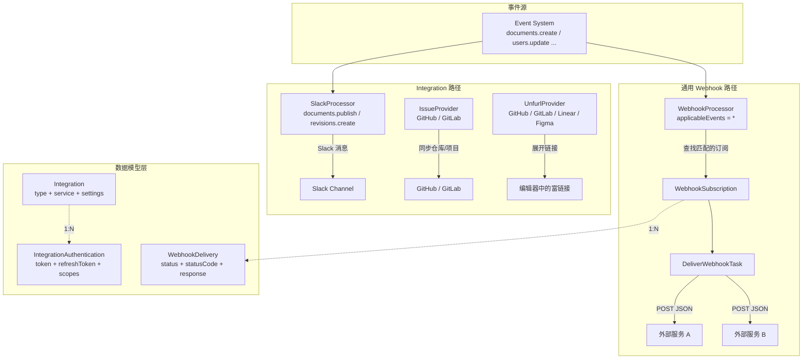
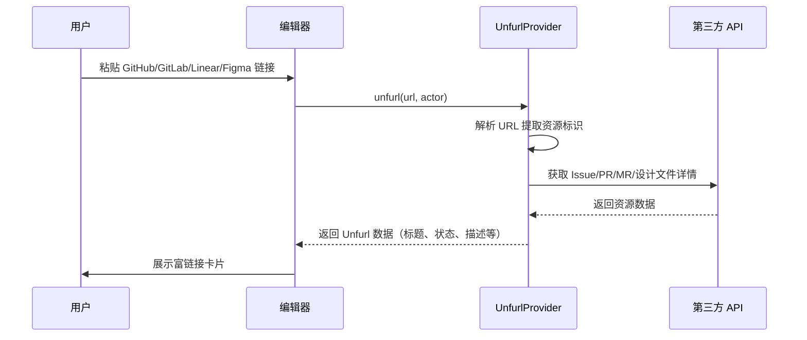

Outline 的集成生态由两条并行且互补的架构脉络组成：**通用 Webhook 订阅系统**提供了一种与任意 HTTP 服务对接的标准机制；**Integration 框架**则针对 Slack、GitHub、GitLab、Linear、Figma 等特定服务实现了深度嵌入，覆盖认证、命令、消息推送、链接展开（Unfurl）、Issue 追踪等多种交互模式。两者均通过 [插件系统](19-cha-jian-xi-tong-jia-gou-she-ji-yu-nei-zhi-cha-jian-lan) 的 `PluginManager` 注册到应用中，体现了 Outline 高度可扩展的架构理念。

Sources: [PluginManager.ts](server/utils/PluginManager.ts#L1-L153), [shared/types.ts](shared/types.ts#L142-L212)

## 整体架构概览

在深入每个子系统之前，理解 Webhook 与 Integration 两条路径的差异至关重要。Webhook 是"推送式"的通用事件管道——Outline 主动将事件以 HTTP POST 发送到你指定的 URL；Integration 则是"双向式"的服务绑定——它既包含 OAuth 认证流程，也包含从外部接收 Webhook 回调、处理命令、展开链接等多维度交互。



上图揭示了一个核心设计原则：**Webhook 订阅是事件驱动的"扇出"模式**（一个事件可以分发到多个订阅端点），而 **Integration 是服务驱动的"绑定"模式**（一个 Integration 绑定一个外部服务的一个安装实例）。

Sources: [WebhookProcessor.ts](plugins/webhooks/server/processors/WebhookProcessor.ts#L1-L34), [SlackProcessor.ts](plugins/slack/server/processors/SlackProcessor.ts#L1-L147), [BaseIssueProvider.ts](server/utils/BaseIssueProvider.ts#L1-L27)

## 通用 Webhook 订阅系统

### 数据模型

Webhook 订阅系统的核心数据结构由三个模型组成：

| 模型 | 职责 | 关键字段 |
|------|------|----------|
| **WebhookSubscription** | 订阅定义：哪个 URL 接收哪些事件 | `name`, `url`, `enabled`, `events[]`, `secret`(加密), `teamId`, `createdById` |
| **WebhookDelivery** | 单次投递记录：请求与响应的完整快照 | `status`(pending/success/failed), `statusCode`, `requestBody`, `requestHeaders`, `responseBody`, `responseHeaders` |
| **WebhookSubscription**(前端) | MobX 可观察模型，用于客户端状态管理 | 同上，额外提供 `searchContent` 计算属性 |

**WebhookSubscription** 模型有几个值得注意的设计细节。首先，`secret` 字段使用 `@Encrypted` 装饰器进行数据库级加密存储，确保签名密钥不会以明文形式持久化。其次，`@BeforeCreate` 钩子会检查团队级别的订阅数量上限（默认 10 个），超出则抛出 `ValidationError`。`validForEvent` 方法实现了灵活的事件匹配逻辑：如果订阅配置了通配符 `*`，则匹配所有事件；否则既支持精确匹配（如 `documents.create`），也支持前缀匹配（如配置 `documents` 将匹配所有 `documents.*` 事件）。

Sources: [WebhookSubscription.ts](server/models/WebhookSubscription.ts#L1-L174), [WebhookDelivery.ts](server/models/WebhookDelivery.ts#L1-L59), [validations.ts](shared/validations.ts#L167-L174)

### 签名验证机制

Webhook 的安全性依赖于 HMAC-SHA256 签名。当订阅配置了 `secret` 时，`signature` 方法会生成一个包含时间戳的签名：

```
签名格式: t=<timestamp>,s=<hmac_sha256(secret, timestamp.payload)>
请求头: Outline-Signature: t=1700000000000,s=abcdef123456...
```

接收方应按以下步骤验证：从请求头提取时间戳和签名，用相同的 `secret` 对 `<timestamp>.<rawBody>` 计算 HMAC-SHA256，然后与签名值进行恒定时间比较。`secret` 的默认前缀为 `ol_whs_`，由 `randomString(32)` 生成。

Sources: [WebhookSubscription.ts](server/models/WebhookSubscription.ts#L157-L170)

### 事件处理与投递流程

**WebhookProcessor** 是整个 Webhook 系统的入口。它声明 `applicableEvents: ["*"]`，意味着它接收系统中的所有事件。执行逻辑如下：

1. 过滤无 `teamId` 的事件（系统级事件不触发 Webhook）
2. 查找当前团队所有 `enabled=true` 的订阅
3. 对每个订阅调用 `validForEvent` 进行事件匹配
4. 为每个匹配的订阅调度一个 `DeliverWebhookTask` 异步执行

**DeliverWebhookTask** 是实际执行 HTTP 投递的任务。它根据 `event.name` 走一个庞大的 `switch-case` 分发器，将不同类型的事件路由到对应的 `handleXxxEvent` 方法。每个 handler 的职责是从数据库加载相关模型，使用对应的 Presenter 序列化为 JSON，然后调用 `sendWebhook` 完成 HTTP POST。

`sendWebhook` 方法的关键步骤包括：创建一条 `pending` 状态的 `WebhookDelivery` 记录，组装请求体（包含 `id`, `actorId`, `event`, `payload`, `createdAt`），附加签名头，发起 HTTP POST 请求（5 秒超时，禁止重定向），最后根据响应状态更新 Delivery 记录。响应体最多保留 1024 字节。

Sources: [WebhookProcessor.ts](plugins/webhooks/server/processors/WebhookProcessor.ts#L1-L34), [DeliverWebhookTask.ts](plugins/webhooks/server/tasks/DeliverWebhookTask.ts#L86-L268), [DeliverWebhookTask.ts](plugins/webhooks/server/tasks/DeliverWebhookTask.ts#L722-L816)

### 自动禁用与故障保护

`DeliverWebhookTask` 内置了一套**自适应故障保护机制**。每次投递失败后，它会调用 `checkAndDisableSubscription` 方法分析该订阅在 `WEBHOOK_FAILURE_TIME_WINDOW`（默认 86400 秒 = 24 小时）时间窗口内的投递历史：

| 条件 | 值 |
|------|----|
| 最小分析样本数 | 10 次投递 |
| 时间窗口 | 86400 秒（可通过 `WEBHOOK_FAILURE_TIME_WINDOW` 环境变量配置） |
| 失败率阈值 | 80%（可通过 `WEBHOOK_FAILURE_RATE_THRESHOLD` 环境变量配置） |

当时间窗口内的投递次数 ≥ 10 且失败率 ≥ 阈值时，系统会自动禁用该订阅，并向订阅创建者发送一封 `WebhookDisabledEmail` 通知邮件。这防止了长期失效的 Webhook 端点对系统资源的不必要消耗。

另外，`CleanupWebhookDeliveriesTask` 作为定时任务每天执行一次，自动删除超过 7 天的投递记录，防止 `webhook_deliveries` 表无限增长。

Sources: [DeliverWebhookTask.ts](plugins/webhooks/server/tasks/DeliverWebhookTask.ts#L818-L897), [CleanupWebhookDeliveriesTask.ts](plugins/webhooks/server/tasks/CleanupWebhookDeliveriesTask.ts#L1-L37), [env.ts](server/env.ts#L785-L798)

### 可订阅的事件分类

前端表单组件 `WebhookSubscriptionForm` 定义了用户可在 UI 中选择的完整事件分类：

| 事件组 | 包含的事件 |
|--------|-----------|
| **attachments** | create, update, delete |
| **users** | create, signin, update, suspend, activate, delete, invite, promote, demote |
| **documents** | create, publish, unpublish, delete, permanent_delete, archive, unarchive, restore, move, update, title_change, add_user, remove_user, add_group, remove_group |
| **collections** | create, update, delete, add_user, remove_user, add_group, remove_group, move, permission_changed, archive, restore |
| **comments** | create, update, delete |
| **revisions** | create |
| **groups** | create, update, delete, add_user, remove_user |
| **shares** | create, update, revoke |
| **teams** | update |
| **pins** | create, update, delete |
| **webhookSubscriptions** | create, delete, update |
| **views** | create |

用户可以选择订阅全部事件（`*`）、按组订阅（如整个 `documents` 组），或精确到单个事件。值得注意的是，并非所有内部事件都会触发 Webhook 投递——例如 `documents.update.delayed`、`documents.update.debounced`、`documents.empty_trash`、`comments.add_reaction`、`comments.remove_reaction` 等事件在 `DeliverWebhookTask` 中被明确忽略。

Sources: [WebhookSubscriptionForm.tsx](plugins/webhooks/client/components/WebhookSubscriptionForm.tsx#L18-L87), [DeliverWebhookTask.ts](plugins/webhooks/server/tasks/DeliverWebhookTask.ts#L108-L267)

### API 端点与权限控制

Webhook 订阅的 API 路由全部要求 **Admin 角色**，这通过 `auth({ role: UserRole.Admin })` 中间件和 CanCan 策略双重保障。策略文件规定：只有团队管理员才能创建、列表、读取、更新和删除 Webhook 订阅。

| 端点 | 方法 | 功能 |
|------|------|------|
| `webhookSubscriptions.list` | POST | 分页列出团队的 Webhook 订阅，支持排序和搜索 |
| `webhookSubscriptions.create` | POST | 创建新订阅，需提供 name、url、events 数组 |
| `webhookSubscriptions.update` | POST | 更新订阅，可修改 name、url、secret、events |
| `webhookSubscriptions.delete` | POST | 删除订阅 |

Sources: [webhookSubscriptions.ts](plugins/webhooks/server/api/webhookSubscriptions.ts#L1-L174), [webhookSubscription.ts](server/policies/webhookSubscription.ts#L1-L17)

### Webhook 投递载荷结构

每次 Webhook 投递的 JSON 载荷遵循统一的顶层结构，由 `presentWebhook` 函数生成：

```json
{
  "id": "delivery-uuid",
  "actorId": "user-uuid-who-triggered-event",
  "webhookSubscriptionId": "subscription-uuid",
  "event": "documents.publish",
  "createdAt": "2024-01-15T10:30:00.000Z",
  "payload": {
    "id": "document-uuid",
    "model": { /* 序列化后的文档对象 */ }
  }
}
```

`payload` 的具体结构取决于事件类型。对于文档事件，`model` 包含完整文档数据（含 `data` 和 `text`）；对于集合事件，`model` 包含集合信息；对于关联事件（如 `documents.add_user`），还会额外包含 `user` 或 `group` 字段。

Sources: [webhook.ts](plugins/webhooks/server/presenters/webhook.ts#L1-L39)

## Integration 框架：深度第三方集成

Integration 框架与通用 Webhook 系统不同，它为每个特定外部服务实现了定制化的交互逻辑。框架的核心由两个数据库模型支撑：

### Integration 与 IntegrationAuthentication 模型

**Integration** 模型是一个多态容器，通过 `type` 和 `service` 两个维度描述一个集成实例：

| IntegrationType | 含义 | 典型服务 |
|----------------|------|----------|
| `Post` | 向外部系统推送消息 | Slack |
| `Command` | 监听外部系统的命令 | Slack (/outline) |
| `Embed` | 嵌入外部系统内容 | GitHub, GitLab, Linear, Figma |
| `Analytics` | 数据分析集成 | Google Analytics, Matomo, Umami |
| `LinkedAccount` | 用户账号关联 | Slack, Figma |
| `Import` | 文档导入 | Notion, Markdown |

**IntegrationAuthentication** 模型存储 OAuth 凭证，包含 `token`（加密存储）、`refreshToken`（加密存储）、`clientId`、`clientSecret`（加密存储）、`scopes` 和 `expiresAt`。该模型提供了一个关键的 `refreshTokenIfNeeded` 方法，它使用行级锁（`SELECT FOR UPDATE`）来防止并发刷新的竞态条件，确保在分布式环境中只有一个进程执行令牌刷新操作。

Sources: [Integration.ts](server/models/Integration.ts#L1-L106), [IntegrationAuthentication.ts](server/models/IntegrationAuthentication.ts#L1-L172), [shared/types.ts](shared/types.ts#L142-L290)

### 插件注册机制

每个集成插件在 `server/index.ts` 中通过 `PluginManager.add()` 注册不同类型的 Hook。以下是各集成注册的 Hook 类型汇总：

| 插件 | 注册的 Hook 类型 | 条件启用 |
|------|-----------------|----------|
| **webhooks** | API, Processor, Task × 2 | 始终启用 |
| **slack** | AuthProvider, API, Processor | `SLACK_CLIENT_ID` + `SLACK_CLIENT_SECRET` |
| **github** | API, Task, IssueProvider, UnfurlProvider, Uninstall | 5 个环境变量全部配置 |
| **gitlab** | API, IssueProvider, UnfurlProvider, Task | 始终启用 |
| **linear** | API, Task, UnfurlProvider, Uninstall | `LINEAR_CLIENT_ID` + `LINEAR_CLIENT_SECRET` |
| **figma** | (前端为主) | — |
| **zapier** | (仅前端设置页) | 仅云端部署 |

`PluginManager.loadPlugins()` 通过 `glob` 扫描 `plugins/*/server/` 目录下的文件，自动加载所有插件的服务端组件。API 类型的 Hook 会在主路由注册之前挂载，这意味着插件路由可以覆盖内置路由。

Sources: [PluginManager.ts](server/utils/PluginManager.ts#L138-L150), [webhooks/index.ts](plugins/webhooks/server/index.ts#L1-L27), [slack/index.ts](plugins/slack/server/index.ts#L1-L27), [github/index.ts](plugins/github/server/index.ts#L1-L43), [gitlab/index.ts](plugins/gitlab/server/index.ts#L1-L28), [linear/index.ts](plugins/linear/server/index.ts#L1-L33)

## Slack 集成：最完整的双向集成案例

Slack 是 Outline 中集成深度最高的第三方服务，涵盖了四个独立的交互维度。

### 四维度交互架构

```mermaid
flowchart LR
    subgraph Slack Side
        SC[Slack Channel]
        CMD[/outline 命令]
        LINK[用户粘贴 Outline 链接]
    end

    subgraph Outline Side
        direction TB
        AUTH[Slack OAuth 认证<br/>AuthProvider Hook]
        POST[消息推送<br/>SlackProcessor]
        HOOK[Webhook 回调<br/>hooks.unfurl / hooks.interactive / hooks.slack]
        SEARCH[搜索服务<br/>SearchProviderManager]
    end

    AUTH -->|认证用户| SC
    POST -->|发布/更新文档通知| SC
    CMD -->|搜索 Outline 文档| HOOK
    HOOK -->|返回搜索结果| SC
    LINK -->|触发 link_unfurl 事件| HOOK
    HOOK -->|返回文档摘要| SC
    SEARCH -.->|搜索结果| HOOK
```

**1. 消息推送**——当文档在绑定了 Slack 集成的集合中发布或更新时，`SlackProcessor` 会向配置的 Slack Channel 发送一条包含文档标题、摘要和集合信息的富文本消息。处理器监听 `documents.publish` 和 `revisions.create` 事件，但对首次发布后一分钟内的更新会自动跳过（避免重复通知），且明确忽略批量导入操作触发的事件。

**2. `/outline` 斜杠命令**——用户在 Slack 中输入 `/outline keyword` 后，Outline 接收请求、执行搜索、返回最多 5 条结果。如果用户尚未关联 Slack 与 Outline 账号，则返回引导链接。

**3. 链接展开**——当用户在 Slack 中粘贴 Outline 文档链接时，Slack 会向 `hooks.unfurl` 端点发送 `link_shared` 事件，Outline 返回文档标题和摘要，使链接在 Slack 中显示为富文本卡片。

**4. 交互按钮**——搜索结果可以附带"Post to Channel"按钮（通过 `SLACK_MESSAGE_ACTIONS` 环境变量控制），点击后触发 `hooks.interactive` 端点，将文档信息以富消息格式发布到频道中。

Sources: [SlackProcessor.ts](plugins/slack/server/processors/SlackProcessor.ts#L1-L147), [hooks.ts](plugins/slack/server/api/hooks.ts#L1-L434), [slack.ts](plugins/slack/server/slack.ts#L1-L106), [messageAttachment.ts](plugins/slack/server/presenters/messageAttachment.ts#L1-L33)

### Slack 请求验证与用户关联

所有来自 Slack 的请求都通过 `verifySlackToken` 函数验证，该函数使用恒定时间比较（`safeEqual`）来防止时序攻击。用户关联策略采用两层查找：

1. **优先查找 Integration 记录**：在 `Integration` 表中查找 `service=slack, type=linkedAccount, settings.slack.serviceTeamId/serviceUserId` 匹配的记录
2. **降级到 AuthenticationProvider**：如果找不到显式关联，则查找通过 Slack OAuth 登录的 `UserAuthentication` 记录

Sources: [hooks.ts](plugins/slack/server/api/hooks.ts#L298-L431)

## GitHub 集成：Issue 追踪与链接展开

GitHub 集成的核心是 **GitHub App** 模式，而非传统的 OAuth User Token 模式。集成通过 `@octokit/auth-app` 认证，支持两种认证上下文：

- **用户级认证**（`authenticateAsUser`）：用于 OAuth 回调流程，获取用户安装的 GitHub App 列表
- **安装级认证**（`authenticateAsInstallation`）：使用 GitHub App Private Key 签发 Installation Access Token，用于访问仓库资源

### GitHub Issue Provider

`GitHubIssueProvider` 继承自 `BaseIssueProvider`，实现了两个核心方法：

- **`fetchSources`**：通过安装级认证获取 GitHub App 可访问的所有仓库列表，映射为 `IssueSource[]` 格式（包含 `id`, `name`, `owner.id`, `owner.name`）
- **`handleWebhook`**：处理从 GitHub 接收的 Webhook 事件，维护 `issueSources` 数据的同步

GitHub Webhook 的入站安全性通过 `validateWebhook` 中间件保障，该中间件使用 `X-Hub-Signature-256` 请求头和 `GITHUB_WEBHOOK_SECRET` 环境变量进行 HMAC-SHA256 验证。

Sources: [GitHubIssueProvider.ts](plugins/github/server/GitHubIssueProvider.ts#L1-L260), [github.ts](plugins/github/server/github.ts#L1-L200), [github API](plugins/github/server/api/github.ts#L112-L137)

### GitHub Webhook 事件处理

当 GitHub 向 Outline 发送 Webhook 时，`GitHubWebhookTask` 被调度执行。该 Task 通过 `PluginManager.getHooks(Hook.IssueProvider)` 找到 GitHub 对应的 Provider，然后委托给它处理。Provider 处理以下事件类型：

| 事件 | 处理逻辑 |
|------|----------|
| `installation` (new_permissions_accepted) | 刷新 scopes 和 issueSources |
| `installation_repositories` | 增量添加/移除仓库 |
| `repository` (renamed) | 更新仓库名称 |

所有数据库操作都在事务中执行，并使用行级锁防止并发冲突。

Sources: [GitHubWebhookTask.ts](plugins/github/server/tasks/GitHubWebhookTask.ts#L1-L27), [GitHubIssueProvider.ts](plugins/github/server/GitHubIssueProvider.ts#L49-L87)

## GitLab 集成：自托管友好的 Issue 追踪

GitLab 集成在架构上与 GitHub 高度对称，但有一个关键差异：**支持自定义 GitLab 实例 URL**。这使得自托管的 GitLab 实例也能与 Outline 集成。

GitLab 使用 `@gitbeaker/rest` 客户端库，通过 `Gitlab` 构造函数传入自定义 `host` 参数。为防止 SSRF 攻击，`createClient` 方法会先调用 `validateUrlNotPrivate` 对 URL 进行安全检查。

### GitLab Issue Provider

`GitLabIssueProvider` 同样继承自 `BaseIssueProvider`，处理更丰富的 Webhook 事件：

| 事件 | 处理逻辑 |
|------|----------|
| `project_update` / `project_transfer` / `project_rename` | 更新项目信息 |
| `repository_update` | 创建新项目 |
| `project_destroy` | 删除项目 |
| `group_rename` / `user_rename` | 更新命名空间 |
| `user_destroy` / `group_destroy` | 删除命名空间下所有关联源 |

GitLab 的 `issueSources` 查询使用了 PostgreSQL 的 `jsonb @>` 操作符（通过 `sequelize.literal`）来实现 JSON 包含查询，这是一种高效的 JSONB 索引友好查询方式。

Sources: [GitLabIssueProvider.ts](plugins/gitlab/server/GitLabIssueProvider.ts#L1-L200), [gitlab.ts](plugins/gitlab/server/gitlab.ts#L1-L200), [GitLabUtils.ts](plugins/gitlab/shared/GitLabUtils.ts)

## Linear 与 Figma 集成：链接展开专家

**Linear** 和 **Figma** 集成的核心功能是 **Unfurl**（链接展开）——当用户在 Outline 文档中粘贴 Linear Issue 或 Figma 设计链接时，编辑器会自动展开为富文本卡片。

两者都通过 `Hook.UnfurlProvider` 注册，并提供 `cacheExpiry` 参数（默认 60 秒）控制展开结果的缓存时效。Linear 额外注册了 `Hook.Uninstall` 和 `Hook.Task`（用于上传集成 Logo），Figma 则还支持将链接转换为 `@mention` 格式。



Sources: [linear/index.ts](plugins/linear/server/index.ts#L1-L33), [figma/plugin.json](plugins/figma/plugin.json), [linear.ts](plugins/linear/server/linear.ts)

## Zapier 集成：无代码自动化桥接

Zapier 集成的实现与其他插件截然不同——它**没有服务端组件**，仅在客户端提供一个设置页面。该页面通过加载 Zapier Partner SDK（`zapier-elements.esm.js`）嵌入 Zapier App Directory，让用户可以直接从 Outline 界面浏览和创建 Zap（自动化工作流）。

配置中的 `"deployments": ["cloud"]` 表明这是一个仅在 Outline 云端版本中可用的插件。其 `hide="notion,confluence-cloud..."` 参数隐藏了与 Outline 功能重叠的竞品集成模板。

Sources: [zapier/Settings.tsx](plugins/zapier/client/Settings.tsx#L1-L57), [zapier/plugin.json](plugins/zapier/plugin.json)

## 入站 Webhook 验证中间件

`validateWebhook` 是一个通用的 Webhook 签名验证中间件，被 GitHub 等需要接收外部 Webhook 的集成使用。其设计如下：

```typescript
validateWebhook({
  secretKey: string | ((ctx) => Promise<string>),  // 静态密钥或动态获取函数
  getSignatureFromHeader: (ctx) => string | undefined,  // 从请求头提取签名
  hmacSign: boolean  // 是否使用 HMAC 验证（默认 true）
})
```

验证流程：提取请求头中的签名 → 用密钥对 `JSON.stringify(body)` 计算 HMAC-SHA256 → 使用 `safeEqual` 进行恒定时间比较。不匹配则返回 401 状态码。这种设计使得每个集成可以自定义签名来源和密钥获取策略。

Sources: [validateWebhook.ts](server/middlewares/validateWebhook.ts#L1-L49)

## 环境变量配置参考

以下是与 Webhook 和集成相关的关键环境变量：

| 环境变量 | 默认值 | 用途 |
|----------|--------|------|
| `WEBHOOK_FAILURE_TIME_WINDOW` | 86400（24小时） | Webhook 失败分析的时间窗口（秒） |
| `WEBHOOK_FAILURE_RATE_THRESHOLD` | 80 | 触发自动禁用的失败率百分比 |
| `SLACK_CLIENT_ID` | — | Slack App 的 Client ID |
| `SLACK_CLIENT_SECRET` | — | Slack App 的 Client Secret |
| `SLACK_VERIFICATION_TOKEN` | — | Slack 请求验证令牌 |
| `SLACK_MESSAGE_ACTIONS` | — | 是否启用 Slack 交互按钮 |
| `GITHUB_CLIENT_ID` | — | GitHub OAuth App Client ID |
| `GITHUB_CLIENT_SECRET` | — | GitHub OAuth App Client Secret |
| `GITHUB_APP_ID` | — | GitHub App ID |
| `GITHUB_APP_NAME` | — | GitHub App 名称 |
| `GITHUB_APP_PRIVATE_KEY` | — | GitHub App 私钥 |
| `GITHUB_WEBHOOK_SECRET` | — | GitHub Webhook 签名密钥 |
| `LINEAR_CLIENT_ID` | — | Linear OAuth Client ID |
| `LINEAR_CLIENT_SECRET` | — | Linear OAuth Client Secret |
| `GITLAB_CLIENT_ID` | — | GitLab OAuth Client ID |
| `GITLAB_CLIENT_SECRET` | — | GitLab OAuth Client Secret |

Sources: [env.ts](server/env.ts#L785-L798), [slack/env.ts](plugins/slack/server/env.ts), [github/env.ts](plugins/github/server/env.ts), [gitlab/env.ts](plugins/gitlab/server/env.ts), [linear/env.ts](plugins/linear/server/env.ts)

## 扩展指南：添加新的集成

如果要为 Outline 添加新的第三方集成，需要遵循以下步骤：

1. **在 `plugins/` 目录下创建新插件**，包含 `plugin.json`（声明 `id`, `name`, `priority`, `description`）和 `client/`、`server/`、`shared/` 子目录
2. **在 `shared/types.ts` 中注册新的 `IntegrationService` 枚举值**，并在 `IntegrationSettings` 类型中添加对应的设置结构
3. **实现 `server/index.ts`**，根据环境变量条件性地通过 `PluginManager.add()` 注册所需 Hook（API、Processor、IssueProvider、UnfurlProvider、Task 等）
4. **如需 Issue 追踪功能**，继承 `BaseIssueProvider` 并实现 `fetchSources` 和 `handleWebhook` 方法
5. **如需处理入站 Webhook**，创建一个继承 `BaseTask` 的 Webhook Task，并使用 `validateWebhook` 中间件验证签名
6. **如需链接展开**，实现 `UnfurlSignature` 类型的函数并注册为 `Hook.UnfurlProvider`

`PluginManager.loadPlugins()` 会自动扫描并加载 `plugins/*/server/` 下的文件，无需手动注册。

Sources: [PluginManager.ts](server/utils/PluginManager.ts#L138-L150), [BaseIssueProvider.ts](server/utils/BaseIssueProvider.ts#L1-L27), [shared/types.ts](shared/types.ts#L157-L212)

---

**延伸阅读**：
- 了解插件系统的底层架构，参见 [插件系统：架构设计与内置插件一览](19-cha-jian-xi-tong-jia-gou-she-ji-yu-nei-zhi-cha-jian-lan)
- 了解事件驱动机制与任务队列如何支撑 Webhook 的异步投递，参见 [异步任务队列：Bull 队列、事件处理器与定时任务](13-yi-bu-ren-wu-dui-lie-bull-dui-lie-shi-jian-chu-li-qi-yu-ding-shi-ren-wu)
- 了解权限控制如何保护 Webhook API，参见 [权限与授权：基于 CanCan 的策略（Policies）系统](11-quan-xian-yu-shou-quan-ji-yu-cancan-de-ce-lue-policies-xi-tong)