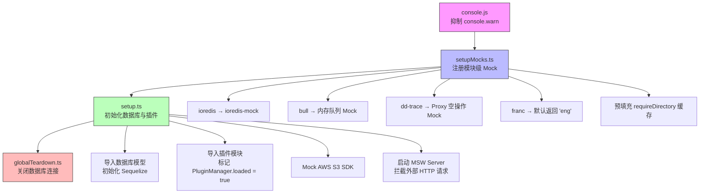
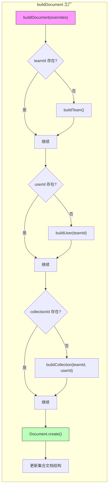
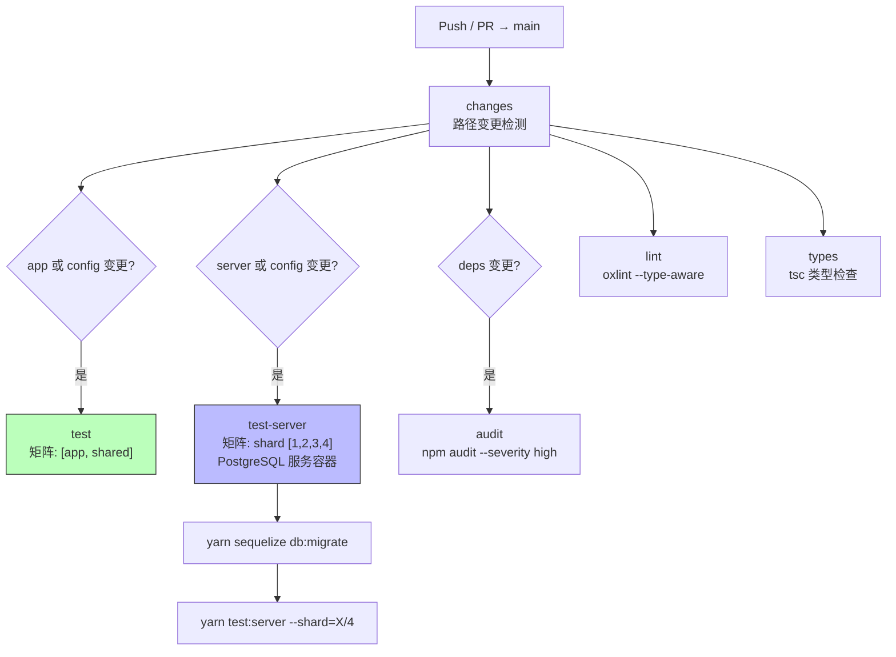

Outline 采用 **Vitest** 作为统一的测试运行器，通过多项目（projects）配置同时覆盖后端、前端和共享层的测试需求。整个测试体系围绕三个核心支柱构建：**分层的项目配置**隔离不同运行环境，**工厂模式（Factory Pattern）**提供高效的测试数据生成，以及 **TestServer + MSW** 实现接近真实场景的 API 集成测试。项目共有 223 个测试文件，其中后端占 166 个、共享层 29 个、前端 8 个，充分体现了后端密集测试、前端轻量验证的策略分布。

Sources: [vitest.config.ts](vitest.config.ts#L1-L112), [package.json](package.json#L31-L38)

## Vitest 多项目配置架构

Outline 的测试配置并非简单的单文件设置，而是通过 Vitest 的 `projects` 功能将整个测试矩阵拆分为四个独立项目，每个项目拥有专属的运行环境、setup 文件和文件匹配规则。这种设计的核心目标是让服务端测试在 Node.js 环境中直接访问数据库和文件系统，让前端测试在 jsdom 中模拟浏览器 API，而共享层则根据测试内容分别提供两种环境选择。

Sources: [vitest.config.ts](vitest.config.ts#L47-L111)

### 共享基础配置

四个项目共享同一套 Babel 编译插件和路径别名配置。由于项目使用 TypeScript 装饰器（`legacy: true` 模式）和 MobX 的 observable 装饰器，Babel 配置中必须包含 `@babel/plugin-proposal-decorators` 和 `@babel/plugin-transform-class-properties`。同时 `esbuild` 和 `oxc` 被显式关闭，因为这两者不支持装饰器语法所需的编译转换。

```typescript
// vitest.config.ts 中的共享配置核心
const sharedConfig = {
  resolve: { alias: aliases },
  plugins: [babelPlugin()],
  esbuild: false as const,
  oxc: false as const,
};
```

路径别名将 `@server`、`@shared`、`~`（app 目录）映射到物理路径，确保测试代码中的 `import` 语句与源码保持一致。前端和共享层的 jsdom 项目额外配置了图片/字体文件的 mock 别名，避免 Vitest 尝试解析二进制文件。

Sources: [vitest.config.ts](vitest.config.ts#L14-L46)

### 四个测试项目详解

| 项目名 | 运行环境 | 文件匹配范围 | Setup 文件 | 用途 |
|--------|---------|-------------|-----------|------|
| **server** | Node.js | `server/**/*.test.{ts,tsx}`, `plugins/**/*.test.{ts,tsx}` | `console.js` → `setupMocks.ts` → `setup.ts` | 后端 API、模型、命令、策略、工具测试 |
| **app** | jsdom | `app/**/*.test.{ts,tsx}` | `window.js` → `app/test/setup.ts` | 前端 MobX 模型、工具函数测试 |
| **shared-node** | Node.js | `shared/**/*.test.{ts,tsx}` | `console.js` → `shared/test/setup.ts` | 共享层中不需要 DOM 的纯逻辑测试 |
| **shared-jsdom** | jsdom | `shared/**/*.test.{ts,tsx}` | `window.js` | 共享层中需要 DOM API 的测试（如编辑器） |

Sources: [vitest.config.ts](vitest.config.ts#L54-L109)

值得注意的是 `server` 项目和 `shared-*` 项目之间存在文件匹配范围重叠——`shared` 目录的测试文件同时被 `shared-node` 和 `shared-jsdom` 两个项目匹配。这意味着同一个测试文件会运行两次，一次在 Node.js 环境中，一次在 jsdom 环境中。这种设计确保了共享代码在两种运行时下的兼容性。Vitest 配置还启用了 `globals: true`（允许直接使用 `describe`/`it`/`expect` 而无需显式导入）和 `pool: "threads"`（线程池并发执行），以及 `dangerouslyIgnoreUnhandledErrors: true` 防止未捕获的 Promise 异常导致整个测试进程崩溃。

Sources: [vitest.config.ts](vitest.config.ts#L49-L53)

### 测试命令矩阵

```json
{
  "test": "TZ=UTC vitest run",
  "test:app": "TZ=UTC vitest run --project app",
  "test:shared": "TZ=UTC vitest run --project shared-node --project shared-jsdom",
  "test:server": "TZ=UTC vitest run --project server",
  "test:watch": "TZ=UTC vitest"
}
```

所有测试命令都设置 `TZ=UTC` 确保时区一致性。`test` 命令运行全部项目，而 `test:server`、`test:app`、`test:shared` 分别只运行对应项目，便于开发时快速迭代。`test:watch` 启动监听模式，在文件变更时自动运行受影响的测试。

Sources: [package.json](package.json#L31-L38)

## 后端测试体系

后端测试是 Outline 测试体系的主体，覆盖了从模型层到 API 路由层的完整垂直切面。其核心设计理念是：**使用真实数据库（PostgreSQL）进行集成测试，通过工厂函数生成测试数据，通过 TestServer 进行 HTTP 级别的 API 测试**。

### 启动流程与 Mock 策略

后端测试的启动流程分为三个阶段，由 `setupFiles` 数组的顺序严格控制：



**第一阶段**（`console.js`）仅一行代码——抑制 `console.warn`，避免测试输出被大量警告信息污染。**第二阶段**（`setupMocks.ts`）是最关键的 Mock 注册阶段，必须在测试环境初始化之前运行，防止真实 Redis 客户端或 Bull 队列在模块导入时被创建。这里有一个精巧的设计：由于 Vitest 无法通过 `require()` 加载带路径别名的 TypeScript 文件，`setupMocks.ts` 使用 `import.meta.glob` 预加载邮件模板和队列处理器的模块，并通过 `__setRequireDirectoryCache` 注入到 `@server/utils/fs` 的缓存中，绕过了 `requireDirectory` 在测试环境下的路径解析限制。**第三阶段**（`setup.ts`）动态导入数据库模型和插件系统，启动 MSW（Mock Service Worker）服务器拦截所有非 localhost 的 HTTP 请求。

Sources: [server/test/setupMocks.ts](server/test/setupMocks.ts#L1-L56), [server/test/setup.ts](server/test/setup.ts#L1-L62), [__mocks__/console.js](__mocks__/console.js#L1-L2)

### 关键 Mock 模块

后端测试 Mock 了以下关键外部依赖：

| Mock 目标 | Mock 方式 | 原因 |
|-----------|----------|------|
| **ioredis** | 替换为 `ioredis-mock` | 避免需要真实 Redis 服务 |
| **bull** | 自定义内存队列实现 | 避免创建真实任务队列 |
| **dd-trace** | Proxy 动态返回空函数 | APM 追踪在测试中无意义 |
| **AWS S3 SDK** | `vi.mock()` 返回空操作 | 避免真实 S3 请求 |
| **franc** | 默认返回 `"eng"` | 语言检测确定性 |
| **request-filtering-agent** | 自定义 Mock | SSRF 防护在测试中无需真实执行 |
| **@aws-sdk/signature-v4-crt** | 空模块导出 | AWS SigV4 签名在测试中不需要 |

`dd-trace` 的 Mock 使用了 JavaScript `Proxy` 实现了一个递归的"链式调用吞没器"——无论调用哪个方法、传什么参数，都会返回一个新的可调用 Proxy，完美模拟了 APM tracer 的链式 API（如 `tracer.trace('name', (span) => {...})`），而不会产生任何副作用。

Sources: [server/__mocks__/bull.ts](server/__mocks__/bull.ts#L1-L42), [server/__mocks__/dd-trace.ts](server/__mocks__/dd-trace.ts#L1-L40), [server/__mocks__/franc.ts](server/__mocks__/franc.ts#L1-L10), [server/test/setup.ts](server/test/setup.ts#L17-L38)

### TestServer：HTTP 级别的 API 测试

`TestServer` 是后端 API 测试的核心基础设施，它将 Koa 应用包装在一个随机端口的 HTTP 服务器中，通过 `node-fetch` 发送真实 HTTP 请求，实现了最接近生产环境的集成测试。其关键设计包括：

**自动认证**——当传入 User 对象时，TestServer 自动从 `WeakMap` 缓存中获取或生成 session token，并设置为 `Authorization: Bearer <token>` 请求头。使用 `WeakMap` 缓存 token 意味着当 User 对象被垃圾回收时，缓存条目也会自动清除。

**自动 JSON 序列化**——当请求体是对象且未指定 `Content-Type` 时，自动设置 `application/json` 并执行 `JSON.stringify()`。

**方法重载**——提供 `get`、`post`、`put`、`delete`、`patch`、`head`、`options` 等方法，每个方法都支持两种调用签名：`(path, opts)` 和 `(path, user, opts)`，第二个参数可以传入 User 对象（自动认证）或 RequestOptions。

```typescript
// 典型用法：传入 user 自动带上认证 token
const res = await server.post("/api/documents.info", user, {
  body: { id: document.id },
});
// 不传 user 则匿名请求
const res = await server.post("/api/documents.info", { body: {} });
```

Sources: [server/test/TestServer.ts](server/test/TestServer.ts#L1-L231)

### MSW：网络请求拦截

后端测试使用 MSW（Mock Service Worker）的 Node.js 版本拦截外部 HTTP 请求。配置中注册了一个 `passthrough` 规则，让指向 `localhost`、`127.0.0.1`、`0.0.0.0` 的请求（即 TestServer 自身的请求）直接通过，而其他所有请求都会被 MSW 拦截。结合 `setup.ts` 中的 `server.listen({ onUnhandledRequest: "error" })` 配置，任何未预期的外部请求都会导致测试失败，防止测试意外依赖外部服务。

Sources: [server/test/msw.ts](server/test/msw.ts#L1-L12), [server/test/setup.ts](server/test/setup.ts#L8-L10)

### withAPIContext：命令级测试辅助

并非所有测试都需要经过 HTTP 层。对于 [命令模式（Commands）](12-ming-ling-mo-shi-commands-fu-za-ye-wu-luo-ji-de-zu-zhi-fang-shi) 中的业务逻辑测试，`withAPIContext` 辅助函数在数据库事务中创建一个模拟的 API 上下文，直接调用命令函数。这种方式跳过了 HTTP 和中间件层，测试更快速、更聚焦：

```typescript
const document = await withAPIContext(user, (ctx) =>
  documentCreator(ctx, {
    title: "Test Document",
    text: "content",
    collectionId: collection.id,
  })
);
```

`withAPIContext` 内部启动一个 Sequelize 事务，构造包含用户认证信息和事务引用的 `APIContext` 对象。测试结束后事务自动回滚，保持测试隔离。

Sources: [server/test/support.ts](server/test/support.ts#L58-L79)

## 工厂模式：测试数据生成

Outline 的测试工厂体系是整个测试基础设施中最庞大也最精巧的部分。[server/test/factories.ts](server/test/factories.ts) 包含约 40 个工厂函数，覆盖了几乎所有数据库模型。每个工厂函数遵循统一的设计模式：**接受可选的 `overrides` 对象，自动补全缺失的依赖关系，使用 Faker.js 生成合理的随机数据**。

### 工厂函数的设计模式



每个工厂函数的核心逻辑是 **依赖自动解析**。以 `buildDocument` 为例：创建文档需要用户、团队和集合，如果调用者没有提供这些依赖，工厂函数会自动调用相应的子工厂创建它们。这种级联创建机制意味着调用者只需写 `await buildDocument()` 就能得到一个完整的、可用的文档对象，而无需关心其背后的 Team → User → Collection → Document 依赖链。

Sources: [server/test/factories.ts](server/test/factories.ts#L375-L433)

### 工厂函数一览

| 工厂函数 | 创建对象 | 自动依赖 | 特殊行为 |
|---------|---------|---------|---------|
| `buildTeam` | Team + AuthenticationProvider | 无 | 自动创建 Slack 认证提供者 |
| `buildUser` | User + UserAuthentication | Team | 关联 Team 的认证提供者 |
| `buildAdmin` | User (Admin 角色) | Team | 委托给 `buildUser` |
| `buildViewer` | User (Viewer 角色) | Team | 委托给 `buildUser` |
| `buildGuestUser` | User (Guest 角色) | Team | 不创建 Authentication |
| `buildInvite` | User (被邀请状态) | Team, Actor | 设置 `invitedById`，`lastActiveAt` 为 null |
| `buildCollection` | Collection | Team, User | 默认权限为 `ReadWrite`，使用 `withDocumentStructure` scope |
| `buildDocument` | Document | Team, User, Collection | 解析 Markdown 文本为 ProseMirror JSON，更新集合结构 |
| `buildDraftDocument` | Document | 同 buildDocument | 设置 `publishedAt: null` |
| `buildTemplate` | Template | Team, User, Collection | 类似 buildDocument 但创建模板 |
| `buildComment` | Comment | 无（需必传参数） | 创建包含段落的 ProseMirror 数据 |
| `buildAttachment` | Attachment | Team, User, Document | 使用 `AttachmentHelper.getKey()` 生成 S3 key |
| `buildShare` | Share | Team, User, Document | 默认 `published: true` |
| `buildIntegration` | Integration + IntegrationAuthentication | Team, User | 默认 Slack Post 类型 |
| `buildFileOperation` | FileOperation | Team, Admin | 默认导出操作 |
| `buildImport` | Import | Team, Admin, Integration | 默认 Notion 导入 |
| `buildApiKey` | ApiKey | User | — |
| `buildStar` | Star | User, Document | 默认 index `"h"` |
| `buildSubscription` | Subscription | User, Document | 默认 `Document` 事件类型 |
| `buildNotification` | Notification | Team, User | 默认 `UpdateDocument` 事件 |
| `buildPin` | Pin | Team, User, Document | — |
| `buildWebhookSubscription` | WebhookSubscription | Team, User | 默认监听所有事件 (`"*"`) |
| `buildWebhookDelivery` | WebhookDelivery | WebhookSubscription | 默认 200 成功状态 |
| `buildSearchQuery` | SearchQuery | Team, User | 默认 source 为 `"app"` |
| `buildOAuthClient` | OAuthClient | Team, User | 默认 published 且有回调 URL |
| `buildOAuthAuthentication` | OAuthAuthentication | User, OAuthClient | 生成真实的 access/refresh token |
| `buildUserPasskey` | UserPasskey | User | 模拟 WebAuthn 凭据 |
| `buildEmoji` | Emoji | Team, User, Attachment | 自定义表情 |
| `buildGroup` | Group | Team, User | — |
| `buildGroupUser` | GroupUser | Team, User | — |
| `buildRelationship` | Relationship | User, Document × 2 | 默认 Backlink 类型 |

Sources: [server/test/factories.ts](server/test/factories.ts#L59-L996)

### 工厂函数的覆盖（Override）机制

所有工厂函数的第一个参数是 `overrides` 对象，其属性会展开到最终 `create` 调用中，**覆盖**默认值。但有一个重要细节：依赖自动解析逻辑检查的是 `overrides` 是否提供了某个外键（如 `teamId`），而不是检查 `overrides` 的其他属性。这意味着你可以这样做：

```typescript
// 只覆盖 name，其他依赖自动创建
const doc = await buildDocument({ title: "我的文档" });

// 覆盖外键，跳过对应的依赖创建
const user = await buildUser();
const doc = await buildDocument({ teamId: user.teamId, userId: user.id });

// 特殊处理：collectionId 设为 null 创建不在任何集合中的文档
const draft = await buildDocument({ collectionId: null });
```

`buildDocument` 中有一个设计注释说明了 TypeScript 类型系统的局限：为了允许 `collectionId` 传入 `null`（表示不属于任何集合的草稿），工厂函数的参数类型使用 `Omit<Partial<Document>, "collectionId"> & { collectionId?: string | null }` 先移除再重新添加这个字段，因为 `Partial<Document>` 中 `collectionId` 的类型是 `string | undefined`，不包含 `null`。

Sources: [server/test/factories.ts](server/test/factories.ts#L375-L433)

### 编辑器相关的测试辅助

`shared/test/editor.ts` 提供了一套编辑器节点构建工具函数，用于创建 ProseMirror 文档结构。这些函数包括 `p()`（段落）、`heading()`（标题）、`table()`/`tr()`/`td()`/`th()`（表格）、`blockquote()`（引用）、`bulletList()`/`orderedList()`（列表）、`codeBlock()`（代码块）、`hr()`（分割线）和 `doc()`（文档根节点），使用项目中实际注册的 `richExtensions` 构建 Schema，确保测试中的节点定义与生产环境一致：

```typescript
import { doc, p, table, tr, td, createEditorState } from "@shared/test/editor";

const testDoc = doc(p("Hello"), table([tr([td("Cell")])]));
const state = createEditorState(testDoc);
```

Sources: [shared/test/editor.ts](shared/test/editor.ts#L1-L241)

## 前端测试策略

前端的测试文件数量远少于后端（仅 8 个），这反映了前端测试的不同哲学：**前端测试聚焦于 MobX 模型的计算属性和纯工具函数的单元测试，而非组件的 UI 测试**。这种选择是务实的——Outline 的前端组件高度依赖 MobX 响应式系统和复杂的交互状态，编写有意义的组件测试成本高而收益低。

### 前端测试环境配置

前端测试运行在 jsdom 环境中，setup 文件做了三件事：导入 `reflect-metadata`（装饰器元数据支持），初始化 i18n 国际化系统，以及 Mock `localStorage`（使用自定义的内存实现替代 jsdom 自带的）。此外 `window.js` 为 `window.matchMedia` 和 `window.env` 提供了占位实现，`ApiClient` 则被整体 Mock 为空操作。

Sources: [app/test/setup.ts](app/test/setup.ts#L1-L13), [__mocks__/window.js](__mocks__/window.js#L1-L3), [__mocks__/localStorage.js](__mocks__/localStorage.js#L1-L21)

### 前端模型测试模式

前端模型测试直接使用 MobX Store 的 `add` 方法创建模型实例，然后测试其计算属性：

```typescript
import stores from "~/stores";

describe("User model", () => {
  const users = stores.users;

  test("should return first character of name uppercased", () => {
    const user = new User({ id: "123", name: "alice smith" }, users);
    expect(user.initial).toBe("A");
  });
});
```

这种模式简洁且高效——不需要 Mock HTTP 请求，不需要渲染组件，直接测试模型的业务逻辑。对于 `User.initial`、`User.initials` 这样的计算属性，测试覆盖了各种边界情况：空字符串、null、undefined、Unicode 字符、特殊字符等。

Sources: [app/models/User.test.ts](app/models/User.test.ts#L1-L198), [app/models/Collection.test.ts](app/models/Collection.test.ts#L1-L13)

## 测试文件组织与分布

### 后端测试的分层覆盖

后端测试文件分布在多个目录中，每一层都有对应的测试：

| 层级 | 目录 | 测试文件数 | 测试模式 |
|------|------|-----------|---------|
| **API 路由** | `server/routes/api/*/` | ~36 | TestServer HTTP 请求 + 工厂数据 |
| **命令** | `server/commands/` | ~20 | `withAPIContext` 直接调用 |
| **模型** | `server/models/` | ~20 | 工厂函数 + 直接模型方法调用 |
| **策略** | `server/policies/` | ~5 | `serialize()` 权限检查 |
| **中间件** | `server/middlewares/` | ~3 | TestServer + 特定场景 |
| **工具函数** | `server/utils/` | ~25 | 纯函数测试 |
| **协作** | `server/collaboration/` | ~1 | WebSocket 连接测试 |
| **队列任务** | `server/queues/` | 若干 | Mock Bull + 任务逻辑 |
| **工具 (Tools)** | `server/tools/` | ~6 | MCP 工具调用测试 |

Sources: [server/routes/api/documents/documents.test.ts](server/routes/api/documents/documents.test.ts#L1-L120), [server/commands/documentCreator.test.ts](server/commands/documentCreator.test.ts#L1-L77), [server/policies/collection.test.ts](server/policies/collection.test.ts#L1-L80)

### API 路由测试的典型模式

API 路由测试是最复杂的测试类型，通常遵循以下模式：

```typescript
// 1. 创建 TestServer 实例（在文件顶层，利用 getTestServer 自动管理生命周期）
const server = getTestServer();

// 2. 在 describe 块中组织测试用例
describe("#documents.info", () => {
  // 3. 使用工厂函数创建测试数据
  it("should return published document", async () => {
    const user = await buildUser();
    const document = await buildDocument({
      userId: user.id,
      teamId: user.teamId,
    });
    
    // 4. 通过 TestServer 发送请求
    const res = await server.post("/api/documents.info", user, {
      body: { id: document.id },
    });
    const body = await res.json();
    
    // 5. 断言响应状态和数据
    expect(res.status).toEqual(200);
    expect(body.data.id).toEqual(document.id);
  });
});
```

API 路由测试中广泛使用**快照测试**（Snapshot Testing），特别是在 `groups`、`comments`、`users`、`collections` 等 API 中，响应数据结构被保存为 `.snap` 文件，后续运行时自动对比，捕获意外的 API 响应格式变更。

Sources: [server/routes/api/documents/documents.test.ts](server/routes/api/documents/documents.test.ts#L44-L74)

## CI/CD 中的测试执行

Outline 使用 GitHub Actions CI 管道运行测试，测试策略体现了对效率的精细考虑：



关键设计决策包括：

**路径变更检测**——通过 `dorny/paths-filter` Action 检测哪些目录发生了变更，只在相关变更时才触发对应的测试任务。后端测试只在 `server/`、`shared/`、`package.json` 或 `yarn.lock` 变更时运行，前端测试同理。

**服务端测试分片**——后端测试被拆分为 4 个分片（shard）并行执行（`--shard=1/4` 到 `--shard=4/4`），每个分片使用 2 个 worker（`--maxWorkers=2`）。这需要 PostgreSQL 服务容器支持并发连接。

**真实数据库**——CI 使用 `postgres:14.2` Docker 容器作为测试数据库，并在测试前运行 `sequelize db:migrate` 确保数据库 schema 是最新的。测试使用的数据库名为 `outline_test`。

**Redis 实际未被使用**——虽然 CI 配置了 `REDIS_URL` 环境变量，但后端测试通过 `ioredis-mock` 替代了真实的 Redis 连接。

Sources: [.github/workflows/ci.yml](.github/workflows/ci.yml#L1-L134)

## 测试辅助工具箱

除了核心的 TestServer 和工厂函数外，Outline 还提供了几个专用的测试辅助工具：

### mockTaskSchedule

用于测试异步任务的调度行为。它通过 `vi.spyOn` 在 `BaseTask.prototype.schedule` 上安装 Mock，捕获所有任务调度调用但不实际执行，允许测试验证"某任务是否被正确调度"：

```typescript
const schedule = mockTaskSchedule();
// ... 执行业务逻辑 ...
expect(schedule).toHaveBeenCalledWith({ documentId: doc.id });
```

Sources: [server/test/support.ts](server/test/support.ts#L43-L56)

### McpHelper

专门用于 MCP（Model Context Protocol）端点的测试辅助工具。它封装了 OAuth 用户创建、JSON-RPC 请求构建、SSE 响应解析等逻辑，简化了 [MCP 服务器](20-mcp-fu-wu-qi-ai-gong-ju-ji-cheng-yu-model-context-protocol-shi-xian) 相关的测试编写。

Sources: [server/test/McpHelper.ts](server/test/McpHelper.ts#L1-L123)

### 测试 Fixtures

`server/test/fixtures/` 目录存放了各种静态测试文件，包括 Confluence 导出文件、Notion JSON 页面、Markdown 文件、ZIP 压缩包、HTML 文档等，主要用于 [文档导入](12-ming-ling-mo-shi-commands-fu-za-ye-wu-luo-ji-de-zu-zhi-fang-shi) 和格式转换的测试。

Sources: [server/test/fixtures](server/test/fixtures)

## 测试最佳实践总结

基于 Outline 测试体系的设计，可以总结出以下适用于本项目的测试最佳实践：

1. **优先使用工厂函数**——永远不要手动构造测试数据，使用 `build*` 系列函数并传入必要的覆盖参数。这确保测试数据的依赖关系完整且一致。

2. **选择正确的测试层级**——测试业务逻辑用 `withAPIContext` + 命令函数直接调用；测试 API 行为（认证、权限、参数验证）用 `TestServer` + HTTP 请求。前者快速且聚焦，后者全面但较慢。

3. **利用 MSW 拦截外部请求**——如果测试代码需要发起外部 HTTP 请求（如 OAuth 回调、Webhook 投递），使用 MSW 的 `server.use()` 注册特定的 handler。不要让测试依赖外部网络。

4. **测试文件命名**——测试文件与源文件同名，后缀为 `.test.ts`（或 `.test.tsx`），放在同一目录下。Vitest 的 `include` 配置会自动发现它们。

5. **使用 `beforeEach` 重置状态**——每个测试用例应该独立运行，不依赖其他用例的副作用。使用 `beforeEach` 重置 Mock 和环境变量。

如果你接下来想了解测试如何融入整体部署流程，请参阅 [部署指南：Docker 容器化与环境变量配置](24-bu-shu-zhi-nan-docker-rong-qi-hua-yu-huan-jing-bian-liang-pei-zhi)。如果想了解生产环境中如何监控测试未能捕获的运行时问题，请参阅 [可观测性：日志、指标收集、Sentry 错误追踪与链路追踪](25-ke-guan-ce-xing-ri-zhi-zhi-biao-shou-ji-sentry-cuo-wu-zhui-zong-yu-lian-lu-zhui-zong)。