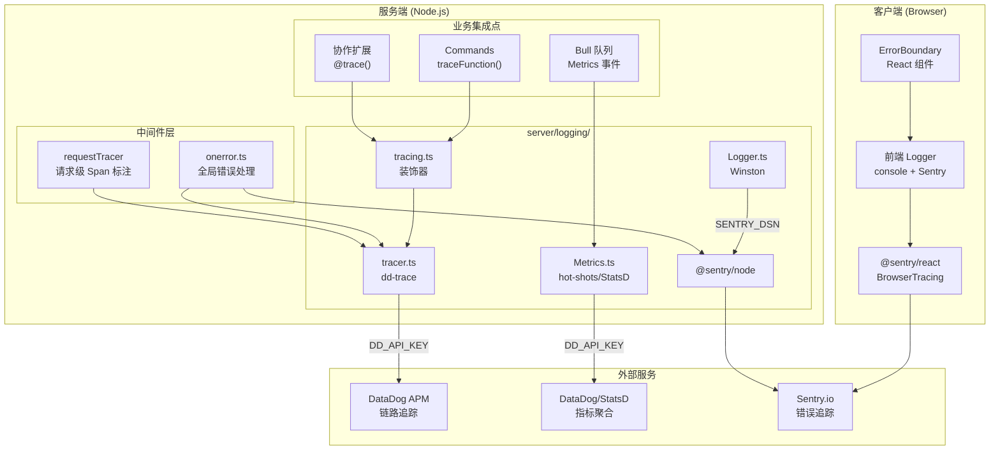
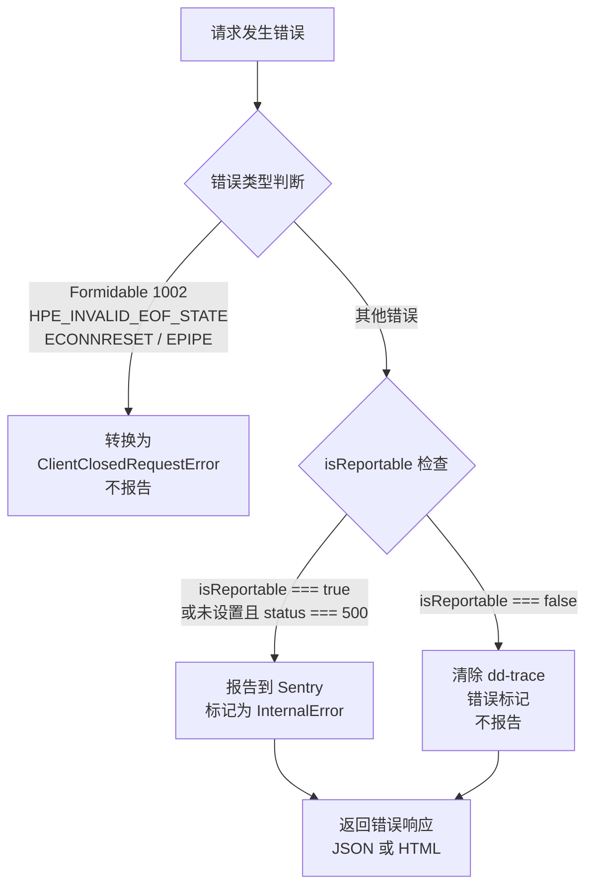

Outline 的可观测性体系建立在四大支柱之上：**结构化日志**（Winston）、**指标收集**（StatsD/DataDog）、**错误追踪**（Sentry）和**分布式链路追踪**（DataDog APM）。这四套系统通过环境变量实现零耦合的按需启用，在自托管部署中只需配置对应的环境变量即可激活，而在云托管环境中默认全部启用。整个体系贯穿前后端——服务端的 `server/logging` 目录是核心编排层，客户端的 `app/utils/sentry.ts` 和 `app/utils/Logger.ts` 则构成了前端可观测性的入口。

Sources: [server/logging](server/logging), [app/utils/sentry.ts](app/utils/sentry.ts), [app/utils/Logger.ts](app/utils/Logger.ts)

## 整体架构



上图的虚线表示条件激活——只有当 `SENTRY_DSN` 和 `DD_API_KEY` 分别被配置时，Sentry 和 DataDog 模块才真正初始化。这套条件激活机制确保自托管部署不会因为缺少外部服务而产生启动错误。

Sources: [server/logging/Logger.ts](server/logging/Logger.ts#L1-L10), [server/logging/tracer.ts](server/logging/tracer.ts#L27-L34), [server/logging/sentry.ts](server/logging/sentry.ts#L5-L45)

## 结构化日志系统

### 核心设计：Winston + 分类标签

后端日志系统基于 **Winston** 构建，封装在 `Logger` 单例类中。其核心设计理念是**分类驱动**的日志输出——每条日志都携带一个 `LogCategory` 标签（如 `lifecycle`、`authentication`、`multiplayer` 等），便于在生产环境的海量 JSON 日志中快速过滤。

| 日志级别 | 方法 | 用途 |
|---------|------|------|
| `info` | `info(label, message, extra?)` | 常规信息，如服务启动、文档加载 |
| `debug` | `debug(label, message, extra?)` | 调试信息，受 `LOG_LEVEL` 和 `DEBUG` 控制 |
| `silly` | `silly(label, message, extra?)` | 极详细日志，最低优先级 |
| `warn` | `warn(message, extra?)` | 警告，自动递增 `logger.warning` 指标 |
| `error` | `error(message, error, extra?, request?)` | 错误，联动 Sentry + Metrics + Tracing |
| `fatal` | `fatal(message, error, extra?)` | 致命错误，触发进程关闭 |

生产环境输出 **JSON 格式**的日志（`winston.format.json()`），方便被日志聚合系统（如 ELK、Datadog Logs）直接消费；开发环境则输出**彩色化的可读格式**（`winston.format.colorize()` + `printf`），标签会以粗体显示。

Sources: [server/logging/Logger.ts](server/logging/Logger.ts#L31-L77)

### 数据脱敏机制

Logger 内置了 `sanitize()` 方法，在日志写入前递归清理敏感字段。该方法的行为根据环境有所区分：

- **非生产环境**：直接透传原始数据，方便调试
- **生产环境**：自动将 `accessToken`、`refreshToken`、`token`、`password`、`content` 等关键字段替换为 `[Filtered]`，嵌套深度超过 3 层时截断为 `[…]`

```typescript
// 敏感字段在日志输出时被自动过滤
const sensitiveFields = [
  "accessToken",
  "refreshToken",
  "token",
  "password",
  "content",
];
```

Sources: [server/logging/Logger.ts](server/logging/Logger.ts#L191-L246)

### 前端日志

前端日志系统（`app/utils/Logger.ts`）是一套轻量级实现，核心区别在于：

- **`info` / `debug`**：直接输出到 `console`，`debug` 受 `ENVIRONMENT` 和 `debugLoggingEnabled` 开关控制
- **`warn` / `error`**：在配置了 `SENTRY_DSN` 时，同时将事件发送到 Sentry（`captureMessage` / `captureException`）

前端的日志分类（`LogCategory`）与服务端有所不同，包含 `editor`、`router`、`store` 等前端特有类别。

Sources: [app/utils/Logger.ts](app/utils/Logger.ts#L1-L96)

### `error()` 方法的四重联动

服务端 Logger 的 `error()` 方法是整个可观测性体系的**核心交汇点**，一次调用同时触发四个动作：

1. **Metrics 计数**：递增 `logger.error` 指标，附带 `name` 标签标识错误类型
2. **链路标注**：通过 `Tracing.setError()` 在当前 APM Span 上标记错误信息
3. **Sentry 上报**：在新的 Sentry Scope 中设置额外上下文，解析 HTTP 请求信息，捕获异常
4. **日志输出**：生产环境输出 JSON 格式（含 `error.message` 和 `error.stack`），开发环境直接 `console.error`

Sources: [server/logging/Logger.ts](server/logging/Logger.ts#L129-L171)

## 指标收集系统

### StatsD 客户端配置

指标系统基于 **hot-shots**（StatsD 客户端）实现，封装在 `Metrics` 单例类中。所有指标自动添加 `outline.` 前缀和 `env` 全局标签（取自 `DD_ENV` 或 `ENVIRONMENT`），便于在 DataDog 中按环境筛选。

```typescript
this.client = new StatsD({
  prefix: "outline.",
  globalTags: { env: process.env.DD_ENV ?? env.ENVIRONMENT },
  errorHandler: () => {
    // 静默忽略 StatsD 错误，避免拖垮服务器
  },
});
```

`errorHandler` 的静默设计是一个关键的容错决策——当 StatsD Agent 不可用时，指标写入失败不应影响业务请求。

Sources: [server/logging/Metrics.ts](server/logging/Metrics.ts#L1-L45)

### 指标类型与使用模式

| 方法 | 类型 | 用途 | 典型场景 |
|------|------|------|---------|
| `gauge(key, value, tags?)` | 仪表盘 | 记录当前值 | 队列任务数量 |
| `gaugePerInstance(key, value, tags?)` | 实例级仪表盘 | 按实例 ID 记录值 | 连接数、文档数 |
| `increment(key, tags?)` | 计数器 | 递增统计 | 事件发生次数 |

`gaugePerInstance` 特别值得注意——它自动从 `INSTANCE_ID`、`HEROKU_DYNO_ID` 或 `process.pid` 中提取实例标识，以 `instance:` 标签附加到指标上。这在多进程部署（通过 `WEB_CONCURRENCY` 控制）中至关重要，确保各实例的连接数、文档数等指标可以独立追踪。

Sources: [server/logging/Metrics.ts](server/logging/Metrics.ts#L17-L34)

### 协作服务的指标集成

Hocuspocus 协作服务通过 `MetricsExtension` 深度集成了指标收集，覆盖文档协作的完整生命周期：

| 事件 | 指标名 | 类型 |
|------|--------|------|
| 文档加载 | `collaboration.load_document` | 计数器 |
| 认证失败 | `collaboration.authentication_failed` | 计数器 |
| 连接建立 | `collaboration.connect` / `collaboration.connections_count` | 计数器 + 仪表盘 |
| 连接断开 | `collaboration.disconnect` | 计数器 |
| 文档变更 | `collaboration.change` | 计数器 |
| 服务销毁 | `collaboration.connections_count` = 0 | 仪表盘 |

Sources: [server/collaboration/MetricsExtension.ts](server/collaboration/MetricsExtension.ts#L1-L72)

### Bull 队列的自动指标

每个通过 `createQueue()` 创建的 Bull 队列自动注册四种事件指标，并以 `queue.<snake_case_name>.jobs.*` 的命名空间组织：

- `*.stalled`：任务停滞
- `*.completed`：任务完成
- `*.errored`：队列错误
- `*.failed`：任务失败

同时，每隔 5 秒自动采集 `*.count`（队列总大小）和 `*.delayed_count`（延迟任务数）的仪表盘指标。

Sources: [server/queues/queue.ts](server/queues/queue.ts#L10-L68)

### WebSocket 与 HTTP 连接指标

WebSocket 服务在连接建立/断开时自动更新 `websockets.connected`、`websockets.disconnected` 和 `websockets.count` 指标。HTTP 服务则通过 `setInterval` 每 5 秒采集当前连接数，以 `connections.count` 指标上报。

Sources: [server/services/websockets.ts](server/services/websockets.ts#L110-L117), [server/services/web.ts](server/services/web.ts#L61-L70)

## Sentry 错误追踪

### 后端 Sentry 配置

后端 Sentry 使用 `@sentry/node`，初始化时配置了精细的**错误过滤策略**：

**忽略的错误类型**（`ignoreErrors`）——这些是应用正常运行中预期会出现的错误，无需上报：

| 错误类型 | 说明 |
|---------|------|
| `BadRequestError` | 请求参数验证失败 |
| `SequelizeValidationError` | 数据库模型验证失败 |
| `SequelizeEmptyResultError` | 查询未返回结果 |
| `ValidationError` | 通用验证错误 |
| `ForbiddenError` | 权限不足 |
| `UnauthorizedError` | 未认证 |
| `TeamDomainRequiredError` | 无法识别工作空间域名 |
| `GmailAccountCreationError` | Gmail 账号限制 |
| `UserSuspendedError` | 用户已停用 |
| `TooManyRequestsError` | 请求频率超限 |

**采样策略**——通过 `beforeSend` 钩子对 warning 级别事件进行 10% 采样（`Math.random() < 0.1` 过滤掉 90%），有效降低告警噪音。

Sources: [server/logging/sentry.ts](server/logging/sentry.ts#L5-L45)

### 请求级错误处理

`requestErrorHandler` 函数（定义在 `sentry.ts` 中）是 Sentry 与 Koa 请求上下文的桥梁，它为每个上报的错误附加以下上下文标签：

- `request_id`：来自 `x-request-id` 请求头
- `auth_type`：认证类型（如 session、API key）
- `team_id`：当前用户所属团队
- 用户 ID：通过 `scope.setUser()` 设置

同时自动过滤掉 `EPIPE` 和 `ECONNRESET` 错误（客户端断开连接导致的管道错误），这些是网络层面的正常现象。

Sources: [server/logging/sentry.ts](server/logging/sentry.ts#L48-L88)

### 全局错误处理中间件（`onerror`）

`onerror.ts` 是 Koa 的全局错误处理器，它实现了一套**精细化的错误上报策略**：



关键设计：`isReportable` 属性控制着错误是否上报。所有业务预期错误（如 404、403、401）都标记为 `isReportable: false`，只有真正的内部错误（500）和显式标记为 `isReportable: true` 的错误才会被上报。对于不报告的错误，还会主动清除 dd-trace 在 Span 上自动设置的错误标记，确保 APM 链路不会出现误报。

Sources: [server/onerror.ts](server/onerror.ts#L1-L101)

### 前端 Sentry 配置

前端使用 `@sentry/react` 并集成了 `BrowserTracing`，通过 React Router v5 路由自动埋点实现前端性能追踪。配置要点包括：

- **采样率**：生产环境 10%（`tracesSampleRate: 0.1`），非生产环境 100%
- **URL 白名单**：仅追踪来自 `URL`、`CDN_URL`、`COLLABORATION_URL` 的错误
- **Sentry Tunnel**：支持通过 `SENTRY_TUNNEL` 配置代理，绕过广告拦截器
- **错误过滤**：忽略动态模块加载失败、ResizeObserver 循环、浏览器扩展等已知噪音

Sources: [app/utils/sentry.ts](app/utils/sentry.ts#L1-L58)

### ErrorBoundary 组件

React 的 `ErrorBoundary` 组件提供了用户层面的错误捕获和恢复机制。它维护一个**错误去重系统**——将错误时间戳存储在 localStorage 中，5 分钟窗口内重复出现的错误会显示不同的提示信息（建议清除缓存或更换浏览器），而非重复错误则提示已通知工程团队（仅当配置了 `SENTRY_DSN` 时显示）。

Sources: [app/components/ErrorBoundary.tsx](app/components/ErrorBoundary.tsx#L40-L110)

## 分布式链路追踪

### DataDog Tracer 初始化

链路追踪基于 **dd-trace**（DataDog APM SDK），在 `server/index.ts` 中通过 `import "./logging/tracer"` 作为**第一个模块导入**（甚至先于 `env` 模块之后的任何业务代码），确保所有后续模块中的 dd-trace 自动埋点都能正确生效。

```typescript
// server/index.ts
import env from "./env";
import "./logging/tracer"; // 必须在任何被埋点的模块之前导入
```

初始化条件是 `DD_API_KEY` 存在，配置了 `version`（应用版本）、`service`（服务名，默认 `outline`）、`env`（环境名）和 `logInjection`（日志关联）。

Sources: [server/index.ts](server/index.ts#L5-L5), [server/logging/tracer.ts](server/logging/tracer.ts#L27-L34)

### 三种追踪集成模式

Outline 提供了三种级别的追踪集成，覆盖不同粒度的场景：

| 模式 | 装饰器/函数 | 适用范围 | 示例 |
|------|------------|---------|------|
| **类级追踪** | `@trace()` | 整个类的所有方法 | `DocumentConverter`、`ZipHelper`、`TextHelper` |
| **函数级追踪** | `traceFunction(config)(fn)` | 单个函数 | Commands、Worker 任务处理器 |
| **手动 Span 操作** | `addTags()`、`setResource()` | 在已有 Span 上添加上下文 | Worker 任务、请求中间件 |

Sources: [server/logging/tracing.ts](server/logging/tracing.ts#L59-L218), [server/logging/tracer.ts](server/logging/tracer.ts#L36-L113)

### `traceFunction` 装饰器详解

`traceFunction` 是最核心的追踪原语，它将一个普通函数包装为可追踪的版本：

```typescript
export default traceFunction({
  spanName: "accountProvisioner",
})(accountProvisioner);
```

其内部工作机制：

1. **Span 创建**：根据配置创建新的 Span（`spanName` 决定 Span 名称，`resourceName` 决定资源标识）
2. **服务名映射**：如果配置了 `serviceName`，会将 Span 的服务名设为 `outline-<serviceName>`（如 `outline-worker`）
3. **根 Span 模式**：`isRoot: true` 时，不继承父 Span，创建独立的根 Span（Worker 任务通常使用此模式）
4. **异步支持**：自动检测返回值是否为 Promise，在 Promise reject 时标记错误、resolve 时关闭 Span
5. **测试环境跳过**：`ENVIRONMENT === "test"` 时直接透传原函数，零开销

Sources: [server/logging/tracing.ts](server/logging/tracing.ts#L59-L127)

### `@trace()` 类装饰器

`@trace()` 装饰器通过反射机制遍历目标类的**原型方法**和**静态方法**（跳过 `constructor`），将每个方法都用 `traceMethod` 包装。这意味着一个类上的所有公共方法都会自动出现在 APM 链路中。

典型使用场景包括协作扩展类（`AuthenticationExtension`、`PersistenceExtension`、`ConnectionLimitExtension` 等），使得每个协作生命周期钩子都有独立的 Span。

Sources: [server/logging/tracing.ts](server/logging/tracing.ts#L148-L184)

### 请求级 Span 标注

`requestTracer` 中间件在每个 API 请求到达时，自动从请求参数中提取 ID 类字段（以 `id` 结尾的参数），将其作为 `resource.<fieldName>` 标签附加到请求的**根 Span** 上。这使得在 DataDog 中可以通过具体的文档 ID、集合 ID 等直接搜索到对应的请求链路。

Sources: [server/middlewares/requestTracer.ts](server/middlewares/requestTracer.ts#L1-L24)

### Worker 服务的追踪架构

Worker 服务的三个队列（`globalEventQueue`、`processorEventQueue`、`taskQueue`）都使用 `traceFunction` 包装处理器函数，配置 `serviceName: "worker"` 和 `isRoot: true`，创建独立的追踪树：

- **全局事件队列**：`setResource(`Event.${event.name}`)` 标注事件类型
- **处理器事件队列**：`setResource(`Processor.${name}`)` 标注处理器名称，并通过 `addTags({ event })` 附加事件数据
- **任务队列**：`setResource(`Task.${name}`)` 标注任务名称，附加 `props`

Sources: [server/services/worker.ts](server/services/worker.ts#L17-L179)

## 错误分类与 `isReportable` 体系

Outline 定义了一套基于 `isReportable` 属性的错误分类体系，决定了错误在可观测性系统中的可见度：

| 分类 | `isReportable` | Sentry 行为 | APM 行为 | 典型错误 |
|------|----------------|------------|----------|---------|
| **业务预期错误** | `false` | 不上报 | 清除错误标记 | 401、403、404、429 |
| **内部错误** | `true` | 上报 | 标记为错误 | 500 |
| **未标记错误** | 未设置 | 若 status=500 则上报 | 保持默认行为 | 未知运行时错误 |

Sources: [server/errors.ts](server/errors.ts#L1-L106), [server/onerror.ts](server/onerror.ts#L37-L65)

## 环境变量配置一览

| 环境变量 | 作用 | 默认值 | 作用域 |
|---------|------|--------|--------|
| `SENTRY_DSN` | 启用 Sentry 错误追踪 | 无（不启用） | 前后端 |
| `SENTRY_TUNNEL` | Sentry 代理隧道 URL | 无 | 前端 |
| `DD_API_KEY` | 启用 DataDog APM + 指标 | 无（不启用） | 后端 |
| `DD_SERVICE` | DataDog 服务名 | `outline` | 后端 |
| `DD_ENV` | DataDog 环境标签（覆盖 `ENVIRONMENT`） | 无 | 后端 |
| `LOG_LEVEL` | Winston 日志级别 | `info` | 后端 |
| `DEBUG` | 额外调试（逗号分隔），`http` 启用请求日志 | 无 | 后端 |
| `RELEASE` | Sentry 发布版本标识 | 无 | 后端 |
| `ENVIRONMENT` | 运行环境（`development`/`production`/`staging`/`test`） | `production` | 前后端 |

Sources: [server/env.ts](server/env.ts#L481-L513), [server/env.ts](server/env.ts#L293-L302)

## 健康监控与队列保护

`HealthMonitor` 类为 Bull 队列提供了**停滞检测**机制——如果队列在 30 秒内没有任何活动（`active`、`completed`、`failed` 事件），且等待任务数超过 50 个，则通过 `Logger.fatal()` 触发进程关闭。这是一种**自杀式恢复策略**：当队列进程卡死时，通过终止进程让进程管理器（如 Heroku/Docker）自动重启，恢复队列消费能力。

Sources: [server/queues/HealthMonitor.ts](server/queues/HealthMonitor.ts#L1-L47)

## 测试环境中的可观测性

测试环境采取了全面的静默策略：

- **dd-trace**：完全由 `__mocks__/dd-trace.ts` 替换为一个基于 `Proxy` 的空操作 Mock，所有链路追踪调用静默返回
- **`@trace()` 装饰器**：当 `ENVIRONMENT === "test"` 时直接透传原函数
- **Sentry**：`requestErrorHandler` 在测试环境仅 `console.error`，不上报
- **队列指标**：`createQueue` 中跳过定时指标采集

Sources: [server/__mocks__/dd-trace.ts](server/__mocks__/dd-trace.ts#L1-L39), [server/logging/sentry.ts](server/logging/sentry.ts#L84-L87), [server/queues/queue.ts](server/queues/queue.ts#L56-L61)

---

> **下一步阅读**：理解了可观测性体系后，建议结合 [测试体系：Vitest 配置、前后端测试策略与工厂模式](23-ce-shi-ti-xi-vitest-pei-zhi-qian-hou-duan-ce-shi-ce-lue-yu-gong-han-mo-shi) 了解如何在测试中验证日志和错误处理行为，或参考 [部署指南：Docker 容器化与环境变量配置](24-bu-shu-zhi-nan-docker-rong-qi-hua-yu-huan-jing-bian-liang-pei-zhi) 配置生产环境的可观测性参数。