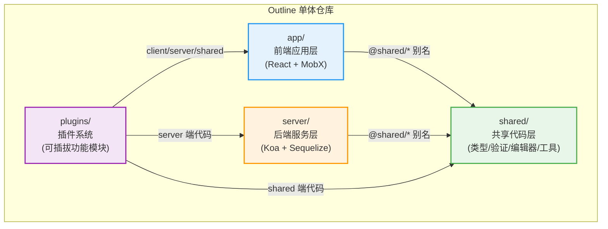
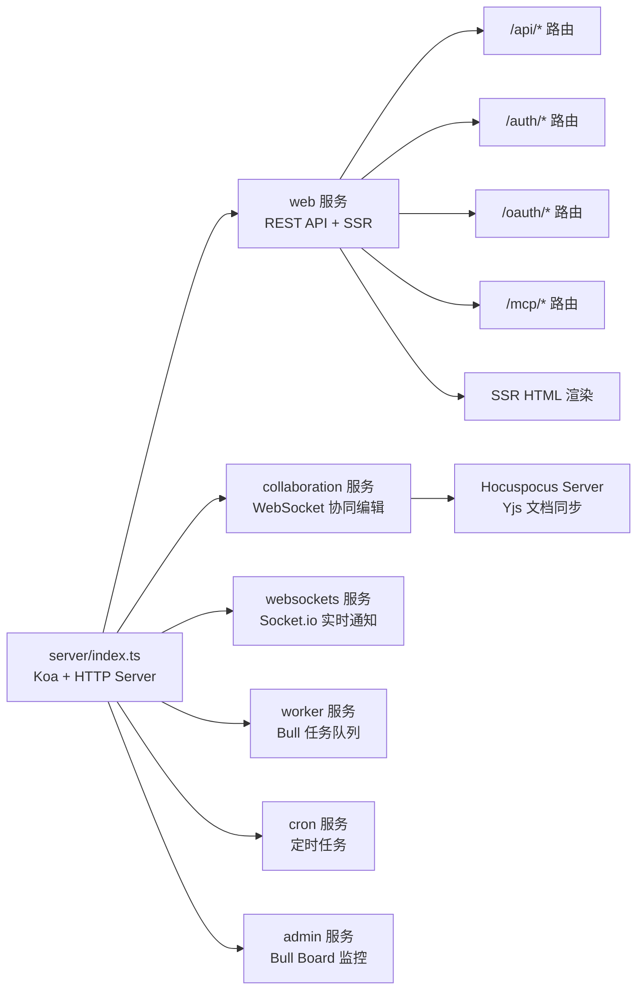
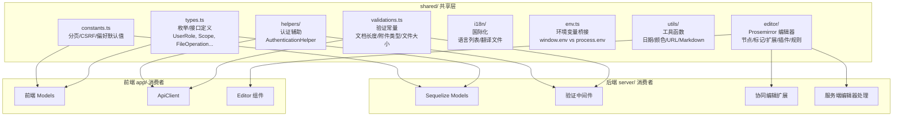
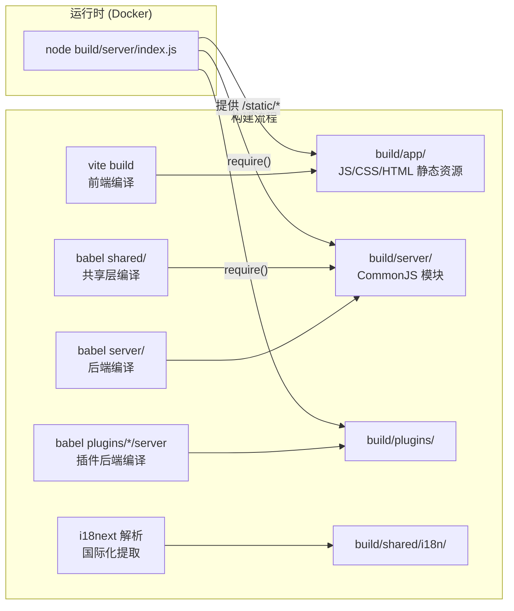
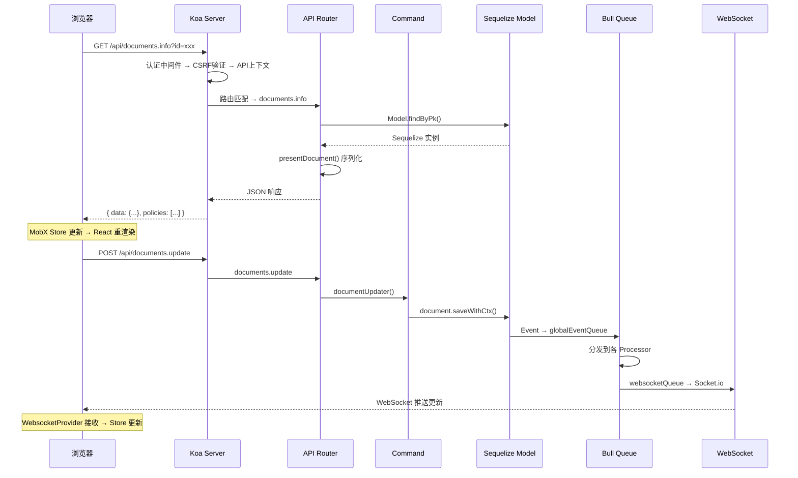

Outline 是一个基于 Node.js 的现代团队知识库系统，采用**单体仓库（Monorepo）**结构，将代码组织为三大核心层：前端应用层（`app/`）、后端服务层（`server/`）和共享代码层（`shared/`）。这种分层设计既保持了前后端的职责清晰，又通过共享层实现了类型、验证规则、编辑器逻辑的零冗余复用。整个系统以一个 Koa.js HTTP 服务为核心，同时承载 REST API、WebSocket 实时通信和基于 Hocuspocus 的协同编辑能力，最终编译为一个 Docker 容器中的单一 Node.js 进程。

## 三层目录结构与职责划分

Outline 的源代码根目录下有三个最为核心的目录，它们各自承担不同的运行时角色，却通过 TypeScript 路径别名紧密协作：



**路径别名**是理解三层协作的关键机制。在 [tsconfig.json](tsconfig.json#L27-L32) 中，TypeScript 定义了三个核心路径映射：

| 路径别名 | 指向目录 | 消费者 | 用途 |
|---------|---------|--------|------|
| `~/*` | `./app/*` | 前端代码内部引用 | 前端组件、Store、路由等 |
| `@shared/*` | `./shared/*` | 前端和后端共同引用 | 共享类型、验证规则、工具函数 |
| `@server/*` | `./server/*` | 后端代码内部引用 | 后端模型、服务、中间件等 |

这种别名设计意味着，当你看到前端组件中 `import { Scope } from "@shared/types"` 或后端中间件中 `import env from "@shared/env"` 时，它们引用的是同一份源代码。编译后的产物中，Babel 会将这些路径解析为相对路径。

Sources: [tsconfig.json](tsconfig.json#L27-L32), [vite.config.ts](vite.config.ts#L157-L162)

## 前端应用层（app/）：React SPA 的组织结构

前端是一个基于 **React 18** 的单页应用（SPA），通过 **Vite** 进行开发和构建。入口文件 [app/index.tsx](app/index.tsx#L1-L93) 展示了应用的顶层组件嵌套结构，从外到内依次是：`HelmetProvider`（SEO 头信息）→ `Provider`（MobX 状态注入）→ `Analytics`（埋点）→ `Router`（路由）→ `Theme`（主题）→ `KBarProvider`（命令面板）→ `LazyMotion`（动画）→ `PageScroll`→ `Routes`（页面路由出口）。

前端内部按职责划分为以下关键子目录：

| 目录 | 职责 | 典型内容 |
|------|------|---------|
| `scenes/` | 页面级场景组件 | 登录、文档编辑、设置、搜索等完整页面 |
| `components/` | 可复用 UI 组件 | 按钮、弹窗、面包屑、侧边栏等 |
| `stores/` | MobX 状态管理 | 30+ 个 Store，按业务实体划分 |
| `models/` | 前端数据模型 | 带 MobX observable 的客户端领域模型 |
| `hooks/` | 自定义 React Hooks | 权限检查、分页、窗口尺寸等 |
| `menus/` | 右键/下拉菜单 | 文档菜单、集合菜单、用户菜单等 |
| `editor/` | 编辑器 UI 集成 | 编辑器组件、工具栏菜单 |
| `routes/` | 路由配置 | 认证路由、设置路由等 |
| `utils/` | 工具函数 | API 客户端、日志、国际化等 |

前端的状态管理采用 **MobX 4.x**，通过 [RootStore](app/stores/RootStore.ts#L40-L116) 模式集中管理所有 Store 实例。每个 Store 对应一个业务实体（如 `DocumentsStore`、`CollectionsStore`），而每个前端 Model（如 `Document`、`Collection`）是 MobX observable 对象，通过 [ApiClient](app/utils/ApiClient.ts#L44-L55) 与后端 `/api/*` 端点通信。

Sources: [app/index.tsx](app/index.tsx#L57-L92), [app/stores/RootStore.ts](app/stores/RootStore.ts#L76-L116), [app/utils/ApiClient.ts](app/utils/ApiClient.ts#L44-L55)

## 后端服务层（server/）：多服务架构的 Koa 应用

后端并非一个简单的 REST API 服务器，而是一个**多服务共进程**的架构。入口文件 [server/index.ts](server/index.ts#L180-L189) 通过 `env.SERVICES` 环境变量动态加载所需的服务，注册在 [server/services/index.ts](server/services/index.ts#L1-L15) 中：



**web 服务**（[server/services/web.ts](server/services/web.ts#L76-L100)）是最核心的服务，它将 Koa 中间件栈挂载到 `/api`、`/mcp`、`/auth`、`/oauth` 和根路径上。其中，API 路由（[server/routes/api/index.ts](server/routes/api/index.ts#L56-L81)）使用了 `koa-body`（文件上传）、CSRF 验证、请求追踪、API 响应格式化等中间件，然后按资源注册了 30+ 个子路由模块（documents、collections、users、comments 等）。

**collaboration 服务**（[server/services/collaboration.ts](server/services/collaboration.ts#L44-L71)）基于 **Hocuspocus Server** 构建，通过 WebSocket 的 `upgrade` 事件拦截 `/collaboration` 路径的连接请求，以扩展链模式挂载了认证、持久化、限流、日志、指标收集等多个扩展。

**worker 服务**（[server/services/worker.ts](server/services/worker.ts#L17-L179)）处理三个 Bull 队列：全局事件队列（`globalEventQueue`）分发事件到各处理器、处理器事件队列（`processorEventQueue`）执行具体业务逻辑、任务队列（`taskQueue`）执行异步任务（如导出、邮件发送）。

后端的数据模型层使用 **Sequelize ORM**（通过 `sequelize-typescript`），定义在 [server/models/](server/models/base/Model.ts#L48-L52) 中。后端 Model 继承自 `SequelizeModel`，拥有生命周期钩子（`AfterCreate`、`AfterUpdate` 等）和带上下文的保存方法（`saveWithCtx`、`updateWithCtx`），确保每次数据变更都能触发事件写入队列。

Sources: [server/index.ts](server/index.ts#L180-L189), [server/services/index.ts](server/services/index.ts#L1-L15), [server/services/web.ts](server/services/web.ts#L28-L103), [server/services/collaboration.ts](server/services/collaboration.ts#L44-L71), [server/services/worker.ts](server/services/worker.ts#L17-L179), [server/routes/api/index.ts](server/routes/api/index.ts#L56-L81)

## 共享代码层（shared/）：前后端的桥梁

`shared/` 目录是 Outline 架构设计中最精妙的部分。它包含的代码**同时运行在浏览器和 Node.js 服务器中**，确保了前后端在类型定义、业务规则和编辑器行为上的绝对一致性。



共享层的关键子目录和文件包括：

| 路径 | 内容 | 前端用途 | 后端用途 |
|------|------|---------|---------|
| `types.ts` | 785 行的类型/枚举定义 | 前端 Model 类型标注 | Sequelize 模型字段类型、API 序列化 |
| `validations.ts` | 业务验证常量（长度/大小限制） | 前端表单验证 | API 请求验证、WebSocket 载荷限制 |
| `constants.ts` | 分页参数、CSRF 配置、偏好默认值 | Store 分页查询、CSRF Token 管理 | 服务端配置一致性 |
| `schema.ts` | Zod Schema 定义 | — | 导入任务的数据结构验证 |
| `editor/` | Prosemirror 编辑器全套定义 | 浏览器编辑器渲染 | 服务端文档解析/转换 |
| `i18n/` | 国际化语言列表与翻译文件 | 客户端语言切换 | 服务端邮件模板翻译 |
| `env.ts` | 环境变量桥接（`window.env` / `process.env`） | 读取注入的配置 | — |
| `helpers/AuthenticationHelper.ts` | API 权限范围匹配逻辑 | ApiClient 请求认证 | API 中间件权限校验 |

一个典型的协作案例是 [shared/validations.ts](shared/validations.ts#L55-L67) 中的 `DocumentValidation`：`maxTitleLength`（100 字符）和 `maxStateLength`（1500KB）同时被前端表单和后端 API 验证引用，确保用户在客户端就能得到即时反馈，而后端也不会接受超出限制的数据。同样，[shared/editor/nodes/index.ts](shared/editor/nodes/index.ts#L54-L124) 定义了编辑器的三种扩展集（`inlineExtensions`、`basicExtensions`、`richExtensions`），前端用它们渲染编辑器 UI，后端用它们解析文档结构（如提取标题、统计字数）。

Sources: [shared/types.ts](shared/types.ts#L1-L100), [shared/validations.ts](shared/validations.ts#L1-L80), [shared/constants.ts](shared/constants.ts#L1-L50), [shared/editor/nodes/index.ts](shared/editor/nodes/index.ts#L54-L134), [shared/env.ts](shared/env.ts#L1-L5), [shared/helpers/AuthenticationHelper.ts](shared/helpers/AuthenticationHelper.ts#L1-L69)

## 构建与部署：从源码到运行时

Outline 的构建过程体现了前后端分层编译的特点。根据 [package.json](package.json#L11-L12) 中的 `build` 脚本和 [build.js](build.js#L29-L92)：



- **前端**通过 `vite build` 编译，产物输出到 `build/app/`，包含带有内容哈希的 JS/CSS 文件和 HTML 入口
- **后端和共享层**通过 Babel 编译（`yarn babel`），输出 CommonJS 模块到 `build/server/` 和 `build/shared/`
- **插件**的服务端和共享代码也通过 Babel 独立编译到 `build/plugins/`

在**开发模式**下（`yarn dev:watch`），后端通过 `nodemon` 监听 `server/`、`shared/`、`plugins/` 目录变化并自动重编译；前端通过 `vite dev` 在 3001 端口启动开发服务器，主服务在 3000 端口运行。生产模式下，前端资源由 Koa 直接从 `build/app/` 提供（[server/routes/index.ts](server/routes/index.ts#L62-L91)），后端渲染 HTML 时将 Vite 编译出的入口脚本注入模板（[server/routes/app.ts](server/routes/app.ts#L126-L139)）。

部署时，所有内容打包为**单个 Docker 镜像**（[Dockerfile](Dockerfile#L1-L48)），最终以 `node build/server/index.js` 启动，对外暴露 3000 端口。所有的 web、collaboration、worker、cron 服务运行在同一个进程中。

Sources: [package.json](package.json#L11-L12), [build.js](build.js#L29-L92), [Dockerfile](Dockerfile#L24-L47), [server/routes/app.ts](server/routes/app.ts#L126-L139), [server/routes/index.ts](server/routes/index.ts#L62-L91)

## 前后端数据流：从请求到渲染

理解 Outline 的前后端协作关系，最直观的方式是追踪一个典型的数据流：



**请求流程**的核心链路是：浏览器通过 [ApiClient](app/utils/ApiClient.ts#L62-L67) 发起 HTTP 请求 → Koa 中间件栈处理认证和验证 → API 路由处理器调用 **Command** 模式对象（如 `documentUpdater`）→ Command 操作 **Sequelize Model** → Model 通过生命周期钩子将事件写入 **Bull 队列** → 队列分发到各 Processor 异步处理 → 最终通过 **Socket.io** 推送 WebSocket 消息到所有在线客户端。

**序列化层**（[server/presenters/](server/presenters/index.ts#L1-L77)）负责将 Sequelize 模型实例转换为 API 响应的 JSON 格式。每个 Presenter 函数（如 `presentDocument`、`presentUser`）接收一个模型实例和上下文信息，返回一个纯 JavaScript 对象。前端 MobX Store 收到响应后，将数据包装为前端 Model 实例存入内存。

Sources: [app/utils/ApiClient.ts](app/utils/ApiClient.ts#L62-L67), [server/presenters/index.ts](server/presenters/index.ts#L1-L77), [app/components/WebsocketProvider.tsx](app/components/WebsocketProvider.ts#L65-L100)

## 实时通信：双通道 WebSocket 架构

Outline 使用**两套独立的 WebSocket 通道**处理不同类型的实时需求，这是一个容易忽略但至关重要的架构决策：

| 通道 | 协议 | 路径 | 用途 | 技术栈 |
|------|------|------|------|--------|
| 实时通知 | Socket.io | `/realtime` | 实体变更广播、在线状态、通知推送 | socket.io-client |
| 协同编辑 | 原生 WebSocket | `/collaboration` | 文档内容实时同步、冲突解决 | Hocuspocus + Yjs |

**Socket.io 通道**由 [server/services/websockets.ts](server/services/websockets.ts) 管理，[WebsocketProvider](app/components/WebsocketProvider.tsx#L49-L51) 组件在 React 应用顶层建立连接，监听 40+ 种事件类型（如 `documents.update`、`collections.delete`），实时更新 MobX Store 中的数据。

**协同编辑通道**基于 **Hocuspocus** 和 **Yjs** 实现，在 [server/services/collaboration.ts](server/services/collaboration.ts#L73-L138) 中通过 HTTP Server 的 `upgrade` 事件拦截。编辑器内容以 **CRDT（Conflict-free Replicated Data Type）** 格式存储，多个用户可以同时编辑同一文档，变更通过 `PersistenceExtension` 持久化到数据库。

Sources: [server/services/collaboration.ts](server/services/collaboration.ts#L73-L138), [app/components/WebsocketProvider.tsx](app/components/WebsocketProvider.tsx#L65-L100)

## 插件系统：可扩展的功能模块

[plugins/](plugins/) 目录包含 Outline 的可插拔功能模块，每个插件遵循与主项目类似的三层结构：

```
plugins/<插件名>/
├── plugin.json          # 插件元数据
├── client/              # 前端代码（React 组件、图标等）
├── server/              # 后端代码（路由、处理器、服务）
└── shared/              # 共享代码（类型定义）
```

内置插件覆盖了认证（Google、Slack、OIDC、Azure）、第三方集成（GitHub、GitLab、Slack、Linear）、文件存储、搜索增强（PostgreSQL 全文搜索）、图表（Mermaid、Diagrams.net）等功能。后端通过 [PluginManager](server/utils/PluginManager.ts#L26-L37) 注册各种钩子类型（`Hook.API`、`Hook.Processor`、`Hook.AuthProvider` 等），在运行时动态加载和执行。

Sources: [server/utils/PluginManager.ts](server/utils/PluginManager.ts#L26-L69)

## 环境配置：前后端的配置桥梁

环境变量的传递是一个有趣的架构细节。后端通过 [server/env.ts](server/env.ts#L33-L64) 定义了一个 `Environment` 类，使用 `class-validator` 装饰器进行验证。其中标记了 `@Public` 装饰器的环境变量会被 [presentEnv](server/presenters/env.ts) 序列化为 JSON，注入到 HTML 模板的 `<script>` 标签中作为 `window.env`。前端 [app/env.ts](app/env.ts#L8-L25) 则从 `window.env` 读取这些配置，实现了从服务端到客户端的安全配置传递。而 [shared/env.ts](shared/env.ts#L1-L4) 作为更底层的桥接，根据 `typeof window` 自动选择 `process.env` 或 `window.env`，让共享层代码能在两种运行环境中无缝工作。

Sources: [server/env.ts](server/env.ts#L33-L64), [app/env.ts](app/env.ts#L8-L25), [shared/env.ts](shared/env.ts#L1-L4), [server/routes/app.ts](server/routes/app.ts#L117-L124)

## 推荐阅读路线

理解了整体架构后，你可以按照以下路径深入各个子系统：

1. **前端结构** → [React 应用结构：场景（Scenes）、组件与路由体系](4-react-ying-yong-jie-gou-chang-jing-scenes-zu-jian-yu-lu-you-ti-xi)
2. **前端状态管理** → [MobX 状态管理：模型（Models）与存储（Stores）的设计模式](5-mobx-zhuang-tai-guan-li-mo-xing-models-yu-cun-chu-stores-de-she-ji-mo-shi)
3. **后端 API** → [API 路由与控制器：请求处理流程与验证机制](9-api-lu-you-yu-kong-zhi-qi-qing-qiu-chu-li-liu-cheng-yu-yan-zheng-ji-zhi)
4. **数据模型** → [数据模型层：Sequelize ORM 模型体系与生命周期钩子](10-shu-ju-mo-xing-ceng-sequelize-orm-mo-xing-ti-xi-yu-sheng-ming-zhou-qi-gou-zi)
5. **实时协作** → [实时协同编辑：Yjs 与 Hocuspocus 的集成原理](8-shi-shi-xie-tong-bian-ji-yjs-yu-hocuspocus-de-ji-cheng-yuan-li)
6. **部署运维** → [部署指南：Docker 容器化与环境变量配置](24-bu-shu-zhi-nan-docker-rong-qi-hua-yu-huan-jing-bian-liang-pei-zhi)