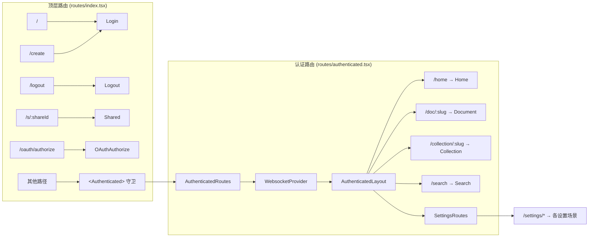
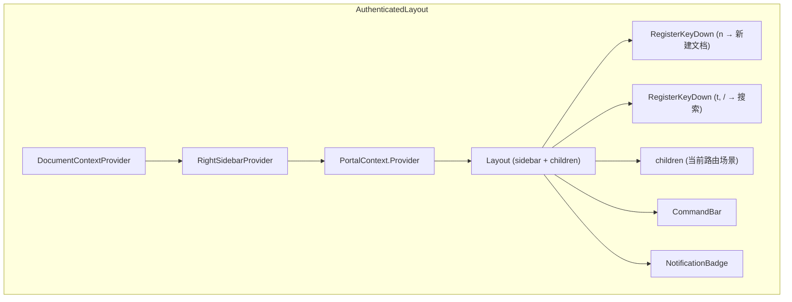

Outline 的前端采用 React + React Router v5 构建，以 MobX 作为状态管理核心。整个应用在架构上分为三层：**路由层**负责 URL 到页面的映射，**场景层**封装独立页面的业务逻辑，**组件层**提供可复用的 UI 构建块。理解这三层之间的协作关系，是高效参与前端开发的前提。

Sources: [index.tsx](app/index.tsx#L1-L93), [routes/index.tsx](app/routes/index.tsx#L1-L73)

## 应用启动与全局 Provider 树

应用入口位于 `app/index.tsx`，它在渲染路由之前搭建了一棵完整的 **Provider 树**，为整个应用提供上下文能力。这棵树的嵌套顺序决定了每一层功能的初始化时序和作用域边界：

```mermaid
graph LR
    A["StrictMode"] --> B["HelmetProvider<br/>(文档头管理)"]
    B --> C["Provider (MobX)<br/>(全局状态注入)"]
    C --> D["Analytics<br/>(分析追踪)"]
    D --> E["Router (history)<br/>(路由上下文)"]
    E --> F["Theme<br/>(主题系统)"]
    F --> G["ActionContextProvider<br/>(操作上下文)"]
    G --> H["ErrorBoundary<br/>(错误边界)"]
    H --> I["KBarProvider<br/>(命令栏)"]
    I --> J["LazyPolyfill<br/>(惰性填充)"]
    J --> K["LazyMotion (framer-motion)<br/>(动画引擎)"]
    K --> L["PageScroll<br/>(滚动管理)"]
    L --> M["Routes<br/>(路由组件)"]

    style A fill:#e8f5e9
    style C fill:#e3f2fd
    style E fill:#fff3e0
    style H fill:#fce4ec
    style I fill:#f3e5f5
    style M fill:#fff9c4
```



从结构上看，Provider 树遵循**由外到内、由通用到具体**的原则：最外层处理全局错误（`ErrorBoundary`）、最内层处理页面路由（`Routes`）。值得注意的是，`ErrorBoundary` 被放置在 KBarProvider 之外，确保命令栏 UI 不会被错误边界意外卸载。

几个关键初始化逻辑在渲染之前执行：插件系统通过 `PluginManager.loadPlugins()` 异步加载（`void` 表明不阻塞渲染），MobX 配置启用了 `computedRequiresReaction` 以在开发阶段捕获计算属性的错误用法，Sentry 错误追踪则在 `SENTRY_DSN` 环境变量存在时才激活。

Sources: [index.tsx](app/index.tsx#L33-L93)

## 路由体系：三层分离的 URL 映射

路由系统分为三个文件，形成清晰的层次结构。**顶层路由** (`app/routes/index.tsx`) 是整个应用的入口，它根据 `env.ROOT_SHARE_ID` 的存在与否将应用切换到两种完全不同的运行模式：

| 模式 | 条件 | 行为 |
|------|------|------|
| **公开共享模式** | `ROOT_SHARE_ID` 存在 | 所有请求直接路由到 `Shared` 场景，无需登录 |
| **标准模式** | `ROOT_SHARE_ID` 不存在 | 未认证用户看到登录页，认证后进入 `AuthenticatedRoutes` |

标准模式下，顶层路由首先处理不需要认证的路径（登录、登出、OAuth 授权、公开分享链接 `/s/:shareId`），然后通过 `<Authenticated>` 组件作为守卫将认证路由包裹起来。`Authenticated` 组件会检查 MobX 的 `auth.authenticated` 状态，未认证时自动重定向到根路径。

Sources: [routes/index.tsx](app/routes/index.tsx#L32-L69), [Authenticated.tsx](app/components/Authenticated.tsx#L14-L58)



### 认证路由的结构

认证后的路由 (`app/routes/authenticated.tsx`) 被两层 Provider 包裹：`WebsocketProvider` 建立 WebSocket 连接以接收实时更新，`AuthenticatedLayout` 提供侧边栏、命令栏和全局键盘快捷键等基础设施。路由内部通过 `usePolicy(team)` 获取权限对象，**基于权限条件性地渲染路由**——例如，`Drafts`、`Archive`、`Trash` 三个路由仅在 `can.createDocument` 为真时才注册。

路由定义中大量使用了 `lazy(() => import(...))` 进行代码分割。每个场景组件都是按需加载的，配合外层 `<Suspense>` 的 `PlaceholderDocument` 占位 UI，确保首屏加载体验。

Sources: [authenticated.tsx](app/routes/authenticated.tsx#L55-L138), [WebsocketProvider.tsx](app/components/WebsocketProvider.tsx#L1-L51)

### 设置路由的配置驱动模式

设置页面的路由采用**配置驱动**模式，这是与主路由的一个显著区别。`useSettingsConfig` Hook 返回一个 `ConfigItem[]` 数组，每个条目包含路径、组件、图标、权限条件等信息。`SettingsRoutes` 组件遍历这个数组来注册路由：

```typescript
// routes/settings.tsx 中的核心逻辑
{configs.map((config) => (
  <Route exact key={config.path} path={config.path}
    component={config.component} />
))}
```

这种设计的优势在于**插件系统可以动态注入设置项**。`useSettingsConfig` 内部通过 `PluginManager.getHooks(Hook.Settings)` 遍历所有注册了设置钩子的插件，将它们的配置项插入到数组中。这意味着一个新插件的设置页面只需要声明一个 Hook，就能自动出现在设置路由和侧边栏中。

Sources: [settings.tsx](app/routes/settings.tsx#L16-L55), [useSettingsConfig.ts](app/hooks/useSettingsConfig.ts#L69-L289)

### 路由辅助函数与 Slug 匹配

`app/utils/routeHelpers.ts` 集中管理所有路径生成和匹配逻辑。关键的路由参数匹配模式定义如下：

- **`matchDocumentSlug`**: `:documentSlug([0-9a-zA-Z-_~]*-[a-zA-z0-9]{10,15})` — 文档 URL 由 slugified 标题加上 10-15 位的 urlId 后缀组成
- **`matchCollectionSlug`**: 同样格式，用于集合路径匹配

路径生成函数如 `documentPath(doc)` 直接委托给模型的 `doc.path` 属性，确保路径始终与模型状态一致。`searchPath()` 支持丰富的查询参数（query、collectionId、documentId、ref），所有参数通过 query string 传递以实现**搜索结果的 URL 可分享性**。

Sources: [routeHelpers.ts](app/utils/routeHelpers.ts#L1-L207)

## 认证布局：侧边栏与主内容区的编排

`AuthenticatedLayout` 是认证后所有页面的骨架。它的核心职责是将 `Layout` 组件与业务逻辑桥接起来：



布局层面的几个关键设计决策值得关注。**侧边栏切换**根据 URL 是否以 `/settings` 开头来决定渲染 `SettingsSidebar` 还是主 `Sidebar`，两者通过 CSS 的 `display: none` 进行切换而非条件渲染，避免重复挂载/卸载的的性能开销。**全局键盘快捷键**在布局层注册（`Cmd+.` 折叠侧边栏，`n` 新建文档，`t` 或 `/` 打开搜索），确保在任何认证页面都能触发。**登录后路径恢复**通过 `usePostLoginPath` Hook 实现，用户在未登录状态被重定向后，登录成功会自动跳回原路径。

如果用户账号被暂停 (`auth.isSuspended`)，布局层会直接渲染 `ErrorSuspended` 错误页面，完全跳过正常的内容渲染。

Sources: [AuthenticatedLayout.tsx](app/components/AuthenticatedLayout.tsx#L38-L121), [Layout.tsx](app/components/Layout.tsx#L26-L107)

### Layout 组件的响应式侧边栏

`Layout` 组件本身是一个**纯展示层组件**，通过 `styled-components` 实现侧边栏的宽度动画。当侧边栏折叠时，主内容区的 `margin-inline-start` 通过 CSS transition 平滑过渡。`ui.sidebarWidth` 存储了当前侧边栏的精确像素宽度（用户可拖拽调整），直接用作内联样式，而 `ui.sidebarIsResizing` 标志在拖拽过程中禁用 transition 以避免延迟感。

Sources: [Layout.tsx](app/components/Layout.tsx#L44-L105)

## 场景（Scenes）：页面级组件的设计模式

`app/scenes/` 目录包含所有页面级组件。场景是路由的直接对应物——每个 URL 模式映射到一个场景。场景按复杂度分为两类：

| 类型 | 示例 | 特征 |
|------|------|------|
| **简单场景** | Archive, Drafts, Trash | 单文件，直接使用 `Scene` 包裹 |
| **复合场景** | Document, Collection, Search | 目录结构，含 `index.tsx` + `components/` + `hooks/` |

### Scene 组件：页面骨架的统一抽象

`Scene` 组件是绝大多数页面的顶层包裹器，它提供了一套**声明式的页面结构配置接口**：

```typescript
<Scene
  icon={<HomeIcon />}           // 标题旁的图标
  title={t("Home")}             // 页面标题（滚动后显示在 Header 中）
  left={<InputSearchPage />}    // 左侧区域（通常放搜索框）
  actions={<Action><NewDocumentMenu /></Action>}  // 右侧操作区
  centered={true}               // 是否居中内容（默认 true）
  wide={false}                  // 是否全宽显示
>
  {/* 页面内容 */}
</Scene>
```

Scene 内部组合了三个子组件：`PageTitle`（设置浏览器标签页标题）、`Header`（粘性顶部栏）和 `CenteredContent`（内容居中容器）。当 `centered` 为 `true`（默认值）时，内容被 `CenteredContent` 包裹，限制最大宽度并添加水平内边距；当设为 `false` 时，内容直接全宽渲染，场景自身负责布局控制。

Sources: [Scene.tsx](app/components/Scene.tsx#L7-L66), [CenteredContent.tsx](app/components/CenteredContent.tsx#L12-L41)

### 典型场景分析：Home 页面

Home 场景展示了 Scene 的标准用法。它通过 `useStores` 获取全局状态，通过 `usePinnedDocuments` 获取置顶文档，然后渲染标题、置顶文档列表和带选项卡的文档列表。选项卡本身通过嵌套的 `<Switch>/<Route>` 实现子路由：

```typescript
<Tabs>
  <Tab to="/home" exact>Recently viewed</Tab>
  <Tab to="/home/recent" exact>Recently updated</Tab>
  <Tab to="/home/created">Created by me</Tab>
</Tabs>
<Switch>
  <Route path="/home/recent">{/* ... */}</Route>
  <Route path="/home/created">{/* ... */}</Route>
  <Route path="/home">{/* 默认: recently viewed */}</Route>
</Switch>
```

这是一个**在场景内部使用子路由**的典型模式：顶层路由匹配 `/home` 前缀，场景内部的 Switch/Route 处理具体的标签页切换，避免了每个标签页都成为独立路由的过度设计。

Sources: [Home.tsx](app/scenes/Home.tsx#L25-L131)

### 复合场景分析：Document

Document 场景是整个应用最复杂的场景之一，它的结构体现了**关注点分离**的设计理念：

```
scenes/Document/
├── index.tsx               # 路由参数解析 + 组装
├── components/
│   ├── DataLoader.tsx       # 数据获取 + 错误处理
│   ├── Document.tsx         # 主文档视图编排
│   ├── Editor.tsx           # 富文本编辑器集成
│   ├── Header.tsx           # 文档专属头部
│   ├── Footer.tsx           # 文档底部信息
│   ├── Comments/            # 评论系统
│   ├── History/             # 版本历史
│   └── ...
└── hooks/
    └── useDocumentSidebar.ts # 文档侧边栏逻辑
```

`index.tsx` 作为场景入口，职责非常有限：解析路由参数、设置活动文档状态、计算用于组件重挂载的 `key`。关键的 `key` 计算逻辑值得注意——它仅使用 URL 中的 `urlId` 部分（不含 slugified 标题），这样当文档标题变更导致 URL 变化时，不会触发整个文档子树的卸载/重挂载。

真正的数据获取委托给 `DataLoader` 组件，它通过 **render props 模式**将加载完成的 `document`、`revision`、`abilities` 等数据传递给子组件。DataLoader 内部处理了多种错误场景（402 支付限制、403 权限不足、404 未找到、离线错误），为每种错误渲染对应的错误场景。

Sources: [scenes/Document/index.tsx](app/scenes/Document/index.tsx#L26-L73), [DataLoader.tsx](app/scenes/Document/components/DataLoader.tsx#L68-L80)

### 复合场景分析：Collection

Collection 场景展示了另一种复杂度：**权限感知的标签页路由**。它根据集合的权限和内容状态，动态决定显示哪些标签页（Overview、Recent、Updated、Published、Popular、Alphabetical、Old）。归档的集合只显示 Recent 标签，空集合显示空状态占位符。

场景还实现了 **URL 规范化**：当集合名称变更后，通过 `updateCollectionPath` 函数将浏览器 URL 无感更新为新的 slug，同时保持路由状态不丢失。

Sources: [scenes/Collection/index.tsx](app/scenes/Collection/index.tsx#L55-L341)

### 共享场景：无需认证的公开访问

`Shared` 场景 (`app/scenes/Shared/index.tsx`) 是一个独立于认证体系的完整页面。它拥有自己的 `Layout`、`Sidebar`（Shared 版本）、`ThemeProvider`，甚至自己的命令栏（`SharedCommandBar`）。这意味着共享链接的访问者看到的是一个**完整但简化的应用界面**。

Shared 场景通过 `ShareContext.Provider` 将分享 ID 和共享树结构注入上下文，使得嵌套的 `Document` 和 `Collection` 子场景能够感知到自己运行在共享模式下。当访问未授权的分享链接时，它会渲染一个简化版登录界面，登录成功后自动返回。

Sources: [scenes/Shared/index.tsx](app/scenes/Shared/index.tsx#L125-L292)

## 组件层：可复用 UI 构建块

`app/components/` 目录包含约 120 个独立组件文件和 20 个组件子目录。这些组件遵循**单一职责**原则，按功能粒度分为几个层次：

### 核心布局组件

| 组件 | 职责 | 关键特性 |
|------|------|----------|
| `Layout` | 页面骨架 | 侧边栏 + 主内容区 + 右侧边栏，响应式宽度 |
| `Header` | 粘性顶部栏 | 滚动后显示标题，支持响应式紧凑模式 |
| `CenteredContent` | 内容居中 | 限制最大宽度，适配编辑器宽度标准 |
| `Scene` | 页面封装 | 统一页面结构（标题、操作、内容） |
| `Sidebar` | 侧边导航 | 可拖拽宽度，支持折叠 |

### 基础 UI 组件

基础组件如 `Button`、`Input`、`Flex`、`Text`、`Heading`、`Tooltip` 等位于 `components/` 根目录，被场景和上层组件广泛引用。`Fade` 和 `DelayedMount` 提供了轻量级的动画和延迟渲染能力——`DelayedMount` 常用于 loading 状态的延迟显示，避免短暂加载时的闪烁。

### 高级交互组件

- **`CommandBar`**: 基于 KBar 的命令面板，支持键盘快速操作
- **`Modal`/`Guide`**: 全局对话框系统，通过 `DialogsStore` 管理 modal 栈
- **`HoverPreview`**: 文档链接的悬浮预览
- **`Editor`**: Prosemirror 富文本编辑器的 React 封装
- **`PaginatedList`**: 通用的分页列表组件，支持无限滚动加载

Sources: [Layout.tsx](app/components/Layout.tsx#L26-L107), [Header.tsx](app/components/Header.tsx#L34-L113), [Dialogs.tsx](app/components/Dialogs.tsx#L10-L48)

## 懒加载与代码分割策略

Outline 采用 **路由级懒加载** 作为代码分割的主要策略。每个场景组件都通过 `lazyWithRetry` 工具函数进行动态导入：

```typescript
const Home = lazy(() => import("~/scenes/Home"));
const Search = lazy(() => import("~/scenes/Search"));
```

`lazyWithRetry` 在 React.lazy 的基础上添加了**自动重试机制**——默认在导入失败时重试 3 次，间隔 1 秒。这个设计专门应对了 Vite 构建产物哈希变更导致的 "dynamically imported module" 错误：当用户在部署间隙访问页面时，旧的 chunk hash 已失效，重试机制会请求新的 manifest 并加载正确的 chunk。

对于需要更细粒度控制的场景，`createLazyComponent`（位于 `LazyLoad.ts`）提供了额外能力：支持**命名导出**（通过 `exportName` 选项）和**预加载**（通过 `preload` 方法）。Settings 场景大量使用这个模式，使得设置侧边栏可以在用户悬停时提前加载目标页面代码。

Sources: [lazyWithRetry.ts](app/utils/lazyWithRetry.ts#L16-L42), [LazyLoad.ts](app/components/LazyLoad.ts#L36-L53), [useSettingsConfig.ts](app/hooks/useSettingsConfig.ts#L33-L51)

## ProfiledRoute：路由与可观测性的融合

`ProfiledRoute` 是对 React Router `Route` 组件的薄封装，唯一的增强是在 Sentry 可用时使用 `Sentry.withSentryRouting(Route)` 替代原生 Route。这为每个路由渲染自动创建了 Sentry 事务（transaction），使得性能监控能够追踪到具体的页面加载耗时。

```typescript
if (env.SENTRY_DSN) {
  Component = Sentry.withSentryRouting(Route);
} else {
  Component = Route;
}
```

这种条件性的增强确保了在开发环境或未配置 Sentry 的自部署实例中不会引入不必要的开销。

Sources: [ProfiledRoute.ts](app/components/ProfiledRoute.ts#L1-L13)

## 路由守卫与权限控制模式

Outline 的路由权限控制采用**分层策略**：

1. **认证守卫**：`<Authenticated>` 组件在最外层拦截未登录用户
2. **路由级权限**：在 `authenticated.tsx` 中通过 `can.createDocument` 等条件控制路由注册
3. **组件级权限**：场景内部通过 `usePolicy` 获取细粒度权限，控制按钮、菜单等 UI 元素的可见性
4. **数据级权限**：`DataLoader` 捕获 403 错误并渲染对应的错误页面

这种分层设计意味着权限检查不会集中在单一层级，而是在**各层只关注自己该管的粒度**，避免了过度耦合。

Sources: [Authenticated.tsx](app/components/Authenticated.tsx#L27-L57), [authenticated.tsx](app/routes/authenticated.tsx#L70-L78)

## 导航目录结构速览

```
app/
├── index.tsx                    # 应用入口 + Provider 树
├── routes/
│   ├── index.tsx                # 顶层路由（登录/分享/认证分支）
│   ├── authenticated.tsx        # 认证路由（需登录）
│   └── settings.tsx             # 设置路由（配置驱动）
├── scenes/                      # 页面级组件
│   ├── Home.tsx                 # 首页
│   ├── Document/                # 文档场景（复合）
│   ├── Collection/              # 集合场景（复合）
│   ├── Search/                  # 搜索场景（复合）
│   ├── Settings/                # 设置场景群
│   ├── Shared/                  # 公开分享场景
│   ├── Login/                   # 登录场景
│   ├── Errors/                  # 错误页面
│   ├── Archive.tsx, Drafts.tsx  # 简单场景
│   └── ...
├── components/                  # 可复用 UI 组件
│   ├── Scene.tsx                # 页面骨架组件
│   ├── Layout.tsx               # 布局组件
│   ├── AuthenticatedLayout.tsx  # 认证布局
│   ├── Header.tsx               # 顶部栏
│   ├── Sidebar/                 # 侧边栏组件群
│   ├── ProfiledRoute.ts         # Sentry 增强路由
│   ├── WebsocketProvider.tsx    # WebSocket 连接管理
│   └── ...
└── utils/
    ├── routeHelpers.ts          # 路径生成与匹配
    ├── lazyWithRetry.ts         # 懒加载 + 重试
    └── history.ts               # 路由 history 实例
```

---

**下一步阅读建议**：理解了场景与路由的宏观结构后，建议深入 [MobX 状态管理：模型（Models）与存储（Stores）的设计模式](5-mobx-zhuang-tai-guan-li-mo-xing-models-yu-cun-chu-stores-de-she-ji-mo-shi) 以了解场景中的数据流如何通过 Store 体系运作，或查看 [样式系统：Styled Components 与主题配置](6-yang-shi-xi-tong-styled-components-yu-zhu-ti-pei-zhi) 了解组件的视觉实现细节。