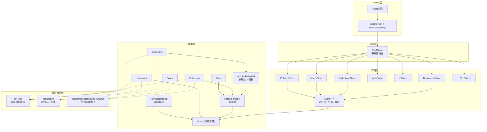
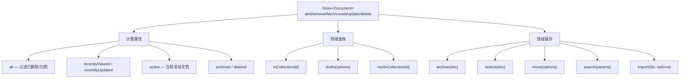
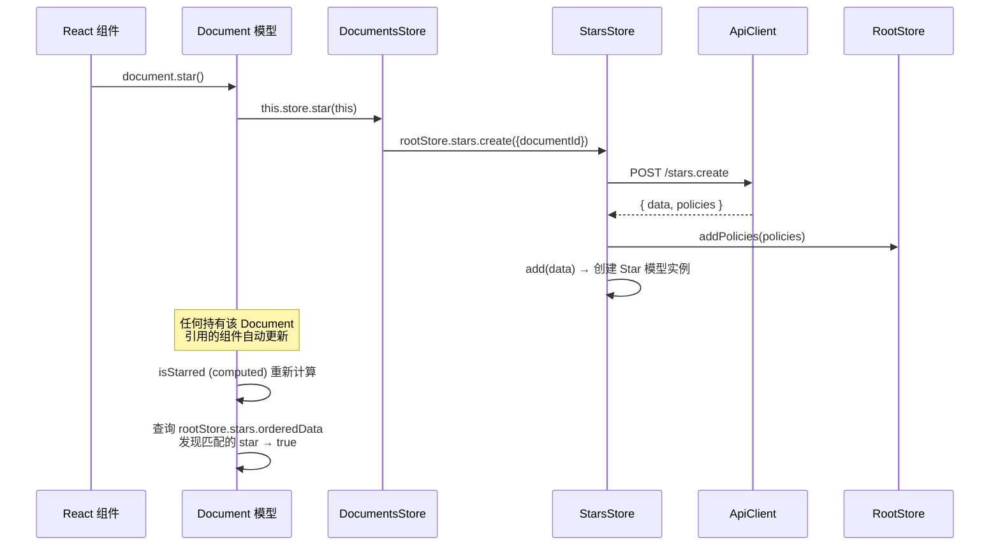

Outline 的前端采用 MobX 构建了一套精细的、层次分明的客户端状态管理体系。这套体系的核心思想是：**Model 封装领域实体的数据与行为，Store 承担实体的生命周期管理与 API 通信，RootStore 作为中央协调器将所有 Store 编织在一起**。本文将逐层拆解这一架构，从基类抽象到具体实现，从装饰器元编程到跨 Store 联动，帮助你建立对整个状态管理方案的系统性理解。

Sources: [Model.ts](app/models/base/Model.ts#L1-L253), [Store.ts](app/stores/base/Store.ts#L1-L496), [RootStore.ts](app/stores/RootStore.ts#L1-L177)

## 整体架构概览

在深入细节之前，先通过一张架构图建立全局认知。整个状态管理层由三个核心层构成——**模型层**负责领域实体的定义与业务计算，**存储层**负责数据集合的管理与 API 同步，**协调层**负责跨 Store 的依赖注入与全局状态编排。



Sources: [index.tsx](app/index.tsx#L5-L61), [index.ts](app/stores/index.ts#L1-L11)

## 模型层：领域实体的抽象设计

### 基类 Model——一切实体的根基

`Model` 是所有客户端模型的抽象基类，定义了实体共有的核心能力：**标识管理、数据更新、脏检测、持久化与删除**。每个 Model 实例在构造时接收原始字段数据和所属 Store 的引用，并通过 `updateData` 方法将 API 返回的原始数据映射到 MobX `@observable` 属性上。

`updateData` 方法采用了一种**智能合并策略**：遍历传入数据中的每个键，跳过 `initialized` 标志，通过 `isEqual(toJS(this[key]), data[key])` 判断值是否真正变化，仅在值确实不同时才触发赋值，从而避免不必要的 MobX 响应式通知。更新完成后，通过 `persistedAttributes` 快照记录当前状态，为 `isDirty()` 方法提供比较基准。

Sources: [Model.ts](app/models/base/Model.ts#L10-L35), [Model.ts](app/models/base/Model.ts#L136-L171)

### 继承层次：ParanoidModel → ArchivableModel

Outline 采用了与后端 ORM 对应的模型继承体系，体现了一致的软删除与归档语义：

| 基类 | 核心扩展 | 适用实体 |
|------|---------|---------|
| **Model** | 基础 CRUD、脏检测、序列化 | Notification, Comment, Star, Pin 等 |
| **ParanoidModel** | `deletedAt` 字段 + `isDeleted` 计算属性 | Collection, User, Group 等 |
| **ArchivableModel** | 在 ParanoidModel 基础上增加 `archivedAt` 字段 | Document |
| **NavigableModel** | `NavigationNode` 树形结构操作 | Membership / Share 相关模型 |

这一继承链的核心设计意图是：**Store 的 `remove` 方法会根据模型类型自动选择删除策略**。当模型是 `ParanoidModel` 的子类时，`remove` 仅设置 `deletedAt` 时间戳而非真正从 `data` Map 中移除；对于普通 `Model`，则直接执行 `Map.delete`。这意味着被"删除"的软删除模型仍然保留在 Store 中，可以通过 `isDeleted` 计算属性在 UI 层正确过滤。

Sources: [ParanoidModel.ts](app/models/base/ParanoidModel.ts#L1-L12), [ArchivableModel.ts](app/models/base/ArchivableModel.ts#L1-L7), [Store.ts](app/stores/base/Store.ts#L174-L221)

### 装饰器系统：元编程驱动的声明式配置

Outline 的模型装饰器系统是其架构中最精巧的部分，通过三个核心装饰器将声明式元数据注入到模型类中。

**`@Field` 装饰器**将属性标记为可序列化字段。被 `@Field` 标注的属性会被注册到一个以类名为键的 `Map` 中，`toAPI()` 方法利用这一注册信息生成仅包含标记字段的对象，供 API 请求使用。这确保了只有明确标记的属性才会被发送到服务器，防止了内部状态（如 `isSaving`、`isNew`）意外泄露。

**`@Relation` 装饰器**是跨 Store 关联的核心机制，它通过 `Object.defineProperty` 将关联属性定义为 getter/setter。getter 在被访问时，通过 `store.rootStore.getStoreForModelName()` 动态查找目标 Store，并从中读取关联对象；setter 则自动将关联对象的 ID 存储到 `xxxId` 字段，同时将完整对象 `add` 到目标 Store。`@Relation` 还支持 `multiple` 选项（一对多）和 `onDelete`/`onArchive` 级联行为配置。

```typescript
// 单一关联示例：Document → Collection
@Relation(() => Collection, { onDelete: "cascade" })
collection?: Collection;

// 多值关联示例：Notification 中的 User
@Relation(() => User)
actor?: User;
```

**`@Lifecycle` 装饰器族**提供了模型生命周期的钩子机制，包括 `@BeforeCreate`、`@AfterCreate`、`@BeforeUpdate`、`@AfterUpdate`、`@BeforeChange`、`@AfterChange`、`@BeforeRemove`、`@AfterRemove`、`@BeforeDelete`、`@AfterDelete`。这些装饰器通过 `LifecycleManager` 将方法注册到以类名和生命周期阶段为键的 Map 中，在 Model 的 `save`、`updateData`、`delete` 等方法执行时自动触发。例如，`Collection` 模型使用 `@AfterChange` 在 `sharing` 或 `permission` 变更时自动清除关联文档的权限缓存。

Sources: [Field.ts](app/models/decorators/Field.ts#L1-L20), [Relation.ts](app/models/decorators/Relation.ts#L84-L185), [Lifecycle.ts](app/models/decorators/Lifecycle.ts#L1-L87), [Collection.ts](app/models/Collection.ts#L428-L444)

### 典型模型分析：Document

`Document` 是 Outline 中最复杂的客户端模型，继承了 `ArchivableModel`，同时实现了 `Searchable` 接口。它集中体现了模型层设计的几个核心原则：

**领域计算内聚于模型**：`Document` 包含大量 `@computed` 属性——`isDraft`（是否为草稿）、`isStarred`（是否被收藏）、`isPubliclyShared`（是否公开分享）、`childDocuments`（子文档列表）、`asNavigationNode`（导航节点表示）等。这些计算属性通过 `this.store.rootStore` 访问其他 Store 的数据，实现了跨 Store 的数据聚合，同时保持计算逻辑紧贴领域实体。

**操作方法内聚于模型**：`Document` 实例方法如 `star()`、`unstar()`、`pin()`、`subscribe()`、`archive()`、`restore()` 等均委托给对应的 Store 执行，但在模型层提供了语义清晰的调用接口。这意味着组件只需持有 Document 实例即可完成所有操作，无需直接了解 Store 的 API 结构。

**`@Field` 与 `@Relation` 的配合**：`collectionId` 被 `@Field` 标记为可序列化字段，同时 `collection` 通过 `@Relation(() => Collection)` 声明为关联属性。当 API 返回 `{ collectionId: "xxx" }` 时，`collectionId` 被直接赋值；当访问 `document.collection` 时，Relation getter 动态从 CollectionsStore 中查找对应实例。

Sources: [Document.ts](app/models/Document.ts#L37-L131), [Document.ts](app/models/Document.ts#L303-L395), [Document.ts](app/models/Document.ts#L557-L580)

## 存储层：数据集合的管理与 API 同步

### 基类 Store——CRUD 模板与身份映射

`Store<T extends Model>` 是所有数据存储的泛型基类，核心数据结构是一个 `@observable Map<string, T>`，配合 `isFetching`、`isSaving`、`isLoaded` 等状态标志。它实现了一套完整的 **Identity Map 模式**——`add` 方法在插入新数据前先检查 Map 中是否已存在同 ID 的模型，若存在则调用 `updateData` 合并更新，而非创建新实例。这确保了整个应用中同一实体只有一个模型实例，所有组件共享相同的响应式引用。

Store 的 CRUD 操作遵循 Outline 的 RPC 风格 API 约定——所有请求都通过 `client.post()` 发送到 `/{apiEndpoint}.{action}` 格式的端点。`actions` 数组定义了当前 Store 支持的 RPC 操作，默认包含全部五种（Info、List、Create、Update、Delete），子类可按需缩减。例如 `PoliciesStore` 将 `actions` 设为空数组，表示该 Store 不发起任何 API 请求。

`fetch` 方法实现了**请求去重**：通过 `requests` Map 缓存正在进行的 Promise，后续对同一 ID 的并发请求直接复用已有的 Promise，避免重复网络调用。`fetchPage` 和 `fetchAll` 则处理分页逻辑，`fetchAll` 在首次请求后根据总页数自动发起后续分页请求，并将所有结果展平返回。

Sources: [Store.ts](app/stores/base/Store.ts#L56-L96), [Store.ts](app/stores/base/Store.ts#L152-L172), [Store.ts](app/stores/base/Store.ts#L357-L408)

### 删除与归档的级联联动

Store 的 `remove` 方法不仅是简单的 Map 删除，还负责处理**反向关联级联**。通过 `getInverseRelationsForModelClass()` 查找所有以当前模型为目标类型的关联关系，并根据每个关联的 `onDelete` 配置执行相应行为：

- **`cascade`**：级联删除关联模型
- **`null`**：将关联的外键置空
- **`ignore`**：不做处理

同样，`addToArchive` 方法处理归档时的级联行为。这种**反向级联**机制确保了数据完整性——当删除一个 Collection 时，所有通过 `@Relation(() => Collection, { onDelete: "cascade" })` 关联到该 Collection 的 Document 和 Notification 的关联会被正确处理。

Sources: [Store.ts](app/stores/base/Store.ts#L174-L258), [Relation.ts](app/models/decorators/Relation.ts#L44-L71)

### 具体 Store 的扩展模式

以 `DocumentsStore` 为例，它展示了具体 Store 如何在基类基础上扩展领域特定的查询和操作方法：



`DocumentsStore` 覆盖了 `get` 方法，增加了通过 `urlId` 的模糊匹配（`id.endsWith(doc.urlId)`）；覆盖了 `fetch` 方法，通过自定义 `accessor` 从 `{ data: { document } }` 嵌套结构中提取数据；覆盖了 `delete` 方法，在调用 `super.delete` 后额外处理永久删除和 Share 关联清理。

`CollectionsStore` 则覆盖了 `orderedData` 计算属性，用基于 `index` 字段的自定义排序替代了基类默认的 `createdAt` 降序排列，并过滤掉无权限的集合。它还定义了 `star`、`unstar`、`subscribe`、`unsubscribe` 等跨 Store 操作方法——这些方法内部委托给 `rootStore.stars` 和 `rootStore.subscriptions` 执行，体现了 Store 间协作的典型模式。

Sources: [DocumentsStore.ts](app/stores/DocumentsStore.ts#L49-L199), [DocumentsStore.ts](app/stores/DocumentsStore.ts#L576-L684), [CollectionsStore.ts](app/stores/CollectionsStore.ts#L16-L84), [CollectionsStore.ts](app/stores/CollectionsStore.ts#L202-L228)

### 特殊 Store：AuthStore、UiStore 与 PoliciesStore

**AuthStore** 是一个特殊的 Store，它继承自 `Store<Team>`（将 Team 模型作为存储类型），但核心职责并非 CRUD，而是管理整个认证生命周期。它通过 `autorun` 将自身状态持久化到 localStorage，并在构造时从 localStorage 恢复（rehydrate）。它监听 `storage` 事件以响应其他标签页的登录/登出操作，实现了跨标签页的认证状态同步。RootStore 的构造函数中特别注明 AuthStore 必须**最后初始化**，因为它在构造时就引用了其他 Store。

**UiStore** 不继承 Store 基类，它是一个纯粹的 UI 状态容器——管理侧边栏宽度、主题偏好、活跃模型、演示模式等与 API 无关的界面状态。它同样通过 localStorage 持久化偏好设置，并监听系统主题变化和跨标签页同步。

**PoliciesStore** 继承自 Store 但禁用了所有 RPC 操作（`actions = []`），它是一个纯内存的权限策略缓存。策略数据跟随其他 API 响应一起返回（通过 `addPolicies` 方法注入），并在模型删除/变更时自动清理。其 `abilities(id)` 方法提供统一的权限查询接口。

Sources: [AuthStore.ts](app/stores/AuthStore.ts#L39-L128), [AuthStore.ts](app/stores/AuthStore.ts#L148-L186), [UiStore.ts](app/stores/UiStore.ts#L42-L186), [PoliciesStore.ts](app/stores/PoliciesStore.ts#L7-L62)

## 协调层：RootStore 与依赖注入

### RootStore 的注册与查找机制

`RootStore` 是整个状态管理层的中央协调器。它在构造函数中按序注册所有子 Store，每个子 Store 接收 `rootStore` 引用作为构造参数，从而能够访问任意其他 Store。注册过程通过 `registerStore` 方法统一处理，该方法通过 `modelName` 自动推导 Store 的属性名（如 `Document` → `documents`），也支持显式指定（如 `OAuthAuthenticationsStore` → `oauthAuthentications`）。

RootStore 维护了从 `modelName` 到 Store 实例的映射关系。`getStoreForModelName(modelName)` 方法被 `@Relation` 装饰器和 `Model.loadRelations()` 广泛使用，是跨 Store 关联解析的基础设施。

Sources: [RootStore.ts](app/stores/RootStore.ts#L76-L116), [RootStore.ts](app/stores/RootStore.ts#L122-L177)

### 全局状态重置

RootStore 的 `clear()` 方法提供了一种安全的状态重置机制——遍历所有 Store 属性并调用其 `clear` 方法，但**排除 `auth` 和 `ui`**。这确保了用户登出时可以清除所有业务数据缓存，同时保留认证状态和 UI 偏好。这一设计在 `AuthStore.logout()` 中被调用。

Sources: [RootStore.ts](app/stores/RootStore.ts#L134-L143), [AuthStore.ts](app/stores/AuthStore.ts#L316-L366)

## React 集成：从 Store 到组件

### Provider 注入与 Hook 访问

Outline 使用 `mobx-react` 的 `Provider` 组件在应用根节点注入 RootStore 实例。在 [index.tsx](app/index.tsx#L60) 中，`<Provider rootStore={stores}>` 将全局唯一的 RootStore 实例挂载到 React Context 上。

组件层通过两个核心 Hook 访问 Store：

- **`useStores()`**：返回整个 RootStore 实例，组件可从中解构出需要的子 Store（如 `const { documents, auth } = useStores()`）
- **`useCurrentUser()`**：封装了对 `auth.user` 的访问，提供 `rejectOnEmpty` 选项用于强制要求登录状态
- **`useComputed(callback, deps)`**：在组件中创建 MobX computed，仅在 observable 依赖变化时重新计算，结合 `useMemo` 管理生命周期

Sources: [index.tsx](app/index.tsx#L5-L61), [useStores.ts](app/hooks/useStores.ts#L1-L15), [useCurrentUser.ts](app/hooks/useCurrentUser.ts#L1-L23), [useComputed.ts](app/hooks/useComputed.ts#L1-L16)

### MobX 配置

应用启动时通过 `configureMobx` 启用了两项严格模式配置：`computedRequiresReaction: true`（禁止在 action 外直接读取 computed 的值而不建立响应式依赖）和 `isolateGlobalState: true`（隔离 MobX 的全局状态，避免与其他使用 MobX 的库冲突）。

Sources: [index.tsx](app/index.tsx#L42-L47)

## 数据流全链路：一次完整的模型操作

为了将所有概念串联起来，以下展示一个典型的"用户收藏文档"操作的完整数据流：



当组件调用 `document.star()` 时，调用链经过 Document → DocumentsStore → StarsStore → API。API 返回后，StarsStore 通过 `add` 创建新的 Star 模型实例。此时，Document 的 `isStarred` 计算属性所依赖的 `rootStore.stars.orderedData` 发生变化，MobX 自动触发重新计算，所有观察该属性的组件在下一个渲染周期更新 UI。整个过程中，**数据流向始终是单向的：用户操作 → Store → API → Store 更新 → Model computed → 组件响应式更新**。

Sources: [Document.ts](app/models/Document.ts#L502-L506), [DocumentsStore.ts](app/stores/DocumentsStore.ts#L686-L691), [Store.ts](app/stores/base/Store.ts#L287-L308), [Document.ts](app/models/Document.ts#L303-L308)

## 设计模式总结

| 设计模式 | 在 Outline 中的应用 | 核心收益 |
|---------|-------------------|---------|
| **Identity Map** | Store 的 `add` 方法去重 | 同一实体全局唯一实例，避免数据不一致 |
| **Active Record** | Model 自带 `save`/`delete`/`fetch` 方法 | 操作接口内聚于实体，简化组件调用 |
| **Repository** | Store 封装数据集合的查询与管理 | 统一的 CRUD 抽象，可替换的持久化策略 |
| **Observer** | MobX `@observable` + React 响应式 | 精准的细粒度更新，避免不必要的重渲染 |
| **Decorator** | `@Field`/`@Relation`/`@Lifecycle` | 声明式元数据配置，减少样板代码 |
| **Dependency Injection** | RootStore 注入所有子 Store | 松耦合的 Store 间协作 |
| **Soft Delete** | ParanoidModel + Store.remove 的条件分支 | 保留"已删除"数据用于 UI 展示（如回收站） |

这套架构的核心优势在于：**通过 Model 和 Store 的分层，将"数据是什么"（Model 的字段与计算属性）和"数据怎么管理"（Store 的集合操作与 API 同步）清晰分离；通过装饰器系统和 RootStore 的依赖注入，实现了声明式的跨 Store 关联和生命周期管理，使得复杂的业务逻辑得以在模型层和存储层各自内聚地组织**。

Sources: [Model.ts](app/models/base/Model.ts#L91-L134), [Store.ts](app/stores/base/Store.ts#L152-L172), [Relation.ts](app/models/decorators/Relation.ts#L84-L185), [RootStore.ts](app/stores/RootStore.ts#L76-L116)

## 延伸阅读

- 要了解 MobX 状态管理层之上的 React 组件与路由组织方式，参阅 [React 应用结构：场景（Scenes）、组件与路由体系](4-react-ying-yong-jie-gou-chang-jing-scenes-zu-jian-yu-lu-you-ti-xi)
- 要了解后端如何定义对应的数据模型，参阅 [数据模型层：Sequelize ORM 模型体系与生命周期钩子](10-shu-ju-mo-xing-ceng-sequelize-orm-mo-xing-ti-xi-yu-sheng-ming-zhou-qi-gou-zi)
- 要了解前后端之间的 API 通信格式与验证机制，参阅 [API 路由与控制器：请求处理流程与验证机制](9-api-lu-you-yu-kong-zhi-qi-qing-qiu-chu-li-liu-cheng-yu-yan-zheng-ji-zhi)