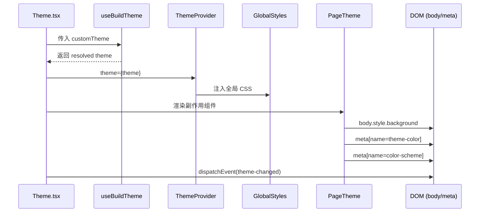

Outline 的前端样式系统以 **styled-components v5** 为核心构建，通过一套精心设计的主题工厂函数、共享样式工具和全局样式，实现了完整的 **明暗主题切换**、**团队品牌定制** 和 **响应式布局**。在 288 个组件文件中，超过 165 个直接使用了 styled-components，构成了整个 UI 层的视觉基础设施。

## 架构总览

样式系统的数据流遵循一条清晰的链路：主题定义 → 主题解析 → Provider 注入 → 组件消费。以下架构图展示了从用户偏好到最终渲染的完整路径：

```mermaid
flowchart TD
    A[用户偏好<br/>UiStore.theme] --> B[系统偏好<br/>prefers-color-scheme]
    A --> C[URL 覆盖<br/>?theme=dark]
    D[团队品牌色<br/>CustomTheme] --> E[useBuildTheme Hook]
    B --> E
    C --> E
    F[设备检测<br/>isMobile / isPrinting] --> E
    E -->|buildLightTheme<br/>buildDarkTheme<br/>buildPitchBlackTheme| G[Resolved Theme Object]
    G --> H[ThemeProvider<br/>styled-components]
    H --> I[GlobalStyles<br/>createGlobalStyle]
    H --> J[组件树中所有<br/>styled-components]
    J --> K[s() mixin /<br/>props.theme /<br/>useTheme()]
```

这套架构的核心优势在于：**主题切换对组件完全透明**——组件只需通过 `s("key")` 或 `props.theme` 访问主题值，无需关心当前处于何种主题模式。

Sources: [Theme.tsx](app/components/Theme.tsx#L1-L72), [useBuildTheme.ts](app/hooks/useBuildTheme.ts#L1-L59), [UiStore.ts](app/stores/UiStore.ts#L18-L28)

## 主题定义：三层工厂体系

主题的构建逻辑位于 `shared/styles/theme.ts`，采用**工厂函数**模式，通过 `buildBaseTheme` → `buildLightTheme` / `buildDarkTheme` / `buildPitchBlackTheme` 的三层继承结构生成最终的主题对象。

### 基础主题层（buildBaseTheme）

`buildBaseTheme` 接收一个可选的 `Partial<Colors>` 参数（用于团队品牌定制），输出所有主题共享的基础属性，包括：

| 类别 | 包含内容 |
|------|---------|
| **字体** | `fontFamily`（系统字体栈）、`fontFamilyMono`（等宽字体栈）、`fontFamilyEmoji`、三个字重等级 |
| **调色板** | 所有 `defaultColors`（accent、danger、warning、success、brand 系列） |
| **代码高亮** | 18 个 code 前缀的语法着色变量（keyword、string、function 等） |
| **Notice** | info/tip/warning/success 四种通知的背景与文字色 |
| **间距** | `sidebarWidth`、`sidebarRightWidth`、`sidebarCollapsedWidth` 等布局常量 |
| **响应式** | `breakpoints` 对象 |

Sources: [theme.ts](shared/styles/theme.ts#L54-L111)

### 明亮主题与暗黑主题

`buildLightTheme` 和 `buildDarkTheme` 各自定义了约 **50 个语义化颜色变量**，这些变量通过组件语义而非颜色值命名，确保组件代码在主题切换时无需修改：

```
background → 主背景色        sidebarBackground → 侧边栏背景
text → 主文字色              sidebarText → 侧边栏文字色
modalBackground → 模态框背景  menuBackground → 菜单背景
inputBorder → 输入框边框      tooltipBackground → 提示框背景
```

**Pitch Black 主题**是一个特殊的变体，继承自暗黑主题，将主背景色设为纯黑（`#000`），专门用于移动端暗黑模式下提供更高的对比度和更省电的 OLED 显示效果。

Sources: [theme.ts](shared/styles/theme.ts#L113-L280)

### DefaultTheme 类型系统

styled-components 的 TypeScript 类型扩展定义在 `app/typings/styled-components.d.ts` 中，通过声明合并（declaration merging）扩展 `styled-components` 模块的 `DefaultTheme` 接口。该接口组合了四个子接口：

| 子接口 | 职责 |
|--------|------|
| `Colors` | 基础调色板（almostBlack、slate、brand 等） |
| `Spacing` | 布局间距常量（sidebarWidth 等） |
| `Breakpoints` | 响应式断点 |
| `EditorTheme` | 编辑器相关属性（含 CodeTheme） |

加上 `DefaultTheme` 自身定义的约 40 个语义属性，构成了一个拥有 **130+ 属性** 的完整主题类型。这意味着在任何 styled-component 中通过 `props.theme` 访问任何主题属性，都能获得完整的类型推断。

Sources: [styled-components.d.ts](app/typings/styled-components.d.ts#L1-L184)

## 主题解析流程

主题的最终选择由 `useBuildTheme` Hook 决定，它综合了五个输入来源并按优先级解析：

```
优先级：URL 参数 > 用户偏好 > 系统偏好
条件覆盖：打印模式 → 强制 Light，移动端 + Dark → Pitch Black
```

具体解析逻辑如下表所示：

| 条件 | 选择结果 |
|------|---------|
| 正在打印 | `buildLightTheme` |
| 移动端 + 暗黑模式 | `buildPitchBlackTheme` |
| 桌面端 + 暗黑模式 | `buildDarkTheme` |
| 其他（含移动端明亮） | `buildLightTheme` |

`UiStore` 中的 `resolvedTheme` 计算属性负责合并三个优先级来源：`themeOverride`（URL 参数设置）> `theme`（用户手动选择）> `systemTheme`（操作系统检测）。`themeOverride` 会持久化到会话期间，但不会写入 localStorage，确保它在关闭浏览器后自动清除。

Sources: [useBuildTheme.ts](app/hooks/useBuildTheme.ts#L22-L59), [UiStore.ts](app/stores/UiStore.ts#L450-L461)

## Theme 组件：注入与副作用

`Theme` 组件是样式系统的注入点，它完成了三件事：

1. **主题注入**：通过 styled-components 的 `<ThemeProvider>` 将解析后的主题对象注入组件树
2. **全局样式**：渲染 `<GlobalStyles>` 组件，应用 CSS 重置和全局样式规则
3. **DOM 同步**：通过 `PageTheme` 组件将主题的关键属性同步到 `document.body` 和 `<meta>` 标签



`PageTheme` 组件在每次主题变化时，更新 `body.style.background`、`meta[name="theme-color"]`（PWA 标题栏颜色）和 `meta[name="color-scheme"]`（浏览器原生控件颜色方案）。此外，`Theme` 组件还会派发 `theme-changed` 自定义事件，供编辑器中的 Mermaid 图表等非 React 内容响应主题切换。

Sources: [Theme.tsx](app/components/Theme.tsx#L16-L71), [PageTheme.ts](app/components/PageTheme.ts#L1-L32), [index.tsx](app/index.tsx#L57-L93)

## 共享样式工具

`shared/styles/index.ts` 导出了一系列**样式 Mixin**，它们是整个应用中复用度最高的工具函数：

### s() —— 主题值访问器

`s` 是一个高阶函数，接收主题键名，返回一个从 `props.theme` 中提取对应值的函数。它的类型签名利用了 `keyof DefaultTheme`，提供完整的编译时类型检查：

```typescript
export const s = (key: keyof DefaultTheme) => (props: { theme: DefaultTheme }) =>
  props.theme[key] as string;
```

在 styled-component 中使用时，`s("accent")` 等价于 `${(props) => props.theme.accent}`，但更简洁且类型安全。这在 `Button`、`Input`、`Notice` 等核心组件中被广泛使用。

### 其他 Mixin 一览

| Mixin | 用途 | 典型使用场景 |
|-------|------|-------------|
| `ellipsis()` | 单行文本溢出省略号 | 标题、链接、列表项 |
| `hideScrollbars()` | 隐藏滚动条但保留滚动能力 | 侧边栏、菜单列表 |
| `hover` | 自动适配设备的 hover 伪类 | 避免移动端"粘滞 hover" |
| `extraArea(px)` | 扩大可点击/悬停区域 | 小型按钮、图标按钮 |
| `truncateMultiline(n)` | 多行文本截断 | 卡片描述、摘要 |

`hover` 变量是一个特别值得注意的设计：在触摸设备上返回 `"active"`，在非触摸设备上返回 `"hover"`，从根源上解决了移动端常见的"粘滞 hover"问题。

Sources: [shared/styles/index.ts](shared/styles/index.ts#L1-L78)

## 响应式断点与层级管理

### 断点系统

断点定义在 `shared/styles/breakpoints.ts` 中，以像素值为单位，配合 `styled-components-breakpoint` 库在样式代码中使用：

| 断点名 | 值 | 目标设备 |
|--------|-----|---------|
| `mobile` | 0 | 所有移动设备 |
| `mobileLarge` | 460 | 大屏手机 |
| `tablet` | 737 | 大于 iPhone 6 Plus 横屏 |
| `desktop` | 1025 | 大于 iPad 横屏 |
| `desktopLarge` | 1600 | 大屏幕桌面 |

组件中使用时通过 `breakpoint("tablet")` 这样的函数调用生成媒体查询，例如 `Heading` 组件在平板以上断点调整 `margin-top`，`SidebarLink` 在平板以上断点调整字号和内边距。

### 层级（z-index）管理

所有 z-index 值集中在 `shared/styles/depths.ts` 中管理，消除了 z-index 冲突的风险。层级从低到高排列如下：

| 层级名 | z-index | 用途 |
|--------|---------|------|
| `toc` | 100 | 目录 |
| `header` | 800 | 顶部导航栏 |
| `sidebar` | 900 | 侧边栏 |
| `editorToolbar` | 925 | 编辑器工具栏 |
| `mobileSidebar` | 930 | 移动端侧边栏 |
| `hoverPreview` | 950 | 悬停预览 |
| `overlay` | 2000 | 遮罩层 |
| `modal` | 3000 | 模态框 |
| `menu` | 4000 | 下拉菜单 |
| `toasts` | 5000 | 通知提示 |
| `popover` | 9000 | 弹出层 |
| `commandBar` | 30000 | 命令面板 |
| `tooltip` | 50000 | 工具提示 |

Sources: [breakpoints.ts](shared/styles/breakpoints.ts#L1-L12), [depths.ts](shared/styles/depths.ts#L1-L21)

## 全局样式

`shared/styles/globals.ts` 通过 `createGlobalStyle` 创建全局样式表，完成以下工作：

1. **CSS 重置**：引入 `styled-normalize` 统一浏览器默认样式
2. **CSS 变量**：定义 `--line-height-body`、`--font-size-body`、`--pointer`（光标类型）、`--scrollbar-width` 等 CSS 自定义属性
3. **排版基准**：统一 `body` 的字体、颜色、抗锯齿渲染；设置 h1-h6 的字号和行高
4. **安全区域**：通过 CSS `env()` 函数适配 iOS 安全区域（`safe-area-inset-*`）
5. **无障碍**：为 `:focus-visible` 设置主题色轮廓；为 `prefers-reduced-motion` 禁用所有动画和过渡
6. **PWA 适配**：在独立显示模式（`display-mode: standalone`）下添加标题栏分隔线
7. **编辑器特殊处理**：处理 Mermaid.js 注入的离屏元素布局；在表格拖拽时切换全局光标样式

Sources: [globals.ts](shared/styles/globals.ts#L1-L163)

## 组件样式模式

Outline 的组件遵循几种高度一致的样式编写模式，这些模式贯穿了整个组件库。

### 模式一：s() 主题访问器

最普遍的模式是使用 `s()` Mixin 直接引用主题属性，避免在模板字符串中写 `(props) => props.theme.xxx`：

```typescript
// Notice.tsx 中的用法
const Container = styled(Text)`
  background: ${s("sidebarBackground")};
  color: ${s("sidebarText")};
`;
```

### 模式二：条件样式与 css 辅助函数

对于需要根据 props 动态变化的样式，使用 styled-components 的 `css` 辅助函数：

```typescript
// SidebarLink.tsx 中的禁用和草稿样式
${(props) =>
  props.$disabled &&
  css`
    pointer-events: none;
    opacity: 0.75;
  `}
```

### 模式三：polished 颜色操作

通过 `polished` 库的 `darken`、`lighten`、`transparentize` 函数在主题色基础上派生新颜色，这在按钮悬停/禁用状态中尤为常见：

```typescript
// Button.tsx 中的悬停和禁用状态
&:hover:not(:disabled) {
  background: ${(props) => darken(0.05, props.theme.accent)};
}
&:disabled {
  color: ${(props) => transparentize(0.3, props.theme.accentText)};
  background: ${(props) => transparentize(0.1, props.theme.accent)};
}
```

### 模式四：Transient Props（$ 前缀）

遵循 styled-components v5.1+ 的最佳实践，仅用于样式计算的 props 使用 `$` 前缀标记为 transient，避免传递到 DOM 元素：

```typescript
// Button.tsx 中定义的 transient props
type RealProps = {
  $fullwidth?: boolean;
  $borderOnHover?: boolean;
  $neutral?: boolean;
  $danger?: boolean;
};
const RealButton = styled(ActionButton)<RealProps>`...`;
```

### 模式五：useTheme() 在 JSX 中读取主题

当需要在 JavaScript 逻辑中（而非 CSS 中）使用主题值时，使用 `useTheme()` Hook：

```typescript
// SidebarLink.tsx 中计算 activeStyle
const theme = useTheme();
const activeStyle = React.useMemo(
  () => ({
    color: theme.text,
    background: theme.sidebarActiveBackground,
    ...style,
  }),
  [theme.text, theme.sidebarActiveBackground, style]
);
```

### 模式六：组合与扩展

styled-component 之间可以通过选择器嵌套实现样式组合。`Modal.tsx` 中的 `Wrapper` 组件直接通过 `${NudeButton}` 和 `${Header}` 选择器修改子组件样式，避免了 prop drilling：

```typescript
const Wrapper = styled.div`...`;
// 在 Wrapper 内部控制 NudeButton 的悬停样式
${NudeButton} {
  &:hover { background: ${s("sidebarControlHoverBackground")}; }
}
```

### 模式七：Flex 布局原语

`Flex` 组件是最基础的布局原语，通过声明式 props（`column`、`align`、`justify`、`gap`、`auto`）替代手写 flexbox CSS。`withConfig({ shouldForwardProp })` 确保 props 不泄漏到 DOM。`Flex` 和 `Text` 定义在 `shared/components/` 中，`app/components/` 下的同名文件只是简单 re-export，体现了共享层与应用层的分层设计。

Sources: [Button.tsx](app/components/Button.tsx#L1-L121), [Notice.tsx](app/components/Notice.tsx#L1-L49), [SidebarLink.tsx](app/components/Sidebar/components/SidebarLink.tsx#L272-L376), [Modal.tsx](app/components/Modal.tsx#L230-L261), [Flex.tsx](shared/components/Flex.tsx#L1-L62)

## 动画系统

所有 CSS 关键帧动画集中在 `app/styles/animations.ts` 中定义，通过 `keyframes` 辅助函数创建。这些动画分为以下几类：

| 动画 | 用途 | 应用场景 |
|------|------|---------|
| `fadeIn` / `fadeOut` | 基础淡入淡出 | 遮罩层、Tooltip |
| `fadeAndScaleIn` | 淡入+缩放 | 模态框出现 |
| `fadeAndSlideDown` / `fadeAndSlideUp` | 淡入+滑动 | 下拉菜单 |
| `fadeInAndSlideLeft` / `fadeOutAndSlideRight` | 水平滑动 | 侧边栏过渡 |
| `mobileContextMenu` | 移动端菜单 | 底部弹出菜单 |
| `bounceIn` | 弹跳进入 | 徽标提示 |
| `pulsate` / `pulse` / `bigPulse` | 脉冲效果 | 加载指示器、状态提示 |

桌面端特有的样式 Mixin（`draggableOnDesktop`、`undraggableOnDesktop`、`fadeOnDesktopBackgrounded`）则定义在 `app/styles/index.ts` 中，通过检测 `Desktop.isElectron()` 条件性输出 CSS。

Sources: [animations.ts](app/styles/animations.ts#L1-L157), [app/styles/index.ts](app/styles/index.ts#L1-L33)

## 团队品牌定制

Outline 支持团队级别的品牌色定制，通过 `CustomTheme` 类型实现：

```typescript
export type CustomTheme = {
  accent: string;       // 主强调色
  accentText: string;   // 强调色上的文字色
};
```

定制流程的完整链路为：管理员在团队设置中配置 `TeamPreference.CustomTheme` → `Theme` 组件从 `auth.team.getPreference()` 读取 → 传入 `useBuildTheme` → 工厂函数通过 `buildBaseTheme(input)` 将自定义颜色与默认颜色合并 → 所有引用 `accent` 和 `accentText` 的组件自动应用新品牌色。

由于 `buildBaseTheme` 接收的是 `Partial<Colors>`，且通过 `{ ...defaultColors, ...input }` 展开合并，团队定制色会覆盖默认的 accent 和 accentText，而其余颜色保持不变。

Sources: [types.ts](shared/types.ts#L380-L383), [Theme.tsx](app/components/Theme.tsx#L19-L23), [theme.ts](shared/styles/theme.ts#L54-L58)

## 样式文件组织规范

项目的样式文件遵循以下组织约定：

```
shared/styles/           ← 共享样式基础设施（主题、断点、Mixin）
  theme.ts               ← 主题工厂函数
  breakpoints.ts         ← 响应式断点
  depths.ts              ← z-index 层级
  globals.ts             ← 全局样式
  index.ts               ← Mixin 导出

app/styles/              ← 应用特有样式
  animations.ts          ← 关键帧动画
  index.ts               ← 桌面端专用 Mixin

app/components/*.tsx     ← 组件样式（co-located）
  Button.tsx             ← 组件与样式在同一文件
  Modal.tsx              ← 子组件样式也在同一文件
  Sidebar/               ← 复杂组件可按目录组织
```

样式与组件**共置（co-located）**在同一文件中是 Outline 的核心约定。一个组件文件中通常包含：类型定义、styled-component 声明、React 组件实现，三者按此顺序排列。对于简单的组件（如 `Text.ts`、`Badge.ts`），整个文件可能就是一个 styled-component 声明。

Sources: [shared/styles/](shared/styles/), [app/styles/](app/styles/)

## 关键依赖版本

| 依赖 | 版本 | 用途 |
|------|------|------|
| `styled-components` | ^5.3.11 | CSS-in-JS 核心引擎 |
| `styled-components-breakpoint` | — | 响应式断点语法糖 |
| `styled-normalize` | — | CSS 重置 |
| `polished` | — | 颜色操作工具（darken/lighten/transparentize） |

---

理解样式系统的运作机制后，你可以继续深入以下主题：

- [Prosemirror 富文本编辑器：节点、标记、插件与扩展机制](7-prosemirror-fu-wen-ben-bian-ji-qi-jie-dian-biao-ji-cha-jian-yu-kuo-zhan-ji-zhi) —— 编辑器内部如何利用主题系统渲染代码高亮和排版
- [React 应用结构：场景（Scenes）、组件与路由体系](4-react-ying-yong-jie-gou-chang-jing-scenes-zu-jian-yu-lu-you-ti-xi) —— 理解 Theme 组件在应用启动流程中的位置
- [插件系统：架构设计与内置插件一览](19-cha-jian-xi-tong-jia-gou-she-ji-yu-nei-zhi-cha-jian-lan) —— 插件如何接入和扩展主题系统