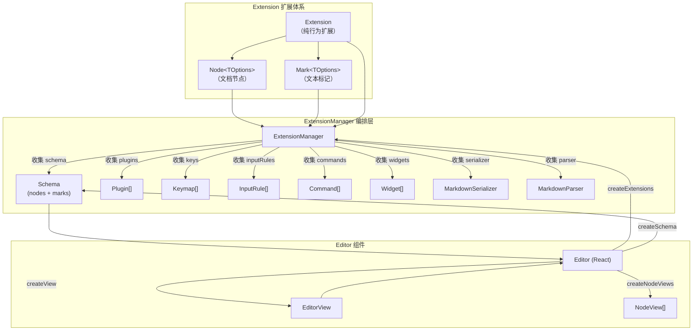
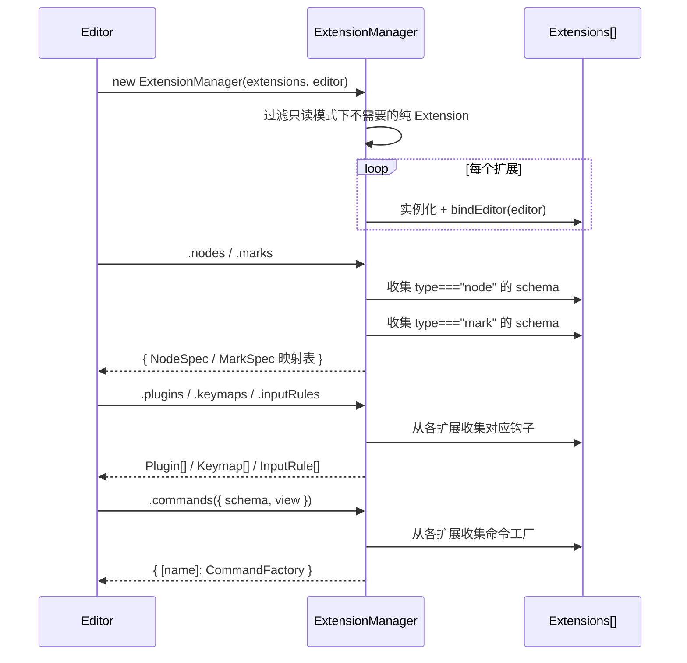
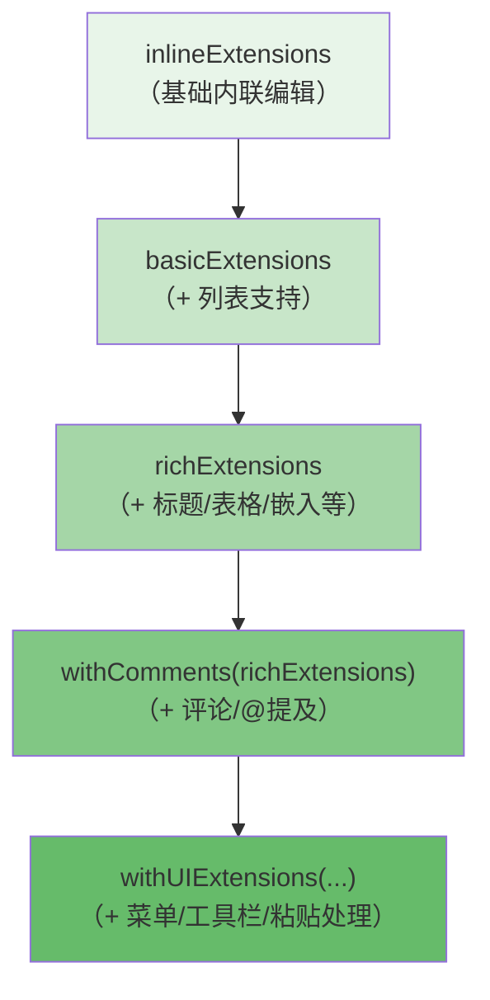
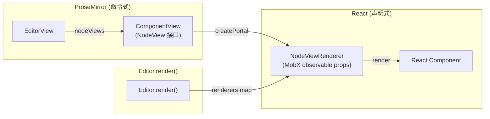

Outline 的富文本编辑器建立在 **ProseMirror** 之上，但并非直接使用 ProseMirror 的原生 API，而是构建了一套 **面向对象的扩展系统** 作为抽象层。这套系统将 ProseMirror 的核心概念——节点、标记、插件、输入规则、命令——统一封装为 `Extension`、`Node`、`Mark` 三类可组合的扩展单元，由 `ExtensionManager` 集中编排并驱动 Schema 构建、Markdown 序列化/反序列化、React NodeView 渲染等全流程。本文将系统性地剖析这一架构的设计理念、核心抽象、组合模式以及 React 集成机制。

Sources: [Extension.ts](shared/editor/lib/Extension.ts#L1-L112), [ExtensionManager.ts](shared/editor/lib/ExtensionManager.ts#L1-L62), [nodes/index.ts](shared/editor/nodes/index.ts#L1-L134)

## 架构总览：三层扩展体系

Outline 的编辑器扩展体系分为三层，每一层对应 ProseMirror 中的一个核心概念，同时共享同一套生命周期钩子接口：



**Extension** 是所有扩展的基类，提供 `plugins`、`keys`、`inputRules`、`commands`、`widget` 等可覆盖的钩子属性/方法。**Node** 继承 Extension，额外提供 `schema`（NodeSpec）、`toMarkdown`、`parseMarkdown` 等节点定义能力。**Mark** 同样继承 Extension，提供 `schema`（MarkSpec）和对应的 Markdown 序列化接口。三者通过 `ExtensionManager` 注册后，由 Editor 组件按固定顺序组装为完整的 ProseMirror 编辑器实例。

Sources: [Extension.ts](shared/editor/lib/Extension.ts#L15-L111), [Node.ts](shared/editor/nodes/Node.ts#L14-L55), [Mark.ts](shared/editor/marks/Mark.ts#L16-L55)

## Extension 基类：所有扩展的契约

`Extension<TOptions>` 是整个扩展体系的根基，定义了所有扩展必须遵循或可选实现的接口契约。它采用泛型参数 `TOptions` 支持类型安全的配置传入：

| 属性/方法 | 返回类型 | 用途 | 是否必须覆盖 |
|-----------|---------|------|-------------|
| `type` | `"extension"` | 标识扩展类型 | 否（子类覆盖） |
| `name` | `string` | 扩展唯一标识 | 是 |
| `defaultOptions` | `Partial<TOptions>` | 默认配置 | 否 |
| `plugins` | `Plugin[]` | ProseMirror 插件 | 否 |
| `keys()` | `Record<string, Command>` | 快捷键绑定 | 否 |
| `inputRules()` | `InputRule[]` | 输入规则 | 否 |
| `commands()` | `CommandFactory \| Record<string, CommandFactory>` | 命令注册 | 否 |
| `rulePlugins` | `PluginSimple[]` | Markdown-it 规则插件 | 否 |
| `widget()` | `React.ReactElement \| undefined` | React Widget 组件 | 否 |
| `allowInReadOnly` | `boolean` | 只读模式下是否启用 | 否（默认 false） |
| `focusAfterExecution` | `boolean` | 命令执行后是否聚焦 | 否（默认 true） |

关键设计点在于 **`bindEditor(editor)`** 方法——每个扩展实例在注册时都会获得 Editor 实例的引用，这使得扩展内部可以直接访问编辑器状态、视图和命令系统，实现跨扩展通信。例如 Heading 节点的 `handleFoldContent` 方法直接通过 `this.editor.view` 派发事务。

Sources: [Extension.ts](shared/editor/lib/Extension.ts#L15-L111)

## Node 扩展：文档内容节点

Node 扩展对应 ProseMirror 的 NodeSpec，定义了文档中可出现的内容块或内联元素。每个 Node 必须提供 `name` 和 `schema` 两个核心属性，并可选实现 Markdown 双向序列化、命令、快捷键和输入规则。

### 节点定义的完整生命周期

以 `Paragraph` 节点为例，展示一个 Node 扩展的最小完整实现：

```typescript
export default class Paragraph extends Node {
  get name() { return "paragraph"; }          // Schema 中的节点名

  get schema(): NodeSpec {                    // ProseMirror NodeSpec
    return {
      content: "inline*",
      group: "block",
      parseDOM: [{ tag: "p", getAttrs: ... }],
      toDOM: () => ["p", { dir: "auto" }, 0],
    };
  }

  keys({ type }) {                            // 快捷键
    return { "Shift-Ctrl-0": setBlockType(type), Backspace: deleteEmptyFirstParagraph };
  }

  commands({ type }) {                        // 命令
    return () => setBlockType(type);
  }

  toMarkdown(state, node) { ... }             // 序列化为 Markdown
  parseMarkdown() { return { block: "paragraph" }; }  // 从 Markdown 解析
}
```

Sources: [Paragraph.ts](shared/editor/nodes/Paragraph.ts#L1-L72)

### 复杂节点示例：Heading 的插件化装饰

`Heading` 节点是一个更复杂的案例，它不仅定义了 Schema，还通过 `plugins` getter 返回了两个 ProseMirror 插件——一个用于渲染标题锚点链接和折叠按钮的 **Widget Decoration**，另一个用于管理折叠内容的 **Node Decoration**：

- **widgetsPlugin**：遍历文档中的所有 heading 节点，为每个标题动态创建包含 `#` 链接按钮和折叠箭头的 DOM 元素，通过 `Decoration.widget()` 插入到编辑器中
- **foldPlugin**：通过 `findCollapsedNodes()` 查询折叠状态的标题，为被折叠的内容添加 `folded-content` CSS 类

这种将 **插件生命周期内嵌于节点定义** 中的模式，使得节点的视觉行为和交互逻辑与其 Schema 定义紧密内聚，而非散落在全局注册表中。

Sources: [Heading.ts](shared/editor/nodes/Heading.ts#L236-L381)

### 复杂节点示例：ToggleBlock 的事务级状态管理

`ToggleBlock`（折叠块）展示了最复杂的节点实现之一。它通过多个 PluginKey 和 Plugin 管理折叠状态的持久化（localStorage）、远程协作事务的识别、以及 `appendTransaction` 自动为新创建的 ToggleBlock 分配 UUID：

- 使用 `toggleFoldPluginKey` 维护一个 `foldedIds: Set<string>` 的插件状态
- 通过 `appendTransaction` 钩子在文档变更时自动检测无 ID 的 ToggleBlock 并分配 UUID
- 通过 `isRemoteTransaction(tr)` 识别来自其他协作者的事务，避免折叠状态冲突

Sources: [ToggleBlock.ts](shared/editor/nodes/ToggleBlock.ts#L48-L200)

## Mark 扩展：文本格式标记

Mark 扩展对应 ProseMirror 的 MarkSpec，定义可叠加到文本上的格式化属性（加粗、斜体、链接等）。Mark 与 Node 共享相同的基础接口，但默认实现了 `commands()` 方法——返回 `toggleMark(type)` 命令，这意味着所有 Mark 扩展开箱即用就支持切换操作。

### 标记的实现模式对比

| 标记 | 输入规则 | 快捷键 | 自定义命令 | 插件 | Markdown-it 规则 |
|------|---------|--------|-----------|------|-----------------|
| **Bold** | `**text**` | `Mod-b` | 默认 toggleMark | 无 | 无 |
| **Italic** | `*text*` | `Mod-i` | 默认 toggleMark | 无 | 无 |
| **Highlight** | `==text==` | `Mod-Shift-h` | 默认 toggleMark | 无 | `markRule` |
| **Link** | `[text](url)` | `Mod-Enter` | link/addLink/updateLink/removeLink/openLink | 点击处理插件 | `links` 规则 |
| **Code** | `` `text` `` | `Mod-e` | 默认 toggleMark | 无 | 无 |
| **Comment** | 无 | 无 | addComment | 无 | 无 |

以 `Bold` 标记为例，其完整实现极为精简——仅定义 `name`、`schema`、`inputRules`、`keys` 和 Markdown 序列化方法，命令行为完全继承自 `Mark` 基类的默认实现。而 `Link` 标记则复杂得多，提供了 5 个命名命令和专用的点击处理插件。

Sources: [Bold.ts](shared/editor/marks/Bold.ts#L1-L59), [Highlight.ts](shared/editor/marks/Highlight.ts#L1-L148), [Link.tsx](shared/editor/marks/Link.tsx#L1-L200), [Mark.ts](shared/editor/marks/Mark.ts#L47-L55)

## 纯行为扩展：无 Schema 的功能增强

不定义 Schema 的纯 `Extension` 子类用于添加编辑器级别的行为，如快捷键、输入规则、Widget 组件或插件。这类扩展在 **只读模式** 下默认不实例化（除非 `allowInReadOnly` 为 `true`），这是 ExtensionManager 在构造时进行的优化。

### History 扩展：撤销/重做

`History` 是最典型的纯行为扩展——它不贡献任何 Schema，而是注册 `prosemirror-history` 插件并暴露 `undo`/`redo` 命令：

```typescript
export default class History extends Extension {
  get name() { return "history"; }
  commands() { return { undo: () => undo, redo: () => redo }; }
  keys() { return { "Mod-z": () => this.editor.commands.undo(), ... }; }
  get plugins() { return [history()]; }
}
```

注意 `keys()` 中通过 `this.editor.commands.undo()` 调用自身注册的命令，形成了自引用的命令回路——这是因为 `commands` 属性由 ExtensionManager 在所有扩展注册完毕后才填充。

Sources: [History.ts](shared/editor/extensions/History.ts#L1-L32)

### TrailingNode 扩展：文档末尾段落保障

`TrailingNode` 确保文档末尾始终存在一个段落节点，防止光标卡在不可编辑的块级节点（如表格、代码块）之后无法继续输入。它通过 Plugin 的 `state` 计算是否需要插入尾部节点，并在 `view` 更新钩子中执行插入事务。

Sources: [TrailingNode.ts](shared/editor/extensions/TrailingNode.ts#L1-L89)

### SelectionToolbar 扩展：Widget 模式

`SelectionToolbarExtension` 展示了 Extension 的 **Widget 模式**——通过 `widget()` 方法返回一个 React 组件，该组件会被 Editor 的渲染流程自动挂载。它同时使用 MobX 的 `@observable` 将选区状态变为响应式，使得工具栏的显示/隐藏完全由 MobX 的观察机制驱动：

```typescript
export default class SelectionToolbarExtension extends Extension {
  get allowInReadOnly() { return true; }
  @observable state: Selection | boolean = false;
  // Plugin 监听 view 更新 → 更新 observable state → Widget 响应式渲染
  widget = (props) => <SelectionToolbar isActive={!!this.state} ... />;
}
```

Sources: [SelectionToolbar.tsx](app/editor/extensions/SelectionToolbar.tsx#L1-L110)

## ExtensionManager：扩展编排引擎

`ExtensionManager` 是整个扩展系统的核心编排器，负责将一组扩展类/实例转化为 ProseMirror 所需的全部运行时构建块。其初始化流程如下：



### 只读模式优化

ExtensionManager 在构造时执行了一项重要的优化：对于 `type === "extension"` 且 `allowInReadOnly === false` 的扩展类，在只读模式下直接跳过实例化。这一检查甚至在构造函数执行之前完成（通过读取 `ext.prototype.type`），避免了不必要的构造开销。Node 和 Mark 扩展则始终实例化，因为它们需要参与 Schema 构建。

### Schema 构建与交叉过滤

ExtensionManager 在收集 `nodes` 和 `marks` 后，会执行两轮交叉过滤：

1. **Node 的 marks 过滤**：每个 NodeSpec 的 `marks` 字段中引用的标记名，如果不在当前编辑器的 marks 集合中，会被移除
2. **Mark 的 excludes 过滤**：每个 MarkSpec 的 `excludes` 字段中引用的标记名，如果不在当前 marks 集合中，同样会被移除

这保证了 Schema 的内部一致性——不会出现引用了不存在标记的节点定义。

Sources: [ExtensionManager.ts](shared/editor/lib/ExtensionManager.ts#L17-L120)

## 扩展组合：从内联到富文本的渐进式构建

Outline 通过函数式组合模式，定义了多层次的扩展集合，适配不同的使用场景：



| 集合 | 包含的扩展 | 使用场景 |
|------|-----------|---------|
| `inlineExtensions` | Doc, Paragraph, Text, Emoji, SimpleImage, 基础 Mark, History, TrailingNode, MaxLength, DateTime, HardBreak, DeleteNearAtom, HexColorPreview | 评论编辑器等简易场景 |
| `basicExtensions` | `inlineExtensions` + CheckboxList/Item, BulletList, OrderedList, ListItem | 需要列表的基础编辑 |
| `richExtensions` | `inlineExtensions`(去掉 SimpleImage) + Image, CodeBlock/Fence, Blockquote, Embed, Attachment, Video, Notice, Heading, HR, Highlight, TemplatePlaceholder, Math, MathBlock, Mention, ToggleBlock, 列表, 表格 | 完整文档编辑 |
| `withComments(nodes)` | 注入 Comment mark 和 Mention node | 需要评论功能的场景 |
| `withUIExtensions(nodes)` | + SmartText, PasteHandler, ClipboardTextSerializer, BlockMenu, EmojiMenu, MentionMenu, FindAndReplace, HoverPreviews, SelectionToolbar, Diagrams, PreventTab, Keys | 完整文档编辑器 |

这种组合模式的核心优势在于：**不同场景可以精确选择所需的功能集**。例如评论编辑器只需 `basicExtensions`，而完整文档编辑器则需要 `withUIExtensions(withComments(richExtensions))`。

Sources: [nodes/index.ts](shared/editor/nodes/index.ts#L48-L134), [extensions/index.ts](app/editor/extensions/index.ts#L1-L33), [Document/Editor.tsx](app/scenes/Document/components/Editor.tsx#L42-L42), [CommentEditor.tsx](app/scenes/Document/components/Comments/CommentEditor.tsx#L19-L19)

## 命令系统：从扩展到 Editor API

命令系统是扩展暴露操作接口的核心机制。ExtensionManager 的 `commands()` 方法遍历所有扩展，将它们注册的 `CommandFactory` 汇聚为一个扁平的命令映射表，挂载到 `Editor` 实例上：

```typescript
// ExtensionManager.commands() 的核心逻辑
const apply = (callback, attrs) => {
  if (!view.editable && !extension.allowInReadOnly) return;  // 只读守卫
  if (extension.focusAfterExecution) view.focus();            // 自动聚焦
  return callback(attrs)?.(view.state, view.dispatch, view);  // 执行命令
};
```

命令的注册有两种形式：
- **命名命令**：`commands()` 返回 `Record<string, CommandFactory>`，每个键作为命令名（如 Link 的 `link`、`addLink`、`removeLink`）
- **匿名命令**：`commands()` 直接返回单个 `CommandFactory`，以扩展的 `name` 作为命令名

最终，Editor 组件上的 `this.commands` 属性就是所有扩展命令的聚合字典，任何扩展都可以通过 `this.editor.commands.xxx()` 调用其他扩展注册的命令。

Sources: [ExtensionManager.ts](shared/editor/lib/ExtensionManager.ts#L238-L292)

## Suggestion 抽象：菜单类扩展的基类

`Suggestion` 是一个重要的中间抽象层，为所有需要弹出菜单的扩展（BlockMenu、EmojiMenu、MentionMenu）提供共享的行为框架。它封装了以下通用逻辑：

- **触发正则**：根据 `trigger`、`allowSpaces`、`requireSearchTerm` 等选项动态构建正则表达式，支持 CJK 字符作为触发上下文
- **SuggestionsMenuPlugin**：处理键盘事件（Backspace 删除回溯、字符输入触发、方向键/Enter 拦截）和 IME compositionupdate 事件
- **MobX 响应式状态**：`{ open: boolean, query: string }` 作为 observable 状态，驱动菜单的显示/隐藏和搜索过滤
- **InputRule 集成**：通过 InputRule 机制在输入触发字符时打开菜单

BlockMenuExtension 继承 Suggestion 后，只需定义 `trigger: "/"`、提供自定义 Plugin（渲染 `+` 按钮装饰和占位文本）以及 `widget()` 方法渲染 React 菜单组件。

Sources: [Suggestion.ts](app/editor/extensions/Suggestion.ts#L1-L98), [SuggestionsMenuPlugin.ts](shared/editor/plugins/SuggestionsMenuPlugin.ts#L1-L165), [BlockMenu.tsx](app/editor/extensions/BlockMenu.tsx#L1-L128)

## React 集成：NodeView 与 Widget 的渲染桥接

ProseMirror 是一个命令式框架，而 Outline 的 UI 层是声明式的 React。两者的桥接通过三个核心机制实现：

### 1. ComponentView：NodeView 的 React 包装器

当 Node 扩展定义了 `component` 属性（即继承自 `ReactNode`），Editor 会在 `createNodeViews()` 阶段为其创建 `ComponentView` 实例。ComponentView 实现了 ProseMirror 的 `NodeView` 接口（`update`、`selectNode`、`deselectNode`、`destroy`），同时内部持有一个 `NodeViewRenderer`：



ComponentView 在构造时创建一个 DOM 元素（inline 节点为 `span`，block 节点为 `div`），并将该元素作为 React Portal 的容器。`NodeViewRenderer` 使用 MobX 的 `@observable` 和 `@computed` 使 props 变为响应式——当 ProseMirror 调用 `update(node)` 时，ComponentView 更新 NodeViewRenderer 的 observable props，触发 React 组件的重新渲染。

Sources: [ComponentView.tsx](app/editor/components/ComponentView.tsx#L24-L177), [NodeViewRenderer.tsx](app/editor/components/NodeViewRenderer.tsx#L1-L34), [ReactNode.ts](shared/editor/nodes/ReactNode.ts#L1-L11)

### 2. Widget：Extension 级别的 React 组件

与 NodeView 渲染特定节点不同，Widget 是 Extension 级别的 React 组件，用于渲染与文档内容无直接关联的 UI 元素（如工具栏、菜单、查找替换面板）。ExtensionManager 的 `widgets` getter 收集所有定义了 `widget()` 方法的扩展，用 MobX 的 `observer()` 包装后返回。Editor 的 `render()` 方法直接遍历这些 Widget 组件并渲染：

```typescript
// Editor.render() 中的 Widget 渲染
{this.widgets && Object.values(this.widgets).map((Widget, index) => (
  <Widget key={index} rtl={isRTL} readOnly={readOnly} selection={view.state.selection} />
))}
```

Sources: [ExtensionManager.ts](shared/editor/lib/ExtensionManager.ts#L64-L76), [index.tsx](app/editor/index.tsx#L906-L915)

### 3. EditorContext：依赖注入

Editor 组件通过 React Context 将自身实例注入到所有子组件中，任何 NodeView 或 Widget 都可以通过 `useEditor()` hook 获取编辑器的完整 API（命令、视图、Schema 等），实现深层组件与编辑器的通信。

Sources: [EditorContext.tsx](app/editor/components/EditorContext.tsx#L1-L9)

## Editor 初始化流程

Editor 组件的 `init()` 方法按照严格的顺序执行以下步骤，每一步依赖前一步的产物：

| 步骤 | 方法 | 产物 | 依赖 |
|------|------|------|------|
| 1 | `createExtensions()` | ExtensionManager 实例 | `props.extensions` |
| 2 | `createNodes()` / `createMarks()` | NodeSpec / MarkSpec 映射 | ExtensionManager |
| 3 | `createSchema()` | ProseMirror Schema | nodes + marks |
| 4 | `createPlugins()` | Plugin[] | ExtensionManager |
| 5 | `createRulePlugins()` | Markdown-it PluginSimple[] | ExtensionManager |
| 6 | `createSerializer()` | MarkdownSerializer | ExtensionManager |
| 7 | `createParser()` | MarkdownParser | Schema + rulePlugins |
| 8 | `createNodeViews()` | `{ [name]: NodeViewConstructor }` | Schema + ReactNode 扩展 |
| 9 | `createWidgets()` | `{ [name]: React.FC }` | ExtensionManager |
| 10 | `createKeymaps()` / `createInputRules()` | Keymap[] / InputRule[] | Schema（非只读模式） |
| 11 | `createView()` | EditorView | 全部上述产物 |
| 12 | `createCommands()` | `{ [name]: CommandFactory }` | Schema + EditorView |

步骤 3 中，`new Schema({ nodes, marks })` 使用 ProseMirror 的 Schema 构造器，将所有 Node 和 Mark 扩展的 Spec 定义合并为统一的类型系统。步骤 11 的 `createView()` 创建 `EditorView`，配置 `dispatchTransaction` 回调以处理文档变更通知、方向计算和 React 强制更新。

Sources: [index.tsx](app/editor/index.tsx#L319-L344), [index.tsx](app/editor/index.tsx#L413-L553)

## 插件（Plugin）生态

编辑器中的插件来源有三类，它们共同组成 EditorState 的 `plugins` 数组：

**扩展内嵌插件**：由各 Node/Mark/Extension 的 `plugins` getter 提供，如 Heading 的装饰插件、ToggleBlock 的折叠状态插件、Link 的点击处理插件、Doc 的 PlaceholderPlugin。

**全局功能插件**：在 `createView()` 阶段由 Editor 组件直接添加，包括 `dropCursor`（拖拽光标）、`gapCursor`（间隙光标）、`inputRules`（输入规则引擎）、`baseKeymap`（基础快捷键）和 `anchorPlugin`（锚点滚动）。

**Suggestion 类插件**：由 Suggestion 基类及其子类引入的 `SuggestionsMenuPlugin`，处理菜单的键盘交互和文本匹配。

Sources: [index.tsx](app/editor/index.tsx#L439-L467), [PlaceholderPlugin.ts](shared/editor/plugins/PlaceholderPlugin.ts#L1-L91)

## 输入规则（Input Rules）与 Markdown 规则（Rule Plugins）

编辑器支持两种文本模式转换机制：

**Input Rules**（ProseMirror 原生）：在用户输入时通过正则匹配自动触发格式转换。例如输入 `# ` 触发标题转换（`textblockTypeInputRule`），输入 `:::` 触发 Notice 块创建（`wrappingInputRule`），输入 `**text**` 触发加粗标记。ExtensionManager 的 `inputRules()` 方法从所有扩展收集 InputRule 并合并。

**Markdown-it Rule Plugins**：用于 Markdown 解析时的自定义规则，由扩展的 `rulePlugins` getter 提供。例如 Highlight 标记注册了 `markRule({ delim: "==", mark: "highlight" })`，使得 `==text==` 语法能在 Markdown 解析时被正确识别。

Sources: [Heading.ts](shared/editor/nodes/Heading.ts#L373-L380), [Notice.tsx](shared/editor/nodes/Notice.tsx#L30-L33), [Highlight.ts](shared/editor/marks/Highlight.ts#L131-L133)

## Markdown 双向序列化

每个 Node 和 Mark 扩展都实现了 `toMarkdown()` 和 `parseMarkdown()` 方法，支持编辑器内容与 Markdown 文本的双向转换。ExtensionManager 在创建 Serializer 和 Parser 时，分别从所有 Node 和 Mark 扩展收集这些方法：

- **Serializer**（`MarkdownSerializer`，fork 自 prosemirror-markdown 并增加了表格支持）：每个 Node 的 `toMarkdown()` 方法定义如何将 ProseMirror 节点序列化为 Markdown 文本
- **Parser**（`MarkdownParser`）：每个 Node/Mark 的 `parseMarkdown()` 返回一个 `ParseSpec`，定义如何从 Markdown-it Token 映射为 ProseMirror 节点/标记

这套序列化系统不仅支持标准的 CommonMark 语法，还通过自定义 Markdown-it 规则插件（如 `noticesRule`、`toggleBlocksRule`、`markRule`）扩展了对 `:::info` 通知块、`%%toggle%%` 折叠块、`==highlight==` 高亮等非标准语法的支持。

Sources: [serializer.ts](shared/editor/lib/markdown/serializer.ts#L1-L60), [ExtensionManager.ts](shared/editor/lib/ExtensionManager.ts#L122-L174), [rules/](shared/editor/rules)

## 查询（Queries）系统

`shared/editor/queries/` 目录包含了一组纯函数查询工具，用于从 ProseMirror 的 EditorState 中提取信息而不产生副作用。这些查询被命令和扩展广泛使用：

| 查询函数 | 用途 |
|---------|------|
| `isMarkActive(type)` | 检查指定标记是否在当前选区激活 |
| `isNodeActive(type)` | 检查指定节点类型是否包含当前选区 |
| `getMarkRange($pos, type)` | 获取光标位置处指定标记的完整范围 |
| `findParentNode(predicate)` | 向上查找满足条件的父节点 |
| `isInList` / `isInCode` / `isInHeading` | 检查光标是否在特定节点类型内 |
| `findCollapsedNodes(doc)` | 查找文档中所有折叠的节点 |
| `getDocumentHighlightColors` | 收集文档中使用的所有高亮颜色 |

Sources: [queries/](shared/editor/queries)

## 设计模式总结

Outline 的编辑器扩展系统体现了几个关键的架构决策：

**组合优于继承的扩展模型**：通过 `inlineExtensions` → `basicExtensions` → `richExtensions` → `withComments()` → `withUIExtensions()` 的函数式组合链，实现了功能集的精确控制，而非依赖深层继承树。

**内聚性优先的插件归属**：将 ProseMirror Plugin 定义在 Node/Mark 扩展内部（如 Heading 的装饰插件、Link 的点击处理），而非全局注册，使得节点的视觉行为和交互逻辑与其 Schema 定义保持在同一文件中。

**React-ProseMirror 桥接层**：通过 `ComponentView` + `NodeViewRenderer` + React Portal 的三层桥接，在保持 ProseMirror 命令式更新性能的同时，获得了 React 声明式渲染的开发体验和 MobX 的响应式状态管理。

**命令聚合与跨扩展通信**：所有扩展注册的命令被扁平化为单一字典，任何扩展都可以通过 `this.editor.commands.xxx()` 调用其他扩展的命令，形成了去中心化的扩展间通信机制。

Sources: [Extension.ts](shared/editor/lib/Extension.ts#L1-L112), [ExtensionManager.ts](shared/editor/lib/ExtensionManager.ts#L1-L294), [nodes/index.ts](shared/editor/nodes/index.ts#L1-L134)

---

**延伸阅读**：本文聚焦于编辑器的扩展架构。要了解编辑器如何通过 Yjs 和 Hocuspocus 实现实时协同编辑、冲突解决和文档持久化，请参阅 [实时协同编辑：Yjs 与 Hocuspocus 的集成原理](8-shi-shi-xie-tong-bian-ji-yjs-yu-hocuspocus-de-ji-cheng-yuan-li)。要了解编辑器在后端如何被解析、转换和持久化，请参阅 [数据模型层：Sequelize ORM 模型体系与生命周期钩子](10-shu-ju-mo-xing-ceng-sequelize-orm-mo-xing-ti-xi-yu-sheng-ming-zhou-qi-gou-zi)。