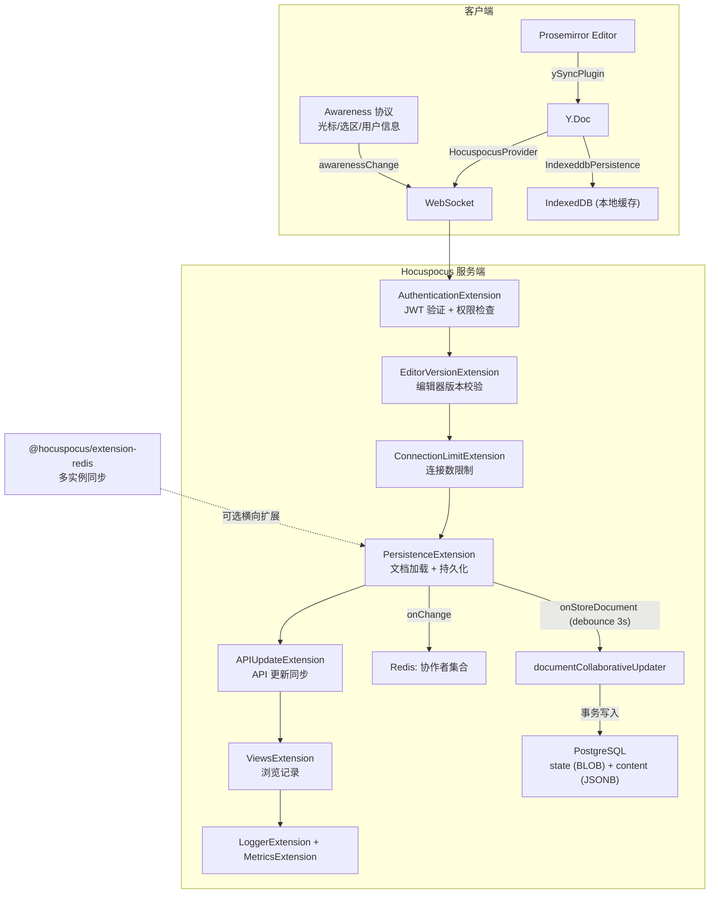
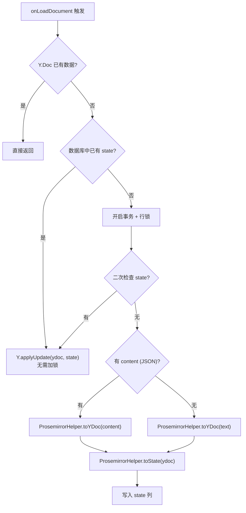

Outline 的实时协同编辑能力建立在 **Yjs**（CRDT 协同引擎）与 **Hocuspocus**（WebSocket 协同服务端）的深度集成之上。本文将系统剖析这一架构如何将 Prosemirror 富文本编辑器与分布式状态同步机制融合，实现多用户无冲突并发编辑，涵盖从客户端 Y.Doc 初始化、Provider 双层持久化策略，到服务端 Hocuspocus 扩展链的完整数据流。读者需具备 [Prosemirror 富文本编辑器](7-prosemirror-fu-wen-ben-bian-ji-qi-jie-dian-biao-ji-cha-jian-yu-kuo-zhan-ji-zhi)的基础知识。

Sources: [MultiplayerEditor.tsx](app/scenes/Document/components/MultiplayerEditor.tsx#L1-L55), [collaboration.ts](server/services/collaboration.ts#L1-L50)

## 核心架构概览

Outline 的协同编辑系统采用经典的三层架构：**客户端编辑层**（Prosemirror + y-prosemirror 绑定）→ **实时同步层**（Hocuspocus WebSocket 服务）→ **持久化层**（PostgreSQL + Redis + IndexedDB）。关键设计决策在于 Yjs CRDT 模型的引入——所有编辑操作最终都转化为对 Yjs 共享类型（`Y.XmlFragment`）的操作，CRDT 的数学特性保证了操作在不同网络延迟和乱序到达场景下的自动收敛。



Sources: [collaboration.ts](server/services/collaboration.ts#L46-L99), [MultiplayerEditor.tsx](app/scenes/Document/components/MultiplayerEditor.tsx#L78-L121)

## 客户端：Y.Doc 的创建与双层 Provider 策略

### Y.Doc 的生命周期

每个打开的文档在客户端创建一个独立的 `Y.Doc` 实例，通过 `useState` 的惰性初始化保证整个组件生命周期中只有一个实例。`Y.Doc` 是 Yjs 的核心数据容器，内部维护一个 **有向无环图（DAG）** 的操作日志，每个客户端的操作都以 `(clientId, clock)` 对偶标识，确保全局唯一性。

`Sources: [MultiplayerEditor.tsx](app/scenes/Document/components/MultiplayerEditor.tsx#L78-L80)`

### 双层 Provider 架构

MultiplayerEditor 组件采用 **双层 Provider** 策略实现可靠的状态同步：

| Provider | 类 | 职责 | 数据流向 |
|---|---|---|---|
| **本地持久化** | `IndexeddbPersistence` | 离线编辑缓存，首次加载时提供即时渲染 | Y.Doc ↔ IndexedDB |
| **远程同步** | `HocuspocusProvider` | 与服务端实时双向同步，传播增量和 Awareness | Y.Doc ↔ WebSocket ↔ Hocuspocus |

这一设计的关键价值在于：当用户重新打开文档时，IndexedDB 中的本地副本可以立即渲染（`isLocalSynced` 判断），无需等待网络往返。只有当远程状态也同步完成（`isRemoteSynced`）后才触发 `onSynced` 回调，确保完整数据就绪。

```typescript
// 本地 Provider：IndexedDB 离线缓存
const localProvider = typeof indexedDB !== "undefined"
  ? new IndexeddbPersistence(name, ydoc)
  : undefined;

// 远程 Provider：WebSocket 实时同步
const provider = new HocuspocusProvider({
  parameters: { editorVersion: EDITOR_VERSION },
  url: `${env.COLLABORATION_URL}/collaboration`,
  name: `document.${documentId}`,  // 文档标识
  document: ydoc,
  token,  // collaborationToken
});
```

Sources: [MultiplayerEditor.tsx](app/scenes/Document/components/MultiplayerEditor.tsx#L83-L121)

### 同步状态机的协调

组件通过四个布尔标志精确控制编辑器的渲染时机：

- `hasLocalPersistence`：是否存在 IndexedDB（某些环境不可用）
- `isLocalSynced`：本地 IndexedDB 是否已加载完成
- `isRemoteSynced`：远程 WebSocket 是否已同步完成
- `showCache`：当本地尚未就绪且远程也未同步时，使用缓存的只读版本渲染

这种分层就绪检测确保了用户在任何网络条件下都能获得流畅的编辑体验——先显示缓存内容，后台静默同步最新状态。

`Sources: [MultiplayerEditor.tsx](app/scenes/Document/components/MultiplayerEditor.tsx#L317-L344)`

### 认证与重连机制

`HocuspocusProvider` 使用专用的 `collaborationToken`（而非主 session token）进行认证，该 token 由 AuthStore 在登录时获取。当认证失败时，客户端实现了一个指数退避重连策略：

```typescript
provider.on("authenticationFailed", () => {
  provider.shouldConnect = false;
  retryCount.current++;
  // 指数退避：等待 retryCount * 1000ms 后重新获取 token 并重连
  void sleep(retryCount.current * 1000 - 1000).then(() =>
    auth.fetchAuth().then(() => {
      provider.setConfiguration({ token: auth.collaborationToken });
      void provider.connect();
      provider.shouldConnect = true;
    })
  );
});
```

Sources: [MultiplayerEditor.tsx](app/scenes/Document/components/MultiplayerEditor.tsx#L125-L144), [AuthStore.ts](app/stores/AuthStore.ts#L50-L52)

## 客户端：y-prosemirror 绑定与 Multiplayer 扩展

### y-prosemirror 的三大插件

y-prosemirror 库是连接 Yjs CRDT 引擎与 Prosemirror 编辑器的桥梁，通过三个核心插件实现双向绑定：

| 插件 | 功能 | 工作原理 |
|---|---|---|
| `ySyncPlugin` | 双向同步 Y.XmlFragment ↔ Prosemirror Doc | 监听 Yjs 事务将远程变更映射为 PM transactions，拦截本地 transactions 转化为 Yjs 操作 |
| `yCursorPlugin` | 远程用户光标和选区渲染 | 基于 Yjs Awareness 协议广播选区位置，通过 Decoration 机制渲染彩色光标 |
| `yUndoPlugin` | 协同感知的撤销/重做 | 独立于 Prosemirror 的 undo 栈，确保只撤销当前用户的操作而非远程变更 |

`Sources: [Multiplayer.ts](app/editor/extensions/Multiplayer.ts#L1-L15)`

### Multiplayer 扩展的定制化

Outline 的 `Multiplayer` 扩展在 y-prosemirror 基础上进行了多项深度定制：

**1. 永久用户映射（PermanentUserData）**

Yjs 的 `PermanentUserData` 机制建立了 `clientId → userId` 的持久映射。这一映射仅在用户首次做出修改时建立（通过 `afterTransaction` 事件），避免为只读连接创建无意义的映射。服务端的 `documentCollaborativeUpdater` 利用此映射提取所有曾经编辑过文档的用户 ID。

```typescript
const assignUser = (tr: Y.Transaction) => {
  const clientIds = Array.from(doc.store.clients.keys());
  if (tr.local && tr.changed.size > 0 && !clientIds.includes(doc.clientID)) {
    const permanentUserData = new Y.PersistentUserData(doc);
    permanentUserData.setUserMapping(doc, doc.clientID, user.id);
    doc.off("afterTransaction", assignUser);
  }
};
doc.on("afterTransaction", assignUser);
```

**2. 选区可见性的时间衰减**

为防止远程用户选区在页面上"残留"，Multiplayer 扩展实现了一个**时间衰减机制**：每个远程用户的选区会在 `awarenessStateFilter` 中记录最后一次变更时间，超过 10 秒未更新的选区将自动隐藏（opacity 降为 0）。

```typescript
const selectionBuilder = (u: { id: string; color: string }) => {
  const cached = userAwarenessCache.get(u.id);
  const opacity =
    !cached || cached?.changedAt > new Date(Date.now() - selectionTimeout)
      ? selectionOpacity  // 70
      : 0;  // 超时后透明
  return { style: `background-color: ${u.color}${opacity}` };
};
```

**3. 远程选区导致的自动滚动抑制**

通过 `handleScrollToSelection` prop 配合 `isRemoteTransaction` 检测，当变更来自远程用户时，编辑器不会自动滚动到变更位置，避免干扰当前用户的编辑焦点。

Sources: [Multiplayer.ts](app/editor/extensions/Multiplayer.ts#L39-L140), [multiplayer.ts](shared/editor/lib/multiplayer.ts#L20-L32)

### y-prosemirror 的补丁定制

Outline 对 y-prosemirror 应用了一个关键补丁（`patches/y-prosemirror+1.3.7.patch`），重构了选区恢复机制以支持 `CellSelection` 等非标准选区类型。原始实现使用硬编码的 `AllSelection`、`NodeSelection`、`TextSelection` 分支处理，补丁版本改用 Prosemirror 的 `Selection.getBookmark()` API，通过 bookmark 的 `map()` 方法将绝对位置转换为 Yjs 相对位置，实现了选区类型的通用支持。

`Sources: [y-prosemirror+1.3.7.patch](patches/y-prosemirror+1.3.7.patch#L1-L50)`

## 服务端：Hocuspocus 扩展链

### 服务初始化与 WebSocket 升级

协同编辑服务作为独立的服务模块注册在 Outline 的服务体系中。它通过 Node.js HTTP Server 的 `upgrade` 事件拦截 WebSocket 升级请求，将 `/collaboration` 路径下的连接移交给 Hocuspocus 处理：

```typescript
const hocuspocus = Server.configure({
  debounce: 3000,      // 变更持久化防抖：3 秒
  timeout: 30000,      // 连接超时：30 秒
  maxDebounce: 10000,  // 最大防抖：10 秒（确保至少每 10 秒持久化一次）
  extensions: [/* 扩展链 */],
});
```

文档 ID 通过 URL 路径解析：`/collaboration/{documentId}`。WebSocket 的 `maxPayload` 受 `DocumentValidation.maxStateLength` 约束，防止超大状态更新导致内存问题。

Sources: [collaboration.ts](server/services/collaboration.ts#L52-L77), [collaboration.ts](server/services/collaboration.ts#L79-L143)

### 扩展执行顺序与职责

Hocuspocus 的扩展系统基于**中间件模式**，每个扩展可以在连接生命周期的特定钩子上执行逻辑。Outline 的扩展链按以下顺序注册，每个扩展承担明确职责：

| 顺序 | 扩展 | 触发钩子 | 核心职责 |
|---|---|---|---|
| 1 | `@hocuspocus/extension-redis` | 全生命周期 | 多实例间通过 Redis Pub/Sub 同步文档状态 |
| 2 | `@hocuspocus/extension-throttle` | 全局 | 速率限制（默认 50 请求/IP/窗口） |
| 3 | `ConnectionLimitExtension` | `onConnect` | 单文档最大连接数（默认 100） |
| 4 | `EditorVersionExtension` | `onConnect` | 客户端编辑器主版本号校验 |
| 5 | `AuthenticationExtension` | `onAuthenticate` | JWT 验证 + 文档权限检查 |
| 6 | `PersistenceExtension` | `onLoadDocument` / `onChange` / `onStoreDocument` | 文档状态加载、变更跟踪、持久化 |
| 7 | `APIUpdateExtension` | `afterLoadDocument` / Redis 消息 | API 更新同步到内存中的 Y.Doc |
| 8 | `ViewsExtension` | `onChange` / `onDisconnect` | 浏览记录更新 + 用户活跃时间 |
| 9 | `LoggerExtension` | 全生命周期 | 连接/断开日志记录 |
| 10 | `MetricsExtension` | 全生命周期 | 协作指标采集（连接数、文档数、变更计数） |

Sources: [collaboration.ts](server/services/collaboration.ts#L46-L99)

### AuthenticationExtension：认证与权限

认证扩展在 `onAuthenticate` 钩子中执行三步验证：

1. **JWT 解析**：通过 `getUserForJWT` 解析 token，限定 scope 为 `["session", "collaboration"]`
2. **文档存在性检查**：使用 `Document.findByPk` 查询文档（含用户上下文）
3. **权限检查**：使用 CanCan 策略系统的 `can(user, "read", document)` 和 `can(user, "update", document)` 分别检查读写权限

只读权限的用户连接通过 `connection.readOnly = true` 标记，Hocuspocus 将拒绝该连接的任何变更推送。

`Sources: [AuthenticationExtension.ts](server/collaboration/AuthenticationExtension.ts#L13-L41)`

### PersistenceExtension：文档状态管理的核心

这是最复杂的扩展，负责文档状态的**加载**、**变更跟踪**和**持久化**三个关键阶段。

**阶段一：onLoadDocument — 懒加载与初始化**

当首个用户连接到某文档时，Hocuspocus 触发 `onLoadDocument`。扩展首先检查 Y.Doc 中是否已有数据（避免重复加载），然后采用分层策略：



**Double-Check Locking 模式**是关键：先不加锁查询，若 `state` 列已有数据则直接返回（快路径）；仅在 `state` 为空时才获取 `SELECT ... FOR UPDATE` 行锁，在事务内二次确认。这种设计在文档已被初始化的常见场景下避免了锁争用。

**阶段二：onChange — 变更感知与协作者追踪**

每次文档变更时，扩展将当前用户 ID 追加到 Redis 的协作者集合中：

```typescript
const key = Document.getCollaboratorKey(documentId);  // "collaborators:{documentId}"
await Redis.defaultClient.sadd(key, context.user.id);
```

这个 Redis Set 用于在持久化时确定哪些用户参与了本次编辑会话。

**阶段三：onStoreDocument — 防抖持久化**

Hocuspocus 的 `onStoreDocument` 在防抖定时器触发后调用。扩展首先检查 Redis 中的协作者集合——若为空则跳过（无变更），否则调用 `documentCollaborativeUpdater` 执行实际的数据库写入。

`Sources: [PersistenceExtension.ts](server/collaboration/PersistenceExtension.ts#L15-L145)`

### documentCollaborativeUpdater：Yjs 状态到数据库的桥梁

此命令是协同编辑系统与关系数据库之间的关键转换层，核心逻辑如下：

**1. 状态差异检测**

通过 `isEqual` 比较当前 Y.Doc 转换后的 Prosemirror JSON 与数据库中存储的 `content`，仅在内容实际变化时才写入。

**2. 协作者合并**

合并三组协作者 ID：数据库中已有的 `collaboratorIds`、本次会话的 `sessionCollaboratorIds`、以及从 `Y.PermanentUserData` 中提取的历史编辑者 `pudIds`。

**3. 安全的事务写入**

使用 `SET LOCAL lock_timeout = '15s'` 防止无限等待，`hooks: false` 避免触发 Document 模型的 AfterUpdate 钩子（防止无限递归）。

**4. 事件调度**

通过 `Event.schedule` 调度 `documents.update` 事件，`done` 标志仅在最后一个连接断开时设为 `true`，用于标识一次完整的编辑会话结束。

```typescript
await document.update({
  content,                    // Prosemirror JSON 快照
  state: Buffer.from(state),  // Yjs 二进制状态
  lastModifiedById,           // 最后修改者
  collaboratorIds,            // 合并后的协作者
  editorVersion,              // 编辑器版本号
}, { transaction, hooks: false });
```

Sources: [documentCollaborativeUpdater.ts](server/commands/documentCollaborativeUpdater.ts#L1-L121)

### APIUpdateExtension：API 与实时协作的双向桥接

当文档通过 REST API 更新时（如批量操作、外部集成），`APIUpdateExtension` 负责将变更同步到 Hocuspocus 内存中的 Y.Doc。其工作原理是 **Redis Pub/Sub 桥接模式**：

1. Document 模型的 `AfterUpdate` 钩子检测到 `state` 列变化时，调用 `APIUpdateExtension.notifyUpdate` 发布消息到 Redis 频道 `collaboration:api-update:{documentId}`
2. 扩展接收到消息后，从数据库读取最新 `state`，创建临时 Y.Doc
3. 使用 `Y.encodeStateAsUpdate(dbYdoc, currentStateVector)` 计算增量差异
4. 通过 `Y.applyUpdate` 将差异应用到内存中的 Y.Doc，自动广播给所有连接的客户端

```typescript
// 计算差异更新（基于当前内存状态的状态向量）
const currentStateVector = Y.encodeStateVector(document);
const update = Y.encodeStateAsUpdate(dbYdoc, currentStateVector);
if (update.length > 0) {
  Y.applyUpdate(document, update);
}
```

这一机制确保了 API 路径和 WebSocket 路径的编辑操作始终一致。

Sources: [APIUpdateExtension.ts](server/collaboration/APIUpdateExtension.ts#L1-L211), [Document.ts](server/models/Document.ts#L586-L600)

## Awareness 协议：实时在线状态与光标同步

### Awareness 的数据结构

Yjs Awareness 协议是独立于文档状态同步的轻量级广播机制，用于传递实时在线信息。Outline 的 Awareness 状态包含三个字段：

| 字段 | 类型 | 用途 |
|---|---|---|
| `user` | `{ id, name, color }` | 用户身份和显示颜色 |
| `cursor` | `{ anchor, head }` | Prosemirror 选区的 Yjs 相对位置 |
| `scrollY` | `number` | 页面滚动位置（用于"跟随"功能） |

`Sources: [types.ts](app/types.ts#L289-L314)`

### Presence Store 的状态管理

客户端的 `DocumentPresenceStore` 将 Awareness 事件转化为 MobX 可观察状态，驱动 UI 中的协作者头像和编辑状态显示。其核心方法是 `updateFromAwarenessChangeEvent`，过滤掉当前用户自己通过其他客户端发出的状态（防止循环），并通过 30 秒超时机制自动清理离线用户。

`Sources: [DocumentPresenceStore.ts](app/stores/DocumentPresenceStore.ts#L50-L95)`

### "跟随"功能

MultiplayerEditor 支持通过点击协作者头像来"跟随"某位远程用户的视角。实现方式是在 `awarenessChange` 事件中检查 `scrollY` 字段，当检测到被观察用户的滚动位置变化时，通过 `window.scrollTo` 平滑滚动到对应位置：

```typescript
event.states.forEach(({ user, scrollY }) => {
  if (user && scrollY !== undefined && user.id === ui.observingUserId) {
    window.scrollTo({
      top: scrollY * window.innerHeight,
      behavior: "smooth",
    });
  }
});
```

Sources: [MultiplayerEditor.tsx](app/scenes/Document/components/MultiplayerEditor.tsx#L148-L165)

## 连接管理：生命周期控制与弹性策略

### 空闲与页面可见性断连

为节省服务器资源和网络带宽，MultiplayerEditor 实现了**智能断连策略**：当用户处于空闲状态（`isIdle`）且页面不可见（`!isVisible`）时自动断开 WebSocket 连接；当用户恢复活动或页面重新可见时自动重连。这通过监听 `useIdle` 和 `usePageVisibility` 两个 Hook 实现。

```typescript
useEffect(() => {
  if (isIdle && !isVisible && remoteProvider.status === WebSocketStatus.Connected) {
    remoteProvider.disconnect();
  }
  if ((!isIdle || isVisible) && remoteProvider.status === WebSocketStatus.Disconnected) {
    void remoteProvider.connect();
  }
}, [remoteProvider, isIdle, isVisible]);
```

`Sources: [MultiplayerEditor.tsx](app/scenes/Document/components/MultiplayerEditor.tsx#L293-L306)`

### WebSocket 关闭事件码

系统定义了一套标准化的 WebSocket 关闭码，用于精确标识断连原因：

| 关闭码 | 常量 | 含义 | 触发方 |
|---|---|---|---|
| `1009` | `DocumentTooLarge` | 文档状态超过最大限制 | 服务端 |
| `4401` | `AuthenticationFailed` | 未提供认证凭证 | 服务端 |
| `4403` | `AuthorizationFailed` | 无文档访问权限 | 服务端 |
| `4408` | `ConnectionTimeout` | 连接超时 | 服务端 |
| `4503` | `TooManyConnections` | 单文档连接数超限 | 服务端 |
| `4999` | `EditorUpdateError` | 编辑器版本过旧 | 服务端 |

当客户端收到 `EditorUpdateError`（4999）时，会设置 `editorVersionBehind` 标志，将编辑器切换到只读模式，提示用户刷新页面。

Sources: [CloseEvents.ts](shared/collaboration/CloseEvents.ts#L1-L53), [MultiplayerEditor.tsx](app/scenes/Document/components/MultiplayerEditor.tsx#L170-L180)

### 多实例横向扩展

Hocuspocus 支持多进程部署，但要求 `@hocuspocus/extension-redis` 扩展通过 Redis Pub/Sub 在实例间同步文档状态。当 `REDIS_COLLABORATION_URL` 未配置时，系统强制将进程数限制为 1（`webProcessCount = 1`），因为内存中的 Y.Doc 状态无法跨进程共享。

```
if (env.SERVICES.includes("collaboration") && !env.REDIS_COLLABORATION_URL) {
  webProcessCount = 1;  // 强制单进程
}
```

Sources: [index.ts](server/index.ts#L35-L44), [env.ts](server/env.ts#L197-L201)

## 数据模型：双列存储与 CRDT 状态

Document 模型使用双列存储策略来兼顾协同编辑的效率和兼容性：

| 列名 | 类型 | 用途 | 更新时机 |
|---|---|---|---|
| `content` | `JSONB` | Prosemirror JSON 快照，用于搜索、导出、API 响应 | 每次持久化时由 `yDocToProsemirrorJSON` 生成 |
| `state` | `BLOB` | Yjs 二进制状态，用于文档加载和增量同步 | 每次持久化时由 `Y.encodeStateAsUpdate` 生成 |

`content` 列为空的文档会通过 `DocumentHelper.toJSON` 在 `beforeCreate` 钩子中回填。`state` 列最大长度受 `DocumentValidation.maxStateLength` 约束，超出时拒绝连接。

Sources: [Document.ts](server/models/Document.ts#L350-L367), [documentCollaborativeUpdater.ts](server/commands/documentCollaborativeUpdater.ts#L79-L106)

## 协同编辑的多编辑器决策

Document 场景组件通过 `multiplayerEditor` 布尔标志决定是否启用协同编辑：

```typescript
const multiplayerEditor =
  !document.isArchived && !document.isDeleted && !revision && !isShare;
```

只有当文档处于活跃状态（非归档、非删除）、非历史版本查看、非分享页面时才启用 MultiplayerEditor。在其他情况下使用普通的 Prosemirror Editor 组件，避免在不需要的场景中建立 WebSocket 连接。

`Sources: [Document.tsx](app/scenes/Document/components/Document.tsx#L275-L276), [Editor.tsx](app/scenes/Document/components/Editor.tsx#L173)`

## 关键设计模式总结

| 设计模式 | 应用场景 | 实现 |
|---|---|---|
| **Double-Check Locking** | 文档首次加载 | 无锁快查询 → 事务内二次确认 → 转换写入 |
| **Debounce + MaxDebounce** | 变更持久化 | 3 秒防抖 + 10 秒最大等待，平衡写入频率与数据安全 |
| **Event Sourcing** | 协作者追踪 | Redis Set 收集会话协作者，持久化时合并到数组列 |
| **Pub/Sub Bridge** | API ↔ 实时同步 | Redis 频道广播 API 变更，内存 Y.Doc 增量更新 |
| **Time-decay Awareness** | 远程选区渲染 | 10 秒超时自动隐藏残留选区 |
| **Lazy Binding** | 永久用户映射 | 首次修改时才建立 clientId → userId 映射 |

---

### 延伸阅读

- [实时协作服务：WebSocket、文档持久化与冲突解决](15-shi-shi-xie-zuo-fu-wu-websocket-wen-dang-chi-jiu-hua-yu-chong-tu-jie-jue) — 从后端服务角度深入理解协同编辑的运维与冲突处理
- [Prosemirror 富文本编辑器：节点、标记、插件与扩展机制](7-prosemirror-fu-wen-ben-bian-ji-qi-jie-dian-biao-ji-cha-jian-yu-kuo-zhan-ji-zhi) — 理解 y-prosemirror 绑定的 Prosemirror 基础
- [缓存与会话：Redis 的多种用途与存储策略](17-huan-cun-yu-hui-hua-redis-de-duo-chong-yong-tu-yu-cun-chu-ce-lue) — 理解 Redis 在协作者追踪和多实例同步中的角色