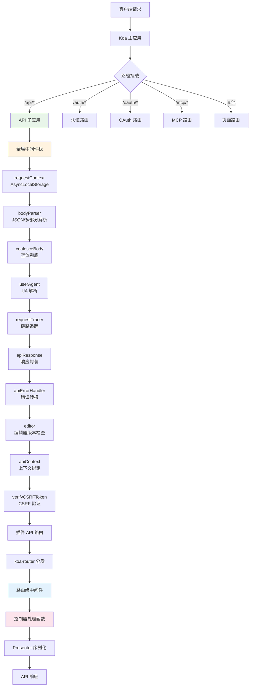
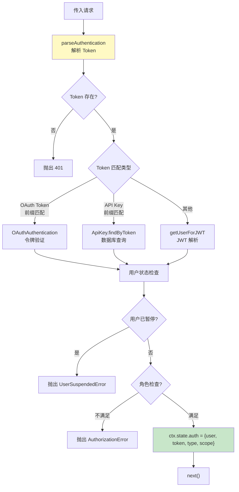
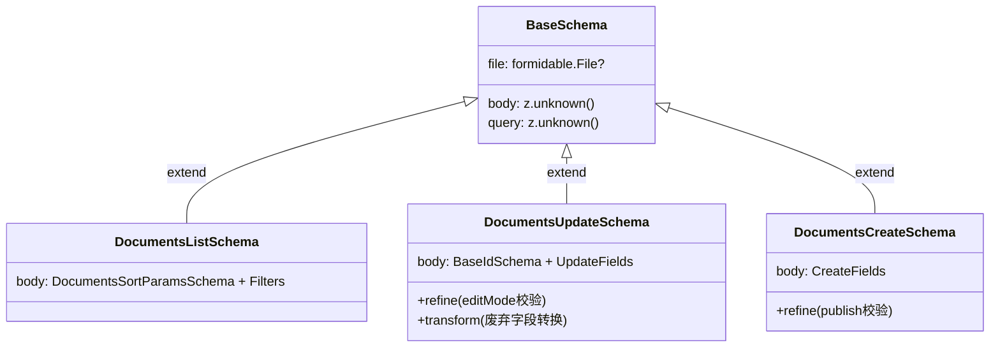

Outline 的 API 层构建在 **Koa** 框架之上，采用 **koa-router** 进行路由分发，以 **Zod** 作为请求验证引擎，并通过精心设计的中间件栈实现了认证、授权、限流、CSRF 防护等横切关注点的统一处理。整个 API 遵循"模块化路由 + 声明式验证 + 策略化授权"的架构范式，每个业务领域（文档、集合、用户等）都拥有独立的路由模块、验证 Schema 和控制器逻辑。

Sources: [index.ts](server/routes/api/index.ts#L1-L146), [web.ts](server/services/web.ts#L76-L100)

## 请求处理全局架构

一个 API 请求从到达服务器到返回响应，需要经过多层中间件的有序处理。以下是完整的请求生命周期：



核心应用通过 `koa-mount` 将不同路径前缀的子应用挂载到主 Koa 实例上。API 子应用被独立实例化为一个新的 Koa 对象，拥有自己专属的中间件栈，与其他路由（认证、OAuth、页面渲染）完全隔离。

Sources: [web.ts](server/services/web.ts#L76-L100), [api/index.ts](server/routes/api/index.ts#L56-L81)

### 全局中间件栈

API 子应用在请求到达具体路由之前，会依次执行以下全局中间件：

| 顺序 | 中间件 | 职责 | 来源 |
|------|--------|------|------|
| 1 | `requestContext` | 初始化基于 `AsyncLocalStorage` 的请求上下文 | [requestContext.ts](server/middlewares/requestContext.ts) |
| 2 | `bodyParser` | 解析 JSON（5MB 上限）和 multipart 请求体 | [api/index.ts](server/routes/api/index.ts#L61-L73) |
| 3 | `coalesceBody` | 确保请求体始终为对象（修复 koa-body 的已知问题） | [coaleseBody.ts](server/middlewares/coaleseBody.ts#L5-L12) |
| 4 | `userAgent` | 解析客户端 User-Agent 信息 | [api/index.ts](server/routes/api/index.ts#L75) |
| 5 | `requestTracer` | 注入分布式追踪标签 | [requestTracer.ts](server/middlewares/requestTracer.ts) |
| 6 | `apiResponse` | 为响应体自动注入 `status` 和 `ok` 字段 | [apiResponse.ts](server/routes/api/middlewares/apiResponse.ts#L5-L26) |
| 7 | `apiErrorHandler` | 捕获并转换 Sequelize 和业务异常为标准错误 | [apiErrorHandler.ts](server/routes/api/middlewares/apiErrorHandler.ts#L12-L47) |
| 8 | `editor` | 检查客户端编辑器版本，拒绝大版本落后的请求 | [editor.ts](server/routes/api/middlewares/editor.ts#L6-L30) |
| 9 | `apiContext` | 定义 `ctx.context` getter，提供 auth/transaction/ip 统一访问 | [apiContext.ts](server/middlewares/apiContext.ts#L11-L26) |
| 10 | `verifyCSRFToken` | 对基于 Cookie 认证的变异请求验证 CSRF 令牌 | [csrf.ts](server/middlewares/csrf.ts#L41-L109) |

`apiResponse` 中间件在 `next()` 之后执行（即"后置"模式），将所有对象类型的响应体自动包装为 `{ ...body, status, ok }` 格式，使前端能够统一判断请求成功与否。`apiErrorHandler` 同样在后置阶段工作，将 Sequelize 的 `ValidationError` 转换为应用层的 `ValidationError`，将 `EmptyResultError` 转换为 `NotFoundError`。

Sources: [api/index.ts](server/routes/api/index.ts#L59-L81), [apiResponse.ts](server/routes/api/middlewares/apiResponse.ts#L5-L26), [apiErrorHandler.ts](server/routes/api/middlewares/apiErrorHandler.ts#L12-L47)

## 路由模块的组织结构

Outline 的 API 路由按照业务领域划分为 **30+ 个独立模块**，每个模块遵循统一的三文件结构：

```
server/routes/api/<module>/
├── index.ts        # 模块入口，re-export 路由实例
├── schema.ts       # Zod 验证 Schema 定义
├── <module>.ts     # 路由注册与控制器逻辑
└── <module>.test.ts # 路由测试
```

以 `documents` 模块为例，`index.ts` 仅负责导出路由实例，`schema.ts` 定义了所有文档端点的请求验证规则（562 行），`documents.ts` 则包含了全部路由注册和控制器处理函数（2185 行）。这种结构使得验证逻辑与业务逻辑清晰分离。

Sources: [documents/index.ts](server/routes/api/documents/index.ts#L1-L2), [documents/schema.ts](server/routes/api/documents/schema.ts#L1-L562)

### 路由注册模式

所有模块路由在 `server/routes/api/index.ts` 中以平铺方式注册到同一个 Router 实例上，**插件的路由优先注册**以允许覆盖默认行为：

```typescript
// 插件 API 路由优先注册
PluginManager.getHooks(Hook.API).forEach((hook) =>
  router.use("/", hook.value.routes())
);

// 业务模块路由按顺序注册
router.use("/", auth.routes());
router.use("/", documents.routes());
router.use("/", collections.routes());
// ... 共 30+ 个模块
```

每个路由模块内部使用 `koa-router` 的命名路由（named route）模式，例如 `documents.list`、`documents.update`。请求路径统一为 `POST /api/<module>.<action>` 格式（列表接口也使用 POST，以便在 body 中传递复杂查询参数）。

Sources: [api/index.ts](server/routes/api/index.ts#L83-L143)

### 典型路由定义剖析

以下是一个典型的路由定义，展示了中间件的组合方式：

```typescript
router.post(
  "documents.list",                                    // 路由名称
  auth(),                                              // 认证中间件
  pagination(),                                        // 分页中间件
  validate(T.DocumentsListSchema),                     // Zod 验证
  async (ctx: APIContext<T.DocumentsListReq>) => {     // 类型安全的处理函数
    const { sort, direction, collectionId } = ctx.input.body;
    const { offset, limit } = ctx.state.pagination;
    const { user } = ctx.state.auth;
    // ... 业务逻辑
    ctx.body = { pagination, data, policies };
  }
);
```

处理函数的参数 `ctx` 使用 `APIContext<T>` 泛型类型，其中 `T` 是 Zod Schema 推断出的请求类型。验证通过后，`ctx.input` 包含类型安全的已验证数据，`ctx.state.auth` 包含认证信息，`ctx.state.pagination` 包含分页参数。

Sources: [documents.ts](server/routes/api/documents/documents.ts#L100-L321)

## 路由级中间件体系

在全局中间件之后、控制器处理函数之前，每个路由可以组合一系列路由级中间件来实现细粒度的请求控制。

### 认证中间件：`auth()`

认证中间件支持三种认证方式，通过请求头、Cookie、请求体或查询参数中携带的 Token 自动识别：



认证中间件通过选项对象灵活配置：

| 选项 | 类型 | 说明 |
|------|------|------|
| `role` | `UserRole` | 要求的最低角色（如 `UserRole.Admin`） |
| `type` | `AuthenticationType \| AuthenticationType[]` | 允许的认证类型白名单 |
| `optional` | `boolean` | 设为 `true` 时认证失败不报错，仅将 `ctx.state.auth` 置为空对象 |

三种认证类型的优先级判断逻辑为：先尝试 OAuth Token（通过前缀匹配），再尝试 API Key（通过前缀匹配），最后回退到 JWT 解析。

Sources: [authentication.ts](server/middlewares/authentication.ts#L37-L76), [authentication.ts](server/middlewares/authentication.ts#L135-L278)

### 限流中间件：`rateLimiter()`

限流中间件基于 **Redis + rate-limiter-flexible** 实现，支持两级限流策略：

- **默认限流器**（`defaultRateLimiter`）：应用于所有 API 请求，使用用户 ID（已认证请求）或 IP 地址（未认证请求）作为限流标识
- **路由级限流器**（`rateLimiter`）：应用于特定路由，覆盖默认配置，支持自定义窗口大小和请求配额

路由级限流器在首次匹配时惰性注册，后续请求复用已创建的限流器实例。环境变量 `RATE_LIMITER_MULTIPLIER` 可以按比例调整限流配额。

Sources: [rateLimiter.ts](server/middlewares/rateLimiter.ts#L55-L145)

### 分页中间件：`pagination()`

分页中间件从查询参数或请求体中提取 `limit` 和 `offset`，进行范围验证后存入 `ctx.state.pagination`。该中间件还通过 `x-client-version` 请求头区分客户端请求和 API 请求，对客户端请求采用"多取一条判断是否有下一页"的优化策略，避免额外的 COUNT 查询。

Sources: [pagination.ts](server/routes/api/middlewares/pagination.ts#L21-L111)

### 事务中间件：`transaction()`

事务中间件为写操作路由包裹数据库事务，事务对象通过 `ctx.state.transaction` 传递给后续处理函数。配合 `ctx.context` getter，模型层的 `saveWithCtx` 和 `destroyWithCtx` 等辅助方法可以自动获取事务上下文。

Sources: [transaction.ts](server/middlewares/transaction.ts#L13-L20)

### 特性开关中间件：`feature()`

特性开关中间件检查当前用户所属 Team 的 `TeamPreference` 设置，当指定功能未启用时抛出验证错误。例如评论功能需要 `TeamPreference.Commenting` 开关。

Sources: [feature.ts](server/middlewares/feature.ts#L12-L19)

### 文件上传中间件：`multipart()`

文件上传中间件验证请求的 Content-Type 为 `multipart/form-data`，检查文件存在性和大小限制，将文件对象注入 `ctx.input.file`。

Sources: [multipart.ts](server/middlewares/multipart.ts#L7-L43)

## Zod 验证机制

Outline 采用 **Zod** 作为 API 请求验证的核心引擎，实现了声明式、类型安全的输入校验。

### 验证中间件的工作原理

`validate` 中间件接收一个 Zod Schema，对 `ctx.request` 执行 `schema.parse()`，将验证结果合并到 `ctx.input` 上。验证失败时提取第一个错误信息，包装为 `ValidationError`（HTTP 400）抛出：

```typescript
export default function validate<T extends z.ZodType<Record<string, unknown>>>(schema: T) {
  return async function validateMiddleware(ctx: APIContext, next: Next) {
    try {
      ctx.input = { ...(ctx.input ?? {}), ...schema.parse(ctx.request) };
    } catch (err) {
      if (err instanceof ZodError) {
        const { path, message } = err.issues[0];
        const errMessage = path.length > 0
          ? `${String(path[path.length - 1])}: ${message}`
          : message;
        throw ValidationError(errMessage);
      }
      ctx.throw(err);
    }
    return next();
  };
}
```

Sources: [validate.ts](server/middlewares/validate.ts#L7-L29)

### BaseSchema 与 Schema 组合模式

所有路由 Schema 都继承自 `BaseSchema`，它定义了请求的三个核心维度：

```typescript
export const BaseSchema = z.object({
  body: z.unknown(),
  query: z.unknown(),
  file: z.custom<formidable.File>().optional(),
});
```

每个路由 Schema 通过 `BaseSchema.extend()` 定义具体的 `body`、`query` 和 `file` 验证规则。这种组合模式形成了清晰的层次结构：



Schema 定义中大量使用 Zod 的高级特性：

| Zod 特性 | 用途 | 示例 |
|-----------|------|------|
| `refine` | 自定义校验逻辑 | 确保 `startDate <= endDate` |
| `transform` | 验证后转换数据 | 将废弃的 `append` 转换为 `editMode` |
| `prefault` | 提供默认值（验证前） | `sort` 字段默认 `"updatedAt"` |
| `nullish` | 允许 `null` 和 `undefined` | `parentDocumentId: z.uuid().nullish()` |
| `z.union` | 多类型联合 | `id` 可以是 UUID 或 slug |
| `z.coerce` | 自动类型转换 | `z.coerce.date()` 将字符串转为日期 |

Sources: [schema.ts](server/routes/api/schema.ts#L9-L34), [documents/schema.ts](server/routes/api/documents/schema.ts#L78-L109), [documents/schema.ts](server/routes/api/documents/schema.ts#L261-L343)

### 共享验证常量

`shared/validations.ts` 定义了前后端共用的验证参数常量（如最大名称长度、最大文件大小），确保前端表单验证与后端 API 验证保持一致。`server/utils/zod.ts` 则提供了常用的自定义 Zod 类型工厂函数，如 `zodIdType()`（UUID 或 slug）、`zodIconType()`（emoji 或图标键或 UUID）、`zodShareIdType()` 等。

Sources: [validations.ts](shared/validations.ts#L1-L182), [zod.ts](server/utils/zod.ts#L14-L31)

### 旧式断言验证

除了 Zod Schema 验证，`server/validation.ts` 中还保留了一套命令式断言函数（`assertPresent`、`assertUuid`、`assertEmail` 等），主要用于控制器内部对特定字段进行增量校验。这类断言直接抛出 `ParamRequiredError` 或 `ValidationError`，属于历史遗留的验证方式，新代码应优先使用 Zod Schema。

Sources: [validation.ts](server/validation.ts#L18-L23), [validation.ts](server/validation.ts#L121-L133)

## 授权检查：authorize 模式

路由处理函数内部通过 CanCan 授权系统进行细粒度的权限检查。`authorize` 函数接收三个参数：当前用户、操作名称和目标资源。如果权限不足，直接抛出 `AuthorizationError`（HTTP 403）。

```typescript
const collection = await Collection.findByPk(collectionId, { userId: user.id });
authorize(user, "readDocument", collection);  // 权限不足时抛出异常
```

`authorize` 是一个 **assertion 函数**（通过 TypeScript 的 `asserts` 关键字标记），调用后 TypeScript 编译器能推断出目标对象非空，从而避免后续冗余的空值检查。完整的策略定义逻辑在 [权限与授权：基于 CanCan 的策略（Policies）系统](11-quan-xian-yu-shou-quan-ji-yu-cancan-de-ce-lue-policies-xi-tong) 中详细讨论。

Sources: [cancan.ts](server/policies/cancan.ts#L182-L191)

## 响应序列化：Presenter 模式

控制器处理完业务逻辑后，通过 **Presenter** 函数将数据库模型实例转换为面向 API 消费者的序列化对象。所有 Presenter 函数集中在 `server/presenters/` 目录下，每个模型对应一个 Presenter 文件。

Presenter 函数接收 `APIContext` 和模型实例（以及可选的配置对象），返回一个纯 JavaScript 对象。例如 `presentDocument` 会根据请求头 `x-api-version` 决定返回 Markdown 文本还是 ProseMirror JSON 数据，并在公开分享场景下自动为图片生成签名 URL。

Sources: [presenters/index.ts](server/presenters/index.ts#L1-L78), [presenters/document.ts](server/presenters/document.ts#L28-L60)

## 错误处理体系

Outline 使用 `http-errors` 库创建标准化的 HTTP 错误对象，所有错误工厂函数集中在 `server/errors.ts` 中。每个错误携带机器可读的 `id` 标识和 `isReportable` 标记：

| 错误函数 | HTTP 状态码 | 错误 ID | 典型触发场景 |
|----------|-------------|---------|------------|
| `AuthenticationError` | 401 | `authentication_required` | 未提供有效 Token |
| `AuthorizationError` | 403 | `authorization_error` | 权限不足或操作被拒绝 |
| `CSRFError` | 403 | `csrf_error` | CSRF 令牌缺失或不匹配 |
| `ValidationError` | 400 | `validation_error` | 请求参数验证失败 |
| `InvalidRequestError` | 400 | `invalid_request` | 请求格式或参数不合法 |
| `NotFoundError` | 404 | `not_found` | 资源不存在 |
| `RateLimitExceededError` | 429 | `rate_limit_exceeded` | 超过请求频率限制 |
| `ParamRequiredError` | 400 | `param_required` | 缺少必需参数 |

Sources: [errors.ts](server/errors.ts#L1-L253)

## 完整的中间件组合示例

以 `comments.create` 路由为例，展示一个写操作路由的完整中间件组合：

```typescript
router.post(
  "comments.create",
  rateLimiter(RateLimiterStrategy.TwentyFivePerMinute),  // 1. 限流：每分钟25次
  auth(),                                                  // 2. 认证：必须登录
  feature(TeamPreference.Commenting),                      // 3. 特性开关：评论功能已启用
  validate(T.CommentsCreateSchema),                        // 4. 验证：Zod Schema
  transaction(),                                           // 5. 事务：包裹数据库操作
  async (ctx: APIContext<T.CommentsCreateReq>) => {        // 6. 控制器
    const { documentId, parentCommentId } = ctx.input.body;
    const { user } = ctx.state.auth;
    const { transaction } = ctx.state;
    
    const document = await Document.findByPk(documentId, {
      userId: user.id, transaction,
    });
    authorize(user, "comment", document);                  // 7. 授权检查
    
    // ... 创建评论逻辑
    ctx.body = { data: presentComment(comment) };          // 8. Presenter 序列化
  }
);
```

这个组合模式确保了：未认证请求在步骤 2 被拒绝、超频请求在步骤 1 被拒绝、无效数据在步骤 4 被拒绝、功能未启用在步骤 3 被拒绝、权限不足在步骤 7 被拒绝——层层递进，每一层都有清晰的职责边界。

Sources: [comments.ts](server/routes/api/comments/comments.ts#L32-L68)

## API 上下文类型系统

TypeScript 类型系统在 API 层中扮演着关键的类型安全角色。`APIContext<T>` 泛型接口是整个类型系统的核心：

```typescript
interface APIContext<ReqT = Partial<BaseReq>, ResT = BaseRes>
  extends ParameterizedContext<AppState, DefaultContext & IRouterParamContext<AppState>, ResT> {
  input: ReqT;           // Zod Schema 推断的类型安全输入
  context: {             // 请求上下文（传递给模型层）
    transaction?: Transaction;
    auth: Authentication;
    ip?: string;
  };
}
```

`AppState` 定义了 Koa 状态中可用的字段：`auth`（认证信息）、`transaction`（数据库事务）、`pagination`（分页参数）等。每个路由的 Schema 都导出对应的类型别名（如 `DocumentsListReq = z.infer<typeof DocumentsListSchema>`），控制器函数通过泛型参数获得完全类型安全的 `ctx.input` 访问。

Sources: [types.ts](server/types.ts#L46-L108)

## 延伸阅读

- **[中间件体系：认证、限流、CSRF 与请求上下文](14-zhong-jian-jian-ti-xi-ren-zheng-xian-liu-csrf-yu-qing-qiu-shang-xia-wen)** — 深入理解每个中间件的实现细节
- **[权限与授权：基于 CanCan 的策略（Policies）系统](11-quan-xian-yu-shou-quan-ji-yu-cancan-de-ce-lue-policies-xi-tong)** — 理解 `authorize` 背后的策略定义机制
- **[命令模式（Commands）：复杂业务逻辑的组织方式](12-ming-ling-mo-shi-commands-fu-za-ye-wu-luo-ji-de-zu-zhi-fang-shi)** — 控制器内部如何将业务逻辑委托给 Command 对象
- **[数据模型层：Sequelize ORM 模型体系与生命周期钩子](10-shu-ju-mo-xing-ceng-sequelize-orm-mo-xing-ti-xi-yu-sheng-ming-zhou-qi-gou-zi)** — 理解 Presenter 序列化的模型层基础